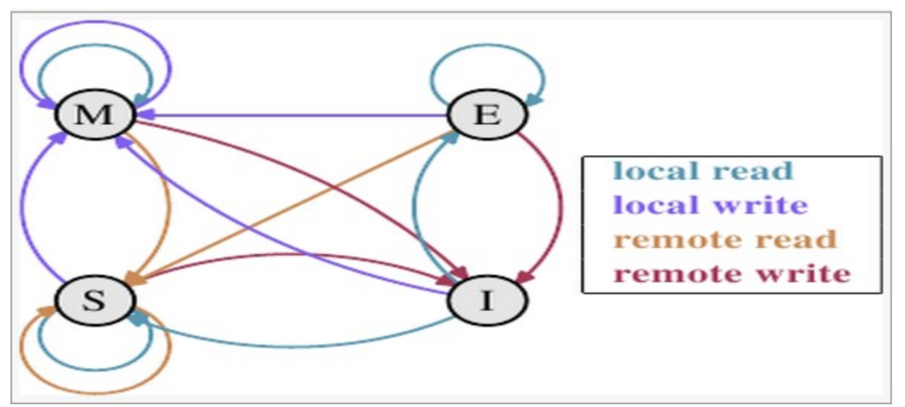

### CPU缓存一致性协议MESI

多核心CPU共享内存的问题被称为Cache一致性问题，简单来说，多个CPU核心所看到的Cache数据应该是一致的，在某个数据被某个CPU写入自己的Cache以后，其他的CPU都应该能看到相同的Cache数据；如果自己的Cache中有旧数据，则抛弃旧数据。

如上，是一个高速缓存的结构，每个Cache Line的头部有两个Bit来表示自身的状态，总共有4种状态：

* M(Modified)：修改状态，其他CPU上没有数据的副本，并且在本CPU上被修改过，与存储器中的数据不一致，最终必然会引发系统总线的写命令，将Cache Line中的数据写回到Memory中。
* E(Exclusive)：独占状态，表示Cache Line 中的数据与Memory中的数据一致，此外，其他CPU上没有数据的副本。
* S(Share)：共享状态，表示Cache Line 中包含的数据一致，而且在当前CPU和至少在其他某个CPU中有副本。
* I(Invalid)：无效状态，当前Cache Line 中没有有效数据或该Cache Line 数据已经失效，不能再用。

　

（1）某个CPU（CPU A）发起本地读请求(Local Read)，比如读取某个内存地址的变量，如果此时所有CPU的Cache中都没有加载此内存地址，即此内存地址对应的Cache Line 为无效状态(Invalid)，则CPU A 中的Cache 会发起一个到Member的内存Load指令，在相应的Cache Line 中完成内存加载后，此Cache Line的状态会被标记为Execlusive。接下来如果其他CPU（CPU B）在总线上也发起对同一个内存地址的读请求，则这个请求会被CPU A嗅探到（SNOOP），然后CPU A 在内存总线上复制一份Cache Line 作为应答，并将自身的Cache Line 状态改为Shared，同时CPU B收到来自总线的应答并保存到自己的Cache里，也修改对应的Cache Line 状态为Shared。

（2）某个CPU(CPU A)发起本地写请求（Local Write），比如对某个内存地址的变量赋值，如果此时所有CPU的Cache中都没有加载此内存地址，即此内存地址对应的Cache Line 为无效状态(Invalid)，则CPU A中的Cache Line保存了最新的内存变量值后，其状态被修改为Modified。随后，如果CPU B发起对同一个变量的读操作(Remote Read)，则CPU A在总线上嗅探到这个请求后，先将Cache Line 里修改过的数据回写(Write Back)到Memory中，然后在内存总线上复制一份Cache Line 作为报答，最后将自身的Cache Line 状态改为Shared，由此产生的结果是CPU A与CPU B里对应的Cache Line 状态都为Shared。

（3）以上面两天为基础，CPU A发起本地写请求并导致自身的Cache Line 状态为Modified，如果此时CPU B发起同一个内存地址的写请求（Remote Write），则我们看到状态图里CPU A 的Cache Line 状态为Invalid，其原因如下：

​	CPU B 此时发出的是一个特殊的请求—读并且打算修改数据，当CPU A 从总线上嗅探到这个请求后，会先阻止此请求并取得总线的控制权，随后将Cache Line 里修改过的数据回写到Memory中，再将此Cache Line 的状态修改为Invalid（CPU B  要修改数据），与此同时，CPU B发现之前的请求并没有得到响应，于是重新发起了一次请求，此时由于所有CPU 的Cache 里都没有内存副本了，所以CPU B 的Cache 就从Memory 中加载最新的数据到Cache Line 中，随后修改数据，然后改变Cache Line 的状态为Modifed。

（4）如果某个变量被多个CPU加载到各自的Cache中，从而使得Cache Line 的状态为Shared，若此时某个CPU打算对此变量进行写操作，会导致所有的缓存都失效，这是引发性能下降的一种典型 Cache Miss问题。