### Y86-64 指令集体结构

> Y86-64指令是自定义的一个简单指令集，作为我们处理器实现的运行示例。与x86-64相比，它的指令集的数据类型、指令和寻址方式都要少一些，字节级编码也比较简单，机器代码没有相应的x86-64紧凑，不过设计它的CPU译码逻辑也要简单一些。

#### 程序员可见的状态

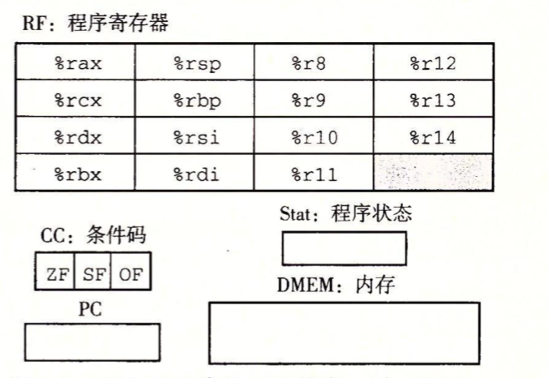

* 寄存器：有15个寄存器，每个程序寄存器存储一个64位的字。
* 条件码：有3个一位的条件码，ZF、SF、OF，它们保存着最近的算术或逻辑指令所造成影响的有关信息。
* 程序计数器(PC)：存放当前正在执行指令的地址。
* 内存：从概念上来说就是一个很大的字节数组，保存着程序和数据。
* 程序状态：状态码Stat，它表明程序执行的总体状态。Stat会指示示正常运行还说出现了某种异常。

#### Y86-64指令

Y86-64指令集是x86-64指令集的一个子集，它只包括**8字节整数**操作，寻址方式较少，操作也较少，如下图，左边是指令的汇编码表示，右边是字节编码：

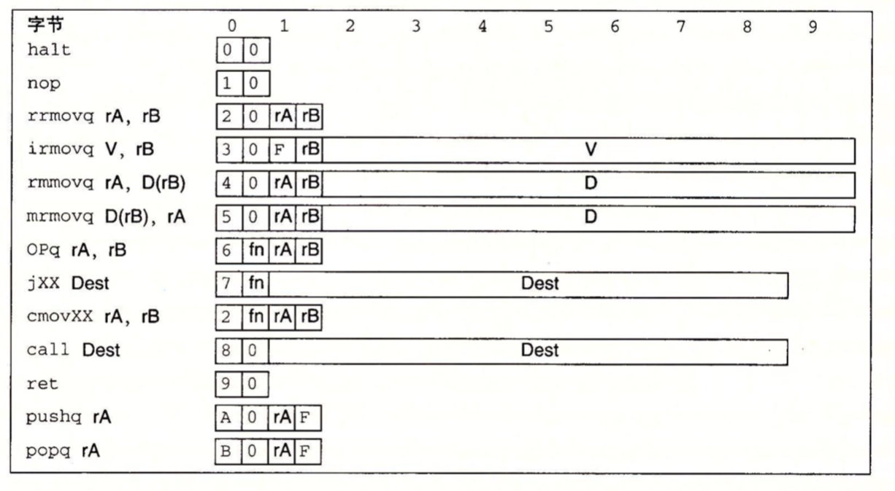

* moveq指令：irmovq、rrmovq、mrmovq、rmmovq分别显示地指明源和目的格式。指令的第一个字母表明了源的类型，第二个字母指明目的的类型。 立即数(i)、寄存器(r)或内存(m)。同x86-64一样，我们不允许从一个内存地址直接传送到另一个内存地址，另外，也不允许将立即数传送到内存。
* 整数操作指令(OPq)：它们是addq、subq、andq和xorq。它们只对寄存器数据进行操作，这些指令会设置3个条件码ZF、SF、OF。
* 跳转指令(jxx)：jmp、jle、jl、 je、 jne、 jge和jg。根据分支指令的类型和条件码的设置来选择分支。
* 条件传送指令(cmovxx)：cmovle、cmovl 、cmove、cmovne、cmovge、cmovg 。这些指令格式与寄存器-寄存器传送指令rrmovq一样，但是只有当条件码满足所需要的约束时，才更新目的寄存器。
* call指令将返回地址入栈，然后跳到目的地址，ret指令从这样的调用中返回。
* pushq和popq实现了入栈和出栈。
* halt指令停止指令的执行。

#### 指令编码

指令编码的第一个字节表明指令的类型，这个字节分为两个部分，每部分4位：高4位是代码部分(唯一，指明指令的类型，如传送指令的代码为2，跳转指令的代码为7)，低4位是功能部分(比较大小、是否相等等)。

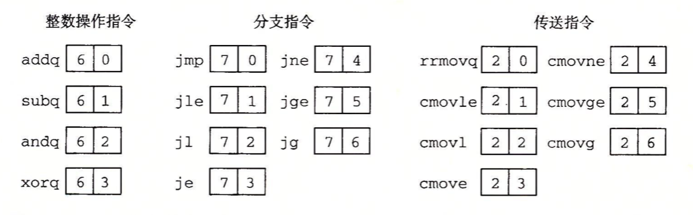

如上图，rrmovq(传送指令)和cmovle(条件传送)的代码是一样的，只是功能部分不同，因此我们也可以将rrmovq看作是一个“无条件传送”的跳转指令。

程序寄存器都有一个相对应的范围在0到oxE之间的寄存器标识符，用它来区分不同的寄存器，当需要指明不应该访问任何寄存器时，就用ID值0xF来表示。

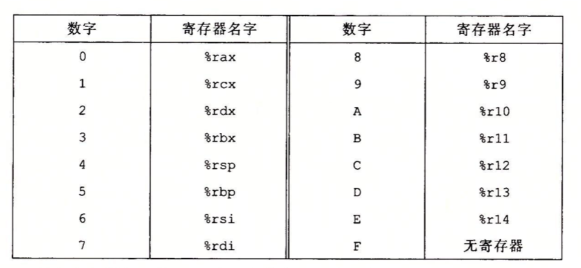

有的指令需要操作两个寄存器，如rrmovq，rA和rB就用来指定数据源和目的寄存器(或者用于于地址计算的基址寄存器)。没有寄存器，如call指令，就没有寄存器指示符字节。那些需要一个寄存器操作数的指令(popq)，将另一个寄存器指示符设为0xF。

例子：用十六进制来表示指令 rmmovq %rsp 0x123456789abcd(%rdx)的字节编码：

rmmovq的第一个字节是40，源寄存器(%rsp)存放在rA中，而基址%rdx放在rB中，根据上图寄存器的对照表，%rsp和%rdx组合在一起是42。最后偏移量编码放在8字节的常数字中，0x123456789abcd前面补0变成8个字节，变成字节序列00 01 23 45 67 89 ab cd，写成按字节反序就是cd ab 89 67 45 23 01 00 (整数采用小端法)，把它们连起来就得到指令的编码4042cdab896745230100。

#### 代码异常

对于Y86-64来说，程序员可见的状态包括状态码Stat，它描述程序执行的总体状态。

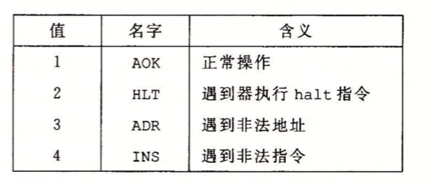

* 代码值1，命名AOK，表示程序执行正常。
* 代码值2，命名HLT，表示处理器执行了一条halt指令。
* 代码值3，命名ADR，表示处理器试图从一个非法内存地址读或者向一个非法内存地址写，可能是当取指令的时候，也可能是当读或者写数据的时候。
* 代码4，命名INS，表示遇到了非法的指令代码。

例子：Y86-54程序

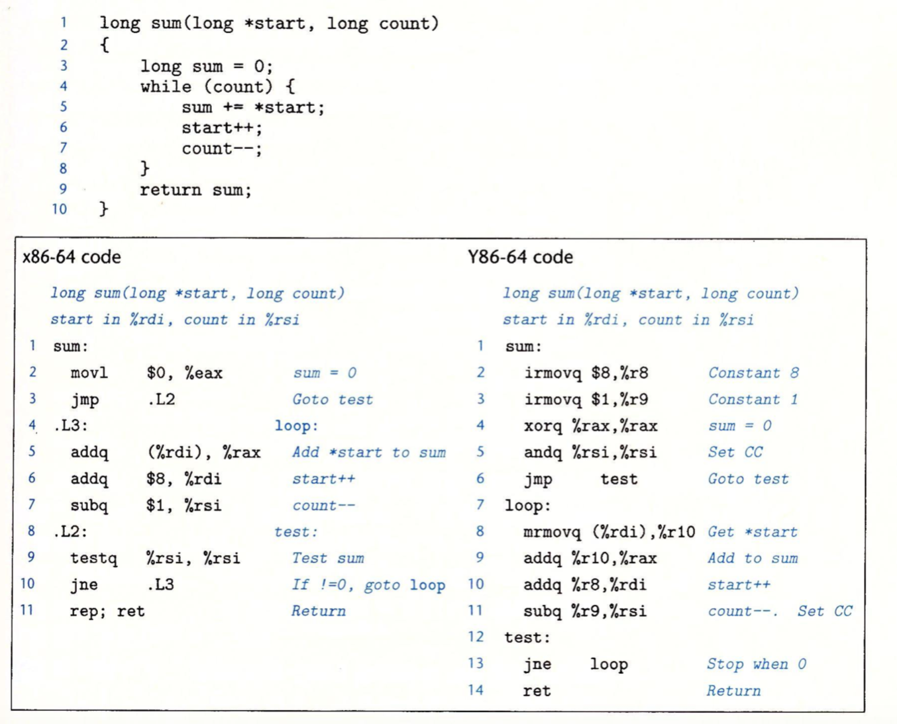

* Y86-64将常数加载到寄存器(第2～3行)，因为它在算术指令中不能使用立即数。
* 要实现从内存读取一个数值并将其与一个寄存器相加，Y86-64代码需要两条指令(第8～9行)，而x86-64只需要一条addq指令(第5行)。
* Y86-64 subq指令会同时设置条件码(CC)，省去了GCC代码中的testq指令。不过Y86-64代码必须用andq指令在进入循环之前设置条件码。

### 逻辑设计和硬件控制语言HCL

在硬件设计中，用电子电路来计算对位进行运算的函数，以及在各种存储器单元中存储位。大多数现代电路技术都是用信号线上的高电压或低电压来表示不同的位值。在当前的技术中，逻辑1是用1.0伏特左右的高电压表示，而逻辑0是用0.0伏特的低电压表示。

#### 逻辑门

逻辑门只对单个**位**进行操作，而不是整个字。

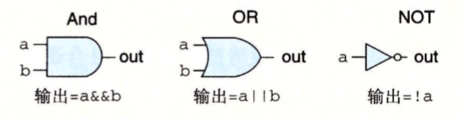

#### 组合电路和HCL布尔表达式

> HCL，硬件控制语言，用这种语言来描述不同处理器设计的控制逻辑。

将很多的逻辑门组合成一个网，称为组合电路。构建这些网有以下限制：

* 每个逻辑门的输入必须连接到以下选项之一：1）一个系统输入(主输入)；2）某个存储器单元的输出；3）某个逻辑门的输出
* 两个或多个逻辑门的输出不能连接在一起。否则它们可能会使线上的信号矛盾，可能会导致一个不合法的电压或电路故障。
* 这个网必须是无环的。也就是在网中不能有路径经过一系列的门而形成一个回路，这样的回路会导致该网络计算的函数有歧义。

例1：当a和b都是1或都是0时，输出1。用HCL来写这个网的函数是：

```
bool eq = (a && b) || (!a&&!b)
```

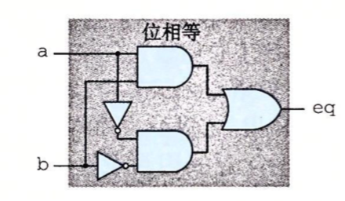

例2：如下是一个**多路复用器**例子。多路复用器根据输入控制信号的值，从一组不同的数据信号中选出一个。如当s=1时，输出a，而当s=0时，输出b。

```
bool out = (s && a) || (!s && b)
```

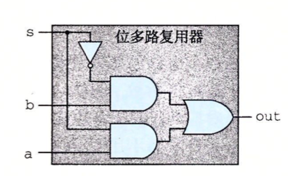

#### 字级的组合电路和HCL整数表达式

通过将逻辑门组合成大的网，可以构成能计算更加复杂函数的组合电路，通常，我们设计能对数据字(字的大小的范围为4位到64位)进行操作的电路。

例1：如下它测试两个64位字A和B是否相等，也就是，当且仅当A的每一位都和B的相应位相等，输出才为1。

```
bool Eq = (A == B)
```

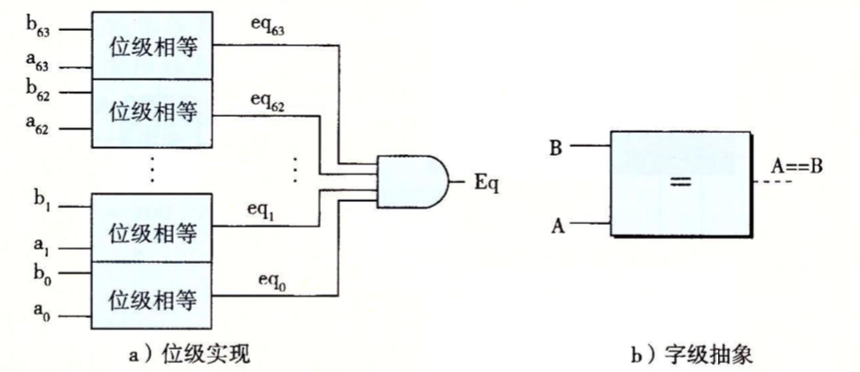

例2：如下图是一个字级别的多路复用器电路。这个电路根据控制输入位s，产生一个64位的字out。这个输出等于输入字中的某一个。字级多路复用器电路，当控制信号s为1时，输出会等于输入字A，否则等于B。(HCL中用case表达式来描述多路复用器)

```
#第二个选择表达式是1，表明如果前面没有情况被选中，那就选择这种情况
word Out = [
    s:A
    1:B
]
```


例3：如下四路复用器，这个电路根据控制信号s1和s0，从输入的字A、B、C、D中选择一个。将控制信号看成两位的二进制数，可以用HCL来表示这个电路：

```
word Out4=[
    !s1 && !s0 : A   ##00
    !s1        : B   ##01
    !s0        : C   ##10
    1          : D   ##11
]
```

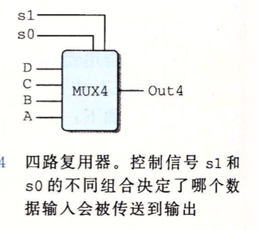

#### 集合关系

在处理设计中，很多时候需要将一个信号与许多可能匹配的信号做比较，以此来检测正在处理的某个指令代码是否属于某一类代码指令。

如下，假设信号s1和s0由两位信号code来决定，code可能值有1，2，3，那么当code在集合{2,3}中时s1=1，而code在集合{1,3}中时s0=1：

```
bool s1 = code in {2,3}
bool s2 = code in {1,3}
```

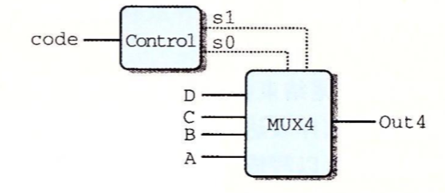

####  存储器和时钟

> 时钟是一个周期性信号，决定什么时候要把新值加载到设备中。

组合电路只是简单的输入信号，然后输出输入信号中的某个信号，为了产生时序电路，也就是有状态并且在这个状态上进行计算的系统，我们必须引入按位存储信息的设备。存储设备有两类：

* 时钟寄存器(简称寄存器)：存储单个位或字。时钟信号控制寄存器加载输入值。
* 随机访问存储器：存储多个字，用地址来选择该读或写哪个字。随机访问存储器例子包括：1）处理器的虚拟系统；2）寄存器文件。

> 当说到硬件时，寄存器指硬件寄存器，说到机器级编程时指程序寄存器。

例子：如下，大多数寄存器保持在稳定状态(用x表示)，产生的输出等于它的当前状态。信号沿着寄存器前面的组合逻辑传播，这时，产生了一个新的寄存器(用y表示)，但只要时钟是低电位的，寄存器的输出就仍保持不变。当时钟变成高电位时，输入信号就加载到寄存器中，成为下一个状态y。直到下一个时钟上升沿，这个状态就一直是寄存器的新输出(y)。寄存器是作为电路不同部分中的组合逻辑之间的屏障，每当每个时钟上升沿时，值才会从寄存器的输入传送到输出。(Y86-64处理器会用时钟寄存器保存程序计数器(PC)，条件码(CC)和程序状态(Stat))。

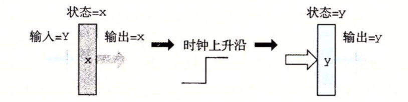

程序寄存器存在于CPU中的一个寄存器文件中，这个寄存器文件就是一个小的、以寄存器ID作为地址的随机访问存储器。

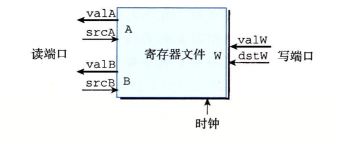

寄存器文件有两个读端口(A和B)，两个读端口有地址输入srcA和srcB和数据输出valA和valB；还有一个写端口(W)，写端口有地址输入(dstW)以及数据输入valW。

虽然寄存器文件不是组合电路，因为它有**内部存储**，不过我们可以把它看作以地址输入，数据输出的一个组合逻辑块，当srcA被设置为某个寄存器的ID时，存储在程序寄存器的值就会出现在valA上。

向寄存器文件写入字是由时钟信号控制的，控制方式类似于将值加载到时钟寄存器。每当时钟上升时，输入valW上的值会被写入输入dstW上寄存器ID指示的程序寄存器。当dstW设置为特殊的ID值0xF时，不会写任何程序寄存器。当我们同时写一个寄存器和读一个寄存器时，我们会看到一个从旧值到新值的变化。

处理器有一个随机访问存储器来存储程序数据，如下：

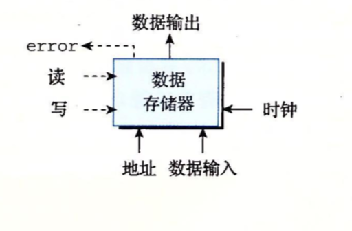

我们可以将读写随机访问存储器当做一个组合逻辑，如上：读、写可以当作控制信号，地址、数据输入是输入信号，数据输出是输出信号。当写设置为0时，表示程序要从内存中读数据，相反就是写入数据。即：如果我们在输入address上提供一个地址，并将write控制信号设置为0，那么经过一些延迟，存储在那个位置上数据会出现在数据输出上。如果地址超过了范围，error信号就会设置为1，否则就设置为0。而当write设置为1，只要地址合法，就会更新内存中指定的位置的数据


