### Y86-64 指令集体结构

> Y86-64指令是自定义的一个简单指令集，作为我们处理器实现的运行示例。与x86-64相比，它的指令集的数据类型、指令和寻址方式都要少一些，字节级编码也比较简单，机器代码没有相应的x86-64紧凑，不过设计它的CPU译码逻辑也要简单一些。

#### 程序员可见的状态


* 寄存器：有15个寄存器，每个程序寄存器存储一个64位的字。
* 条件码：有3个一位的条件码，ZF、SF、OF，它们保存着最近的算术或逻辑指令所造成影响的有关信息。
* 程序计数器(PC)：存放当前正在执行指令的地址。
* 内存：从概念上来说就是一个很大的字节数组，保存着程序和数据。
* 程序状态：状态码Stat，它表明程序执行的总体状态。Stat会指示示正常运行还说出现了某种异常。

#### Y86-64指令

Y86-64指令集是x86-64指令集的一个子集，它只包括**8字节整数**操作，寻址方式较少，操作也较少，如下图，左边是指令的汇编码表示，右边是字节编码，一条指令含有一个单字节的指令指示符，可能含有一个单字节的寄存器指示符，还可能含有一个8字节的常数字。字段fn指明是某个整数操作(OPq)、数据传送条件(cmovxx)或是分支条件(jxx)：


* moveq指令：irmovq、rrmovq、mrmovq、rmmovq分别显示地指明源和目的格式。指令的第一个字母表明了源的类型，第二个字母指明目的的类型。 立即数(i)、寄存器(r)或内存(m)。同x86-64一样，我们不允许从一个内存地址直接传送到另一个内存地址，另外，也不允许将立即数传送到内存。
* 整数操作指令(OPq)：它们是addq、subq、andq和xorq。它们只对寄存器数据进行操作，这些指令会设置3个条件码ZF、SF、OF。
* 跳转指令(jxx)：jmp、jle、jl、 je、 jne、 jge和jg。根据分支指令的类型和条件码的设置来选择分支。
* 条件传送指令(cmovxx)：cmovle、cmovl 、cmove、cmovne、cmovge、cmovg 。这些指令格式与寄存器-寄存器传送指令rrmovq一样，但是只有当条件码满足所需要的约束时，才更新目的寄存器。
* call指令将返回地址入栈，然后跳到目的地址，ret指令从这样的调用中返回。
* pushq和popq实现了入栈和出栈。
* halt指令停止指令的执行。

#### 指令编码

指令编码的第一个字节表明指令的类型，这个字节分为两个部分，每部分4位：高4位是代码部分(唯一，指明指令的类型，如传送指令的代码为2，跳转指令的代码为7)，低4位是功能部分(比较大小、是否相等等)。


如上图，rrmovq(传送指令)和cmovle(条件传送)的代码部分是一样的，只是功能部分不同，因此我们也可以将rrmovq看作是一个“无条件传送”的跳转指令。

程序寄存器都有一个相对应的范围在0到oxE之间的寄存器标识符，用它来区分不同的寄存器，当需要指明不应该访问任何寄存器时，就用ID值0xF来表示。


有的指令需要操作两个寄存器，如rrmovq，rA和rB就用来指定数据源和目的寄存器(或者用于于地址计算的基址寄存器)。没有寄存器，如call指令，就没有寄存器指示符字节。那些需要一个寄存器操作数的指令(popq)，将另一个寄存器指示符设为0xF。

例子：用十六进制来表示指令 rmmovq %rsp 0x123456789abcd(%rdx)的字节编码：

rmmovq的第一个字节是40，源寄存器(%rsp)存放在rA中，而基址%rdx放在rB中，根据上图寄存器的对照表，%rsp和%rdx组合在一起是42。最后偏移量编码放在8字节的常数字中，0x123456789abcd前面补0变成8个字节，变成字节序列00 01 23 45 67 89 ab cd，写成按字节反序就是cd ab 89 67 45 23 01 00 (整数采用小端法)，把它们连起来就得到指令的编码4042cdab896745230100。

#### 代码异常

对于Y86-64来说，程序员可见的状态包括状态码Stat，它描述程序执行的总体状态。


* 代码值1，命名AOK，表示程序执行正常。
* 代码值2，命名HLT，表示处理器执行了一条halt指令。
* 代码值3，命名ADR，表示处理器试图从一个非法内存地址读或者向一个非法内存地址写，可能是当取指令的时候，也可能是当读或者写数据的时候。
* 代码4，命名INS，表示遇到了非法的指令代码。

例子：Y86-54程序


* Y86-64将常数加载到寄存器(第2～3行)，因为它在算术指令中不能使用立即数。
* 要实现从内存读取一个数值并将其与一个寄存器相加，Y86-64代码需要两条指令(第8～9行)，而x86-64只需要一条addq指令(第5行)。
* Y86-64 subq指令会同时设置条件码(CC)，省去了GCC代码中的testq指令。不过Y86-64代码必须用andq指令在进入循环之前设置条件码。

### 逻辑设计和硬件控制语言HCL

在硬件设计中，用电子电路来计算对位进行运算的函数，以及在各种存储器单元中存储位。大多数现代电路技术都是用信号线上的高电压或低电压来表示不同的位值。在当前的技术中，逻辑1是用1.0伏特左右的高电压表示，而逻辑0是用0.0伏特的低电压表示。

#### 逻辑门

逻辑门只对单个**位**进行操作，而不是整个字。


#### 组合电路和HCL布尔表达式

> HCL，硬件控制语言，用这种语言来描述不同处理器设计的控制逻辑。

将很多的逻辑门组合成一个网，称为组合电路。构建这些网有以下限制：

* 每个逻辑门的输入必须连接到以下选项之一：1）一个系统输入(主输入)；2）某个存储器单元的输出；3）某个逻辑门的输出
* 两个或多个逻辑门的输出不能连接在一起。否则它们可能会使线上的信号矛盾，可能会导致一个不合法的电压或电路故障。
* 这个网必须是无环的。也就是在网中不能有路径经过一系列的门而形成一个回路，这样的回路会导致该网络计算的函数有歧义。

例1：当a和b都是1或都是0时，输出1。用HCL来写这个网的函数是：

```
bool eq = (a && b) || (!a&&!b)
```


例2：如下是一个**多路复用器**例子。多路复用器根据输入控制信号的值，从一组不同的数据信号中选出一个。如当s=1时，输出a，而当s=0时，输出b。

```
bool out = (s && a) || (!s && b)
```


#### 字级的组合电路和HCL整数表达式

通过将逻辑门组合成大的网，可以构成能计算更加复杂函数的组合电路，通常，我们设计能对数据字(字的大小的范围为4位到64位)进行操作的电路。

例1：如下它测试两个64位字A和B是否相等，也就是，当且仅当A的每一位都和B的相应位相等，输出才为1。

```
bool Eq = (A == B)
```


例2：如下图是一个字级别的多路复用器电路。这个电路根据控制输入位s，产生一个64位的字out。这个输出等于输入字中的某一个。字级多路复用器电路，当控制信号s为1时，输出会等于输入字A，否则等于B。(HCL中用case表达式来描述多路复用器)

```
#第二个选择表达式是1，表明如果前面没有情况被选中，那就选择这种情况
word Out = [
    s:A
    1:B
]
```


例3：如下四路复用器，这个电路根据控制信号s1和s0，从输入的字A、B、C、D中选择一个。将控制信号看成两位的二进制数，可以用HCL来表示这个电路：

```
word Out4=[
    !s1 && !s0 : A   ##00
    !s1        : B   ##01
    !s0        : C   ##10
    1          : D   ##11
]
```


#### 集合关系

在处理设计中，很多时候需要将一个信号与许多可能匹配的信号做比较，以此来检测正在处理的某个指令代码是否属于某一类代码指令。

如下，假设信号s1和s0由两位信号code来决定，code可能值有1，2，3，那么当code在集合{2,3}中时s1=1，而code在集合{1,3}中时s0=1：

```
bool s1 = code in {2,3}
bool s2 = code in {1,3}
```


####  存储器和时钟

> 时钟是一个周期性信号，决定什么时候要把新值加载到设备中。

组合电路只是简单的输入信号，然后输出输入信号中的某个信号，为了产生时序电路，也就是有状态并且在这个状态上进行计算的系统，我们必须引入按位存储信息的设备。存储设备都是由同一个时钟控制的，时钟是一个周期性信号，决定什么时候要把新值加载到设备中，考虑两类存储设备：

* 时钟寄存器(简称寄存器)：存储单个位或字。时钟信号控制寄存器加载输入值。
* 随机访问存储器：存储多个字，用地址来选择该读或写哪个字。随机访问存储器例子包括：1）处理器的虚拟系统，硬件和操作系统软件结合起来使处理器可以在一个很大的地址空间内访问任意的字；2）寄存器文件，以寄存器标识符作为地址。在Y86-64处理器中，寄存器文件有15个程序寄存器。

> 在硬件中，寄存器直接将它的输入和输出线连接到电路的其他部分。在机器级编程中，寄存器代表的是CPU中为数不多的可寻址的字，这里的地址是寄存器的ID。为了避免歧义，分别称这两类寄存器为“硬件寄存器”和“程序寄存器”。

例子，如下说明了一个硬件寄存器是如何工作的：大多数硬件寄存器保持在稳定状态(用x表示)，产生的输出等于它的当前状态。信号沿着硬件寄存器前面的组合逻辑传播，这时，产生了一个新的硬件寄存器(用y表示)，但只要时钟是低电位的，硬件寄存器的输出就仍保持不变。当时钟变成高电位时，输入信号就加载到硬件寄存器中，成为下一个状态y。直到下一个时钟上升沿，这个状态就一直是硬件寄存器的新输出(y)。硬件寄存器是作为电路不同部分中的组合逻辑之间的屏障，每当每个时钟上升沿时，值才会从硬件寄存器的输入传送到输出。**Y86-64处理器会用时钟寄存器保存程序计数器(PC)，条件码(CC)和程序状态(Stat)**。


程序寄存器存在于CPU中的一个寄存器文件中，这个寄存器文件就是一个小的、以寄存器ID作为地址的随机访问存储器。


寄存器文件有两个读端口(A和B)，两个读端口有地址输入srcA和srcB和数据输出valA和valB；还有一个写端口(W)，写端口有地址输入(dstW)以及数据输入valW。

虽然寄存器文件不是组合电路，因为它有**内部存储**，不过我们可以把它看作以地址输入，数据输出的一个组合逻辑块，当srcA被设置为某个寄存器的ID时，存储在程序寄存器的值就会出现在valA上。

向寄存器文件写入字是由时钟信号控制的，控制方式类似于将值加载到时钟寄存器。每当时钟上升时，输入valW上的值会被写入输入dstW上寄存器ID指示的程序寄存器。当dstW设置为特殊的ID值0xF时，不会写任何程序寄存器。当我们同时写一个寄存器和读一个寄存器时，我们会看到一个从旧值到新值的变化。

处理器有一个随机访问存储器来存储程序数据，如下：


我们可以将读写随机访问存储器当做一个组合逻辑，如上：读、写可以当作控制信号，地址、数据输入是输入信号，数据输出是输出信号。当写设置为0时，表示程序要从内存中读数据，相反就是写入数据。即：如果我们在输入address上提供一个地址，并将write控制信号设置为0，那么经过一些延迟，存储在那个位置上数据会出现在数据输出上。如果地址超过了范围，error信号就会设置为1，否则就设置为0。而当write设置为1，只要地址合法，就会更新内存中指定的位置的数据

### Y86-64的顺序实现

#### 将处理组织成阶段

通常，处理一条指令包含很多操作，将它们组织成某个特殊的阶段序列，即使指令的动作差异很大，但所有的指令都遵循统一的序列。

* 取指(fetch)：取指阶段指从内存读取指令字节，地址为程序计数器(PC)的值。从指令中抽取出指令指示符字节的两个四位部分，称为icode(指令代码)和ifun(指令功能)。它可能取出一个寄存器指示符字节，指明一个或两个寄存器操作数指示符rA和rB。它还可能取出一个四字节常数字valC。它按顺序方式计算当前指令的下一条指令的地址valP。也就是说，valP等于PC的值加上已取出指令的长度。
* 译码(decode)：译码阶段从寄存器文件读入最多两个操作数，得到值valA和/或valB。通常，它读入指令rA和rB字段指明的寄存器，不过有些指令是读寄存器%rsp。
* 执行(execute)：在执行阶段，算术/逻辑单元(ALU)要么执行指令指明的操作(根据ifun的值)，计算内存引用的有效地址，要么增加或减少栈指针。得到的值我们称为valE。在此也可能设置条件码。对一条条件传送指令来说，这个阶段会检验条件码和传送条件(由ifun给出)，如果条件成立，则更新目的寄存器。同样，对一条跳转指令来说，这个阶段会决定是不是应该选择分支。
* 访存(memory)：该阶段可以将数据写入内存，或者从内存读出数据。读出的值为valM。
* 写回(write back)：写回阶段最多可以写两个结果到寄存器文件。
* 更新PC(PC update)：将PC设置成下一条指令的地址。

处理无限循环，执行这些阶段。在我们简化的实现中，发生任何异常时，处理器就会停止：它会执行halt指令或非法指令，或它试图读或者写非法地址。

每条指令的整个流程都比较相似，需要执行指令所表明的操作，还必须计算地址、更新栈指针，以及确定下一条指令的地址。我们可以把每条不同的指令所需要的计算放入到上面的那个通用框架中。

如下给出了OPq(整数和逻辑运算)、rrmovq(寄存器-寄存器传送)和irmovq(立即数-寄存器传送)类型的指令所需的处理：


> 符号icode:ifun表明指令字节的两个组成部分，而rA:rB表明寄存器指示符字节的两个组成部分。符号M$_1$[x]表明访问(读或写)内存位置x处的一个字节，而M$_8$[x]表示访问八个字节。

如上图第一列是整数操作指令的处理通用模式。取指阶段，首先从程序计数器取出指令地址，然后根据地址取内存中获取指令指示符，因为指令指示符只占有1个字节，推出寄存器的地址就是在原来的地址上加1，在取指阶段，我们不需要常数字，所以下一条指令的地址就是(valP)PC+2。在译码阶段，我们需要从寄存器中读取操作数。在执行阶段，操作数和功能指示符ifun一起再提供给ALU，这样一来valE就成了指令结果。这个计算用表达式valB OP valA来表达，这里OP代表ifun指定的操作。这些指令在访存阶段什么也不做，而在写回阶段，valE被写入寄存器rB，然后PC设为valP，整个指令的执行就结束了。

如下是一段代码，我们可以套用上面的框架流程来描述不同Y86-64指令在各个阶段是怎么样处理的：


例1：以上面代码的subq指令为例：

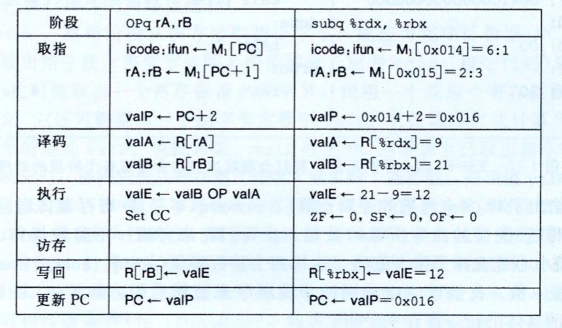

首先我们可以看到汇编代码的1、2行将寄存器分别初始化为9，21，supq指令的地址为0x014，由两个字节组成，值分别为0x61和0x23。

例2：rmmovq指令

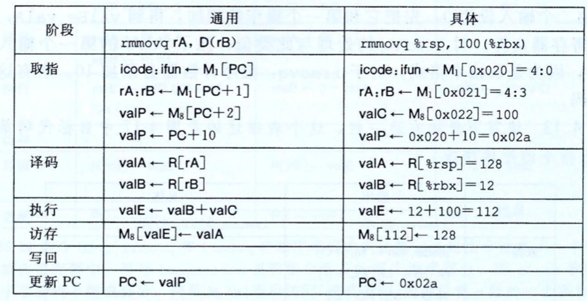

在汇编代码中，指令位于0x020，有10个字节。前两个值为0x40和0x43，后面8个是数字0x0000 0000 0000 0064(十进制100)按字节反过来得到的数。

例子3：pushq和pop指令。 

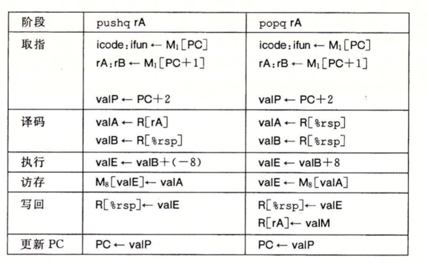

push指令在译码阶段用%rsp(栈寄存器)作为第二个寄存器操作数的标识符，将栈指针赋值为valB。在执行阶段，用ALU将栈指针减8。减过8的值就是内存写的地址，在写回阶段还会存回到%rsp中。

popq指令的执行与pushq的执行类似，在译码阶段读两次栈指针主要是增强设计的整体一致性。在执行阶段，用ALU给栈指针加8，但是用没有加过8的原始值作为内存操作的地址。在写回阶段，要将加过8的栈指针更新栈指针寄存器，还要将寄存器rA更新为从内存中读出的值。popq应该先读内存的值，再增加栈指针。

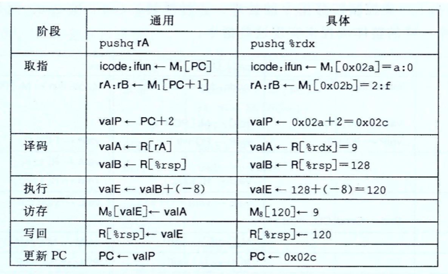

例4：跳转指令

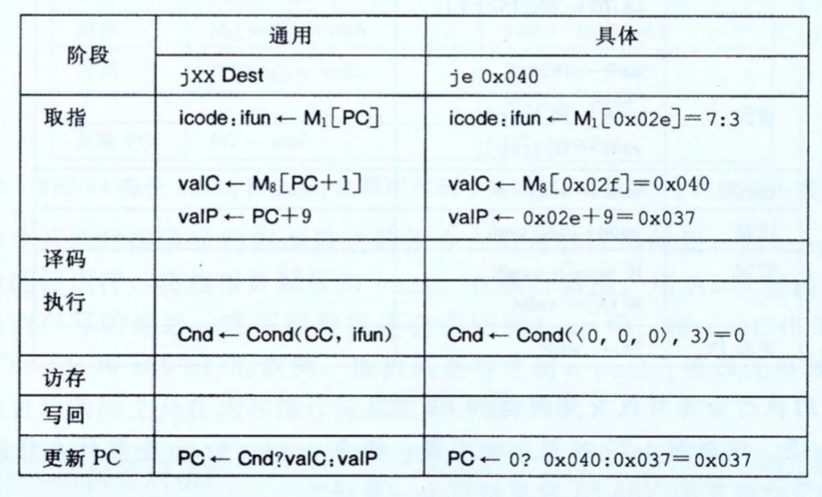

在汇编代码中，je的地址为0x02e，有9个字节，第一个字节的值为0x73,而剩下的8个字节是0x0000 0000 0000 0040按照反过来得到的数，也就是跳转目标。

例5：ret指令

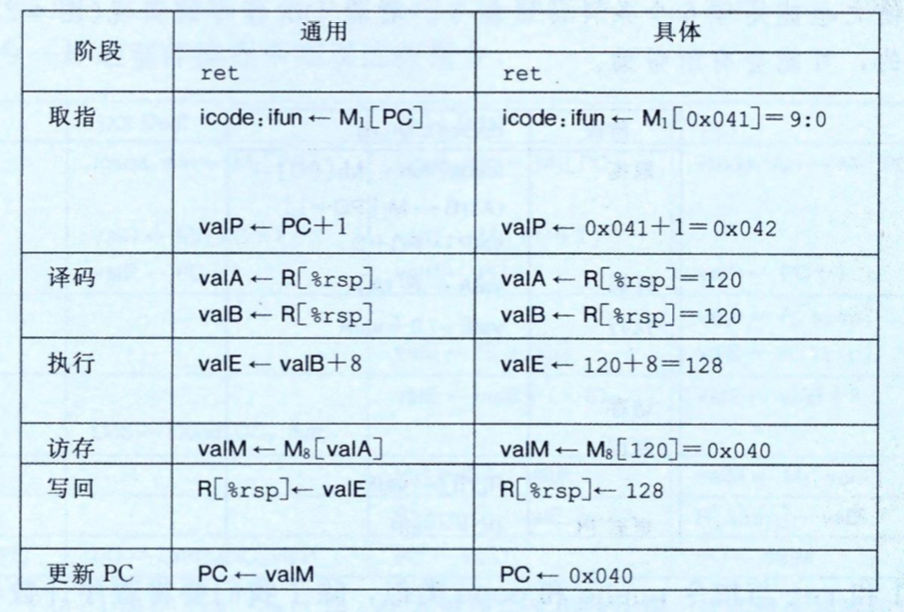

ret指令的地址是0x041,只有一个字节的编码，0x90。ret前面的call指令将%rsp设置为120，并返回地址0x040存放在了内存地址120中。

call指令：

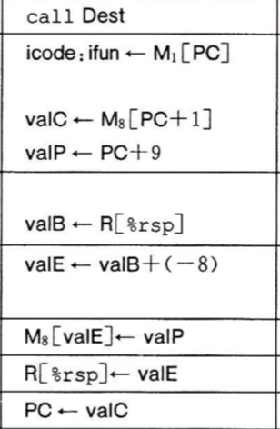

#### SEQ硬件结构

实现所有Y86-64指令所需要的计算可以被组织成6个基本阶段：取指、译码、执行、访存、写回和更新PC。如下给出了一个能执行这些计算的硬件结构的抽象：

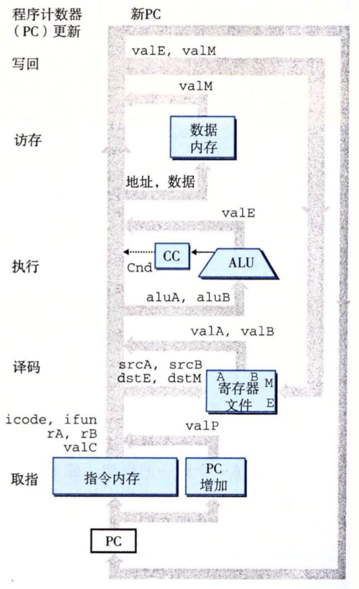

* 取指：将程序计数器寄存器作为地址，"指令内存"读取指令的字节。PC增加器计算valP，即增加了的程序计数器。
* 译码：寄存器文件有两个读端口A和B，从这两个端口同时读寄存器值valA和valB。
* 执行：执行阶段会根据指令的类型，将算术/逻辑单元(ALU)用于不同的目的。对整数操作，它要执行指令所指定的运算。对其他指令，它会作为一个加法器来计算增加或减少栈指针，或计算有效地址，或只是简单地加0，将一个输入传递到输出。条件码寄存器(CC)有三个条件码位。ALU负责计算条件码的新值。当执行条件传送指令时，根据条件码和传送条件来决定是否更新目标寄存器。同样，当执行一条跳转指令时，会根据条件码和跳转类型来计算分支信号Cnd。
* 访存：在执行访存操作时，数据内存读出或写入一个内存字。
* 写回：寄存器文件有两个写端口。端口E用来写ALU计算出来的值(地址)，而端口M用来写从数据内存中读出的值。
* PC更新：程序计数器的新值选择自：valP，下一条指令的地址；valC，调用指令或跳转指令指定的目标地址；valM，从内存读取的返回地址。

如下是更详细的SEQ实现：

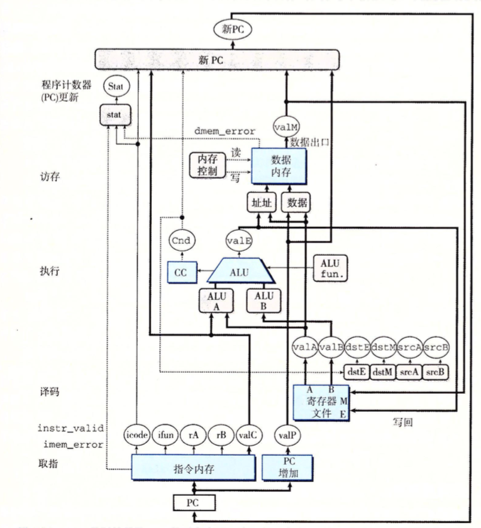


#### SEQ的时序

SEQ的实现包括组合逻辑和两种存储设备：时钟存储器(程序计数器和条件码寄存器)，随机访问存储器(寄存器文件、指令内存和数据内存)。组合逻辑不需要任何时序或控制，因为只有输入有了变化，值就通过逻辑门网络传播。指令内存只用来读指令，可以将这个单元看成是组合逻辑，即根据地址输入产生输出字。

现在还剩四个硬件单元需要对它们的时序进行明确控制—程序计数器、条件码寄存器、数据内存和寄存器文件。**这些单元通过一个时钟信号来控制，它触发将新值装载到寄存器以及将值写到随机访问存储器**。

每个时钟周期，程序计数器都会装载新的指令地址。只有在执行整数运算指令时，才会装载条件码寄存器。只有在执行rmmovq、pushq或call指令时，才会写数据内存。

**要控制处理器中活动的时序，只需要寄存器和内存的时钟控制**。硬件的赋值顺序执行效果如下面汇编代码一样，从上向下，并且即使所有的状态更新实际是同时发生，且只在时钟上升开始下一个周期时。之所以保持这样的等价性，是因为指令遵循以下原则：

> 原则：从不回读。处理器从来不需要为了完成一条指令的执行而去读由该指令更新的状态。

如push指令：我们将栈指针减8作为信号valE，然后再用这个信号既作为寄存器写的数据，也作为内存写的地址。因此在时钟上升开始下一个周期时，处理器就可以同时执行寄存器和内存写了。而如果我们先将%rsp减8，再将更新后的%rsp值作为写地址，那么执行内存操作时，它需要先从寄存器文件中读更新过的栈指针，无法做到在一个时钟内同时对寄存器和内存写了。


例子：如下例子，有些指令会设置条件码，有些指令会读取条件码，但没有指令必须既设置又读取条件码。并且虽然要等到时钟开始下一个周期时才会设置条件码，但是在任何指令试图读它之前，它们都会更新。


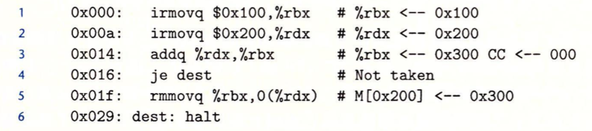

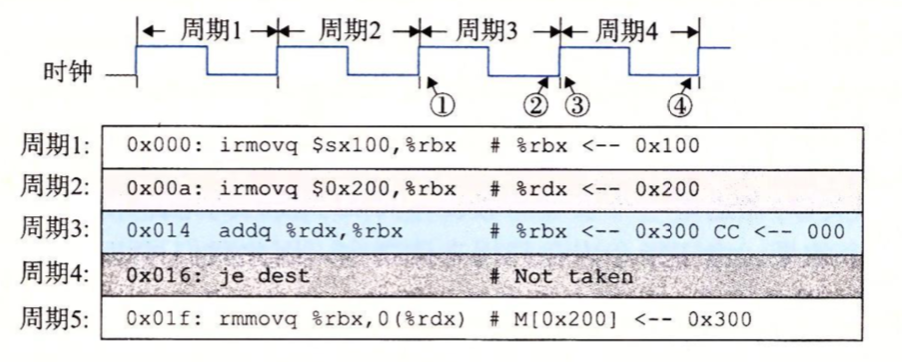

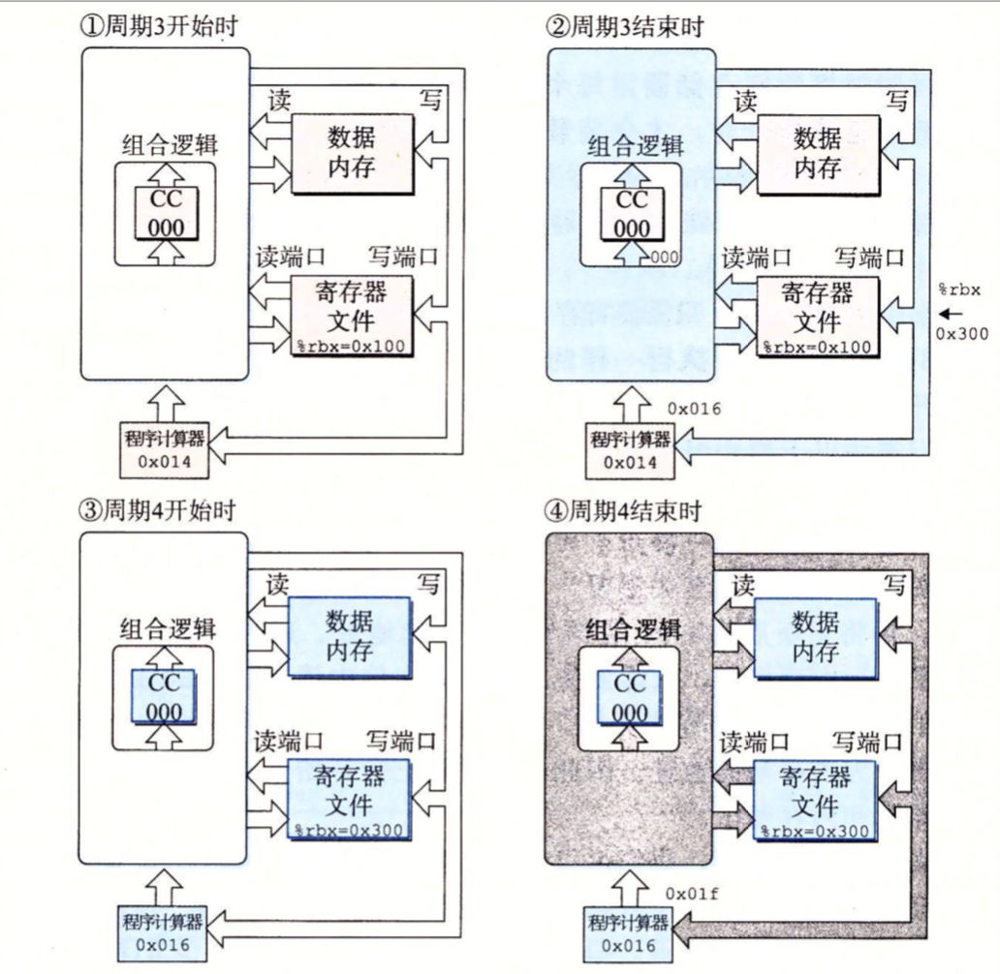

如表示的是周期3开始的时候，周期4结束的流程图，不同颜色的代码表明电路信号是如何与正在被执行的不同指令相联系的。

状态单元保持的是第二条irmovq指令更新过的状态，该指令用浅灰色表示。组合逻辑用白色表示，表明它还没没有来得及对变化了的状态做出反应。时钟周期开始时，地址0x014载入程序计数器中，这样就会取出和处理addq指令。值沿着组合逻辑流动，包括读随机访问存储器。在这个周期末尾，组合逻辑为条件码**产生**了新的值(000)，程序寄存器%rbx的更新值，以及程序计数器的新值(0x016)。此时组合逻辑已经根据addq指令被更新了，但是状态还是保持着第二次irmoveq指令(用浅灰色表示)设置的值。

当时钟上升开始周期4时，会更新程序计数器、寄存器文件和条件码寄存器，因此我们用蓝色来表示，但是组合逻辑还没有对这些变化作出反应，所以用白色表示。在这个周期内，会取出并执行je指令，在图中用深灰色表示。因为条件码ZF为0，所以不会执行分支。在这个周期末尾，程序计数器已经产生了新值0x01f。组合逻辑已经根据je指令被更新过了，但是直到下个周期开始之前，状态还是保持着addq指令设置的值。

总结：在一个周期到来之前，会将前一个指令产生的值设置到存储器中 (改变状态)，如程序计数器，然后再根据这个程序计数器执行新的指令，新的指令会导致组合逻辑发生变化，并产生新的值，但是由于状态只能在一个时钟上升时才能设置，所以当前时钟周期的状态是上一个时钟产生的值，直到下一个周期到来，才会重新设置状态。

#### SEQ阶段的实现

1. 取指阶段

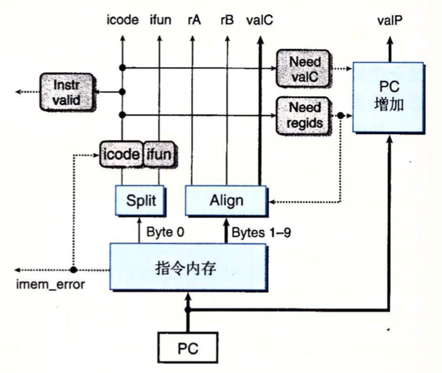

以PC作为起始地址，从指令内存中读出10个字节。第一个字节被解释成指令字节，分为两个4位的数，标号为"icode"和"ifun"(控制逻辑块计算指令和功能码)。如果当指令地址不合法时(由imem_error指明)，使这些值对应于nop指令(空指令)。

根据icode的值，我们可以计算三个一位的信号(虚线表示)：

* instr_valid：这个字节是否对应一个合法的Y86-64指令。这个信号用来发现不合法的指令。
* need_regids：这个指令是否包含一个寄存器指示符字节。
* need_valC：这个指令是否包含一个数字。

instr_valid和imem_error在访存阶段被用来产生状态码。

2. 译码和写回阶段

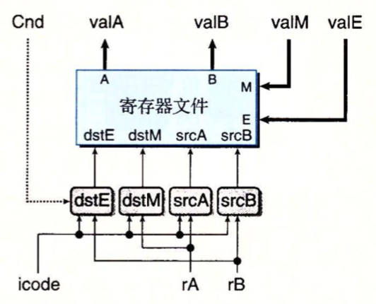

寄存器文件有四个端口，它支持同时进行两个读(在端口A和B)和两个写(在端口E和M上)。每个端口都有一个地址连接和一个数据连接，地址连接是一个寄存器ID，而数据连接是一组64根线路，既可以作为寄存器文件的输出字(对读端口来说)，也可以作为它的输入字(对写端口来说)。两个读端口的地址输入为srcA和srcB，而两个写端口的地址输入为dstE和dstM。如果某个端口上的值为0xF，则表明不需要访问寄存器。

3. 执行阶段

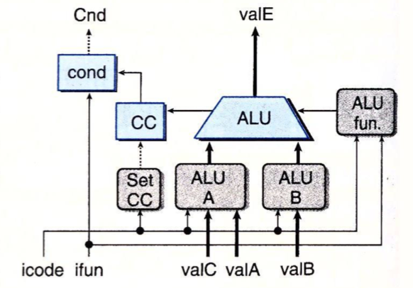

执行阶段包括算术/逻辑单元(ALU)。这个单元根据alufun信号的设置，对输入aluA和aluB执行ADD、AND等运算。

4. 访存阶段

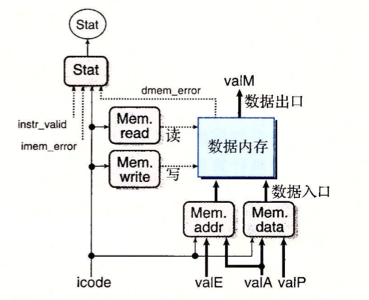

如上图，两个控制块产生内存地址和内存输入数据(为写操作)的值，另外两个块产生表明英国执行读操作还是写操作的控制信号。当执行读操作时，数据内存产生值valM。

5. 更新PC阶段

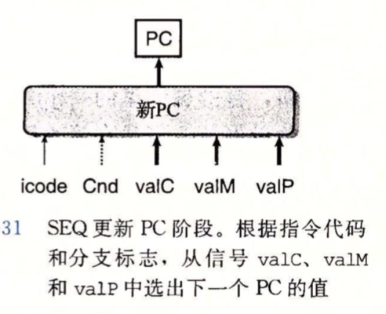

valC表示一个常数，valM从内存中取出的值，valP程序计数器自增值。