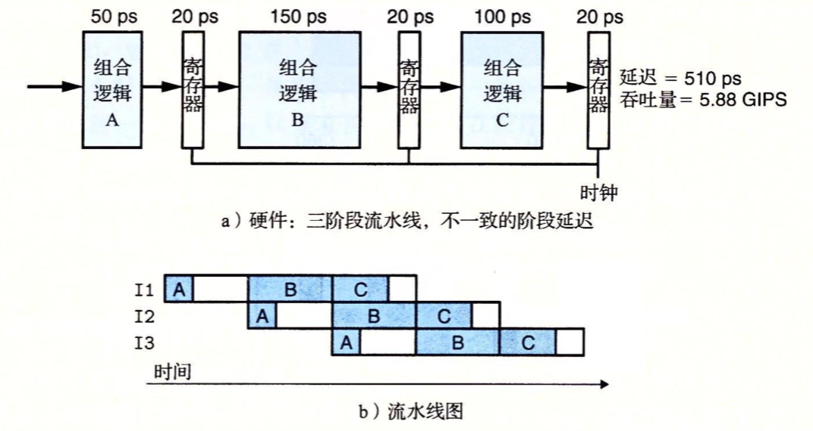

### 处理器结构

#### 流水线的通用原理

在流水化的系统中，待执行的任务被划分成了若干个独立的阶段。如工厂流水线一样，一个商品需要经过多个阶段的加工，而每个阶段都有专属的工人，当流程流经该工人时只处理属于自己的任务。

流水线化的一个重要特性就是提高系统的**吞吐量**，也就是单位时间内加工商品数量，不过它也会轻微地增加**延迟**，也就是某个工人加工商品所需要的时间。

#### 计算流水线

流水线中的指令就是工厂流水线中的工人，每个阶段完成指令执行的一部分。如下是一个非流水线化的例子，它由一些**执行计算的逻辑**以及一个保存计算结果的**寄存器**组成：

在现代逻辑设计中，电路延迟以微微秒或皮秒(ps)为单位来计算，1ps = 10$^{-12}$秒，在这个例子中，组合逻辑需要300ps，而加载寄存器需要20ps。在图b中，从上到下写着一组操作(I1、I2、I3)，实心的长方型表示这些指令执行的时间，在这个实现中，在开始下一条指令之前必须完成前一个。因此这些方框在垂直方向上没有相互重叠。下面给出了这个系统的最大吞吐量（单位每秒千兆条指令(GIPS)，也就是每秒十亿条指令）：

从头到尾执行一条指令所需要的时间称为延迟，在此系统中，延迟为320ps，也就是吞吐量的倒数。

假设将系统执行的计算分成三个阶段(A、B、C)，每个阶段需要100ps，如下图流水线化例子：

每个阶段之间放上流水线寄存器，用来保存每个阶段计算的结果，这样每条指令都会按照三步经过这个系统，从头到尾需要三个完整的时钟周期。在b图中，只要I1指令从A进入B后，I2指令就进入了阶段B，依次类推。在稳定状态下，三个阶段都应该是活动的，每个时钟周期，一条指令离开系统，一条新的进入。在这个系统中，我们将时钟周期设为100+20=120ps，得到的吞吐量大约是8.33GIPS，相比非流水化流程，吞吐量提高了8.33/3.12=2.67倍。因为处理一条指令需要3个时钟周期，所以这条流水线的延迟就是3*120=360ps，延迟有所增加。

#### 流水线操作的详细说明

如下图跟踪了时刻240~360之间的电路活动：

如上，指令I1经过阶段C，I2经过阶段B，而I3经过阶段A。就在时刻240上升之前，阶段A中计算的指令I2的值已经到达第一个流水线寄存器的输入，但是该寄存器的状态和输出还保持为指令I1在阶段A中计算的值，指令I1在阶段B中计算的值已经到达第二个流水线寄存器的输入。当时钟上升时，这些输入被加载到流水线寄存器中，成为寄存器的输出。另外阶段A的输入被设置成发起指令I3的计算。然后信号传播通过各个阶段的组合逻辑。

#### 流水线的局限性

在上面的例子中，我们将计算分成三个相互独立的阶段，每个阶段需要的时间是原来逻辑需要时间的三分之一，但是不幸的是会出现一些因素，降低流水线的效率：

1. 不一致的划分

通常对硬件设计者来说，将系统计算设计划分成一组具有相同延迟的阶段是一个严峻的挑战。

如上图所示，我们将组合逻辑分为三个阶段，通过这些阶段的延迟从50ps到150ps不等。运行时钟的速率是由最慢的阶段的延迟限制的，所以实际上每个阶段的延迟都是150，即时钟的周期为150+20=170ps。因此阶段A会空闲100ps，阶段C会空闲50ps，只有阶段B会一直处于活动状态。此外，由于时钟周期减慢了，延迟也增加到了510ps。

2. 流水线过深，收益反而下降

如上图，我们将计算(组合逻辑)分成了6个阶段，每个阶段需要50ps，并且在每对阶段之间插入流水线寄存器，这样这个系统的最小时钟周期为50+20=70ps，吞吐量为14.29ps，对比前面的流水线，吞吐量提高了14.29/8.33 = 1.71。虽然我们将时钟的时间缩短了两倍，但是增加了流水寄存器的梳数量，导致吞吐量并没有加倍，这个流水线寄存器的延迟成为了一个制约因束。