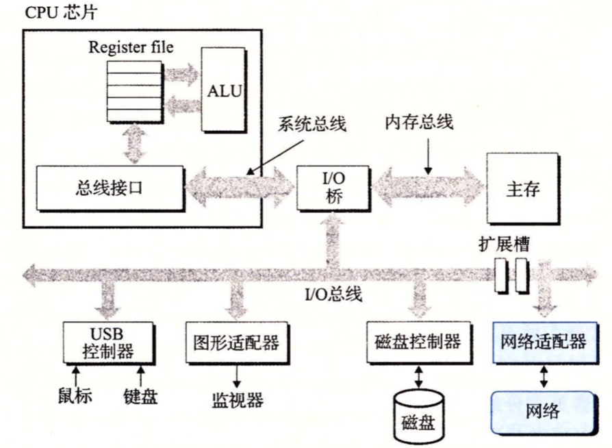
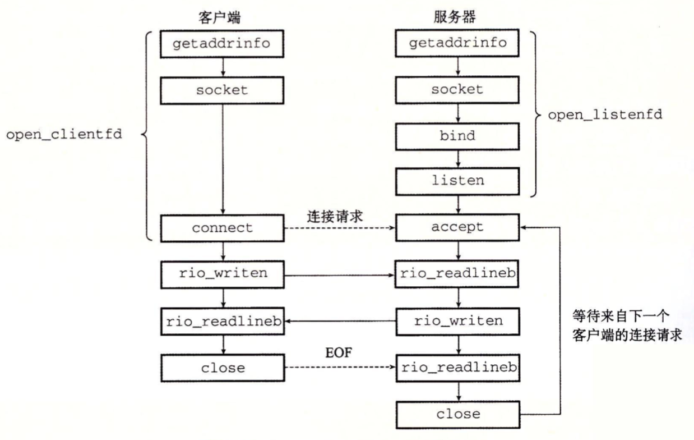
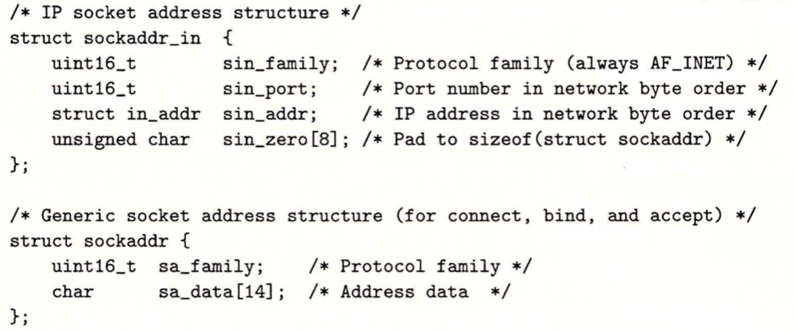
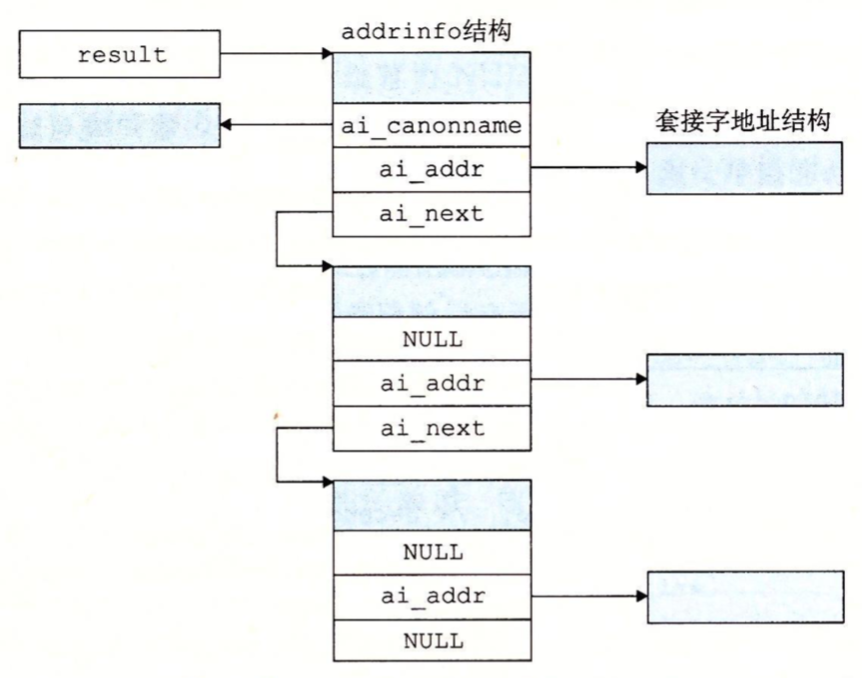
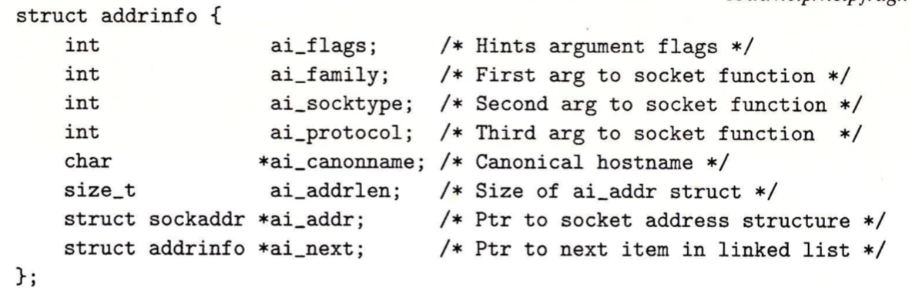

网络可以看作是一种I/O设备，是数据源和数据接收方。一个插到I/O总线扩展槽的适配器提供了到网络的物理接口。从网络上接收到的数据从适配器经过I/O和内存总线复制到内存，通常通过DMA传送。相似的，数据也能从内存复制到网络。



### 套接字接口

套接字接口(socket interface)是一组函数，它们和Unix I/O函数结合起来，用以创建网络应用。



#### 套接字地址结构

从Linux程序的角度来看，套接字就是一个有相应描述符的打开文件。

因特网的套接字地址存放在类型为sockaddr_in的16字节结构中。sin_family是AF_INET，sin_port是一个16位的端口号，而sin_addr是一个32位的IP地址。



#### socket函数

客户端和服务端使用socket函数来创建一个套接字(socket descriptor)。

```c
#include <sys/types.h>
#include <sys/socket.h>

int socket(int domain,int type,int protocol);
```

如果想使套接字成为连接的一个端点，就用下面的硬编码的参数来调用socket函数：

```c
clientfd = socket(AF_INET, SOCK_STREAM, 0);
```

> AF_INET（又称PF_INET）是 IPv4 网络协议的套接字类型，AF_INET6 则是 IPv6 的；而AF_UNIX 则是Unix系统本地通信
>
> 选择AF_INET 的目的就是使用IPv4 进行通信。因为IPv4 使用32位地址，相比IPv6 的128位来说，计算更快，便于用于局域网通信

AF_INET表明我们正在使用32位IP地址，而SOCK_STREAM表示这个套接字是连接的一个端点。protocol协议类型，通常是IPPROTO_TCP或者IPPROTO_UDP。socket返回的clientfd描述符仅是部分打开，还不能用于写。如何完成打开套接字的工作，取决于我们是客户端还是服务端。

#### connect函数

客户端通过connect函数来建立和服务端的连接。

```c
#include <sys/socket.h>
int connct(int clientfd,const struct sockaddr *addr,socklen_t addrlen);
```

connect函数试图与套接字地址为addr的服务器建立一个连接，其中addrlen是sizeof(sockaddr_in)。connect函数会阻塞，一直到连接成功或发生错误。如果成功，clientfd描述符就可以读写了。连接成功后得到套接字对，如下：

```
x:y
```

x表示客户端的IP地址，而y表示临时端口，它唯一确定了客户端主机上的客户端进程。

#### bind函数

bind、listen和accept，服务器用它们来和客户端建立连接。

```c
#include <sys/socket.h>
int bind(int sockfd,const struct sockaddr *addr,socklen_t addrlen);
```

bind函数告诉内核将addr中的服务器套接字地址和套接字描述符sockfd联系起来。

#### listen函数

默认情况下，内核会认为socket函数创建的描述符对应于主动套接字(active socket)(客户端)。服务器调用listen函数告诉内核，描述符是被服务器而不是客户端使用的。

```c
#include <sys/socket.h>
int listen(int sockfd,int backlog);
```

listen函数将sockfd从一个主动套接字转化为一个监听套接字(listening socket)，该套接字可以接受来自客户端的连接请求。backlog参数暗示内核在开始拒绝连接请求之前，队列中要排队的未完成的连接请求的数量。

#### accept函数

服务器通过accept函数来等待来自客户端的连接请求。

````c
#include <sys/socket.h>
int accept(int listenfd,struct sockaddr *addr,int *addrlen);
````

accept函数等待来自客户端的请求到达侦听描述符listenfd，然后在addr中填写客户端的套接字地址，并返回一个已连接描述符(connected descriptor)，这个描述符可被用来利用Unix I/O函数与客户端通信。

监听描述符是作为客户端连接请求的一个端点，它通常被创建一次，并保存于服务器的整个生命周期。已连接描述符是客户端和服务端之间已经建立起来了的连接的一个端点，服务器每次接受连接请求时都会创建一次，它只存在于服务器为一个客户端服务的过程中。

#### 主机和服务的转换

​	Linux提供了一些强大的函数(getaddrinfo和getnameinfo)实现二进制套接字地址结构和主机名、主机地址、服务名和端口号的字符串表示之间的相互转化。

1. getaddrinfo函数

   getaddrinfo函数将主机名、主机地址、服务名和端口号转化成套接字地址结构。

   ```c
   #include <sys/socket.h>
   #include <sys/socket.h>
   #include <netdb.h>

   int getaddrinfo(const char *host,const char *service,
                   const struct addrinfo *hints,
                   struct addrinfo **result);

   void freeaddrinfo(struct addrinfo *result);

   const char *gai_strerror(int *result);
   ```

   getaddrinfo返回一个指向addrinfo结构的链表，其中每个结构指向一个对应于host和service的套接字地址结构。

   

   在客户端调用getaddrinfo之后，会遍历这个列表，依次尝试每个套接字地址，直到调用socket和connect成功，建立起连接。类似地，服务器尝试遍历列表中的每个套接字地址，直到调用socket和bind成功，描述符会被绑定到一个合法的套接字地址。为了避免内存泄漏，应用程序必须在最后调用freeaddrinfo，释放该链表。如果getaddrinfo返回非零的错误代码，应用程序可以调用gai_streeror，将该代码转换成消息字符串。

   getaddrinfo的host参数可以是域名，也可以是数字地址(IP地址)，service参数可以是服务名(如http、ftp)，也可以是十进制端口号。

   可选参数hints是一个addrinfo结构，可以控制函数返回的信息类型。

   

   如果要传递hints参数，只能设置下列字段：ai_family、ai_socktype、ai_protocol和ai_flags字段。其他字段必须设置为0：

   * getaddrinfo默认可以返回IPv4和IPv6套接字地址。ai_family设置为AF_INET会将列表限制为IPv4地址；设置为AF_INET6则限制为IPv6地址。
   * 对于host关联的每个地址，getaddrinfo函数默认最多返回三个addrinfo结构，每个的ai_socktype字段不同：一个是连接，一个是数据报，一个是原始套接字。ai_socktype设置为SOCK_STREAM将列表限制为对每个地址最多一个addrinfo结构，该结构的套接字地址可以作为连接的一个端点。
   * ai_flags是一个位掩码，可以进一步修改默认行为：
     * AI_ADDRCONFIG。它要求只有当本地主机被配置为IPv4时，getaddrinfo返回IPv4地址。对IPv6也是类似。
     * AI_CANONNAME。ai_canonname字段默认是NULL。如果设置了该标志，就是告诉getaddrinfo将列表中第一个字段addrinfo结构的ai_canonname字段指向host官方名字。
     * AI_NUMERICSERV。参数service默认可以是服务名或端口号。这个标志强制参数service为端口号。
     * AI_PASSIVE。getaddrinfo默认返回套接字地址，客户端可以调用connect时用作主动套接字。这个标志告诉该函数，返回的套接字地址可能被服务器用作监听套接字。

2. getnameinfo函数

   getnameinfo函数和getaddrinfo是相反的，将一个套接字地址结构换成相应的主机和服务名字符串。

   ```c
   #include <sys/socket.h>
   #include <netdb.h>
   int getnameinfo(const struct sockaddr *sa,socklen_t salen,
                   char *host, size_t hostlen,
                   char *service, size_t servlen, int flags);
   ```

   参数sa指向大小为salen字节的套接字地址结构，host指向大小为hostlen字节的缓冲区，service指向大小为servlen字节的缓冲区。getnameinfo函数将套接字地址结构sa转换成对应的主机和服务名字符串，并将它们复制到host和service缓冲区。如果getnameinfo返回非零的错误码，应用程序可以调用gai_strerror把它转化成字符串。

   如果不想要主机名，可以把host设置为NULL，hostlen设置为0。

   参数flags是一个位掩码，能修改默认的行为：

   * NI_NUMERICHOST。getnameinfo默认试图返回host中的域名。设置该标志会使函数返回一个数字地址字符串。
   * NI_NUMERICSERV。getnameinfo默认会检查/etc/services，如果可能，会返回服务名而不是端口号。设置该标志会使该函数跳过查找，简单返回端口号。


例子：

```c
#include <stdio.h>
#include <sys/socket.h>
#include <sys/types.h>
#include <netdb.h>
#include <stdlib.h>
#include <errno.h>
int main(int argc, const char * argv[]) {
    
    struct addrinfo *p,*listp,hints;
    char buf[8192];
    int rc,flags;
    
    if(argc != 2){
        fprintf(stderr,"usage:%s <domain name>\n",argv[0]);
        exit(0);
    }
    
    //clear hints
    memset(&hints,0,sizeof(struct addrinfo));
    //IP4 only
    hints.ai_family = AF_INET;
    //Connections only
    hints.ai_socktype = SOCK_STREAM;
    if((rc = getaddrinfo(argv[1], NULL, &hints, &listp)) != 0){
        fprintf(stderr, "getaddrinfo error: %s\n",gai_strerror(rc));
        exit(1);
    }
    //display address string instead of domain name
    flags = NI_NUMERICHOST;
    for (p = listp;p; p = p ->ai_next) {
        getnameinfo(p->ai_addr, p ->ai_addrlen, buf, 8192, NULL, 0, flags);
        printf("%s\n",buf);
    }
    
    //clean up
    freeaddrinfo(listp);
    printf("Hello, World!\n");
    exit(0);
}
```

#### 套接字接口的辅助函数

1. open_clientfd函数

```c
int open_clientfd(char *hostname,char *port);
```

open_clientfd函数建立与服务器的连接，该服务器运行在主机hostname上，并在端口port上监听连接请求。它返回一个打开的套接字描述符，该描述符准备好了，可以用UnixI/O函数做输入和输出。

```c
#include <stdio.h>
#include <sys/socket.h>
#include <sys/types.h>
#include <netdb.h>
#include <stdlib.h>
#include <errno.h>
#include<unistd.h>
int open_clientfd(char *hostname,char *port){
    
    int clientfd;
    struct addrinfo hints,*listp,*p;
    
    memset(&hints,0,sizeof(struct addrinfo));
    hints.ai_socktype = SOCK_STREAM;
    //use a numeric port arg
    hints.ai_flags = AI_NUMERICSERV;

    hints.ai_flags |= AI_ADDRCONFIG;
    //getaddrinfo返回addrinfo结构列表，每个结构指向一个套接字地址结构，可用于建立与服务器的连接
    getaddrinfo(hostname,port,&hints, &listp);
    for(p = listp;p;p=p ->ai_next){
        
        if((clientfd = socket(p->ai_family, p->ai_socktype, p->ai_protocol)) < 0){
            continue;
        }
        //尝试建立连接
        if(connect(clientfd, p->ai_addr, p->ai_addrlen) != -1)
            break;
        
        close(clientfd);
    }
    
    freeaddrinfo(listp);
    if(!p){
        return -1;
    }else{
        return clientfd;
    }
    
}
```

2. open_listenfd函数

调用open_listenfd函数，服务器创建一个监听描述符，准备好接收连接请求。

```
int open_listenfd(char *port){
    
    int listenfd,optval = 1;
    struct addrinfo hints,*listp,*p;
    
    memset(&hints,0,sizeof(struct addrinfo));
    hints.ai_socktype = SOCK_STREAM;
    //any IP address
    hints.ai_flags = AI_PASSIVE|AI_ADDRCONFIG;
    //using port number
    hints.ai_flags |= AI_NUMERICSERV;
    
    getaddrinfo(NULL,port,&hints, &listp);
    
    for(p = listp;p;p=p ->ai_next){
        
        if((listenfd = socket(p->ai_family, p->ai_socktype, p->ai_protocol)) < 0){
            continue;
        }
        //设置套接字选项
        //SOL_SOCKET:通用套接字选项
        //SO_REUSEADDR: 允许重用本地地址和端口
        //optval缓冲区
        setsockopt(listenfd, SOL_SOCKET, SO_REUSEADDR, (const void *)&optval, sizeof(int));
        
        if(bind(listenfd, p->ai_addr, p->ai_addrlen) == 0)
            break;
        
        close(listenfd);
    }
    
    freeaddrinfo(listp);
    if(!p){
        return -1;
    }
    if(listen(listenfd, 10)<0){
        close(listenfd);
        return -1;
    }
    return listenfd;
}
```

