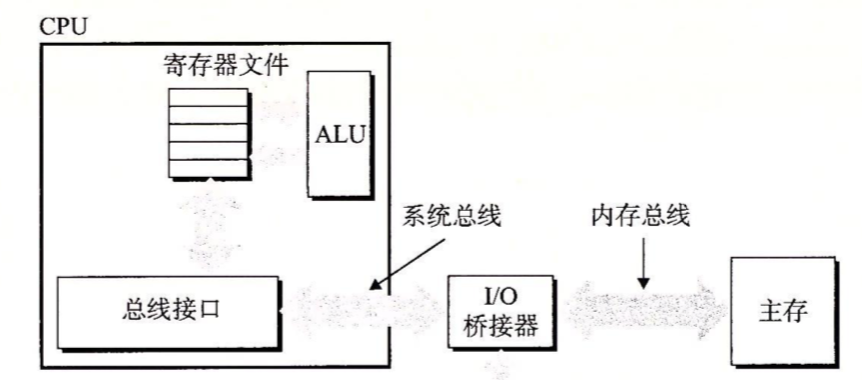

存储系统是一个具有不同容量、成本和访问时间的存储设备的层次结构。访问速度越快，制成本就越高，容量相比下一级越小，它往往缓存着下一层存储器中的数据。**CPU寄存器**保存着最常用的数据(指令数据) 。靠近CPU的小的、快速的**高速缓存存储器**缓存着一部分存储在相对慢速的主存储器中的数据以及一些最近使用的指令。**主存**缓存存储在容量较大的、慢速磁盘上的数据，而这些磁盘又常常作为存储在通过网络连接的其他机器的磁盘或磁带上的数据的缓冲区域。

随机访问寄存器(Random-Access Memory，RAM)分为两类：静态和动态。静态RAM(SRAM)比动态RAM(DRAM)更快，但也贵得多。SRAM用来作为高速缓存存储器，DRAM用来作为主存以及图形系统的帧缓冲区。

#### 1. 静态RAM(SRAM)

SRAM将每个位存储在一个双稳态存储单元里，每个单元用一个六晶体管电路来实现的。这个电路有这样一个属性，它可以无限期地保持在两个不同的电压配置或状态之一。当钟摆倾斜到最左边或最右边时，它是稳定的。其他任何状态都是不稳定的，最细微的扰动也能使它倒下，而且一旦倒下就永远不会再恢复到垂直的位置。**只要有电，它就会永远保持它的值**，即使有干扰来扰乱电压，当干扰消除时，电路就会恢复到稳定值。


#### 2. 动态RAM(DRAM)

DRAM将每个位存储相当于对一个电容充电。这个电容非常小，通常只有30毫微微法拉(30*10$^{-15}$法拉)。 DRAM存储器可以制造得非常密集，每个单元由一个电容和一个访问晶体管组成。但是与SRAM不同，DRAM存储器单元对干扰非常敏感，当电容的电压被干扰之后，它就永远不会恢复了，所以内存系统必须周期性的通过读出，然后重新刷新内存每一位。只要供电，SRAM就会保持不变。


#### 3. 传统的DRAM

**DRAM芯片**中的单元(位)被分成d个超单元，超单元被组织成一个r行c列的长方形阵列，这里rc=d。在这个阵列里，超单元的地址由列和行的下标来决定，如：(i,j)，i表示行，j表示列。假设每个超单元有w位，那么d个超单元可以存储d*w位信息。

例子：如下是一个16*8的DRAM芯片的组织，有d=16个超单元，每个超单元有w=8位，并且超单元被组织成r=4，c=4的阵列。带阴影的方框表示地址(2,1)处的超单元。信息通过称为**引脚**的外部连接器流入和流出芯片。每个引脚携带1位信号，下图中的芯片有8个data引脚，它们能传送一个字节到芯片或从芯片传出一个字节，以及2个addr引脚，它们携带2位的行和列超单元地址。


每个DRAM芯片被连接到称为**内存控制器**的电路，这个电路可以一次传送w位到每个DRAM芯片或一次从每个DRAM芯片传出w位。为了读出超单元(i,j)的内容，内存控制器将行地址i发送到DRAM ，然后是列地址j。行地址i称为RAS(Row Access Strobe，行访问选通脉冲)请求，列地址j称为CAS(Column Access Strobe，列访问选通脉冲)请求)。

例子：下图的DRAM中读出超单元(2,1)，内存控制器发送行地址2，DRAM的响应是将行2的整个内容都复制到一个内部行缓冲区，接下来，内存控制器发送列地址1，DRAM响应是从行缓冲区复制出超单元(2,1)中的8位，并把它们发送到内存控制器。


电路设计者将DRAM组织成二维阵列而不是线性数组的一个原因是降低芯片上地址引脚的数量。如上图如果把16个超单元排成一列，地址为0～15，那么引脚需要4个地址引脚(15需要4位才能表达)。二维阵列组织的缺点是必须两步发送地址，增加了访问时间。

#### 4. 内存模块

DRAM芯片封装在内存模块中，它插到主板的扩展槽上。Core i7系统使用的是240个引脚的双列直插内存模块，它以64位为块传送数据到内存控制器或从内存控制器传出数据。

如下图内存模块，用8个64Mbit的8M*8的DRAM芯片，这8个芯片编号为0～7。每个超单元存储主存的一个字节，而用相应超单元地址为(i,j)的8个超单元来表示主存中字节地址A处的64位字。如DRAM0存储第一个字节，DRAM1存储下一个字节，依此类推。


要取出内存地址A处的一个字，内存控制器将A转换成一个超单元地址(i,j)，并将它发送到内存模块，然后内存模块将i和j广播到每个DRAM。作为响应，每个DRAM输出它的(i,j)超单元的8位内容。模块中电路收集这些输出，并把它们合并成一个64位字，再返回给内存控制器。

#### 5. 增强的DRAM

* 快页模式DRAM(Fast Page Mode DRAM,FPM DRAM)。传统的DRAM将超单元的一整行复制到它的内部行缓冲区，使用一个，然后丢弃。比如要从某一行中读4个超单元，内存控制器必须发送4个RAS/CAS请求，即使它们读的是同一行数据。 FPM DRAM可以连续访问缓冲区去获取数据。比如，如果要读取4个超单元，它们的i地址都一样，那么第一次内存控制器会发送一个RAS/CAS请求，后面吗跟三个CAS请求，初始的RAS/CAS请求将行i复制到行缓冲区，并返回CAS寻址的那个超单元，接下来三个超单元直接从行缓冲区获得，因此返回的比初始超单元快。
* 扩展数据输出(Extended Data Out DRAM,EDO DRAM)。FPM DRAM的一个增强的形式，它允许各个CAS信号在时间上靠得更紧密一点。
* 同步DRAM(Synchronous DRAM,SDRAM)。SDRAM用与驱动内存控制器相同的外部时钟信号的上升沿来代替许多这样的控制信号，这种最终效果就是SDRAM能够比那些异步的存储器更快的输出它的超单元的内容(FPM EDO先对来说是异步的)。
* 双倍数据速率同步DRAM(Double Data-Rate Synchronous DRAM,DDR SDRAM)。DDR SDRAM 是对SDRAM的一种增强，它通过使用两个时钟沿作为控制信号，从而使DRAM的速度翻倍。
* 视频RAM(Video RAM VRAM)。它用在图形系统的帧缓冲区中。

#### 7. 非易失性存储器

如果断电，DRAM和SRAM会丢失它们的信息，从这个意义上来说，它们是**易失的**(volatile)。另一方面，**非易失性存储器**(nonvolatile memory)即使是在关电后，仍然保存着它们的信息。

现在有多种非易失性存储器，由于历史原因，虽然ROM中有的类型既可以读也可以写，但是它们整体上都被称为**只读存储器**(Read-Only Memory,ROM)。ROM是以它们能够被重新编程(写)的次数和对它们进行重编程所用的机制来区分的。

* PROM(Programmable ROM,可编程ROM)只能被编程一次。PROM的每个存储器单元有一种熔丝，只能用高电流熔断一次
* 可擦写编程ROM(Erasable Programmable ROM,EPROM)有一个透明的石英窗口，允许光到达存储单元。紫外线光照射过窗口，EPROM单元就被清除为0。对EPROM编程是通过使用一种把1写入EPROM的特殊设备来完成的。EPROM能够被擦除和重编程的次数的数量级可以达到1000次。
* 电子可擦除PROM(Electrically Erasable PROM,EEPROM)类似于EPROM ,但是它不需要一个物理上独立的编程设备，因此可以直接在印制电路卡上编程。EEPROM能够被编程的次数的数量级可以达到10$^5$次。
* 闪存(flash memory)是一类非易失性存储器，基于EEPROM，它已经成为一种重要的存储技术。如基于闪存的磁盘驱动器—固态硬盘。

存储在ROM设备中的程序通常被称为固件(firmware)。当一个计算机系统通电以后，它会运行存储在ROM中的固件。一些系统在固件中提供了少量基本的输入和输出函数。

#### 8. 访问主存

数据流通过称为**总线**的共享电子电路在处理器和DRAM主存之间来来回回。每次CPU和主存之间的数据传送都是通过一系列步骤来完成的，这些步骤称为**总线事务**。**读事务**从主存传送数据到CPU。**写事务**从CPU传送数据到主存。

如下一个示例计算机系统的配置。主要部件是CPU芯片、我们将称为I/O桥接器(I/O bridge)的芯片组(其中包括内存控制器)，以及组成主存的DRAM内存模块。这些部件由一对总线连接起来，其中一条总线是**系统总线**(system bus)，它连接CPU和I/O桥接器，另一条总线是**内存总线**(memory bus)，它连接I/O桥接器和主存。**I/O桥接器**将系统总线的电子信号翻译成内存总线的电子信号。



例子：```movq A,%rax```,这里，地址A的内容加载到寄存器%rax中。

CPU芯片上称为总线接口(bus interface)的电路在总线上发起读事务。读事务由三个步骤组成：首先，CPU将地址A放到系统总线上，I/O桥将信号传送到内存总线。接下来，主存感觉到内存总线上的地址信号，从内存总线读地址，从DRAM取出数据字，并将数据写到内存总线。I/O桥将内存总线信号翻译成系统总线信号，然后沿着系统总线传递。最后，CPU感觉到系统总线上的数据，从总线上读取数据，并将数据复制到寄存器%rax。

反过来，当CPU执行一个像下面这样的存储操作时，

```
movq %rax,A
```

这里，寄存器%rax的内容被写到地址A，CPU发起写事务。同样，有三个基本步骤。首先，CPU将地址放到系统总线上，内存从内存总线读出地址，并等待数据到达。接下来，CPU将 %rax中的数据字复制到系统总线。最后，主存从内存总线读出数据字，并将这些位存储到DRAM中。

