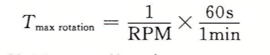

## 存储器层次结构

#### 1. 磁盘构造

磁盘是由**盘片**构成的。每个盘片有两面称为**表面**，表面覆盖着磁性记录材料。盘片中央有一个可以旋转的**主轴**，它使得盘片以固定的旋转速率旋转，通常是5400~15000转每分钟(Revolution Per Minute,RPM)。磁盘通常包含一个或多个这样的盘片，并封装在一个密封的容器内。

如上图，每个表面是由一组称为**磁道**的同心圆组成的。每个磁道被划分为一组**扇区**。每个扇区包含相同数量的数据位(通常是512字节)，这些数据编码在扇区上的磁性材料中。扇区之间由一些**间隙**分隔开，这些间隙不存储数据位。间隙用来标识扇区的格式化位。

磁盘由一个或多个叠放在一起的盘片组成的，它们被封装在一个密封的包装里。整个装置通常被称为**磁盘驱动器**，我们通常简称为**磁盘**。制造商通常用术语**柱面**来描述多个盘片驱动器的构造。这里，**柱面是所有盘片表面到主轴中心的距离相等的磁道的集合**。例如如果一个驱动器有三个盘片和六个面，每个面上的磁道的编号都是一致的，那么柱面k就是6个磁道k的集合。

#### 2. 磁盘容量

一个磁盘上可以记录的最大数称为它的最大容量，或者简称为**容量**。磁盘容量是由以下技术因素决定的：

* 记录密度(位/英寸)：磁道一英寸的段中可以放入的位数。
* 磁道密度(位/英寸)：从盘片中心出发半径上一英寸的段可以有的磁道数。
* 面密度(位/平方英寸)：记录密度与磁道密度的乘积。

最初的磁盘，是在面密度很低的时代设计的，将每个磁道分为数目相同的扇区，扇区的数目由最靠内的磁道能记录的扇区数决定的。为了保持每个磁道有固定的扇区，越往外的磁道扇区隔得越开。在面密度相对比较低的时候，这种方法还算合理，不过，随着面密度的提高，扇区之间的间隙变得不可接受的大。因此现代大容量磁盘使用一种称为**多区记录**的技术，在这种技术中，柱面的集合被分隔成不相交的子集合，称为 **记录区**。每个区包含一组连续的柱面。一个区中的每个柱面中的每条磁道都有相同的扇区，这个扇区的数量由该区中最里面的磁道所能包含的扇区确定的。

下面的公式给出了一个磁盘的容量计算公式：

例如：假设有一个磁盘，有5个盘片，每个扇区512 个字节，每个面20 000 条磁道，每条磁道平均300个扇区。那么这个磁盘的容量是：

#### 3. 磁盘操作

磁盘用读/写头(read/write head)来读写存储在磁性表面的位，而读写头连接到一个传动臂，如下图：

通过沿着半径轴前后移动这个传动臂，驱动器可以将读/写头定位在盘面上的任何磁道上，这样的机械运动称为寻道(seek)。一旦读/写头定位到了期望的磁道上，那么当磁道上的每个位通过它下面时，读/写头可以感知到这个位的值(读该位)，也可以修改这个位的值(写该位)。有多个盘片的磁盘针对每个盘面都有一个独立的读/写头。读/写头垂直排列，一致行动，在任何时刻，所有的读/写头都位于用一个柱面上。

磁盘以扇区大小的块来读写数据，对扇区的访问时间有三个主要的部分：寻道时间(seek time)，旋转时间(rotational latency)和传送时间(transfer time)：

* 寻道时间：为了读取某个目标扇区的内容，传动臂首先将读/写头定位到包含目标扇区的磁道上，移动传动臂所需的时间称为**寻道时间**。寻道时间T$_{seek}$依赖于读/写头以前的位置和传动臂在盘面上移动的速度。现代驱动器中平均寻道时间T$_{avg seek}$为3～9ms，一次寻道的最大时间T$_{max seek}$可以高达20ms。
* 旋转时间：一旦读/写头定位到了期望的磁道，驱动器等待目标扇区的第一位旋转到读/写头下。这个步骤的性能依赖于当读/写头到达目标扇区盘面的位置以及磁盘的旋转速度。在最坏的情况下，读/写头刚刚错过了目标扇区，必须等待磁盘转一整圈。

平均旋转时间T$_{avg rotation}$是T$_{max totation}$的一半。

* 传送时间：当目标扇区的第一个位位于读/写头下时，驱动器就可以开始读或者写该扇区的内容了。一个扇区的传送时间依赖于旋转速度和每条磁道的扇区数目(即读写头旋转一个扇区所需的时间)。我们粗略估计一个扇区以秒为单位的平均传送时间如下：

我们可以估计访问一个磁盘扇区内容的平均时间为：平均寻道时间、平均旋转延迟和平均传送时间之和。如下例子：

上面这个例子说明了一些很重要的问题：

* 访问一个磁盘扇区中512个字节的时间主要是寻道时间和旋转延迟。访问扇区中的第一个字节用了很长时间，但是访问剩下的字节几乎不用时间。因此如果是顺序读/写，可以节约寻道和旋转延迟时间，性能会提高很多。
* 因为寻道时间和旋转延迟大致相等，所以寻道时间乘以2就是估计磁盘访问时间的简单合理方法。

#### 4. 逻辑磁盘块

现在磁盘的构造呈现为一个简单的视图，一个B个扇区大小的逻辑块的序列，编号为0，1…B-1。磁盘封装中有一个小的硬件/固件设备，称为磁盘控制器，维护着逻辑块号和实际磁盘扇区之间的映射关系。

当操作系统想执行一个I/0操作时，例如读一个磁盘扇区的数据到主存，操作系统会发送一个命令到磁盘控制器，让它读某个逻辑块号。控制器上的固件执行一个快速表查找，将一个逻辑块号翻译成一个(盘面，磁道，扇区)的三元组，这个三元组唯一地标识了对应的物理扇区。控制器上的硬件会解释这个三元组，将读/写头移动到适当的柱面，等待扇区移动到读/写头下，将读/写头感知到的位放到控制器上的一个小缓冲区中，然后将它们复制到主存中。

#### 5. 连接I/O设备

例如图形卡、监视器、鼠标、键盘和磁盘这样的输入/输出(I/O)设备，都是通过I/O总线连接到CPU和主存的。

虽然I/O总线比系统和内存总线慢，但是它可以容纳多种第三方I/O设置，如下：

* 通用串行总线(Universal Serial Bus,USB)，USB总线是一个广泛使用标准，连接各种外围I/O设备，包括键盘、鼠标、调制解调器、打印机、外部磁盘驱动器和固态硬盘。USB3.0	总线的最大宽带为625MB/s。USB3.1总线的最大的宽带为1250 MB/s。
* 图形适配器：包含硬件和软件逻辑，它们负责代表CPU在显示器上画像素。
* 主机总线适配器：将一个或多个磁盘连接到I/O总线。

其他的设备，例如网络适配器，可以通过将适配器插入到主板上空的扩展槽中，从而连接到I/O总线，这些插槽提供了到总线的直接电路连接。

#### 6. 访问磁盘

CPU使用一种称为**内存映射I/O**的技术来向I/O设备发射命令。在使用内存映射I/O的系统中，地址空间中有一块**地址**是为与I/O设备通信保留的。

比如假设磁盘控制器映射到端口0xa0。随后CPU可能通过执行三个对地址0xa0的存储指令，发起磁盘读：第一条指令是发送一个命令字，告诉磁盘发起一个读，同时还发送其他的参数(比如当读完成时，是否中断CPU)。第二条指令指明应该读的逻辑块号。第三条指明应该应该存储磁盘扇区的主存地址。

当CPU发了请求之后，在磁盘执行读的时候，它通常会做些其他的工作。因为CPU的时钟周期非常短，而读取硬盘的时候相对来说又比较长，在这段时间内，如果CPU只是简单的等待，将是一种极大的浪费。

在磁盘控制器接收到来自CPU的读命令之后，它将逻辑块号翻译成一个扇区地址，读该扇区的内容，然后将这些内容直接传送到主存，不需要CPU的干涉。

设备自己执行读或者写总线事务而不需要CPU干涉的过程，称为直接内存访问(Direct Memory Access，DMA)，这种数据传送称为DMA传送(DMA transfer)。

在DMA传送完后，磁盘扇区的内容被安全存储在主存中，磁盘控制器通过给CPU发送一个中断信号来通知CPU。基本思想是中断会发信号到CPU芯片的一个外部引脚上，这会导致CPU暂停它当前正在做的工作，跳到另一个操作系统例程。

### 固态硬盘

固态硬盘(Solid State Disk，SSD)是一种基于闪存的存储技术。SSD插到I/O总线上标准硬盘插槽(通常是USB 或SATA)，行为就和其他硬盘一样，处理来自CPU的读写逻辑磁盘块的请求。

一个SSD由一个或多个**闪存芯片**和**内存翻译层**组成，闪存芯片代替传统旋转磁盘中的机械驱动器，而闪存翻译层是一个硬件/固件设备，扮演与磁盘控制器相同的角色，将对逻辑块的请求翻译成对底层无聊设备的访问。

如上图，一个闪存由B个块的序列组成，每个块由P页组成。通常页的大小是512字节~4KB，块是由32~128页组成，块的大小为16KB~512KB。数据是以页为单位读写的，只有一页所属的块整个被擦除之后，才能写这一页(通常是指这块中的所有位都被设置为1)。在大约进行100  000次重复写之后，块就会被磨损。一旦一个块磨损之后，就不能再使用了。

注意：读SSD比写更快。

随机写很慢，有两个原因。首先，擦除块需要相对较长的时间，1ms级，比访问页所需要的时间要高一个数量级别。其次，如果写操作试图修改一个包含已经有数据的页，那么这个块中所有有用数据的页都必须复制到一个新的块，然后才能对这个页进行写。

比起旋转磁盘，SSD有很多优点，它们是半导体存储器构成的，没有移动的部件，因而随机访问时间比旋转磁盘要快，能耗更低，更结实。但是也有一些缺点，更贵，反复写之后，闪存会磨损。

