### 局部性

一个良好的计算机程序常常具有良好的**局部性**。也就是，它们倾向于引用邻近于其他最近引用过的数据项的数据项，或者最近引用过的数据项本身。这种倾向性被称为局部性原理。

局部性通常有两种形式：**时间局部性**和**空间局部性**。在一个具有良好时间局部性的程序中，被引用过一次的内存位置很可能在不远的将来再次**被多次引用**。在一个具有良好空间局部性的程序中国，如果一个内存位置被引用了一次，那么程序很可能在不远的将来引用**附近的内存位置**。

现在计算机的各个层次，从硬件到操作系统、再到应用程序，它们的设计都利用了局部性。在硬件层，局部性原理允许计算机设计者通过引入称为**高速缓存存储器**的小而快速的存储器来保存最近被引用的指令和数据，从而提高对主存的访问速度。在操作系统级，局部性原理允许系统使用主存作为虚拟地址空间最近被引用块的高速缓存。类似的，操作系统用主存来缓存磁盘文件系统中最近被使用的磁盘块。

如下例子：变量sum在每次循环迭代中被引用一次，因此对于sum来说，有好的时间局部性。另一方面，因为sum是标量，对于sum来说，没有空间局部性。数组v的的元素是被顺序读取的，一个接一个，按照它们存储在内存中的顺序。因此，对于变量v函数有很好的空间局部性，但是时间局部性很差，因为每个向量元素只被访问一次。

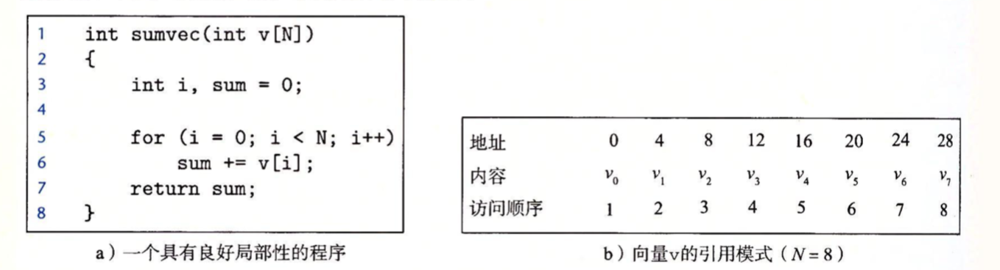

### 高速缓存存储器

早期计算机系统的存储器只有三层：CPU寄存器、DRAM主存储器和磁盘。不过随着CPU与主存之间运行效率逐渐拉大，系统设计者在CPU寄存器与主存之间加入一个小的SRAM高速缓存存储器，称为L1高速缓存(一级缓存)。L1高速缓存的访问速度几乎和寄存器一样快，典型地大约4个时钟周期。

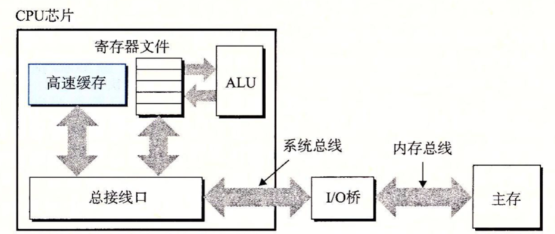

随着CPU和主存之间的性能差距不断增大，系统设计者在L1高速缓存和主存之间又插入一个更大的高速缓存称L2高速缓存，可以大约10个时钟周期内可以访问到它。有些现系统还有更大的高速缓存L3，可以在大约50个周期内访问到它。

#### 通用的高速缓存存储器组织结构

存储器地址是存储器中存储单元的编号。 存储器是由大量存储单元组成,需要用编号区别每个单元:编号=地址。

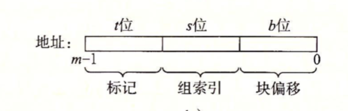

考虑一个计算机系统，其中每个存储器地址有m位，形成M=2$^m$个不同的地址，如下：

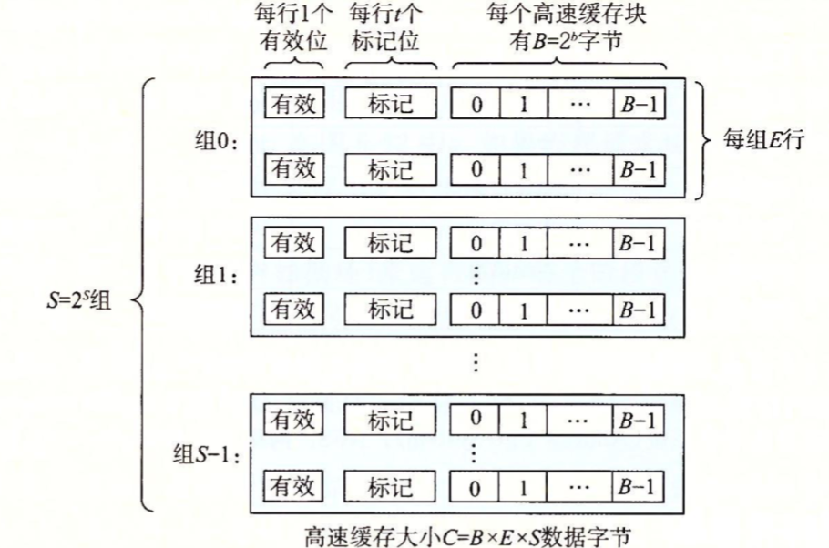

如上图这样一个机器的高速缓存被组织成一个有S=2$^s$个高速缓存组的数组。每个数组含E个高速缓存行，每个行是由一个B=2$^b$个子节的数据块组成的，一个有效位指明这个行是否包含有意义的信息，还有t=m-(b+s)个标记位，它是唯一地标识存储在这个高速缓存中。

当一条加载指令指示CPU从主存地址A中读一个字时，它将地址A发送到高速缓存，如果高速缓存正保存着地址A处那个字的副本，它就立即将那个字发回给CPU。

高速缓存查找缓存的步骤：地址A中s个组索引位是一个到S个组的数组的索引，第一个组是0，第二个组是1，依次类推。组索引位被解释为一个无符号整数，它告诉我们这个字必须存储在哪个组中。A中的t标记位告诉我们这个组的哪一行包含这个字。当且仅当设置了有效位并且该行的标记位与地址A中的标记位匹配时，组中的这一行才包含这个字。一旦我们定位了所在行，那么b个块偏移位给出了在B个字节的数据块中的字偏移。

#### 直接映射高速缓存

当E=1时，每个组只有一行，这个时候高速缓存称为**直接映射高速缓存**。

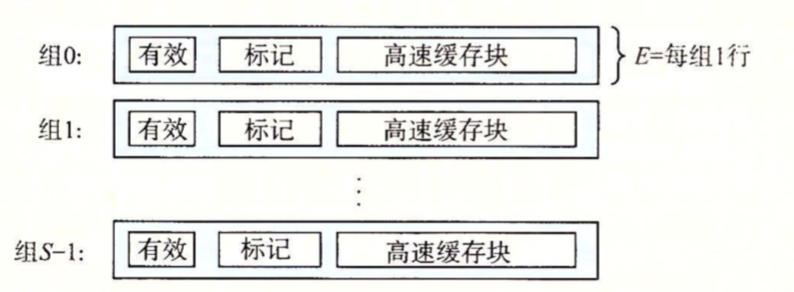

假设我们有这样一个系统，它有一个CPU、一个寄存器文件、一个L1高速缓存和一个主存。当CPU执行一条读内存字w的指令，它向L1高速缓存请求这个字，如果L1有w的副本，那么就得到L1高速缓存命中，高速缓存会很快抽取出w，并将它返回给CPU。否则就是缓存不命中，当L1高速缓存向主存请求包含w的块的一个副本时，CPU必须等待。当请求的块最终从内存到达时，L1高速缓存将这个块存放在它的一个高速缓存里，从被存储的块中抽取出字w，然后将它返回给CPU。

缓存确定一个请求是否命中，然后取出被请求的字分为三个步骤：

1. 直接映射高速缓存中的组选择

在这一步中，高速缓存从w的地址中间抽取出s个**组索引位**，然后选择对应的组(类似根据下标查询数组)。

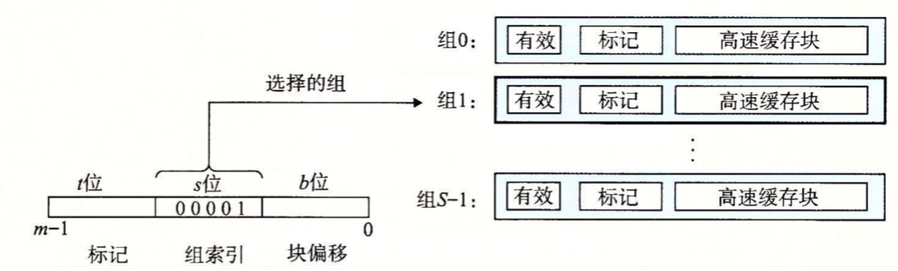

2. 直接映射高速缓存中的行匹配

当选择组i后，就要确定是否有字w的一个副本存储在组i中。判断的标准是当设置了有效位，并且地址中的标记与高速缓存中的标记相匹配。

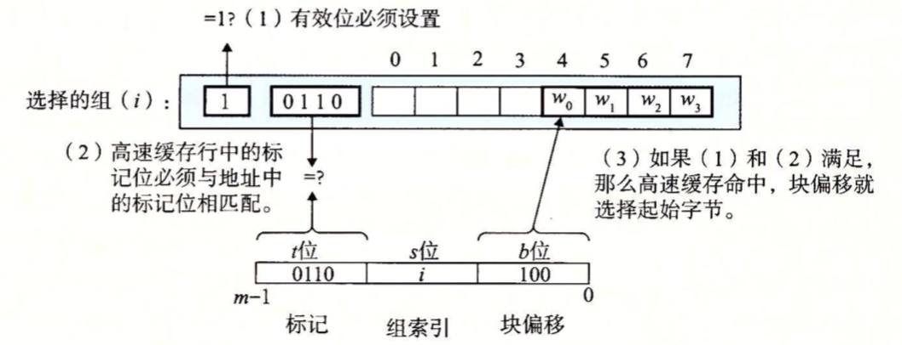

3. 直接映射高速缓存中的字选择

确定了w就在这个块中的某个地方，最后就是确定所需要的块从哪里开始。块偏移量提供了所需要的第一个字节的偏移量。

4. 直接映射高速缓存中不命中时的行替换

如果缓存不命中，那么它需要从存储器结构的下一层取出被请求的块，然后替换当前行的数据。

5. 综合：运行中的直接映射高速缓存

高速缓存用来选择组和标识行的机制极其简单，但是用这种方式处理位有时候会产生无法使用高速缓存的问题。如下：

(S,E,B,m) = (4,1,2,4)

换句话说，高速缓存有4个组，每个组一行，每个块2个字节，而地址是4位。如下例子是根据地址来选择组的列表：

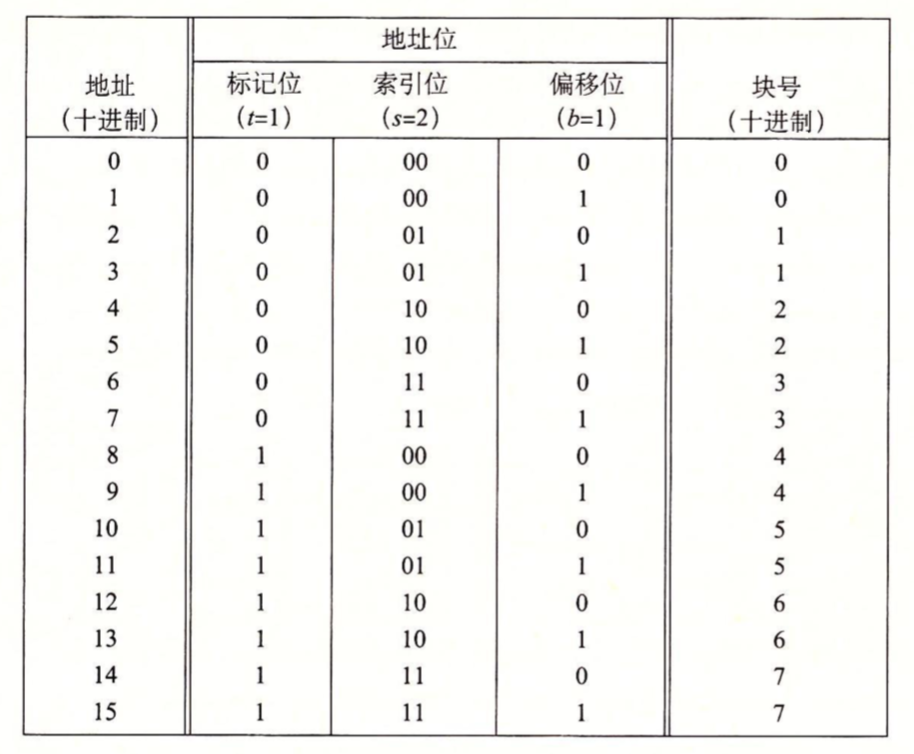

* 如上图标记位和索引位连起来唯一的标识了内存中的每个块。例如，地址0、1都放在块0中，地址2、3放在块1中依次类推。
* 因为有8个内存块，但是只有4个高速缓存组，所以多个块会映射到同一个高速缓存组(即它们会有相同的组索引)。例如块0和4都映射到组0。
* 映射到同一个高速缓存组的块由标记位来区分。例如块0和4的标记位分别是0和1。

CPU指令读取字的流程：

初始时，高速缓存是空的，即有效位都是0，如下图，表中的每一行都代表一个高速缓存行。

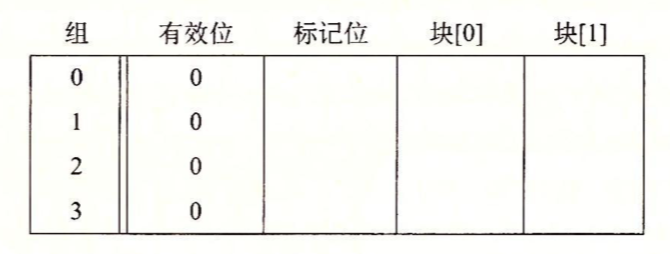

1）**读地址0的字**。因为组0的有效位是0，是缓存不命中。高速缓存从内存取出块0，并把这个块存储在组0中。然后返回块[0]中的m[0]。

2）**读地址1的字**。这次会高速缓存命中。高速缓存立即从组0中的块[1]中返回m[1]。

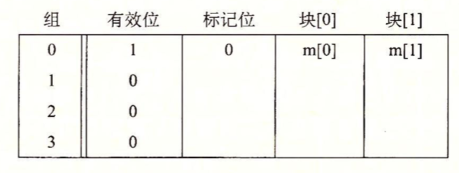

3）**读地址13的字**。由于组2中的高速缓存行不是有效的，所以缓存不命中。高速缓存从内存中把块6加载到组2中，然后将块[1]中的m[13]返回。

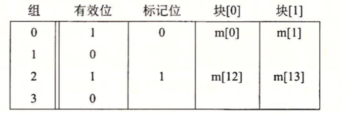

4）**读地址8的字**。这会发生缓存不命中。组0中的高速缓存确实是有效的，但是标记不匹配。高速缓存将块4加载到组0中，替换原来的数据，然后返回块[0]中的m[8]。

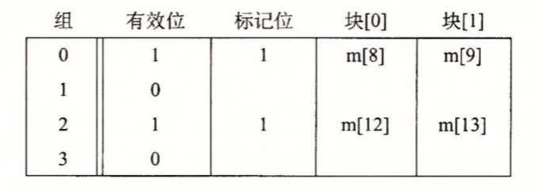

5）**读地址0的字**。又会发生缓存不命中，因为前面引用地址8时，我们刚好替换了块0，即冲突不命中。

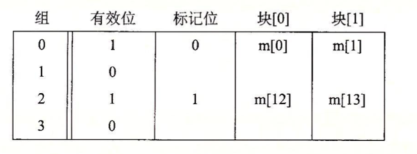

6）直接映射高速缓存中的冲突不命中

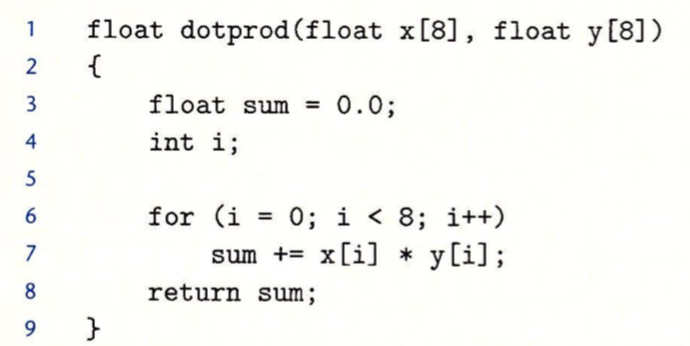

对于 x和y来说，这个函数有良好的空间局部性，因此我们期望它们的命中率会比较高。但是事实并不是如此。

假设浮点型是4个字节，x数组被加载到地址0～32连续内存中，而y被加载到32~64中。并且一个块是16字节，高速缓存由两个组组成，高速缓存的整个大小为32字节。根据这些假设每个x[i]和y[i]会映射到相同的高速缓存组：

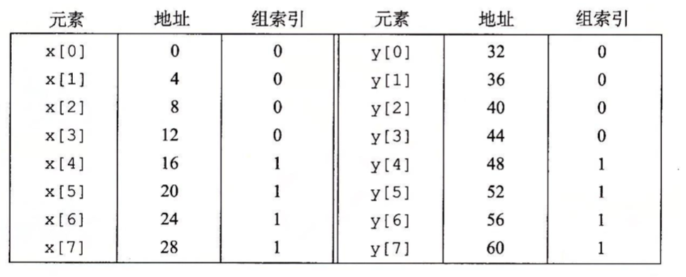

在运行时，循环第一次跌代引用x[0]，缓存不命中会导致包含x[0]~x[3]的块被加载到组0。接下来对y[0]的引用，又一次缓存不命中，导致包含y[0]~y[3]的块被复制到组0。覆盖前一次引用复制进来的x的值。依次类推，**高速缓存反复地加载和清除相同的高速缓存块的组**。

因此即使程序有良好的空间局部性，而且我们的高速缓存中也有足够的空间来存放x[i]和y[i]的块，每次引用还说会导致冲突不命中，这是因为这些块被映射到了同一个高速缓存组。

一个很简单的方法可以修正这个问题，即在每个数组的结尾放B字节的填充。例如将x定义为float x[8]，而是定义成float x[12]。假设y紧跟x后面，那么x[8]~x[11]会占4个组0，接下来y[i]就可以跟x错开来了。

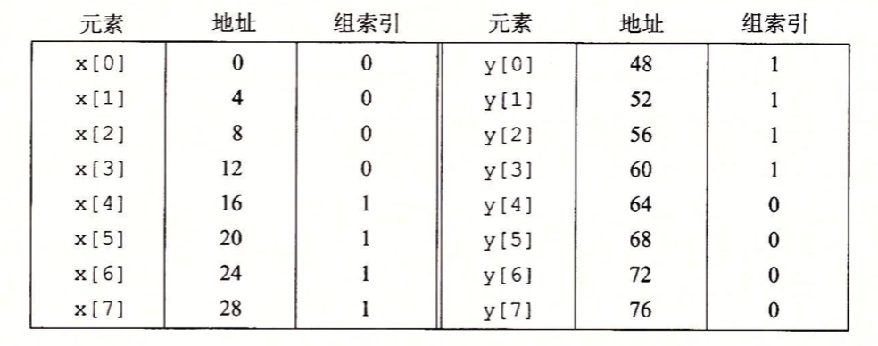

