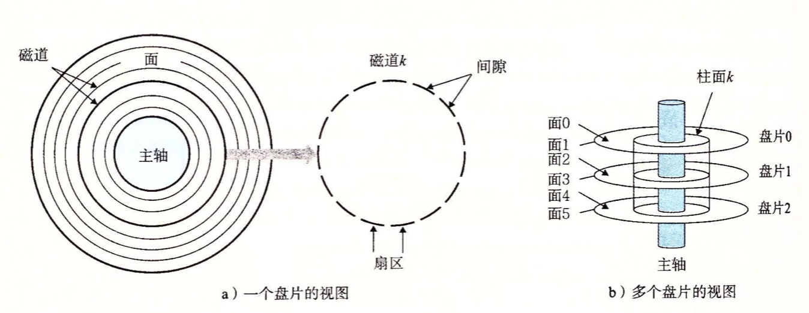

## 存储器层次结构

#### 1. 磁盘构造

磁盘是由**盘片**构成的。每个盘片有两面称为**表面**，表面覆盖着磁性记录材料。盘片中央有一个可以旋转的**主轴**，它使得盘片以固定的旋转速率旋转，通常是5400~15000转每分钟。磁盘通常包含一个或多个这样的盘片，并封装在一个密封的容器内。

如上图，每个表面是由一组称为**磁道**的同心圆组成的。每个磁道被划分为一组**扇区**。每个扇区包含相同数量的数据位(通常是512字节)，这些数据编码在扇区上的磁性材料中。扇区之间由一些**间隙**分隔开，这些间隙不存储数据位。间隙用来标识扇区的格式化位。

磁盘由一个或多个叠放在一起的盘片组成的，它们被封装在一个密封的包装里。整个装置通常被称为**磁盘驱动器**，我们通常简称为**磁盘**。制造商通常用术语**柱面**来描述多个盘片驱动器的构造。这里，**柱面是所有盘片表面到主轴中心的距离相等的磁道的集合**。例如如果一个驱动器有三个盘片和六个面，每个面上的磁道的编号都是一致的，那么柱面k就是6个磁道k的集合。

#### 2. 磁盘容量

一个磁盘上可以记录的最大数称为它的最大容量，或者简称为**容量**。磁盘容量是由以下技术因素决定的：

* 记录密度(位/英寸)：磁道一英寸的段中可以放入的位数。
* 磁道密度(位/英寸)：从盘片中心出发半径上一英寸的段可以有的磁道数。
* 面密度(位/平方英寸)：记录密度与磁道密度的乘积。

最初的磁盘，是在面密度很低的时代设计的，将每个磁道分为数目相同的扇区，扇区的数目由最靠内的磁道能记录的扇区数决定的。为了保持每个磁道有固定的扇区，越往外的磁道扇区隔得越开。在面密度相对比较低的时候，这种方法还算合理，不过，随着面密度的提高，扇区之间的间隙变得不可接受的大。因此现代大容量磁盘使用一种称为**多区记录**的技术，在这种技术中，柱面的集合被分隔成不相交的子集合，称为 **记录区**。每个区包含一组连续的柱面。一个区中的每个柱面中的每条磁道都有相同的扇区，这个扇区的数量由该区中最里面的磁道所能包含的扇区确定的。

下面的公式给出了一个磁盘的容量计算公式：

例如：假设有一个磁盘，有5个盘片，每个扇区512 个字节，每个面20 000 条磁道，每条磁道平均300个扇区。那么这个磁盘的容量是：

