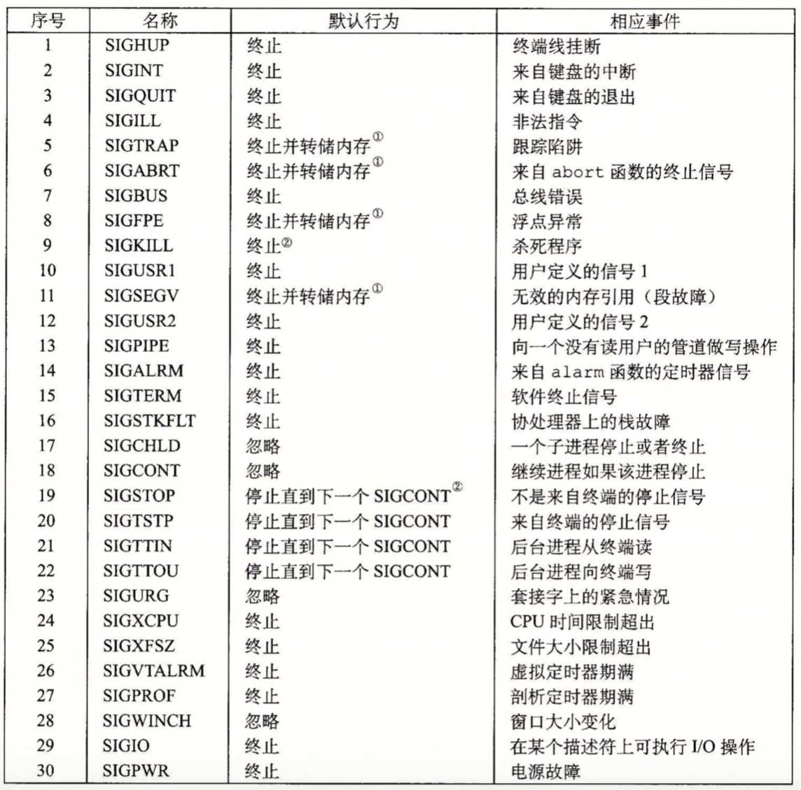

一个信号就是一条小消息，它通知进程系统中发生了一个某种类型的事件，如下图，Linux系统上支持的30种不同类型的信号：



每种信息类型都对应于某种系统事件。低层的硬件异常由内核异常处理程序处理的，正常情况下，对用户进程而言是不可见的。信号提供了一种机制，通知用户进程发生了这些异常。比如，如果一个进程试图除以0，那么内核就发送给它一个SIGFPE信号。

#### 信号术语

传送一个信号到目的进程是由两个不同步骤组成：

* 发送信号。内核通过更新目的进程上下文中的某个状态，发送一个信号给目的进程。发送信号有如下两种原因：1）内核检测到一个系统事件，比如除零错误或者子进程终止。2）一个进程调用了kill函数，显式地要求内核发送一个信号给目的进程。一个进程可以发送信号给它自己。
* 接收信号。当目的进程被内核强迫以某种方式对信号的发送作出反应，它就接收了信号。进程可以忽略这个信号，终止或者通过执行一个称为信号处理程序(signal handler)的用户层函数捕获这个信号。


一个发出而没有被接收的信号叫做待处理信号(pending signal)。在任何时刻，一种类型至多只会有一个待处理信号。如果一个进程有一个类型为k的待处理信号，那么任何接下来发送到这个进程的类型为k的信号都不会排队等待了；它们只是被简单地丢弃。

一个进程可以有选择地阻塞接收某种信号，当一种信号被阻塞时，它仍可以被发送，但是产生的待处理信号不会被接收，直到进程取消对这种信号的阻塞。

一个待处理信号最多只能被接收一次。内核为每个进程在pending位向量中维护着待处理信号的集合，而在blocked位向量中维护着被阻塞的信号集合。只要传送了一个类型为k的信号，内核就会设置pending中的第k位，而只要接收了一个类型为k的信号，内核就会清除pending中的第k位。

#### 发送信号

Unix系统提供了大量向进程发送信号的机制，所有这些机制都是基于**进程组**这个概念。

1. 进程组

   每个进程都只属于一个进程组，进程组是由一个正整数进程组ID来标识的。getpgrp函数返回当前进程的进程组ID。

   ```c
   #include <unistd.h>
   pid_t getpgrp(void)
   ```

   默认地，一个子进程和它的父进程同属于一个进程组。一个进程可以通过使用set-pgid函数来改变自己或者其他进程的进程组。

   ```c
   #include <unistd.h>
   int setpgid(pid_t pid,pid_t pgid);
   ```

   setpgid 函数将进程pid的进程组改为pgid。如果pid是0，那么就使用当前进程的PID。如果pgid是0，那么就使用pid指定的进程的PID作为进程组ID。

2. 用/bin/kill 程序发送信号

   /bin/kill程序可以向另外的进程发送任意的信号。比如：

   ```
   kill -9 15213
   ```

   发送信号9（SIGKILL）给进程15213。

   一个为负的PID会导致信号被发送到进程组PID中的每个进程，比如：发送一个SIGKILL信号给进程组15213中的每个进程。

   ```
   kill -9 -15213
   ```

3. 从键盘发送信号

   在任何时刻，至多只有一个前台作业和0个或多个后台作业。

   ```
   ls|sort
   ```

   上面的指令会创建一个由两个进程组成的前台作业，这两个进程是通过Unix管道连接起来的：一个进程运行ls程序，另一个运行sort程序。shell为每个作业创建一个独立的进程组。进程ID通常取自作业中父进程中的一个。

   

   ​

4. 用kill函数发送信号

   ```c
   #include <sys/types.h>
   #include <signal.h>
   int kill(pid_t pid,int sig);
   ```

   如果pid大于0，那么kill函数发送信号号码sig给进程pid。如果pid等于0，那么kill发送信号sig给调用进程所在进程组中的每个进程，包括调用进程自己。如果pid小于0，kill发送信号sig给进程组|pid|(pid的绝对值)中的每个进程。

   ```c
   #include <stdio.h>
   #include <sys/types.h>
   #include <unistd.h>
   #include <signal.h>
   #include <stdlib.h>
   int main(int argc, const char * argv[]) {
       
       pid_t pid;
       
       if((pid = fork()) == 0){
           pause();
           printf("control should never reach here!");
           exit(0);
       }
       
       kill(pid, SIGKILL);
       printf("Hello, World!\n");
       exit(0);
   }
   ```

   ​

5. 用alarm函数发送信号

   进程可以通过调用alarm函数向它自己发送SIGALRM信号。

   ```c
   #include <unistd.h>
   unsigned int alarm(unsigned int secs);//返回前一次闹钟剩余的秒数，若以前没有设定闹钟，则为0。
   ```

   alarm函数安排内核在secs秒后发送一个SIGALRM信号给调用进程。如果secs是0，那么不会调度安排新的闹钟。在任何情况下，**对alarm的调用都将取消任何待处理的(pending)闹钟**，并且返回任何待处理的闹钟在被发送前还剩下的秒数；如果没有待处理的闹钟，就返回0。

#### 接收信号

当内核把进程p从内核模式切换到用户模式时，它会检查进程p的未阻塞的待处理信号的集合(pending&~blocked)。如果这个集合为空，那么内核将控制传递到p的逻辑控制流中的下一条指令。如果集合是非空的，那么内核选择集合中的某个信号k（通常是最小的k），并且强制p接收信号k。收到这个信号会触发进程采取某种行为，一旦进程完成了这个行为，那么控制就传回p的逻辑控制流中的下一条指令。

每个信号类型都有一个预定义的默认行为，是下面的一种：

* 进程终止。
* 进程终止并转储内存。
* 进程停止（挂起）直到被SIGCONT信号重启。
* 进程忽略该信号。

比如SIGKILL的默认行为就是终止接收进程。进程可以通过使用signal函数修改信号相关联的默认行为。唯一例外是SIGSTOP和SIGKILL它们的默认行为是不能修改的。

```c
signal(int signum,handler);
```

signal函数可以通过下列三种方法来改变信号signum相关的行为：

* 如果handler是SIG_IGN，那么忽略类型为signum的信号。
* 如果handler是SIG_DFL，那么类型为signum的信号行为恢复为默认行为。
* 否则，handler就是用户定义的函数地址，这个函数被称为信号处理程序，如下例子：

```c
#include <stdio.h>
#include <signal.h>
#include <stdlib.h>
#include <unistd.h>

void sigint_handler(int sig){
    
    printf("Caught SIGINT");
    exit(0);
    
}
int main(int argc, const char * argv[]) {
  
    if(signal(SIGINT, sigint_handler) == SIG_ERR)
        printf("siginal error");
    pause();
    printf("Hello, World!\n");
    return 0;
}
```


#### 阻塞和解除阻塞信号

Linux 提供阻塞信号的隐式和显式的机制：

* 隐式阻塞机制。内核默认阻塞任何当前处理程序正在处理信号类型的待处理的信号。比如假设程序捕获了信号s，当前正在运行处理程序S。如果发送给该进程另一个信号s，那么直到处理程序S返回，s会变成待处理而没有被接收。
* 显式阻塞机制。应用程序可以使用sigprocmask函数和它的辅助函数，明确地阻塞和解除阻塞选定的信号。


sigprocmask函数改变当前阻塞的信号集合，具体的行为依赖于how值：

* SIG_BLOCK：把set中的信号添加到blocked中(blocked = blocked|set)。
* SIG_UNBLOCK：从blocked中删除set中的信号(blocked=blocked&~set)。
* SIG_SETMASK：block = set。

如果oldset非空，那么blocked位向量之前的值保存在oldset中。如下述函数对set信号集合进修操作：sigemptyset初始化set为空集合。sigfillset函数把每个信号都添加到set中。sigaddset函数把signum添加到set，sigdelset从set中删除signum，如果signum是set的成员，那么sigismember返回1,否则返回0。


