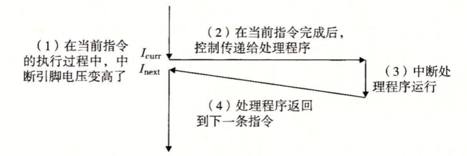

### 异常

异常就是控制流的突变，用来响应处理器状态中的某些变化。控制流指控制转移序列，比如假设程序计数器有一个值的序列a$_0$,a$_1$…a$_k$，其中每个a$_k$是某个相应的指令I$_k$的地址，每次从a$_k$到a$_{k+1}$的过渡称为控制转移。这样的控制转移序列叫做处理器的控制流。

如下图，处理器正在执行某个当前指令I$_{curr}$，然后状态突然发生变化(**状态变化也称为事件**，event)。该事件可能和当前执行指令有关，如发生虚拟内存缺页、算术溢出；也可能不相关，比如一个I/O请求完成。(磁盘I/O完成后，会中断cpu)。


任何情况下，处理器检测到有事件发生时，它会通过一张**异常表(exception table)**的跳转表，进行一个间接过程调用，到一个专门设计用来处理这类事件的操作系统子程序(异常处理程序)。当异常处理程序处理完后，根据引起异常系统子程序的类型，会发生三种情况中的一种：1）处理程序将控制返回给当前指令I$_{curr}$，即当事件发生时正在执行的指令。

​	2）处理程序将控制返回给I$_{next}$，即如果没有发生异常将会执行的下一条指令。

​	3）处理程序终止被中断的程序。

#### 异常处理

系统中可能的每种类型的异常都分配了一个唯一的非负整数的**异常号**。其中一些号码是由处理器的设计者分配的，如被零除、缺页、内存访问违例、断点以及算术运算溢出；其他号码由操作系统内核的设计者分配，如系统调用和来自外部I/O设备的信号。

在运行时，处理器检测到发生了一个事件，并且确定了相应的异常号k。随后，处理器触发异常，方法是执行间接过程调用，通过异常表的表目k，转到相应的处理程序。


异常表的起始地址放在一个叫异常表基址寄存器的特殊CPU寄存器里。


异常类似于过程(方法)调用，但是也有一些不同：

* 过程调用时，在调转到处理程序之前，处理器将返回地址压入栈中。然而，根据异常的类型，返回地址要么是当前指令，要么是下一条指令。
* 处理器也把一些额外的处理器状态压到栈里，在处理程序返回时，重新开始执行被中断的程序会需要这些状态。
* 如果控制从用户程序转移到内核，所有这些项目都被压到内核中，而不是压到用户栈中。
* 异常处理程序运行在内核模式下，这意味着它们对所有的系统资源都有完全的访问权限。

#### 异常的类别

异常的类别可以分为：中断(interrupt)、陷阱(trap)、故障(fault)和终止(abort)。


1. 中断

中断是异步发生的，是来处理器外部的I/O设备的信号的结果。I/O设备，例如网络适配器、磁盘控制器和定时器芯片，通过向处理器芯片上的一个引脚发信号，并将异常号放到系统总线上，来触发中断。



在当前指令完成执行之后，处理器注意到中断引脚的电压变高了，就从系统总线读取异常号，然后调用适当的中断处理程序。当处理程序返回时，它就将控制返回给下一条指令。

2. 陷阱和系统调用

陷阱是有意的异常，是执行一条指令的结果。陷阱最重要的用途是用户程序和内核之间提供一个像过程一样的接口，叫做**系统调用**。

用户程序经常需要向内核请求服务，比如读一个文件(read)、创建一个新的进程(fork)、加载一个新的程序(execve)，或者终止当前进程(exit)。为了允许对这些内核服务的受控的访问，处理器提供了一条特殊的```syscall n```指令，当用户程序想要请求服务n时，可以执行这条指令。执行```syscall n```指令会导致一个到异常处理程序的陷阱，这个处理程序解析参数，并调用适当的内核程序。


普通函数允许在用户模式中，用户模式限制了函数可以执行的指令类型，而且它们只能访问和调用函数相同的栈。系统调用运行在内核模式中，内核模式允许系统调用执行特权指令，并访问定义在内核中的栈。

3. 故障

故障由错误情况引起，当故障发生时，处理器将控制转移给故障处理程序。如果处理程序能够修正这个错误情况，它就将控制返回到引起故障的指令，从而重新执行它。否则，处理程序返回到内核中的abort例程，abort例程会终止引起故障的应用程序。


一个经典的故障示例是缺页异常，当指令引用一个虚拟地址，而与该地址相对应的物理页不在内存中，因此必须从磁盘中取出时，就会发生故障。故障处理程序(缺页处理程序)从磁盘加载适当的页面，然后将控制返回给引起故障的指令。当指令再次执行时，相应的物理页已经驻留在内存中了，指令就不会引起故障了。

4. 终止

终止是不可恢复的致命错误造成的结果，通常是一些硬件错误，比如DRAM或者SRAM位被损坏时发生的奇偶错误。终止处理程序将控制返回给abort例程，该例程会终止这个应用程序。

#### Linux/X86-64 系统中的异常

0～31的号码对应的是由Intel架构师定义的异常，因此对任何x86-64系统都是一样的。32~255的号码对应的是操作系统定义的中断和陷阱。


1. Linux/x86-64 故障和终止

* 除法错误。当应用试图除以0或者当一个除法指令的结果对于目标操作数来说太大了的时候，就是发生除法错误。Unix不会试图从除法错误中恢复，而是选择终止程序。
* 一般保护故障。通常是因为一个程序引用了一个未定义的虚拟内存区域，或者因为程序试图写一个只读的文本段。Linux 不会恢复这类故障。
* 缺页是会重新执行产生故障的指令的一个异常示例。
* 机器检查。机器检查是在导致故障的指令执行中检测到致命的硬件错误时发生的。机器检查处理程序从不返回控制给应用程序。

2. Linux/86-64 系统调用

Linux提供几百种系统调用，每个系统都有一个唯一的整数号，对应于一个到内核中跳转表的偏移量(这个跳转表和异常表不一样)


### 进程

进程的经典定义就是一个执行中程序的实例。系统中每个程序运行在某个进程的上下文中。上下文是由程序正确运行所需的状态组成的。这个状态包括存放在内存中的程序的代码和数据，它的栈、通用目的寄存器的内容、程序计数器、环境变量以及打开文件描述符的集合。

#### 逻辑控制流

我们都知道PC寄存器根据地址读取可执行文件中的指令，这些PC值的序列叫做逻辑控制流或者简称逻辑流。


如上图，处理器的一个物理控制流被分成了三个逻辑流，每个进程一个。三个逻辑流的执行是交错的。进程为每个程序提供了一种假象，好像程序在独占地使用处理器。

#### 并发流

一个逻辑流的执行在时间上与另一个流重叠，称为**并发流**。这两个流被称为并发地执行。多个流并发地执行的一般现象被称为**并发**。一个进程和其他进程轮流运行的概念称为**多任务**。一个进程执行它的控制流的一部分的每一时间段叫做**时间片**。因此，多任务也叫做**时间分片**。如果两个流并发地运行在不同的处理器或计算机上，那么我们称它们为并行流，它们并行地运行，并且并行地执行。

#### 私有地址空间

进程为每个程序提供它自己的私有地址空间。即和这个空间某个地址相关联的那个内存字节是不能被其他进程读或者写的。尽管每个私有地址空间相关的内存内容一般是不同的，但是每个这样的空间都有相同的通用结构。


#### 用户模式和内核模式

为了使操作系统内核提供一个无懈可击的进程抽象，处理器必须提供一种机制，限制一个应用可以执行的指令以及它可以访问的地址空间范围。

处理器通常是用某个控制寄存器中的一个**模式位**来提供这种功能，该寄存器描述了进程当前享有的特权。当设置了模式位时，进程就运行在内核模式中。内核模式的进程可以执行指令集中的任何指令，并且可以访问系统中的任何内存位置。

没有设置模式位时，进程就运行在用户模式中，用户模式不允许执行特权指令，比如：停止处理器、改变位模式或发起一个I/O操作，也不允许进程直接引用地址空间中内核区内的代码和数据。

运行应用程序代码的进程初始时是在用户模式中的。进程从用户模式变为内核模式的唯一方法是通过中断、故障或陷入系统调用这样的异常，当异常发生时，控制传递到异常处理程序，处理器将模式从用户模式变为内核模式。处理程序运行在内核模式中，当它返回到应用程序时，处理器就把模式从内核模式改回用户模式。

#### 上下文切换

操作系统通过**上下文切换**来实现控制流的切换，实现多任务。

**上下文**由通用目的寄存器、浮点寄存器、程序计数器、用户栈、状态寄存器、内核栈和各种内核数据结构，比如描述地址空间的页表、包含有关当前进程信息的进程表，以及包含进程已打开的信息的文件表。

在进程执行的某些时刻，内核可以决定抢占当前进程，并重新开始一个先前被抢占的进程。这种决策就叫做**调度**，是由内核中称为调度器的代码处理的。上下文切换由三个步骤组成：

1）保存当前进程的上下文。

2）恢复某个先前被抢占的进程被保存的上下文。

3）将控制传递给这个新恢复的进程。

如下一对进程A和B之间上下文切换的示例。进程A初始运行在用户模式中，直到它通过执行系统调用read陷入到内核。内核中的陷阱处理程序请求来自磁盘控制器的DMA传输，并且安排在磁盘控制器完成从磁盘到内存的数据传输后，磁盘中断处理器。


