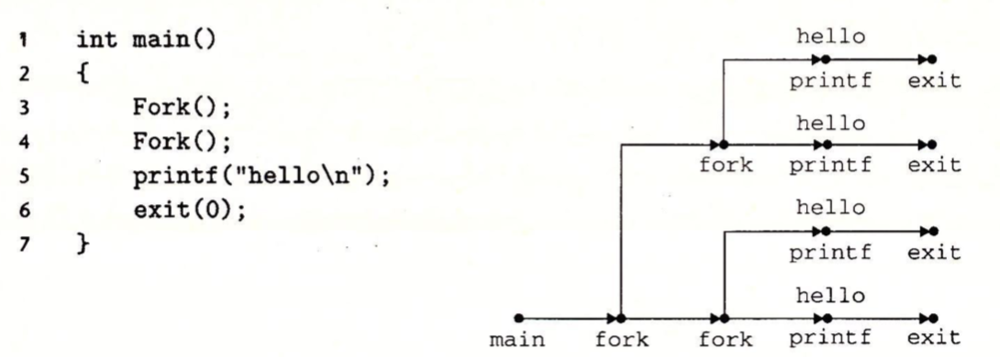
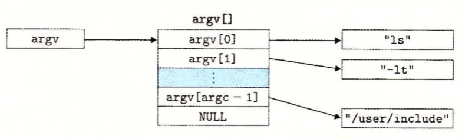
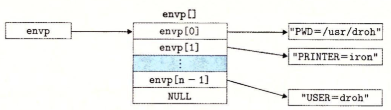
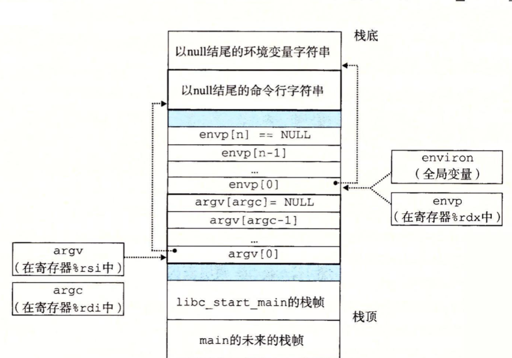

#### 获取进程ID

```c
#include <sys/types.h>
#include <unistd.h>

pid_t getpid(void);
pid_t getppid(void);
```

getpid喝getppid函数返回一个类型为pid_t的整数值，在Linux系统上它在types.h中被定义为int。

#### 创建和终止进程

从程序员的角度，我们认为进程总是处于下面三种状态之一：

* 运行。进程要么在CPU上执行，要么在等待被执行且最终会被内核调度。
* 停止。进程的执行被挂起，且不会被调度。当收到SIGSTOP、SIGT-STP、SIGTTIN或者SIGTTOU信号时，进程就停止，并且保持停止直到它收到一个SIGCONT信号，在这个时刻，进程再次开始运行。
* 终止。进程永远的停止了。进程会因为三种原因终止：1）收到一个信号，该信号的默认行为是终止进程，2）从主程序返回，3）调用exit函数。

```c
#include <stdlib.h>
void exit(int status);
```

exit函数以status退出状态来终止进程。

父进程通过调用fork函数创建一个新的运行的子进程。

```c
#include <sys/types.h>
#include <unistd.h>
pid_t fork(void);
```

子进程得到父进程用户级虚拟地址空间相同的一份副本，包括代码和数据段、堆、共享库以及用户栈。子进程还获得与父进程打开文件描述符相同的副本，这意味着当父进程调用fork时，子进程可以读写父进程中打开的任何文件。父进程与子进程之间的最大区别就是它们的PID不同。

fork函数它只会被调用一次，却会返回两次：一次是在调用进程（父进程）中，一次是在创建新的子进程中。在父进程中，fork返回子进程的PID，在子进程中，fork返回0。返回值就提供一个明确的方法来分辩程序是在子进程还是在父进程中。

```c
#include <stdio.h>
#include <sys/types.h>
#include <unistd.h>

int main(int argc, const char * argv[]) {
    pid_t pid;
    int x = 1;
    pid = fork();
    if(pid == 0){
        printf("child: x=%d\n",++x);
        _exit(0);
    }
     printf("parent: x=%d\n",x);
    //printf("Hello, World!\n");
    _exit(0);
}
```

执行结果：

```
parent: x=1
child: x=2
```

在上面例子有一些微妙的方面：

* 调用一次，返回两次。一次是返回到父进程，一次是返回到新创建的子进程。
* 并发执行。父进程和子进程是并发运行的独立进程。
* 相同但是独立的地址空间。
* 共享文件。当运行这个例子时，父进程和子进程都把它们的输出显示在屏幕上。原因是子进程继承了父进程所有的打开文件。当父进程调用fork时，stdout文件是打开的，并指向屏幕。子进程继承了这个文件，因此它的输出也是指向屏幕的。

下面是fork调用程序的进程图：



#### 回收子进程

当一个进程由于某种原因终止时，内核并不是立即把它从系统中清除。相反，进程被保持在一种已终止的状态中，直到被它的父进程回收。当父进程回收已终止的子进程时，内核将子进程的退出状态传递给父进程，然后抛弃已终止的进程，从此时开始，该进程就不存在了。

如果一个父进程终止了，内核会安排init进程成为它的孤儿进程的养父。init进程的PID为1，是系统启动时由内核创建的，他不会终止，是所有进程的祖先。如果父进程没有回收它的僵死子进程就终止了，那么内核会安排init进程去回收它们。

一个进程可以通过调用waitpid函数来等待它的子进程终止或者停止。

```c
#include <sys/types.h>
#include <sys/wait.h>

pid_t waitpid(pid_t pid,int *statusp,int options);
```

waitpid函数默认情况下(当options = 0)，waitpid挂起调用进程的执行，直到它的等待集(wait set)中的一个子进程终止。如果等待集合中的一个进程在刚调用的时刻就已经终止了，那么waitpid就立刻返回。在这两种情况下，waitpid返回导致waitpid返回的已终止子进程的PID。

1. 判断等待集合的成员

   等待集合的成员由参数pid来确定：

   * 如果pid>0，那么等待集合就是一个单独的子进程，它的进程ID等于pid。
   * 如果pid = -1，那么等待集合就是由父进程所有的子进程组成的。

2. 默认修改行为

   可以通过将options设置为常量WNOHANG、WUNTRACED和WCONTINUED的各种组合来修改默认行为：

   * WNOHANG：如果等待集合中的任何子进程都还没有终止，那么就立刻返回（返回值为0）。默认行为是挂起调用进程，直到有子进程终止。在等待子进程终止的同时，如果还想做些有用的工作，这个选项会有用。
   * WUNTRACED：挂起调用进程的执行，直到等待集合中的一个进程变成已终止或者被停止。返回的PID为导致返回的已终止或被停止子进程的PID。默认的行为是只返回已终止的子进程。当你想检查已终止和被停止的子进程时，这个选项会有用。
   * WCONTINUED：挂起调用进程的执行，直到等待集合中一个正在执行的进程终止或等待集合中一个被停止的进程收到SIGCONT信号重新开始执行。
   * WNOHANG|WUNTRACED：立即返回。如果等待集合中的子进程都没有被停止或终止，则返回值为0；如果有一个停止或终止，则返回值为该子进程的PID。

3. 检查已回收子进程的退出状态

   如果statusp参数是非空的，那么waitpid就会在status中放上关于导致返回的子进程的状态信息，status是statusp指向的值。wait.h头文件定义了解释status参数的几个宏：

   * WIFEXITED(status)：如果子进程通过调用exit或者一个返回(return)正常终止，就返回真。
   * WEXITSTATUS(status)：返回一个正常终止的子进程的退出状态。只有在WIFEXITED()返回为真时，才会定义这个状态。
   * WIFSIGNALED(status)：如果子进程是因为一个未被捕获的信号终止的，那么久返回真。
   * WTERMSIG(status)：返回导致子进程终止的信号的编号。只有在WIFSIGNALED()返回为真时，才定义这个状态。
   * WIFSTOPPED(status)：如果引起返回的子进程当前是停止的，那么就返回真。
   * WSTOPSIG(status)：返回引起子进程停止的信号的编号。只有在WIFSTOPPED()返回为真时，才定义这个状态。
   * WIFCONTINUED(status)：如果子进程收到SIGCONT信号重新启动，则返回真。

4. 错误条件

   如果调用进程没有子进程，那么waitpid返回-1，并且设置errno为ECHILD。如果waitpid函数被一个信号中断，那么它返回-1，并且设置errno为EINTR。

5. wait函数

   wait函数是waitpid函数的简单版本。调用wait(&status)等价于调用waitpid(-1,&status,0)。

```c
#include <sys/types.h>
#include <sys/wait.h>

pid_t wait(int *statusp);
```

6. waitpid示例

```c
#include <stdio.h>
#include <stdlib.h>
#include <sys/types.h>
#include <sys/wait.h>
#include <unistd.h>

#define N 2
int main(int argc, const char * argv[]) {
    int status,i;
    pid_t pid;
    for( i = 0; i < N; i++){
        if((pid = fork()) == 0){//子线程
            printf("for ...");
            exit(100+i);
        }
    }
    
    //-1 对waitpid的调用会阻塞，直到任意一个子进程终止。在每个子进程终止时，对waitpid的调用会返回，返回值为孩子进程的非零的pid。
    while((pid = waitpid(-1, &status, 0)) > 0){
        printf("while ...");
        //检查进程退出状态
        if(WIFEXITED(status))//调用exit函数终止
            printf("child %d exit status=%d\n",pid,WEXITSTATUS(status));
        else
            printf("child %d exit",pid);
    }
    
    printf("Hello, World!\n");
    exit(0);
}
```

#### 让进程休眠

sleep 函数将一个进程挂起一段指定的时间。

```c
#include <unistd.h>
unsigned int sleep(unsigned int secs);//返回还要休眠的秒数
```

如果请求的时间量以及到了，sleep返回0，否则返回还剩下的要休眠的秒数。

pause函数，该函数让调用函数休眠，直到该进程收到一个信号。

```c
#include <unistd.h>
int pause(void);
```

#### 加载并运行程序

execve函数在当前进程的上下文中加载并运行一个新程序。

```c
#include <unistd.h>
int execve(const char *filename, const char *argv[],
           const char *envp[]);
```

execve函数加载并运行可执行目标文件filename，且带参数列表argv和环境变量列表envp。只有当出现错误时，例如找不到filename，execve才会返回到调用程序。

参数列表的数据结构如下图：



argv变量指向一个以null结尾的指针数组，其中每个指针都指向一个参数字符串。按照惯例，argv[0]是可执行目标文件的名字。

环境变量的数据结构如下：



envp变量指向一个以null结尾的指针数组，其中每个指针指向一个环境变量字符串，每个串都是形如"name=value"的名字-值对。

在execve加载了filename之后，它调用启动代码，启动代码设置栈，并将控制传递给新程序的主函数：

```c
int main(int argc, char * argv[],char *envp[]);
```

当main开始执行时，用户栈的组织结构如下：



从栈底到栈顶，首先是以null结尾的环境变量数组，其中每个指针大都指向栈中的一个环境变量字符串。全局变量environ指向这些针中的第一个envp[0]。紧随环境变量数组之后的是以null结尾的argv[]数组，其中每个元素都指向栈中的一个参数字符串。在栈的顶部是系统启动函数libc_start_main的栈帧。

main函数有3个参数：

1）argc，它给出了argv[]数组中非空指针的数量。

2）argv，指向argv[]数组中的第一个条目。

3）envp，指向envp[]数组中的第一个条目。

```c
#include <stdlib.h>
char *getenv(const char *name);//返回，若存在则指向name的指针，若无匹配的，则返回null

//newvalue代替oldvalue，但是只有在overwrite非零时才会这样。如果name不存在，那么setenv就把“name=newvalue”添加到数组中。
int setenv(const char *name,const char *newvalue,int overwrite);
//删除键值对
void unsetenv(const char *name);
```

