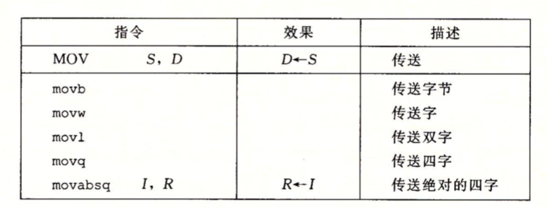
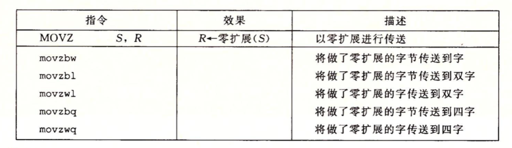
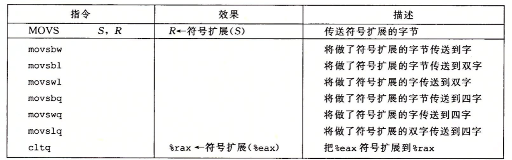
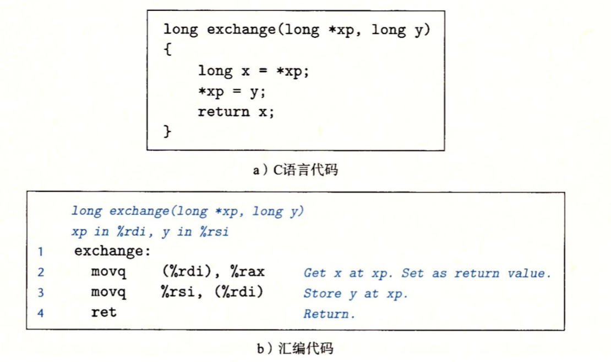

传送指令**MOV**是将数据从一个位置复制到另一个位置的指令，并且数据从源位置复制到目的位置，不做任何变化。MOV有四种指令：```movb、movw、movl、movq```。这些指令执行的操作都是相同的，主要区别就是操作的数据大小不同，分别是1、2 、4和8字节。



源操作数可以是一个立即数或者存储在寄存器或内存中的值，目的操作数用来指定操作结果存储在什么位置，这个位置只能是寄存器或内存地址。x86-64加了一个限制，**传送指令的两个操作数不能都指向内存位置**，将一个值从一个内存复制到另一个内存位置需要两条指令：第一条指令将源值加载到寄存器中，第二条将寄存器值写入到目的地。

大多数情况下，MOV指令只会更新目的操作数指定的内存位置，唯一例外是**movl指令以寄存器作为目的时，它会把该寄存器的高四位字节设置为0**。造成这个例外的原因是x86-64采用的惯例，即任何为寄存器生成32位值的指令都会把该寄存器的高位部分置为0。

movabsq指令是将64位立即数传送到寄存器。**常规的movq指令只能是以32位补码的形式传送立即数，然后把这个值符号扩展到64位的值，然后放到目的位置**。

符号扩展指令记录了两类数据移动指令，可以在将较小的源值复制到较大的目的时使用：

- MOVZ类：指令把目的中剩余的字节填充为0。
- MOVS类：指令通过符号扩展来填充。

可以观察到每条指令名字的最后两个字符都是大小指示符，第一个字符指定源的大小，而第二个指定目的的大小。






例子：理解数据传送如何改变目的寄存器


第一行的指令把寄存器%rax地址初始化为0011223344556677，剩下的指令的源操作数值都是立即数-1(…11111111)，因此movb指令(第2行)把rax的低位字节设置为FF，而movw指令(第3行)把低2字节设置为FFFF，剩下的字节保持不变，movl(第4行)将低4个字节设置为FFFFFFFF，同时把高位4字节设置为00000000，最后movq指令把整个寄存器设置为FFFFFFFFFFFFFFF。


例子：数据传送



当程序执行时，参数xp和y分别存储在寄存器%rdi(第一个参数)和%rsi(第二个参数)中。然后指令2从内存中读出x，把它存放到寄存器%rax(返回值)中，这条指令实现了C程序中的```x=*xp```。

(%rdi)是间接寻址，它的完整操作是：```M[R[%rdi]]```，即根据保存在寄存器中的指针取内存中加载数据。在C语言中，指针其实就是地址。间接引用指针就是将该指针放在一个寄存器中，然后在内存引用中使用这个寄存器。

%rax是返回值寄存器，作为函数的返回值，因而返回值就是x。指令3将y写入到寄存器%rdi中xp指向的内存位置，直接实现了操作\*xp=y

```c
long x = *xp //表示将读取存储在xp所指位置中的值，并将它存放到名字为x的局部变量中。
*xp = y //将参数y的值写到xp所指的位置。
//如下一个例子：
long a = 4;
long b = exchange(&a,3);
//C操作符&称为取址操作符，用来创建一个指针。在本例子中，该指针指向保存局部变量a的位置。然后在exchage方法中用3覆盖存储在a中的值。
```