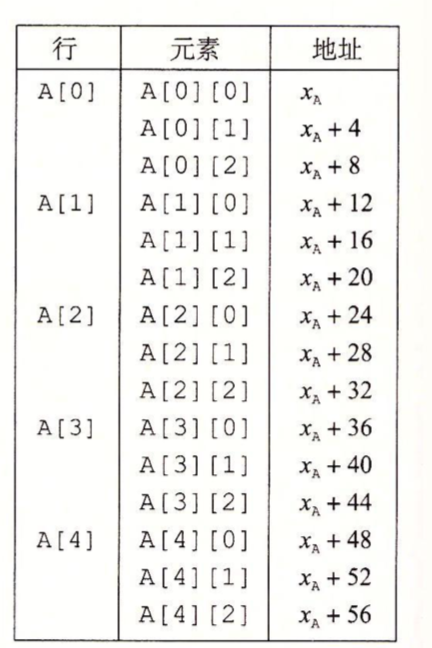
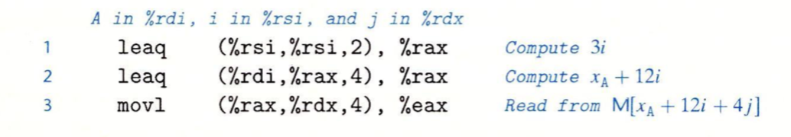
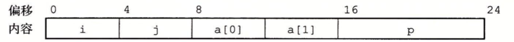
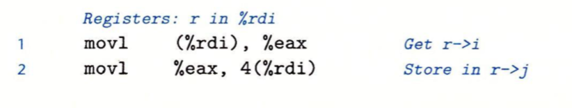

#### 基本原则

对于数据类型T和整型常数N，声明如下：

```
T A[N];//比如 char arr[12]
```

x86~64的内存引用指令可以用来简化数组的方法。例如，假设E是一个int型数组，而我们想访问E[i]，在此，E的地址存放在寄存器%rdx中，而i存放在寄存器%rcx中。然后指令

```
movl (%rdx,%rcx,4),%eax
```

#### 指针运算

操作符'&'和'*'可以产生指针和间接引用指针。也就是，对于一个表示某个对象的表达式Expr，```&Expr```是给出该对象地址的一个指针。对于一个表示地址的表达式AExpr，\*AExpr给出该地址处的值。因此Expr和\*&Expr是等价的。数组A[i]等同于\*(A+i)。

#### 嵌套的数组

当我们创建多维数组时，数组在内存中排列方式是以“行优先”，如：```int A[5][3]```在内存的排列：



通常来说，```T D[R][C]```它的数组元素```D[i][j]```的内存地址为：

```
&D[i][j] = XD+L(C*i+j)//XD 是数组基地址，L是数组元素类型大小
```

假设$X_A$、i、j分别在寄存器%rdi、%rsi、%rdx中，然后要将```A[i][j]```复制到寄存器%eax中：



### 结构

C语言的struct声明创建一个数据类型，将可能不同类型的对象聚合到一个对象中。编译器维护每个字段的字节偏移，它以这些偏移量作为内存引用指令中的位移，从而产生对结构元素的引用。

```
struct rec{
    int i;
    int j;
    int a[2];
    int *P
}
```

这个结构包括4个字断：两个4字节int、一个由两个类型为int的元素组成的数组，一个8字节整型指针，总共是24个字节：



为了访问结构的字断，编译器产生的代码要将结构的地址加上适当的偏移，比如：变量r是rec*类型，它存储在%rdi中，为了将它的属性i的值赋值给属性j：



因为字断i的偏移量为0，所以这个字段的地址就是r的值，为了存储到字断j，代码要将r的地址加上偏移量4。