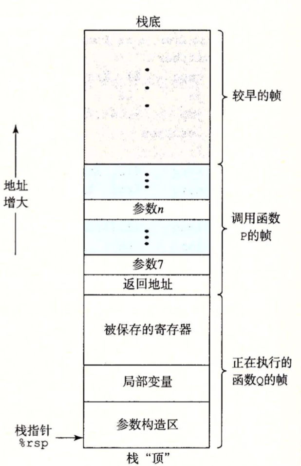
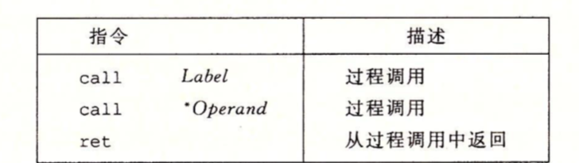
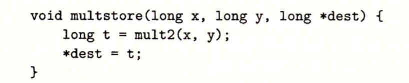
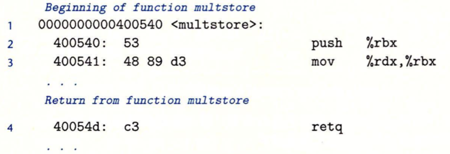
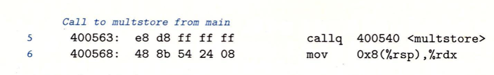
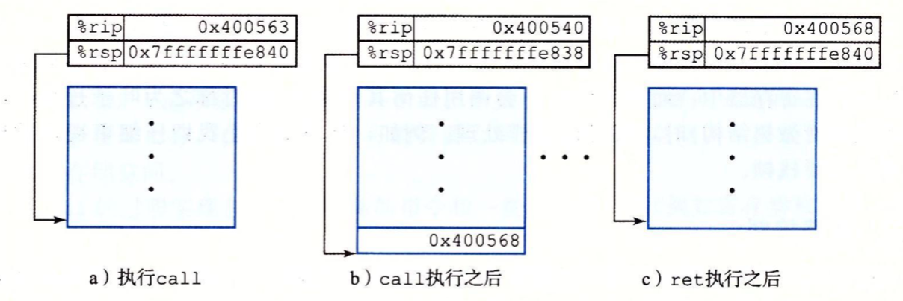

C语言中实现一个方法需要指定方法的名称、参数以及方法返回类型，然后在方法体中实现具体的逻辑。

```c
int main(void) {
    int a = 1;
    int b = 2;
    a = a + b;
}
```

一个封装好的方法可以在程序中不同的地方调用这个函数。但是调用必须遵守一定的策略，比如方法P调用方法Q，Q执行后返回P，这组方法调用必须遵循以下一个或多个机制：

* 传递机制：在进入方法Q的时候，程序计数器必须设置为Q的代码的起始地址，然后在返回时，要把程序计数器设置为P方法中调用Q后面那条指令的地址。
* 传递数据：P必须能够向Q提供一个或多个参数，Q必须能够向P返回一个值。
* 分配和释放内存：在开始的时候，Q可能需要为局部变量分配空间，而在返回前，又必须释放这些空间。

#### 运行时栈

方法的调用机制是通过栈数据结构来实现的。利用栈后进先出的原则，可以在方法调用完之后，弹出当前方法占用的内存，及时释放内存。以P调用Q为例，可以看到当Q在执行时，P以及它向上追溯的调用链都被暂时挂起来了。当Q运行时，它只需要为局部变量分配新的存储空间，然后当它返回时，任何它所分配的局部变量存储的空间都可以被释放。



如上图，x86-64的栈向低地址方向增长，而栈指针%rsp指向栈顶元素。将栈指针减小一个适当的量可以在栈上分配空间，类似的可以通过增加栈指针来释放空间。

x86-64方法在栈上分配的空间称为**栈帧**，可以保存寄存器的值、局部变量以及为它调用的方法设置参数。每个方法的栈帧都是相互隔离，且大部分都是定长的（在方法开始时就已经确定了）。当前正在执行的方法的栈帧总是在栈顶。当P调用Q时，会把返回地址压入栈中，这个返回地址属于方法P，用来指明当Q返回时，P程序从哪里开始执行。

并不是所有的方法都有栈帧，当调用需要的存储空间超出寄存器能够存放的大小时，就会在栈上分配空间，或者在方法中调用另一个方法时，就需要使用栈帧来保存当前方法的数据时。

#### 方法调用

CPU通过读取保存在程序计数器的指令地址来执行相关指令的，所以将控制从方法P转移到方法Q只需要简单的把程序计数器设置为Q的代码起始地址。控制权转移后，我们还要确保方法Q返回后，方法P能继续执行。所以这个时候我们还需要将返回地址，即方法P中调用方法Q指令的下一条指令的地址保存到栈帧中。

在X86-64机器中，方法调用是由call指令完成。该指令会把返回地址压入栈中，并将程序计数器设置为Q的起始地址。对应的ret指令会从栈中弹出返回地址，并把程序计数器设置为返回地址 。



例子：



假设在main方法中调用multstore方法，下面是这两个反汇编代码的节选：





在代码中，第5行是main方法使用call指令调用multstore方法，此时的状态如a图，指明了栈指针%rsp和程序计数器%rip的值。call指令将返回地址0x400568压入栈中(这个返回地址是call指令的下一条指令的地址)，并将程序计数器的地址设置为地址为0x0400540，即函数multstore的第一条指令的地址，程序将从函数multstore继续执行，直到遇到地址0x40054d处的ret指令。这条指令从栈中弹出值0x400568，然后跳到这个地址，继续main函数执行。




