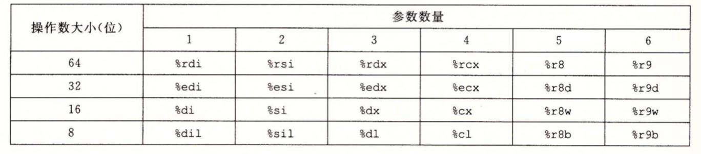
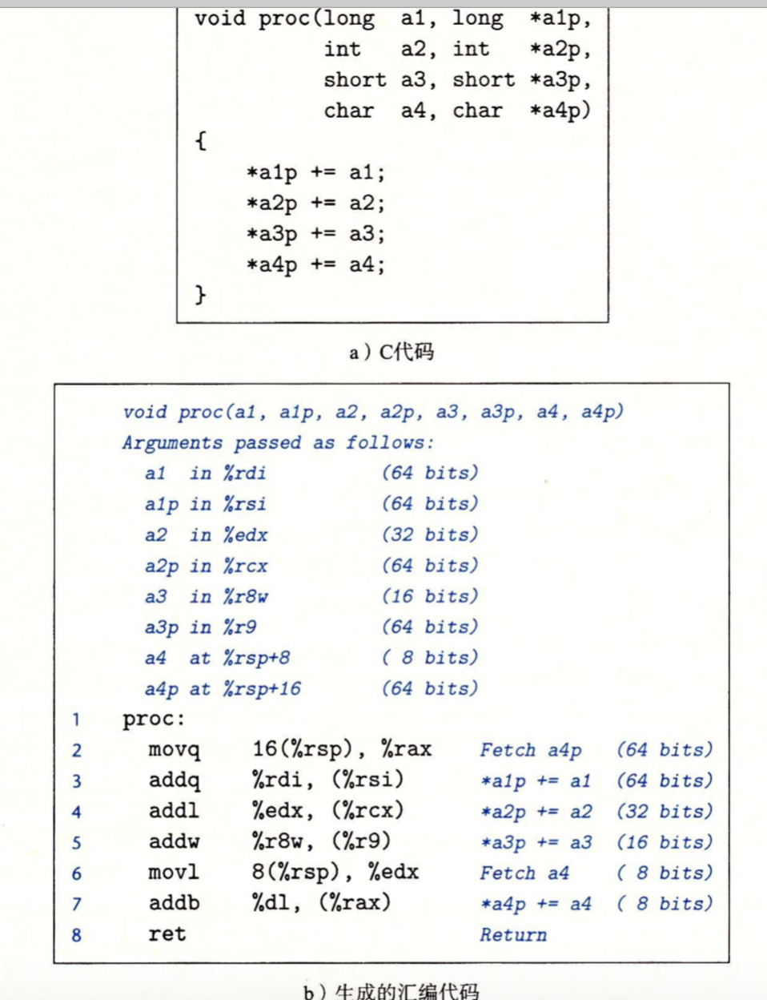
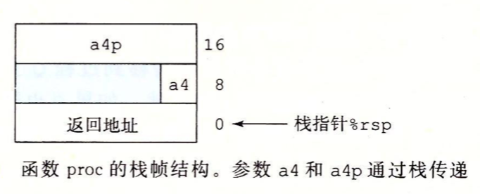
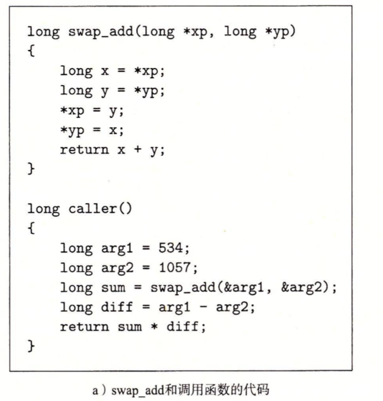
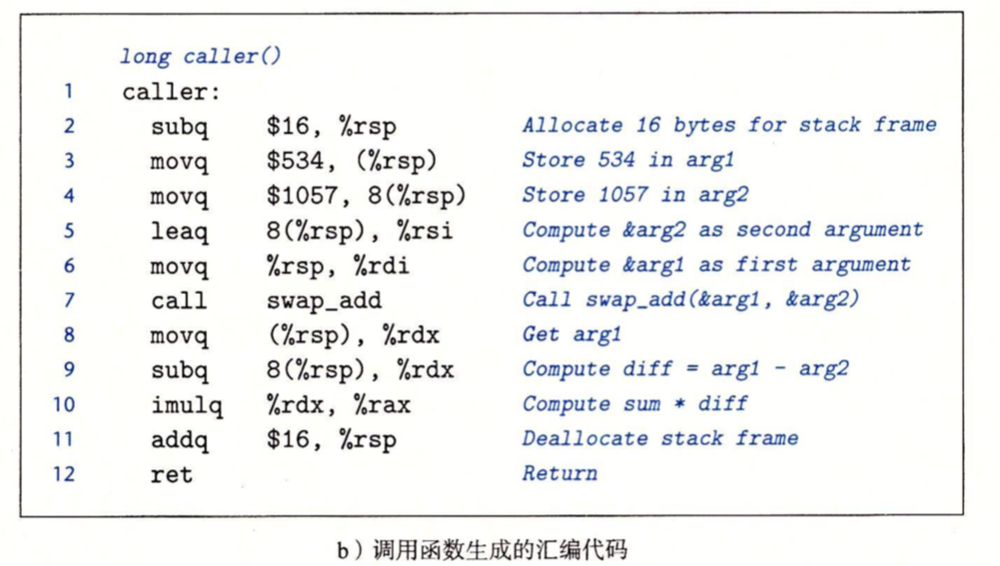
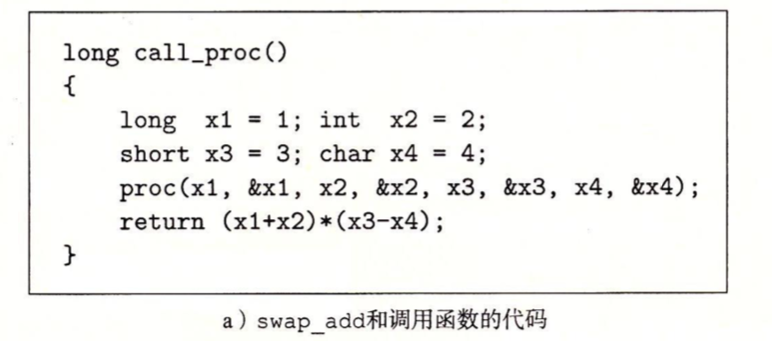
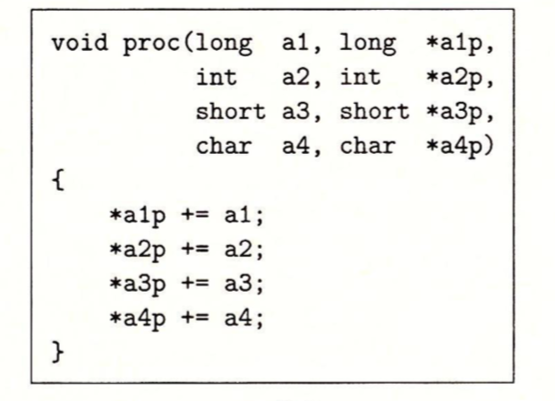
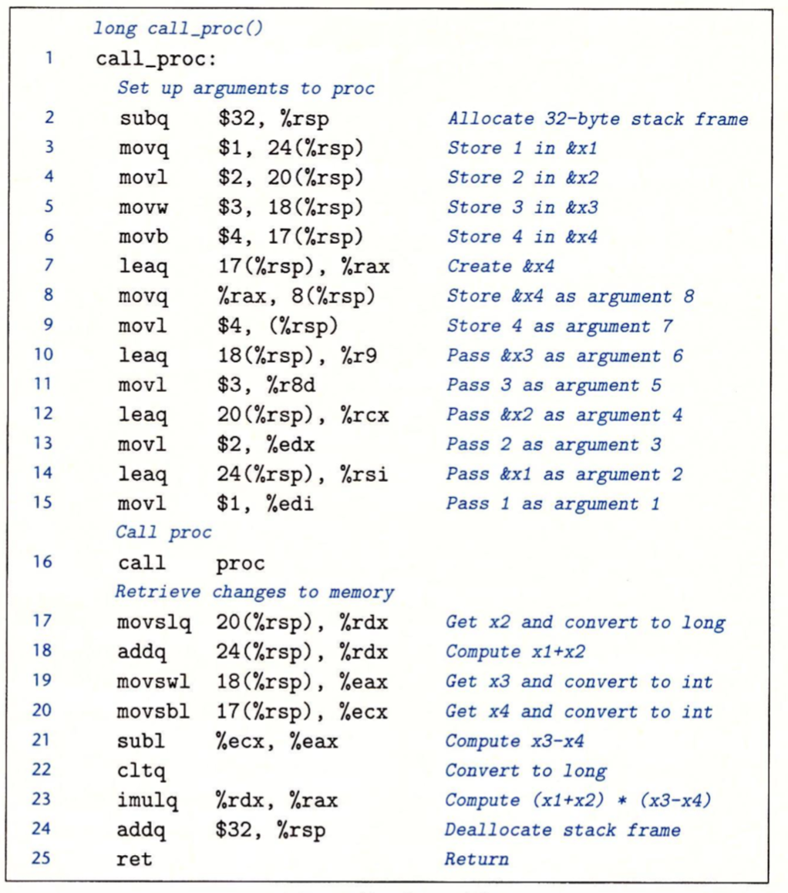
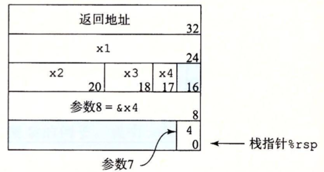
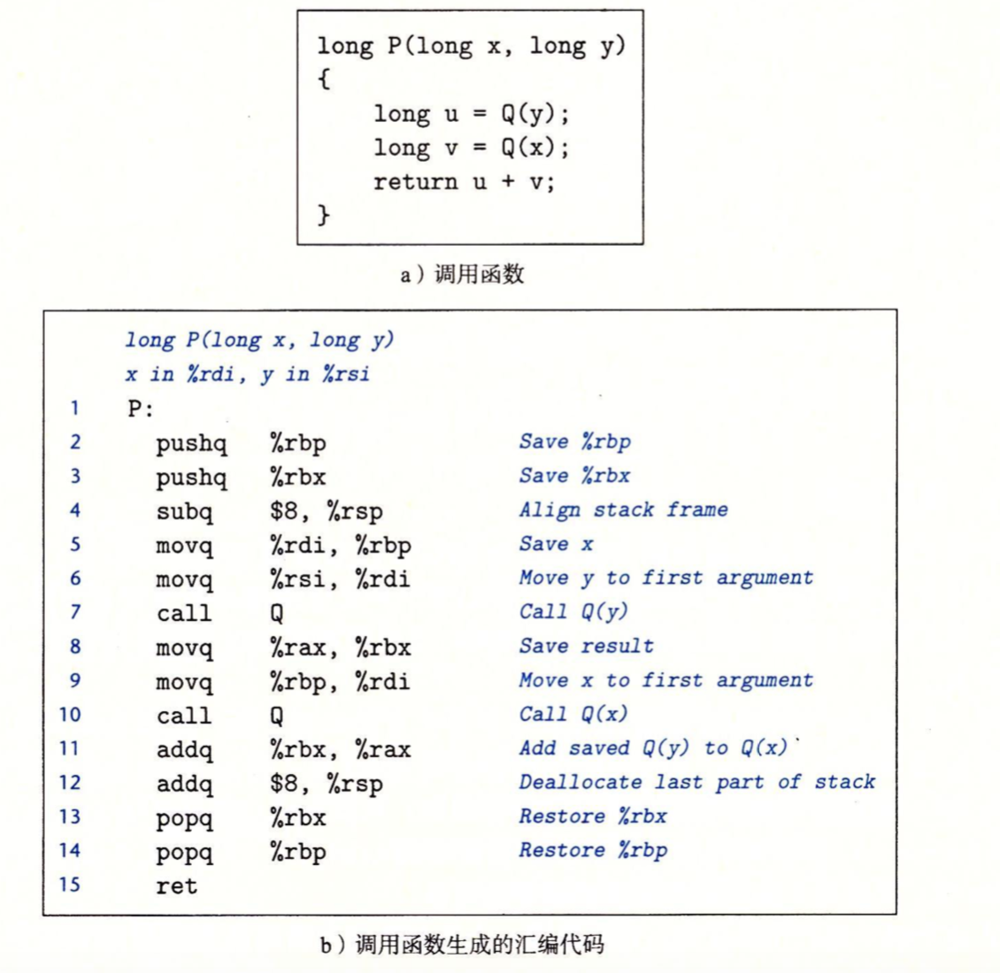

x86-64中，大部分方法间的数据传送是通过寄存器实现的，用来传递参数的寄存器有6个，如果一个函数有大于6个整型参数，超出6个的部分就要通过栈来传递。寄存器的使用是有特殊顺序的，如%rdi用来保存第一个参数，%rsi保存第二个参数。寄存器使用的名字与要传递的数据大小是有关的，如%rdi用来传递64位大小的数据，%edi用来传递32位大小的数据：



比如，方法P调用Q，有n个参数，n>6，那么P的必须在栈上创建一个空间，用来保存7~n的参数项。通过栈传递参数，栈上的参数大小必须是8的倍数对齐，并且从栈顶往上排列。参数到位后，程序就可以调用call指令将控制转移到方法Q了，而方法Q可以通过访问寄存器或栈来获取参数。如果方法Q内部也有其他方法调用，也跟P调用Q类似。

例子：如下这个函数有8个参数，并且包括字节不同的整数和不同类型的指针。前面6个参数通过寄存器传递，后面两个(a4,*a4p)通过栈传递。可以看到作为方法调用的一部分，返回地址被压入栈中，因而后面两个参数位于相对栈指针距离为8和16的位置。





#### 栈上的局部变量

有些时候，局部变量必须存放在内存中，常见的情况包括：

- 寄存器不足存放所有的本地数据。
- 对一个局部变量使用地址运算符'&'，因此必须能够为它产生一个地址。
- 某些局部变量是数组或结构，因此必须能够通过数组或结构引用被访问到。

一般来说，过程通过减小栈指针在栈上分配空间，分配的结果作为栈帧的一部分。

如下例子，代码a中，arg1和arg2是两个局部变量，它们作为swap_add方法的参数，并且使用了'&'地址运算符，所以它们必须存放在栈帧中。

在代码b中，第2行栈指针减小16，其目的是从栈上分配了16个字节，然后用申请出来的空间存储arg1和arg2两个局部变量。我们可以从第3行和第4行看出存储细节。第3行直接将534存储在当前栈指针指定的位置，而534就是局部变量arg1。第4行将1057存储在离栈指针偏移量为8字节处，也就是arg2局部变量。

第5、6行是将arg2和arg1栈引用地址存储到寄存器，为执行swap_add方法作准备。第7行调用swap_add方法。当调用完swap_add方法后(方法返回值会存放在%rax)，caller函数会从栈上取出这两个值，并计算它们的差(第8，9行)，差存储在寄存器%rdx中。第11行寄存器加16，释放栈空间。





例子，如下给出了一个方法call_proc，它必须在栈上分配局部变量，还要向方法proc传递8个参数：








如上，查看call_proc的汇编代码，代码中的一大部分是为调用proc作准备，第2行栈指针减少32字节，在栈中创建一个32字节的栈帧。第3～6行将call_proc方法中的局部变量保存到栈内存中，**局部变量占的空间大小是根据它的类型来判断的，不跟参数一样固定为8字节**，如long x1占的空间大小为24~31即8字节。

将局部变量保存到栈帧中后，接下来就是存储需要传递的参数，因为寄存器最多保存6个参数，多出的参数```a4，*a4p```需要保存到栈帧中。第7行是计算局部变量```*a4```在栈帧中(内存中)的相对地址，然后把这个地址存储在栈帧接下来的8个字节空间中(第8行)。第9行是将参数a4存储在栈帧的最后8个字节中。第10～15将proc剩余的参数设置到寄存器中。第16行调用proc方法。当执行完proc方法后，第17～21取出4个局部变量，并进行最后的计算。最后第24行释放栈内存。



#### 寄存器中局部存储空间

寄存器组是唯一被所有过程共享的资源，我们必须保证当一个方法(调用者)调用另一个方法(被调用者)时，被调用者不会覆盖调用者稍后会使用的寄存器。

寄存器%rbx，%rbp和%r12~%r15被称为**被调用者保存寄存器**，当P调用Q的时候，Q过程可能会需要寄存器来保存数据，为了不覆盖调用它的过程(P)的数据，需要将寄存器原来的值保存到栈，然后在返回前，弹出旧值。

所有的其它寄存器，除了栈指针%rsp，都分类为**调用者保存寄存器**。方法P在某个此类寄存器中有**局部变量**，然后调用过程Q，因为Q可以随意修改这个寄存器，所以ß在调用之前首先保存好这个数据，保存数据是调用者的责任。

例子：



如上汇编代码使用了两个被调用者保存寄存器%rbp，%rbx，第2～3行将%rbp,%rbx的旧值压入栈；第4行创建一个8字节栈帧；第5行将第一个参数x保存到%rbp，第6行将二个参数y保存到%rdi寄存器；第7行执行Q方法，方法返回的结果保存到%rax中；第8行将Q方法的返回值保存到%rbx中；第9行将%rbp中的x保存到%rdi，在执行Q(第10行)方法；第13～14行将%rbp,%rbx的值弹出，恢复这两个寄存器的旧值。