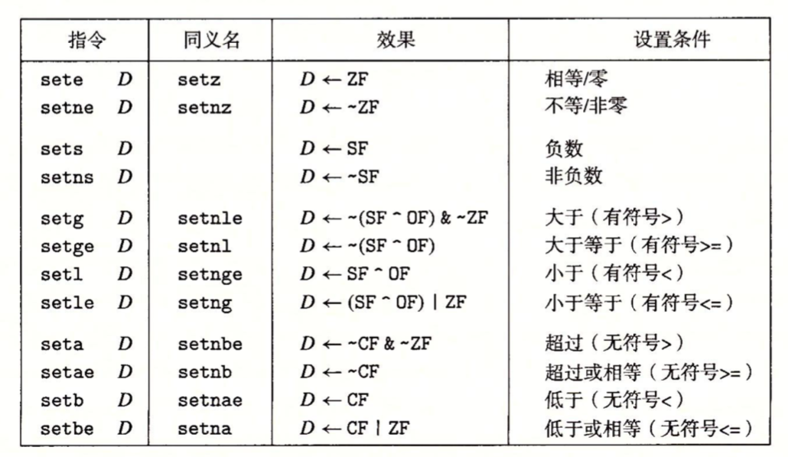
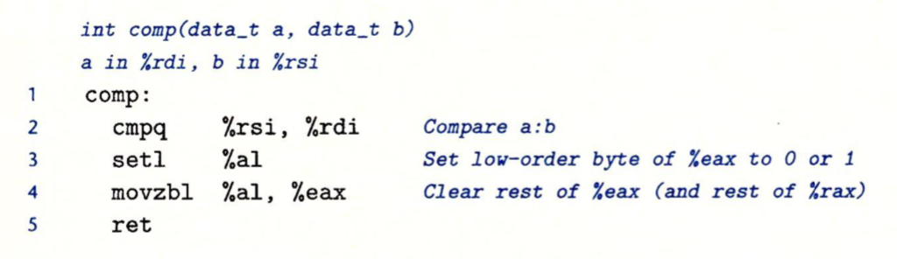

####条件码标志

当计算机执行一条算术或逻辑指令后，会产生一个属性，这个属性就是条件码。比如```1-2=-1```，执行结果小于0，这个``小于0``就是一个条件码，存储在一组单个位的``条件码寄存器``中。它的作用是其他指令在执行的时候检测这些寄存器来判断是否要跳转到其他指令行。

- CF：进位标志。最近的操作使最高位产生了进位。可用来检查无符号操作的溢出。
- ZF：零标志。最近的操作得出的结果为0。
- SF：符号标志。最近的操作得到的结果为负数。
- OF：溢出标志。最近的操作导致一个补码溢出(正溢出或负溢出)。

比如， CPU执行一条ADD指令，它的效果等价于假``` t = a+b```，这里变量a、b、t都是整型，然后根据t来设置条件码：

- CF（unsigned）t < （unsigned）a      无符号溢出
- ZF（t==0)     零
- SF（t<0）负数
- OF（a <0,b<0）&&（t > 0）有符号溢出(负溢出)

leaq指令不会改变任何条件码，因为它只是将地址加载到寄存器或者计算地址。除此之外，前面提到的算术逻辑操作指令都会设置条件码。

还有两类指令，它们只设置条件码而不改变任何寄存器，CMP指令和TEST指令。

- CMP指令：CMP指令的操作数的顺序是相反的，它和SUB指令的行为是一样的。如果两个操作数相等，CMP指令会将零标志(ZF)设置为1。
- TEST指令：它和AND指令一样。

TEST指令的典型应用：

1. 用来检测某个位。

```c
//检测寄存器的右边第三个位是否是1.
test %eax ,00000100b
```

2. 测试寄存器是否为空。

```
//相同的寄存器“与”，如果寄存器不为空，会设置零位标记。
test %eax , %eax
```

####访问条件码

**条件码通常不会直接读取**，常用的三种方式有：1）当我们需要根据条件码去将一个字节设置为0或1时，2）当需要根据条件码来跳转到程序的其他部分，3）根据条件传送数据。

如下SET指令，它的作用是根据条件码来设置单字节寄存器的值：



例子：C语言表达式``a < b``的指令如下：



第2行cmpq比较a和b的大小。第3行setl指令将a和b的比较结果设置到%al中。第4行movzbl将%eax的高3个字节设置为0，还会将%rax的高4字节一起清0。

这里在介绍一下setl指令(当小于时设置指令)，假设 t = a - b。当没有发生溢出时(OF设置为0)， 如果a<b，就将SF设置为1；如果a>b 就将SF设置为0。当发生溢出时(OF=1)，若是负溢出(OF=1)，显然a-b>0(SF=0)，那么可以推导出a<b；若是正溢出，则a-b<0(SF=1)，可以推导出a>b。当a=b时，不会发生溢出。因此当OF被设置为1时，当且仅当SF被设置为0，有a<b，也就是有符号比较测试基于SF^OF和ZF的其他组合。

对于无符号比较测试，t=a-b，当a-b<0时，CMP指令会设置进位标志，因此无符号比较使用的是进位标志和零标志的组合。