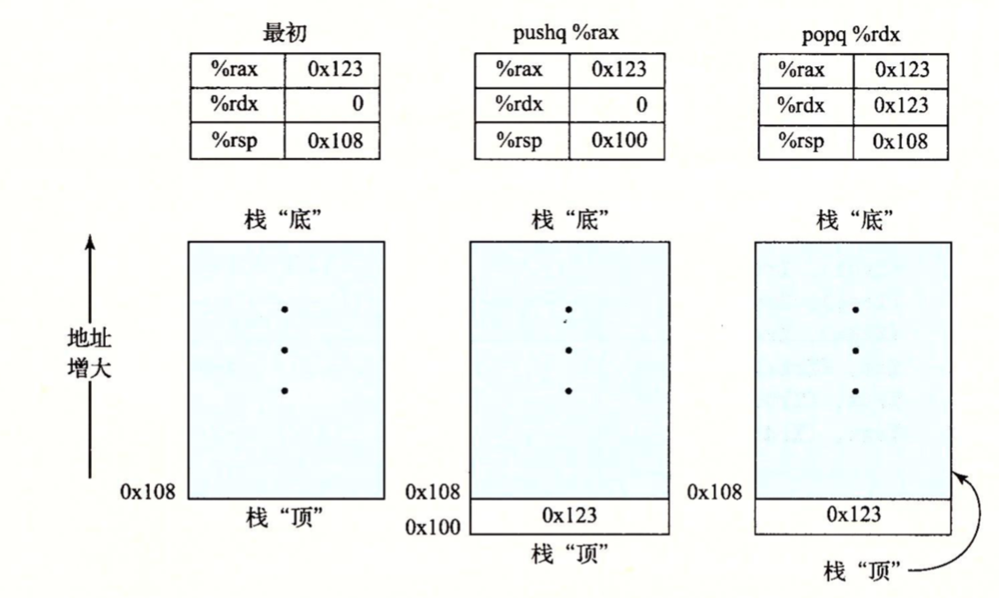

栈是一种数据结构，它只能对某一端进行操作，可以实现为数组。通过push操作把数据压入栈顶，通过pop操作将栈顶删除数据，不过要遵循“后进先出”的原则。程序栈存放在内存中的某个区域。


如下：栈向下增长，栈顶元素的地址是所有栈中元素地址中最低的。%rsp栈寄存器保存着栈顶元素的地址。



如上图：将一个四字(8字节)值压入栈中，首先要将栈指针减8字节，然后将值写到新的栈顶。即刚开始栈寄存器%rsp的地址值为108，%rax内的值为0x123，执行指令pushq %rax后，首先栈寄存器%rsp记录的地址值会减8，得到0x100，然后将0x123 放到内存地址0x100处，即栈顶。

```pushq %rax``` 指令执行的结果等价于下面两条指令：

```c
subq $8,%rsp              //将%rsp中的地址值减去8
movq %rax,(%rsp)     //将%rax的寄存器中的值存放到栈内存 的顶部
```

```popq %rdx```指令将栈顶的元素弹出并保存在%rdx寄存器中，并且将栈寄存器%rsp的值加8回到0x108，也就相当于释放栈空间。它等价于下面两条指令的执行结果：

```c
movq (%rsp) ,%rax
add $8,%rsp
```

因为栈和程序代码以及其他形式的程序数据都是放在同一内存中，所以程序可以使用标准的内存寻址方法访问栈内的任意位置。假设栈顶元素是四字，指令```movq 8(%rsp),%rdx```会将第二个四字从栈中复制到急促器%rdx中。

```
8(%rsp)等价于M[8+R[%rsp]]，（基址+偏移量）寻址
```


