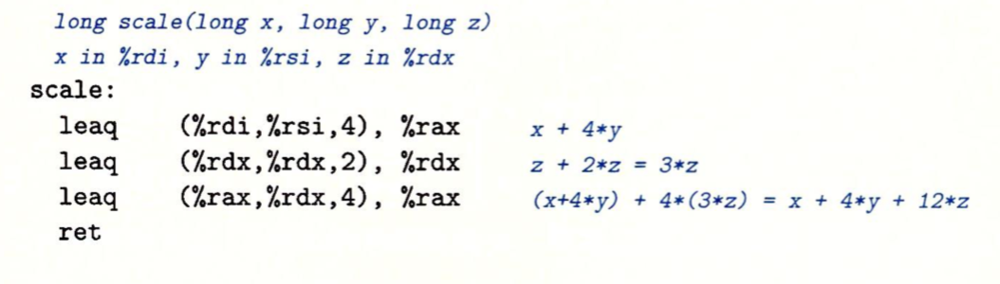
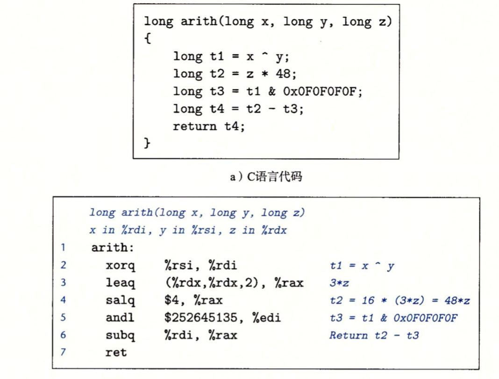

如下是一个整数和逻辑操作指令的集合，根据操作数和用途不同分类为：加载有效地址、一元操作、二元操作和移位。集合中的指令都有不同大小操作数的变种，如addb、addw、addl和addq(leaq除外)。


#### 1. 加载有效地址

在C语言中```&S```是用来创建一个指针，用来指向保存变量S的位置，可以看作是一个取址的操作。因此在leaq指令的操作就是将变量的有效地址加载到目的操作数中。另外它还可以进行普通的算术运算，比如：如果寄存器%rdx的值为x，```leaq7(%rdx,%rdx,4)```的计算结果是```7+5x```。

```c
leaq base_address(offset_address,index,size),%rax  base_address+offset_address+index*size
```

如下是一个leaq的例子，发现它根本与有效地址计算无关。

```c
long scale(long x,long y,long z){
    long t = x+4*y+12*z;
    return t;
}
```

编译时，该函数的算术运算以三条指令实现，它的目的操作数必须是一个寄存器：



#### 2. 一元和二元操作

一元操作只有一个操作数，既是源又是目的。这个操作数可以是一个寄存器，也可以是一个内存位置。比如说，指令```incq(%rsp)```会使栈顶的8字节元素加1。

二元操作，其中第二个操作数既是源又是目的。例如：```subq %rax,%rdx``，使寄存器%rdx的值减去%rax中的值，然后将值保存在%rdx中。%rdx既是源又是目的。二元操作第一个操作数可以是立即数、寄存器或内存位置，第二个操作数可以是寄存器或内存位置。**注意，当第二个操作数为内存地址时，处理器必须从内存读出值，执行操作，把结果写回内存**。

#### 3. 移位操作

移位操作第一个操作数是移位量，第二项是要移位的数。移位量可以是一个立即数，或者放在单字节寄存器%cl中。单字节只能存放一个字节，而一个字节的移位量的范围是2$^8$-1=255。在x86-64中，对w位长的数据值进行操作，移位量是由%cl寄存器的低m位决定，2$^m$=w。高位会忽略。所以当寄存器%cl的十六进制值为0xFF时(全为1)，指令salb会移动7位(salb只能操作一个字节的数据，只有8位，所以只能移动7位，高位忽略)，salw会移动15位，sall会移动31位，而salq会移动63位。

左移指令有两个名字：SAL 和SHL，两者的效果是一样的，都是右边填上0.右移指令不同，SAR执行算术移位(填上符号位)，而SHR执行逻辑移位(填上0)。



