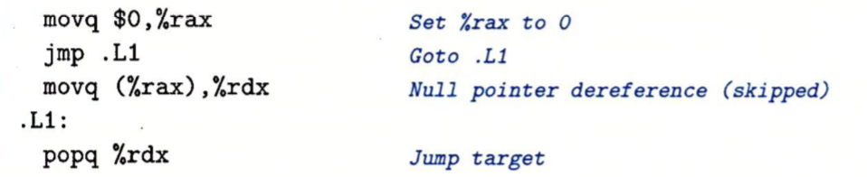
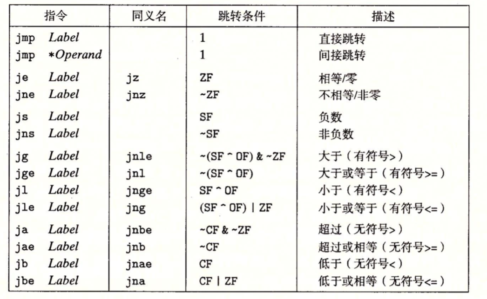
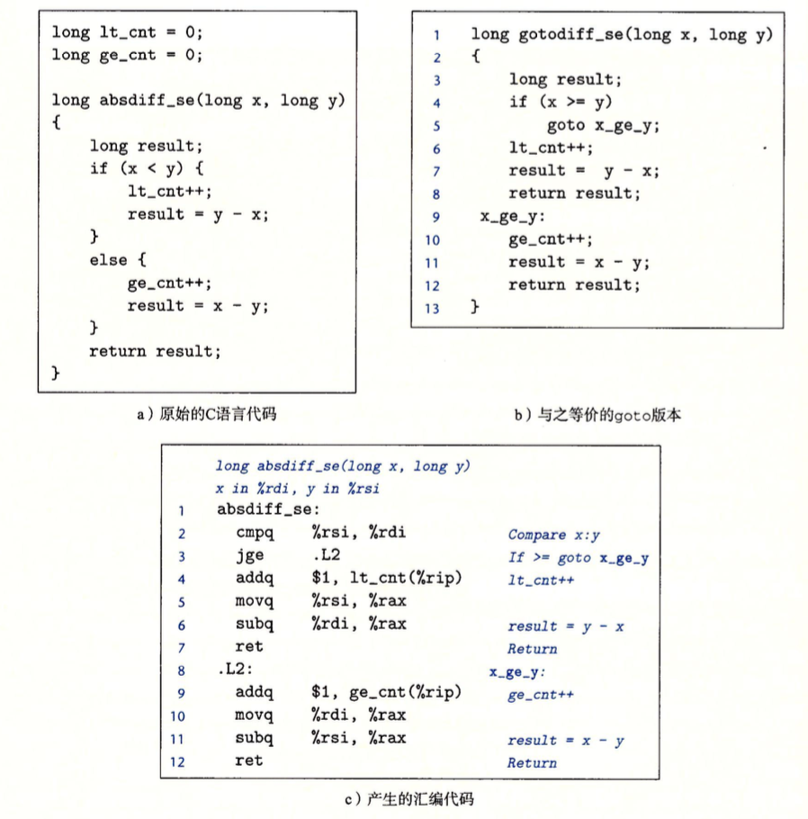
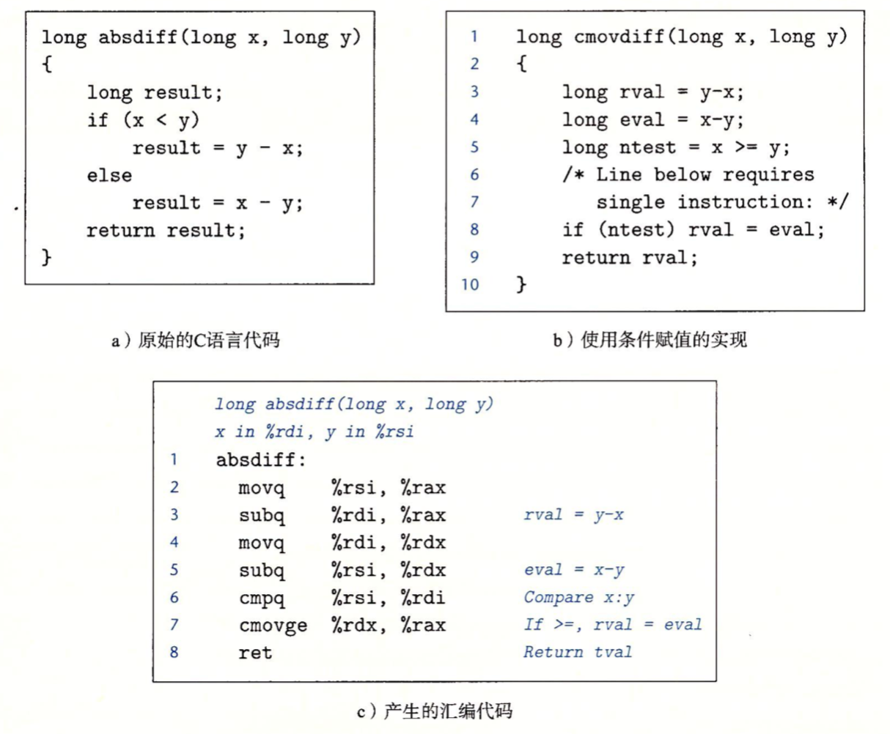
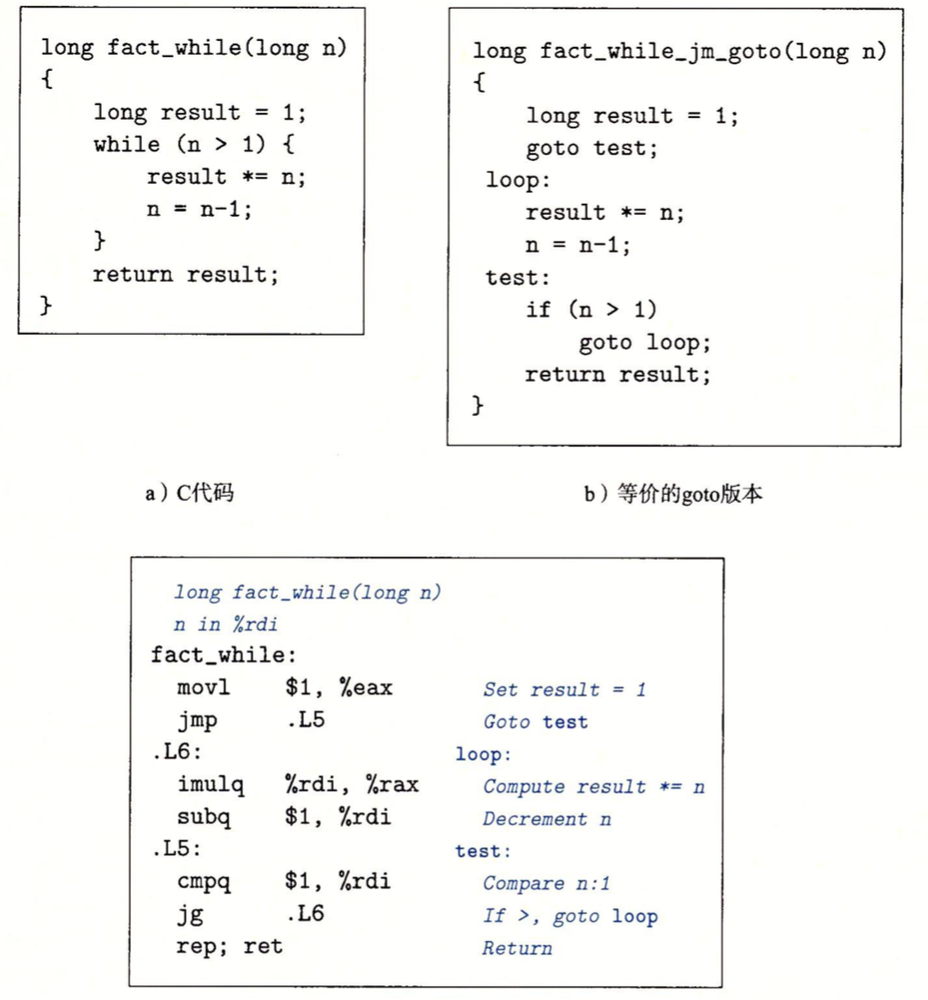
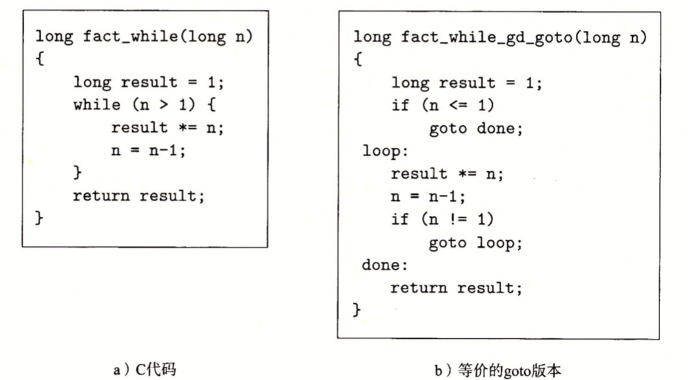

#### 跳转指令

跳转指令，导致指令执行切换到程序中一个全新的位置并执行新的指令。一般跳转指令会根据条件码来判断是否符合要求来进行跳转。但是也可以直接跳转。如下例子中的```jmp .L1```就是一个直接跳转，它会跳转到.L1代码处，导致程序跳过movq指令，程序直接从popq指令处执行:




jmp是一个**无条件跳转**，它可以直接跳转到标号指定的代码处(如上示例)，也可以根据寄存器或内存指令的地址来进行跳转。

如下是跳转指令的一个集合，除下jmp指令，其他都是有条件跳转：



#### 用跳转来实现条件分支

C语言中，条件表达式可以使用跳转指令来实现。如示例代码a中，条件表达式是```if(x<y)```，如果x小于y则执行if代码块，否则执行else。汇编代码(代码c)中对应实现是：先比较x和y的大小(第2行)并设置条件码，然后根据条件码来判断是否进行跳转(第3行)。



#### 用条件传送来实现条件分支

使用跳转指令来实现条件分支，当条件满足时，程序沿着一条执行路径执行，而当条件不满足时，就走另一条路径。这种机制简单而通用，但是在现代处理上，它可能会非常低效。一种替代的策略是使用传送指令来实现(数据的条件转移)。

使用条件传送，会事先将可能的结果都计算出来，然后再根据条件是否满足从中选取一个。

如下例子，代码c是用条件传送实现条件分支的汇编代码。可以看到它将```x-y```和``y-x``的结果都计算出来了，并把它们都存储在寄存器中，然后再比较x和y的大小(第6行)，并设置条件码。最后根据条件码来判断是否需要通过条件传送指令来设置返回寄存器%rax的值(第6行)。



条件传送指令集合如下，每条指令有两个操作数：源寄存器或内存地址S，和目的寄存器 R。源值可以从内存或者寄存器中读取，但是只有在指定的条件满足时，才会被复制到目的寄存器中。源和目的的值可以是16位、32位或64位，不支持单字节的条件传送。


为什么基于条件传送的代码会比基于条件控制转移的代码性能更好？

现代计算机采用流水线来提高性能，即所有待执行的指令（如从内存中读取指令、从内存中读取数据、执行算术运算、向内存写数据已经更新程序计算器）都在流水线中，待到某一时刻，同时执行。这个时刻就是在当时钟上升时。

如果基于条件跳转，只有当分支条件求值完成后，才能确定分支往哪走，再把后面要执行的指令加载到流水线中。处理器采用分支预测逻辑来猜测没跳跳转指令是否会执行，如果错误预测了一个跳转，要求处理器丢掉它为该跳转指令后所有指令以做的工作，这样一个错误的预测会浪费大约15～30个时钟周期，导致程序性能严重下降。

### 循环

C语言中提供了多种循环结构，如do-while、while和for。在汇编中没有相应的循环指令存，可以用条件测试和跳转组合起来实现循环的效果。

1. do-while循环

do-while循环是先执行循环体的内的代码，然后执行判断表达式，如果表达式结果为真，则再回去执行循环体。可以看到循环体至少会执行一次。

如下示例，代码a是源码，程序会先执行do代码块的内容，然后执行表达式，根据表达式来决定是否要继续执行do代码块。汇编代码b中，执行会从上往下执行，第5、6行是do代码块的内容，第7行是表达式，第8行根据第7行产生的条件码来判断是否要跳到标志L2处。


2. while循环

与do-while的不同之处在于，它会先进行条件判断，再根据判断结果决定是否执行循环体内的程序。

有很多种方式将while循环翻译成机器代码，GCC在代码生成中使用其中的两种方法。这两种方法不同点在于判断表达式的实现方式：

1）第一种：跳转中间，它执行一个**无条件跳转跳到循环结尾处**，以此来执行初始的条件判断：



2）第二种方式：首先使用条件分支，如果初始条件不成立就跳过循环，结束循环；如果初始条件成立，则把代码变换为do-while循环。利用这种实现策略，编译器常常可以优化初始的条件判断，假如认为条件总是满足。	




3. for循环

GCC为for循环产生的代码是while循环的两种翻译之一，这取决于优化的等级。

4. switch语句

switch语句可以根据整数索引值进行多重分支，它通过跳转表来实现。跳转表是一个数组，表项标```i```是一个代码段的地址，这个代码段的实现是当switch的索引值等于表项```i```下标时采取的动作。和使用一组很长的if-else语句相比，只要根据索引值执行相对应的代码段，与switch的判断条件数量无关。因此它更高效。

如下C语言示例，从代码可以看出，case102没有使用break，因此程序会继续往下执行，case104和case106会执行同一模块的代码，而101不在switch条件中，因此会执行default模块。


汇编代码的实现如下：jmp指令的操作数有前缀*，表明这是一个间接跳转，操作数指定一个内存位置。

编译器首先将n减去100(第2行)，把取值范围移到0和6之间，因为为了节省空间，跳转表中的元素肯定是紧凑的，所以n必须减去100，否则将会浪费内存空间；比较n和6的大小(第3行)，如果n大于6则跳转到默认代码处(第4行)；如果n小于6则跳到对应的代码段地址上(第5行)。

```c
//代码段地址计算公式：index*8，即第一个元素的地址是0，第二个就是8依次类推。
jmp *.L4(,%rsi,8)
```


汇编语言的等价实如下，jt数组保存了c代码中的各个代码块的地址，（&指向一个数据值的指针，&&指向代码位置的指针)：


