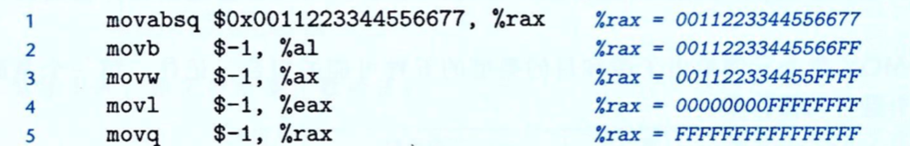

### 数据格式

程序的机器级表示可以理解为汇编代码如何来表示程序。大多数汇编代码指令都有一个后缀用来表明操作指令操作的数据的大小。例如，数据传送指令有四个变种：movb(传送字节)、movw(传送字)、movl(传送双字)和movq(传送四字)。

由于是从16位体系结构扩展成32位的，Intel用术语“字(word)”表示16位数据类型。因此，称32位数为“双字(double words)”，后缀用l(long word)来表示;同理称64位数为“四字(quad words)”，后缀q。

### 访问信息

最初的8086中有8个16位的寄存器，即%ax 到%bp，每个寄存器都有特殊的用途，它们的名字就反应了这些不同的用途。拓展到IA32架构时，这些寄存器也拓展成32位寄存器，标号从%eax到%ebp 。拓展到x86-64后，原来的8个寄存器扩展成64位标号从%rax到%rbp。除此之外，还增加了8个新的寄存器，它们的标号是按照新的命名规则制定的：从%r8到%r15。

所用16个寄存器的低位部分都可以作为字节、字(16位)、双字(32位)和四字(64 位)数字来访问，16位操作可以访问最低的2个字节，32位操作可以访问最低的4个字节，而64位操作可以访问整个寄存器。当这些指令以寄存器为目标时，生成1字节和2字节数字的指令会保持剩下的字节不变；生成4字节的指令会把高位4个字节置为0。

### 操作数指示符

大多数指令有一个或多个操作数，操作数指示出执行一个操作中要使用的源数据值以及放置结果的目的位置。源数据可以以常数的形式给出或是从寄存器会内存中读出。结果可以存放在寄存器或内存中。

**操作数**可以分为三种：

* 立即数：书写方式是'$'后面跟一个用标准C表示的整数，比如，\$-577或者\$0x1f。不同的指令允许的立即数值范围不同。
* 寄存器：它表示某个寄存器的内容，16个寄存器的低位1字节、2字节、4字节或8字节中的一个作为操作数，这些字节分别对应于8位、16位、32位 或64位。我们用r$_a$来表示任意寄存器a，用引用R[r$_a$]来表示它的值。这里将寄存器集合看成一个数组R，用寄存器标识符作为索引。
* 内存引用：它会根据计算出来的地址访问某个内存位置。我们可以把内存看成一个很大的字节数组，用符号M$_b$[Addr]表示对存储在内存中从地址Addr开始的b个字节值的引用。

不同的操作可以组成多种不同的寻址模式，允许不同形式的内存引用。如下图，表中底部用语法Imm(r$_b$,r$_i$,s)表示的是最常用的形式。这样的引用有四部分组成：一个立即数偏移Imm，一个基址寄存器r$_b$，一个变址寄存器r$_i$和一个比例因子s，这里的s必须是1、2、4、8。基址和变址寄存器都必须是64位寄存器。

### 数据传送指令

传送指令(MOV)是将数据从一个位置复制到另一个位置的指令，并且数据从源位置复制到目的位置，不做任何变化。

源操作数指定值是一个立即数存储在寄存器或者内存中，目的操作数指定一个位置，这个位置要么是寄存器，要么是内存地址。x86-64加了一个限制，传送指令的两个操作数不能都指向内存位置，将一个值从一个内存复制到另一个内存位置需要两条指令：第一条指令将源值加载到寄存器中，第二条将寄存器值写入到目的地。

大多数情况下，MOV指令只会更新目的操作数指定的那些寄存器字节或者内存位置，唯一例外是movl指令以寄存器作为目的时，它会把该寄存器的高四位字节设置为0。

**movabsq**指令是处理64位立即数，常规的movq指令只能以表示32位补码数字的立即数作为源操作数，然后把这个值符号扩展到64位的值，然后放到目的位置。movabsq指令能够以任意64位立即数作为源操作数，并且只能以寄存器作为目的地。

如下，记录了两类数据移动指令，在将较小的源值复制到较大的目的时使用：

* MOVZ类：指令把目的中剩余的字节填充为0。
* MOVS类：指令通过符号扩展来填充。

可以观察到每条指令名字的最后两个字符都是大小指示符，第一个字符指定源的大小，而第二个指定目的的大小。

**示例**：理解数据传送如何改变目的寄存器

第一行的指令把寄存器%rax地址初始化为0011223344556677，剩下的指令的源操作数值都是立即数-1(…11111111)，因此movb指令(第2行)把rax的低位字节设置为FF，而movw指令(第3行)把低2字节设置为FFFF，剩下的字节保持不变，movl(第4行)将低4个字节设置为FFFFFFFF，同时把高位4字节设置为00000000，最后movq指令把整个寄存器设置为FFFFFFFFFFFFFFF。

**数据传送示例**

> long x = *xp：表示将读取存储在xp所指位置中的值，并将它存放到名字为x的局部变量中。
>
> *xp = y：将参数y的值写到xp所指的位置。

当程序执行时，参数xp和y分别存储在寄存器%rdi(第一个参数)和%rsi(第二个参数)中。然后指令2从内存中读出x，把它存放到寄存器%rax(返回值)中，这条指令实现了C程序中的操作：x=*xp。%rax是返回值寄存器，作为函数的返回值，因而返回值就是x。指令3将y写入到寄存器%rdi中xp指向的内存位置，直接实现了操作\*xp=y。

### 压入和弹出栈数据

栈是一种数据结构，可以添加或者删除值，不过要遵循“后进先出”的原则。通过push操作把数据压入栈中，通过pop操作删除数据。

pushq指令把数据压入到栈上，而popq指令是弹出数据，%rsp保存着栈顶元素的地址。

如下图，栈向下增长，栈顶的元素地址是所有栈中元素地址最低的：

将一个四字值压入栈中，首先要将栈指针减8，然后将值写到新的栈顶。如上图，%rsp为108，%rax为0x123，执行指令pushq %rax，首先%rsp会减8，得到0x100，然后将0x123 放到内存地址0x100处。

> pushq %rax 的行为等价于：
>
> subq $8,%rsp              //将%rsp中的地址值减去8
>
> movq %rax,(%rsp)     //将%rax的寄存器中的值存放到栈内存 的顶部

弹出一个四字的操作包括从栈顶位置读出数据，然后将栈顶指针加8。如上图第三栏，先从内存中读出值0x123，再写到寄存器%rdx中，然后寄存器%rsp值将回到0x108。值0x123仍然会保持在内存位置0x100中，直到被覆盖。无论如何，%rsp指向的地址总是栈顶。

> pops %rax等价于：
>
> movq (%rsp) ,%rax
>
> add $8,%rsp

**因为栈和程序代码以及其他形式的程序数据都是放在同一内存中，所以程序可以使用标准的内存寻址方法访问栈内的任意位置。**