 ### 算术和逻辑操作三

#### 过程

过程是软件中一种很重要的抽象，它提供了一种封装代码的方式，用一组指定的参数和一个可选的返回值实现了某种功能，然后，可以在程序中不同的地方调用这个函数。

假设过程P调用过程Q，Q执行后返回P，这些动作包括一个或者多个机制：

* 传递机制：在进入过程Q的时候，程序计数器必须设置为Q的代码的起始地址，然后在返回时，要把程序计数器设置为P过程中调用Q后面那条指令的地址。
* 传递数据：P必须能够向Q提供一个或多个参数，Q必须能够向P返回一个值。
* 分配和释放内存：在开始的时候，Q可能需要为局部变量分配空间，而在返回前，又必须释放这些空间。

#### 运行时栈

c语言过程调用的一个关键特性在于使用栈数据结构提供的**后进先出**的内存管理原则。以过程P调用过程Q为例，可以看到当Q在执行时，P以及它向上追溯的调用链都被暂时挂起来了。当Q运行时，它只需要为局部变量分配新的存储空间，然后当它返回时，任何它所分配的局部变量存储的空间都可以被释放。


x86-64的栈向低地址方向增长，而栈指针%rsp指向栈顶元素。将栈指针减小一个适当的量可以为没有指定初始值的数据在栈上分配空间，类似的可以通过增加栈指针来释放空间。

x86-64过程需要的存储空间超出寄存器能够存放的大小时，就会在栈上分配空间，这个部分称为过程的栈帧。在这个空间中，可以保存寄存器的值，分配局部变量空间，为它调用的过程设置参数，大多数过程的栈帧都是定长的，在过程的开始就分配好了。

通过寄存器，过程P可以传递最多6个整数值，但是如果Q需要更多的参数，P可以在调用Q之前在自己的栈帧里存储好这些参数。但当所有的局部变量都可以保存在寄存器中，而且该函数不会调用其他函数，可以省略栈帧部分。

#### 转移控制

将控制从函数P转移到函数Q只简单地把程序计数器设置为Q的代码的起始位置，并且处理器必须记录好它需要继续P的执行的代码位置，在X86-64机器中，这个过程由call指令完成。该指令会把地址A压入栈中，并将程序计数器设置为Q的起始地址。压入的地址A称为返回地址，是**紧跟在call指令后面的那条指令**。对应的ret指令会从栈中弹出地址A，并把程序计数器设置为A 。


例1:

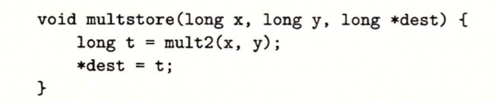

假设在main方法中调用multstore方法，下面是这两个反汇编代码的节选：

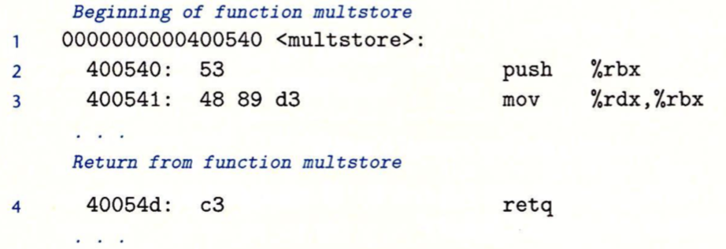

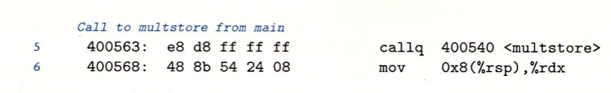

在代码中，第5行是main方法使用call指令调用multstore方法，此时的状态如a图，指明了栈指针%rsp和程序计数器%rip的值。call的效果就是将返回地址0x400568压入栈中(这个返回地址是call指令的下一条指令的地址)，并跳到函数multstore的第一条指令，地址为0x0400540。函数multstore继续执行，直到遇到地址0x40054d处的ret指令。这条指令从栈中弹出值0x400568，然后跳到这个地址，继续main函数执行。


#### 数据传送

x86-64中，大部分过程间的数据传送是通过寄存器实现的，比如过程P调用过程Q，P的代码必须先把参数复制到适当的寄存器，类似地，当Q返回到P时，P的代码可以访问寄存器%rax中的返回值。

x86-64中，可以通过寄存器最多传递6个整型(整数和指针)参数，如果一个函数有大于6个整型参数，超出6个的部分就要通过栈来传递。寄存器的使用是有特殊顺序的，寄存器使用的名字取决于要传递的数据类型的大小：


假设过程P调用过程Q，有n个整型参数，且n>6，那么p的代码分配的栈帧必须要能容纳7到n号参数的存储空间，把参数1～6复制到对应的寄存器，把参数7～n放到栈上，而参数7位于栈顶。通过栈传递**参数**时，所有的数据大小都向**8的倍数对齐**。

例子：这个函数有8个参数，并且包括字节不同的整数和不同类型的指针，每个都是8字节的：

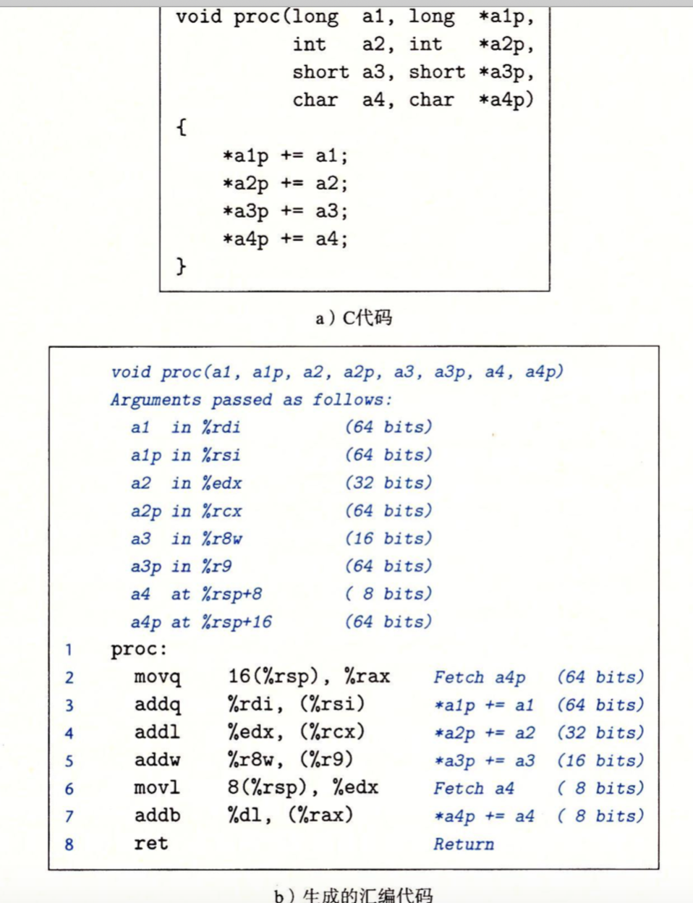

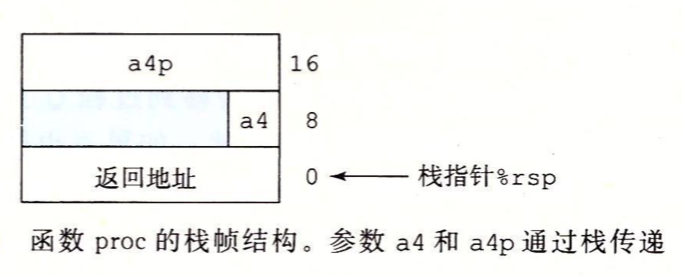

如上：前面6个参数通过寄存器传递，后面两个(a4,*a4p)通过栈传递。可以看到作为过程调用的一部分，返回地址被压入栈中，因而这两个参数位于相对栈指针距离为8和16的位置。

#### 栈上的局部存储

有些时候，局部变量必须存放在内存中，常见的情况包括：

* 寄存器不足存放所有的本地数据。
* 对一个局部变量使用地址运算符'&'，因此必须能够为它产生一个地址。
* 某些局部变量是数组或结构，因此必须能够通过数组或结构引用被访问到。

一般来说，过程通过减小栈指针在栈上分配空间，分配的结果作为栈帧的一部分，标号为‘局部变量’。

例子1:


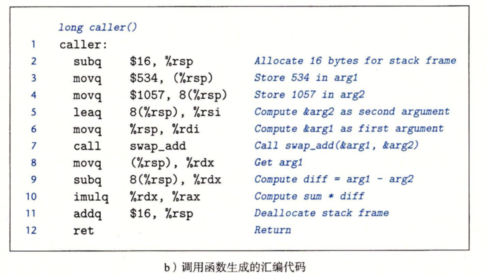

代码b中，第2行栈指针减小16，实际上这就是在栈上分配了16个字节。第3行将局部变量arg1存放在离栈指针偏移量0处，第4行将局部变量arg2存放在离栈指针偏移量为8字节处。第5、6行是将arg2和arg1栈引用地址存储到寄存器，为执行swap_add方法作准备。第7行调用swap_add方法。当调用完swap_add方法后(方法返回值会存放在%rax)，caller函数会从栈上取出这两个值，并计算它们的差(第8，9行)，差存储在寄存器%rdx中。第11行寄存器加16，释放栈空间。

例2:


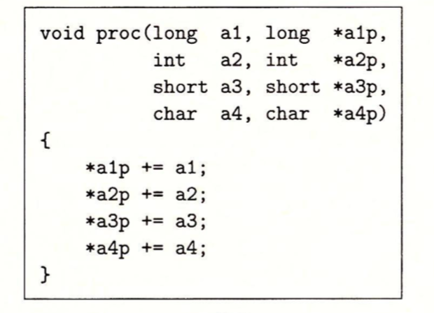

汇编代码如下：

 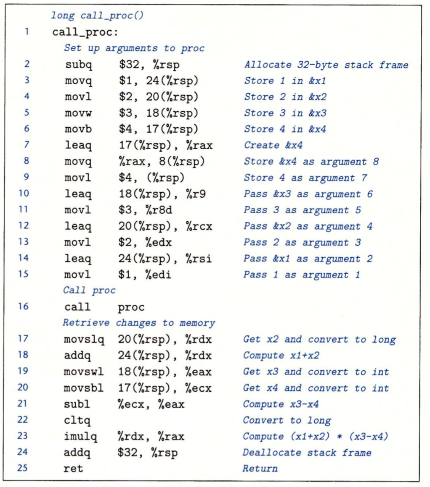

如上，查看call_proc的汇编代码，代码中的一大部分是为调用proc作准备，第2行栈指针减少32字节，在栈中创建一个32字节的栈帧。第3～6行将call_proc方法中的局部变量保存到栈内存中，局部变量占的空间大小是根据它的类型来判断的，不跟参数一样固定为8字节，如long x1占的空间大小为24~31即8字节。

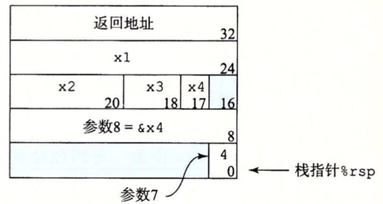

因为寄存器最多只能保存6个参数，多出的参数需要保存到栈内存中，第8、9行就将调用proc方法的第8、7个参数保存到栈内存中，第7行是引用x4局部变量地址，第10～15将proc剩余的参数设置到寄存器中。第16行调用proc方法。当执行完proc方法后，第17～21取出4个局部变量，并进行最后的计算。最后第24行释放栈内存。

#### 寄存器中的局部存储空间

寄存器组是唯一被所有过程共享的资源，我们必须保证当一个过程(调用者)调用另一个过程(被调用者)时，被调用者不会覆盖调用者稍后会使用的寄存器。

寄存器%rbx，%rbp和%r12~%r15被称为**被调用者保存寄存器**，当P调用Q的时候，Q过程可能会需要寄存器来保存数据，为了不覆盖调用它的过程(P)的数据，需要将寄存器原来的值保存到栈，然后在返回前，弹出旧值。

所有的其它寄存器，除了栈指针%rsp，都分类为调用者保存寄存器。过程P在某个寄存器中有**局部变量**，然后调用过程Q，因为Q可以随意修改这个寄存器，所以在调用之前首先保存好这个数据，保存数据是调用者的责任。

例子：


如上汇编代码使用了两个被调用者保存寄存器%rbp，%rbx，第2～3行将%rbp,%rbx的值压入栈；第4行创建一个8字节栈帧；第5行将第一个参数x保存到%rbp，第6行将二个参数y保存到%rdi寄存器；第7行执行Q方法，方法返回的结果保存到%rax中；第8行将Q方法的返回值保存到%rbx中；第9行将%rbp中的x保存到%rdi，在执行Q(第10行)方法；第13～14行将%rbp,%rbx的值弹出，恢复这两个寄存器的旧值。

### 数组分配和访问

#### 基本原则

对于数据类型T和整型常数N，声明如下：

```
T A[N]; //比如 char arr[12]
```

T表示数据类型，表示在内存中分配了连续字节的区域；A表示数组开头的指针，那么指针的值就是X$_A$；可以用0~N-1 的整数索引来访问该数组元素。

x86~64的内存引用指令可以用来简化数组的方法。例如，假设E是一个int型数组，而我们想访问E[i]，在此，E的地址存放在寄存器%rdx中，而i存放在寄存器%rcx中。然后指令

```
movl (%rdx,%rcx,4),%eax
```

会执行地址计算X$_E$+4i，读这个内存位置的值，并将结果存放到寄存器%eax中。

#### 指针运算

操作符'&'和'*'可以产生指针和间接引用指针。也就是，对于一个表示某个对象的表达式Expr，```&Expr```是给出该对象地址的一个指针。对于一个表示地址的表达式AExpr，\*AExpr给出该地址处的值。因此Expr和\*&Expr是等价的。数组A[i]等同于\*(A+i)。

#### 嵌套的数组

当我们创建多维数组时，数组在内存中排列方式是以“行优先”，如：```int A[5][3]```在内存的排列：


通常来说，```T D[R][C]```它的数组元素```D[i][j]```的内存地址为：

```
&D[i][j]=XD+L(C*i+j)//XD是数组的基地址，L是数组元素类型大小
```

假设$X_A$、i、j分别在寄存器%rdi、%rsi、%rdx中，然后要将```A[i][j]```复制到寄存器%eax中：

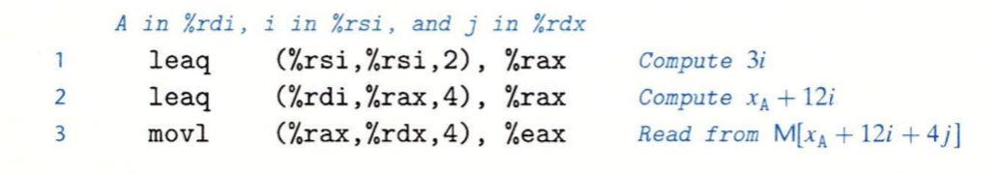

### 结构

C语言的struct声明创建一个数据类型，将可能不同类型的对象聚合到一个对象中。编译器维护每个字段的字节偏移，它以这些偏移量作为内存引用指令中的位移，从而产生对结构元素的引用。

```
struct rec{
    int i ;
    int j ;
    int a[2];
    int *p;
}
```

这个结构包括4个字断：两个4字节int、一个由两个类型为int的元素组成的数组，一个8字节整型指针，总共是24个字节：

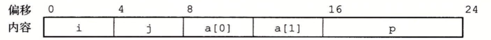

为了访问结构的字断，编译器产生的代码要将结构的地址加上适当的偏移，比如：变量r是rec*类型，它存储在%rdi中，为了将它的属性i的值赋值给属性j：

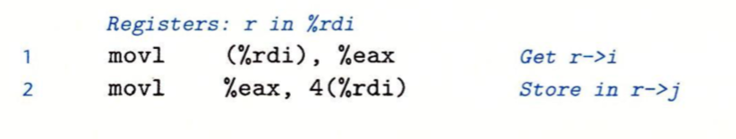

因为字断i的偏移量为0，所以这个字段的地址就是r的值，为了存储到字断j，代码要将r的地址加上偏移量4。

