### 算术和逻辑操作

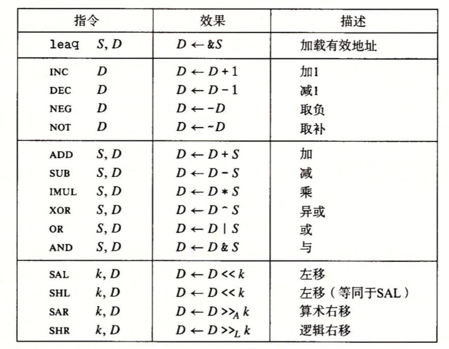

#### 加载有效地址

leaq指令从内存读取数据到寄存器，但实际上它根本没有引用内存，它的第一个操作数看上去是一个内存引用，但该指令并不是从指定的位置读入数据，而是将**有效地址**写入到**目的操作数**。另外它还可以进行普通的算术运算，比如：如果寄存器%rdx的值为x，那么leaq7(%rdx,%rdx,4)，它将设置寄存器%rax(返回寄存器)的值为5x+7。

> lea base_address(offset_address,index,size),%rax  它的计算公式为：base_address+offset_address+index*size

例子：

```
long scale(long x,long y,long z){
    long t = x+4*y+12*z;
    return t;
}
```

编译时，该函数的算术运算以三条指令实现：

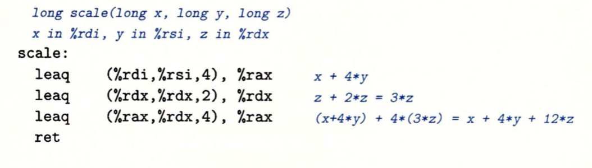

#### 一元和二元操作

一元操作只有一个操作数，既是源又是目的。这个操作数可以是一个寄存器，也可以是一个内存位置。比如说，指令incq(%rsp)会使栈顶的8字节元素加1。

二元操作，其中第二个操作数既是源又是目的。例如：指令subq %rax,%rdx，使寄存器%rdx的值减去%rax中的值。第一个操作数可以是立即数、寄存器或内存位置。第二个操作数可以是寄存器或内存位置，注意，当第二个操作数为内存地址时，处理器必须从内存读出值，执行操作，把结果写回内存。

#### 移位操作

移位操作，第一个操作数是移位量，第二项是要移位的数，可以进行算是和逻辑移位。移位量可以是一个立即数，或者放在单字节寄存器%c1中。在x86-64中，对w位长的数据值进行操作，移位量是由%c1寄存器的低m位决定，这里2$^m$=w。所以当寄存器%c1的十六进制值为0xFF时，指令salb会移动7位，salw会移动15位，sall会移动31位，而salq会移动63位。

左移指令有两个名字：SAL 和SHL，两者的效果是一样的，都是右边填上0.右移指令不同，SAR执行算术移位(填上符号位)，而SHR执行逻辑移位(填上0)。

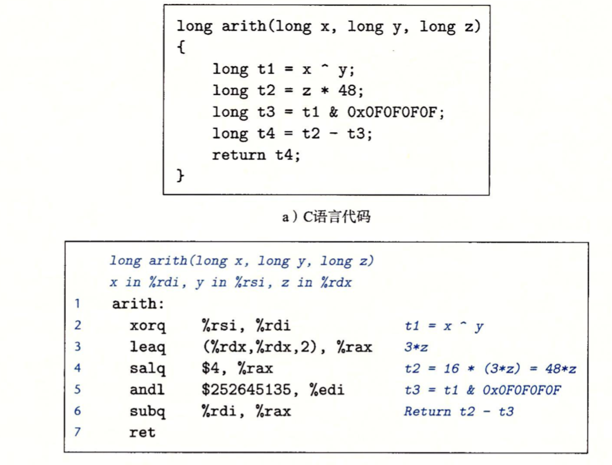

### 控制

在C语言中的某些结构，比如条件语句、循环语句和分支语句，要求有条件的执行，根据测试的结果来决定操作的执行顺序。

#### 条件码

除了整数寄存器，CPU还维护着一组单个位的**条件码寄存器**，它们描述了最近的算术和逻辑操作的属性。可以检测这些寄存器来执行条件分支指令。最常用的条件码有：

* CF：进位标志。最近的操作使最高位产生了进位。可用来检查无符号操作的溢出。
* ZF：零标志。最近的操作得出的结果为0。
* SF：符号标志。最近的操作得到的结果为负数。
* OF：溢出标志。最近的操作导致一个补码溢出(正溢出或负溢出)。

假设我们用一条ADD指令完成等价于C表达式 t = a+b的功能，这里变量a、b、t都是整型，然后根据C表达式来设置条件码：

* CF（unsigned）t < （unsigned）a      无符号溢出
* ZF（t==0)     零
* SF（t<0）负数
* OF（a <0,b<0）&&（t > 0）有符号溢出(负溢出)

leaq指令不会改变任何条件码，因为它是用来进行地址计算的，除此之外，前面提到的算术逻辑操作指令都会设置条件码。除此之外，还有两类指令，它们只设置条件码而不改变任何寄存器，CMP指令和TEST指令。

* CMP指令：CMP指令的操作数的顺序是相反的，它和SUB指令的行为是一样的。比如，如果两个操作数相等，CMP指令会将零标志(ZF)设置为1。
* TEST指令：它和AND指令一样。比如TEST S1，S2 会计算S1&S2的结果并根据结果设置条件码。

#### 访问条件码

条件码通常不会直接读取，可以根据条件码的某种组合，将一个字节设置为0或者1。

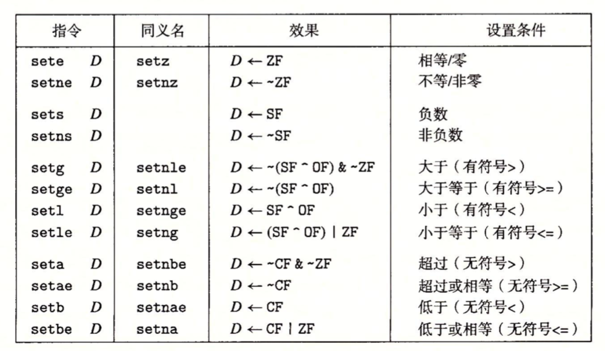

如上的SET指令，它的目的操作数指令是低位单字节寄存器之一，或是一个字节的内存位置，指令会将这个字节设置成0或者1。为了得到一个32位或64位结果，我们必须对**高位清零**。

比如C语言表达式a < b的指令如下：

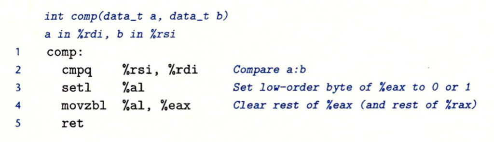

第2行cmpq比较a和b的大小，虽然参数列出的顺序是%rsi(b)和%rdi(a)。第3行setl指令将a和b的比较结果设置到%al中。第4行movzbl将%eax的高3个字节设置为0，还会将%rax的高4字节一起清0。

这里在介绍一下setl指令(当小于时设置指令)，假设 t = a - b。当没有发生溢出时(OF设置为0)， 如果a<b，就将SF设置为1；如果a>b 就将SF设置为0。当发生溢出时(OF=1)，若是负溢出(OF=1)，显然a-b>0(SF=0)，那么可以推导出a<b；若是正溢出，则a-b<0(SF=1)，可以推导出a>b。当a=b时，不会发生溢出。因此当OF被设置为1时，当且仅当SF被设置为0，有a<b，也就是有符号比较测试基于SF^OF和ZF的其他组合。

对于无符号比较测试，t=a-b，当a-b<0时，CMP指令会设置进位标志，因此无符号比较使用的是进位标志和零标志的组合。

#### 跳转指令

跳转指令会导致指令执行切换到程序中一个全新的位置，在汇编代码中，这些跳转的目的地通常用一个标号(label)指明。

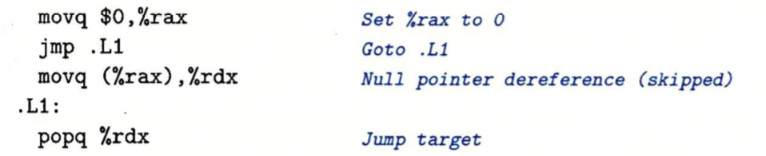

如上，amp.L1会导致程序跳过movq指令，而导致popq指令开始继续执行。如下是jump指令：

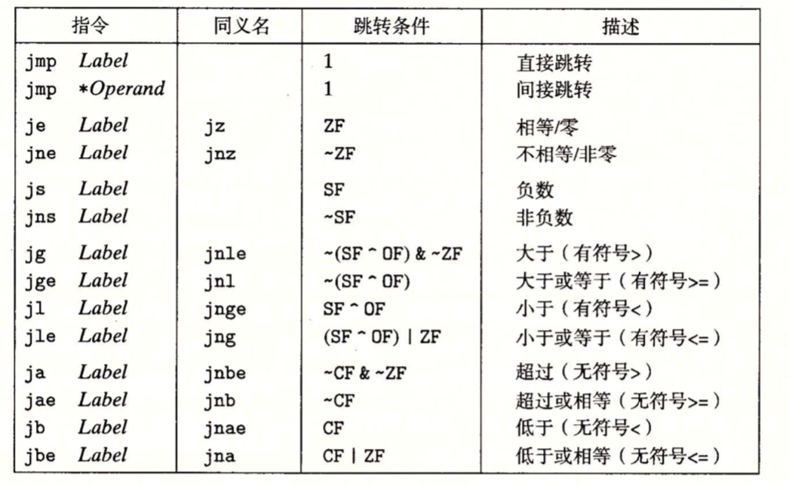

jmp指令是无条件指令。它可以是**直接跳转**，即跳转目标作为指令的一部分编码；也可以是**间接跳转**，即跳转目标是从寄存器或内存位置中读出。汇编语言中，直接跳转是给出一个标号作为目标，如：.L1，间接跳转是'*'后面跟一个操作数指示符。如用寄存器%rax中的值作为跳转目标：jmp *%rax，或者用%rax中的值作为读地址，从内存中读出跳转目标：jmp *(%rax)。

跳转指令的目的地址的编码常用PC相对寻址，即它们会将目标指令的地址与紧跟在跳转指令后面那条指令的之间的差作为编码。

如下是一个PC相对寻址的例子，第2行的jmp指令向前跳转到更高的地址，第7行的jg向后跳转到较低的地址：

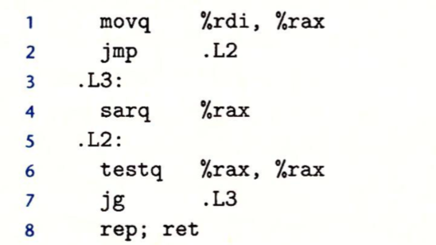

然后对汇编器产生的".o"格式的反汇编如下：

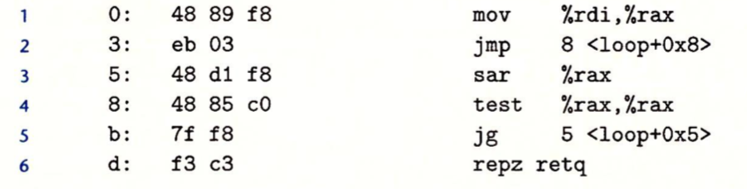

如上，右边汇编器产生的注释中，第2行的跳转目标地址为0x8，第5行的跳转目标地址是0x5。观察左侧的字节编码，会看到第2行的目标地址是0x03,把它加上0x05就是下一条指令的地址，也就是第4行指令的地址，这同时也说明了，**当执行PC相对寻址时，程序计数器的值是跳转指令后面的那条指令的地址，而不是跳转指令本身**。

#### 用条件控制来实现条件分支

C语言中if-else语句的通用形式模版如下：

```
if(test-expr)
	then-statement
else
	else-statement
```

这里的test-expr是一个整数表达式，它取值为0(“假”)或者非0("真")。两个分支语句中只会执行一个。对于这种通用形式，汇编实现通常使用下面这种形式：

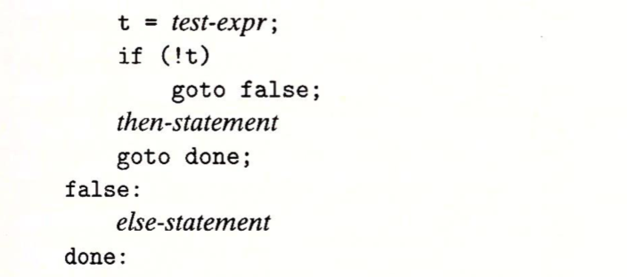

如下示例：

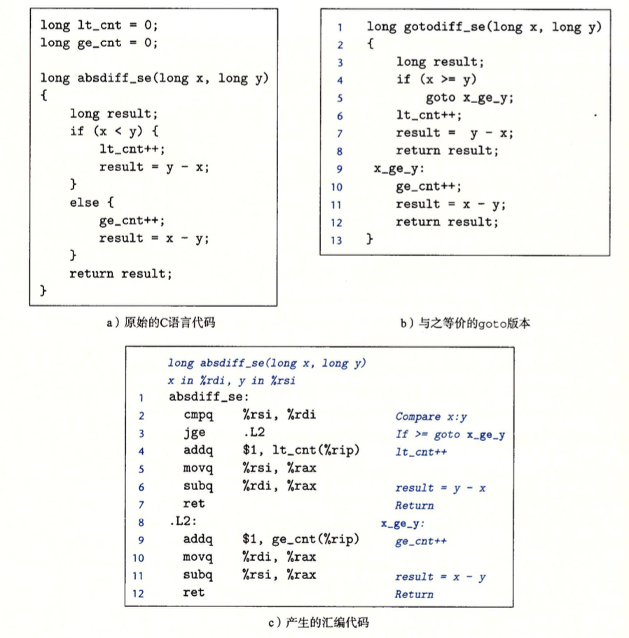

如上c图的汇编代码实现，第2行首先比较了两个操作数的大小，设置条件码，如果x大于或者等于y，那么它就会跳转到第8行。

#### 用条件传送来实现条件分支

使用条件控制来实现条件转移是传统的方法，当条件满足时，程序沿着一条执行路径执行，而当条件不满足时，就走另一条路径。这种机制简单而通用，但是在现代处理上，它可能会非常低效。一种替代的策略是使用数据的条件转移。

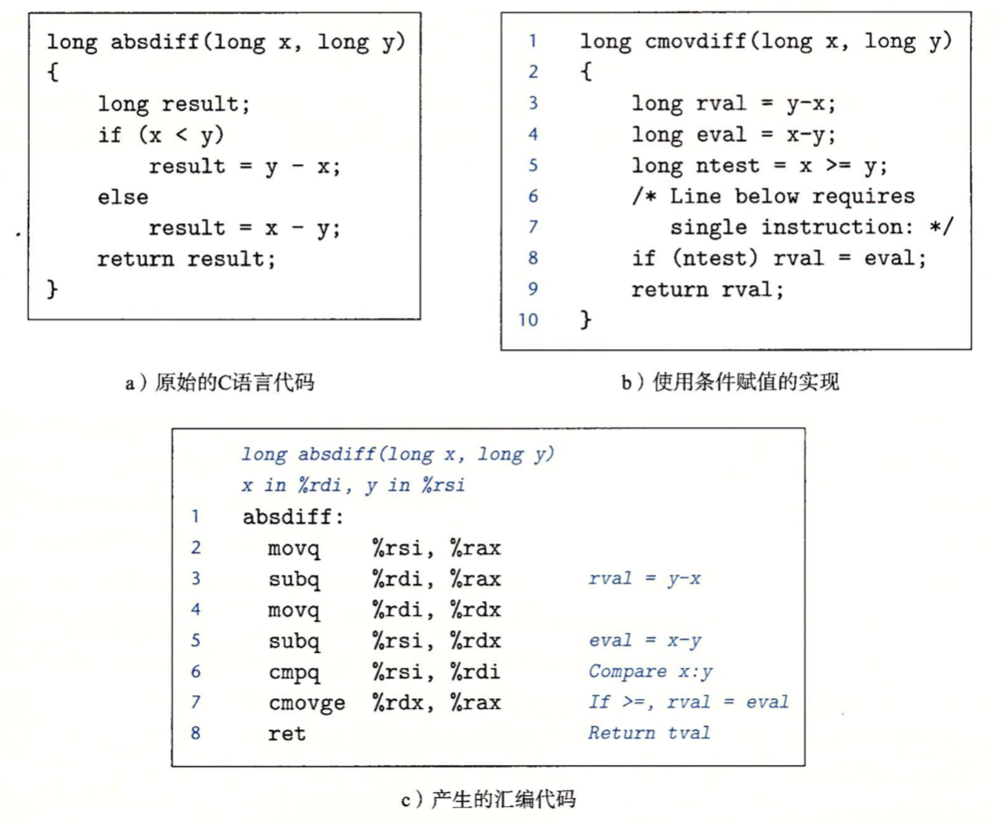

如上c图是用条件传送实现条件分支的汇编代码，b图是模拟c图的实现，具有相同的逻辑。汇编代码的那条cmove指令(第7行)实现了b图中的第8行的条件赋值。只有当第6行的cmpq 指令表明一个值大于等于另一个值时，汇编指令8才会把源数据寄存器传送到目的地。

为什么基于条件传送的代码会比基于条件控制转移的代码性能更好？因为如果基于条件控制转移，处理器采用分支预测逻辑来猜测没跳跳转指令是否会执行，如果错误预测了一个跳转，要求处理器丢掉它为该跳转指令后所有指令以做的工作，这样一个错误的预测会浪费大约15～30个时钟周期，导致程序性能严重下降。

如下是x86-64上一些可用的条件传送指令，每条指令有两个操作数：源寄存器或内存地址S，和目的寄存器 R。源值可以从内存或者寄存器中读取，但是只有在指定的条件满足时，才会被复制到目的寄存器中。源和目的的值可以是16位、32位或64位，不支持单字节的条件传送。

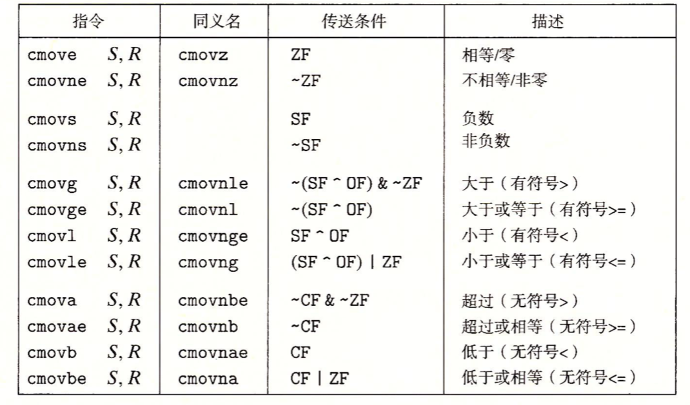

### 循环

对于循环结构，在汇编中没有相应的指令存在，可以用条件测试和跳转组合起来实现循环的效果。

#### do-while

do-while 语句的通用形式如下：

```
do 

	body-statement

	while(test-expr);
```

这个循环的效果就是重复执行body-statement，对test-expr求值，如果求值的结果为非零，就继续循环。可以看到,body-statement至少会执行一次。

do-while翻译成条件和goto语句如下：

```
loop:
	body-statement
	t = test-expr;
	if(t)
		goto loop
```

也就是说，每次循环，程序会执行循环体里的语句，然后执行测试表达式，如果测试为 真，就回去再执行一次循环。

如下示例：

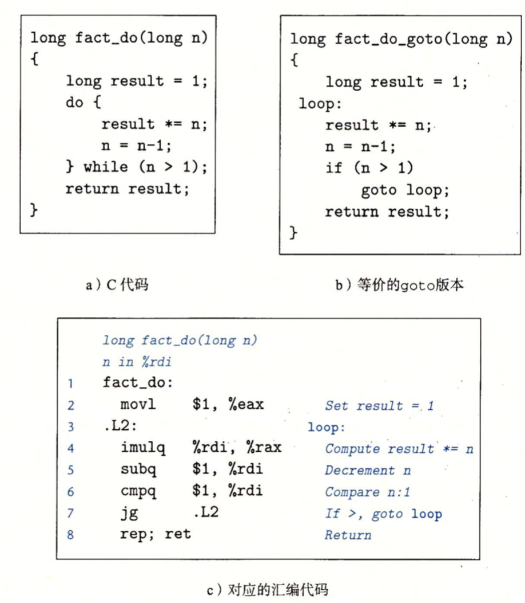

#### while循环

while语句的通用形式如下：

```
while(text-expr)
	body-statement
```

与do-while的不同之处在于，在第一次执行body-statement之前，它会对test-expr求值，循环有可能就终止了。

有很多种方式将while循环翻译成机器代码：

1）第一种：跳转中间，它执行一个无条件跳转跳到循环结尾处的测试，以此来执行初始的测试：

```
	goto test:
loop:
	body-statement
test:
	t = test-expr;
	if(t)
		goto loop;
```

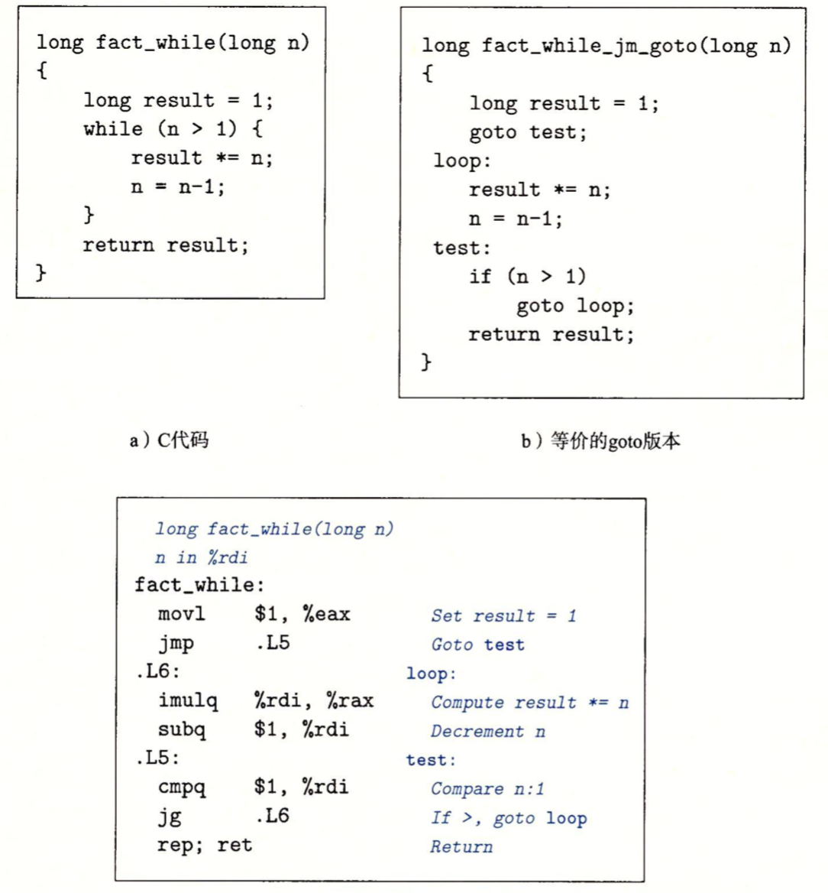

2）第二种方式：首先使用条件分支，如果初始条件不成立就跳过循环，把代码变换为do-while循环,，利用这种实现策略，编译器常常可以优化初始的测试，假如认为测试条件总是满足。

把通用的while循环翻译成do-while循环如下：

```
t = test-expr;
if(!t)
	goto done
do
	body-statement
	while(test-expr)
done:	
```

相应的，还可以把它翻译成goto代码：

```
t = test-expr
if(!t)
	goto done;
loop:
	body-statement
	t = test-expr;
	if(t)
		goto loop;
done:		
```


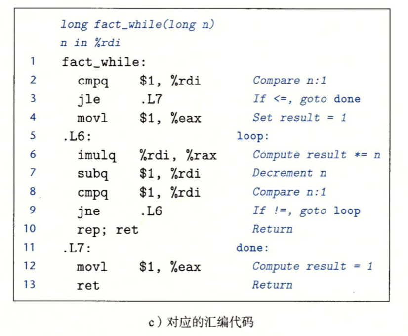

