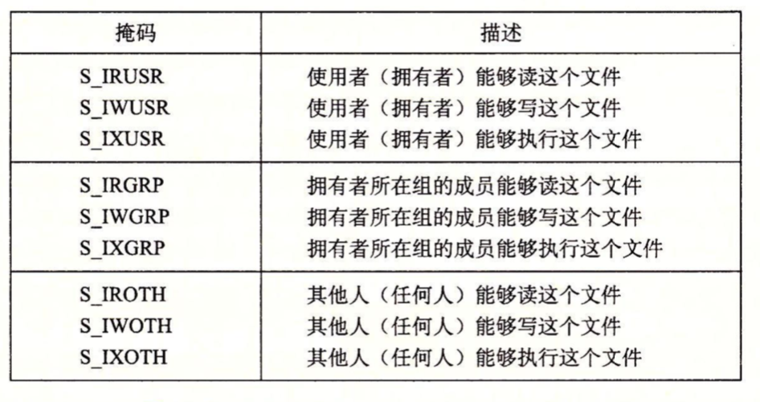
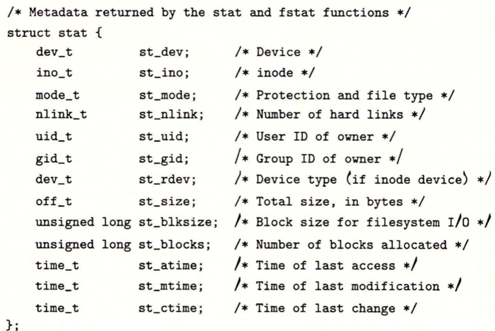
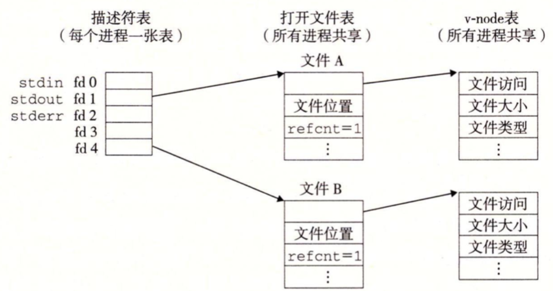
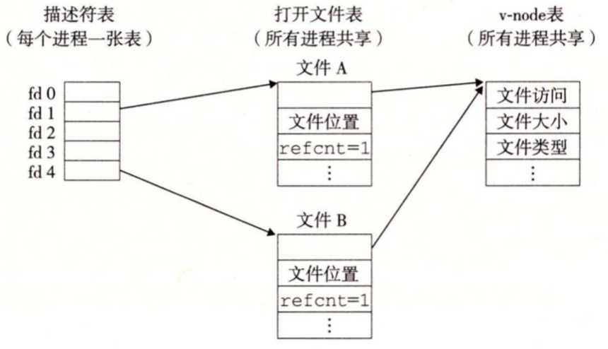
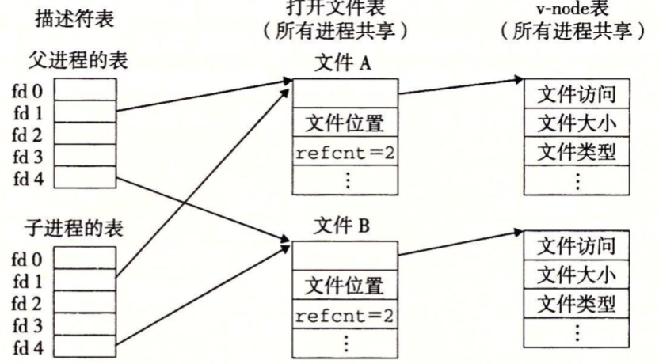

输入/输出(I/O)是在主存和外部设备(例如磁盘驱动器、终端)之间复制数据的过程。输入操作是从I/O设备复制数据到主存，而输出操作是从主存复制数据到I/O设备。

### Unix I/O

所有的I/O设备（例如网络、磁盘和终端）都被模型化文件，而所有的输入和输出都被当作相应文件的读和写来执行。

* 打开文件。一个应用程序通过要求内核打开相应的文件，来宣告它想要访问一个I/O设备。内核返回一个小的非负整数，叫做描述符，它在后续对此文件的所有操作中标识这个文件。内核记录有关这个打开文件的所有信息。应用程序只需要记住这个描述符。
* Linux shell创建的每个进程开始时都有三个打开的文件：标准输入(描述符为0)、标准输出(描述符1)和标准错误(描述符2)。头文件<unistd.h>定义了常量STDIN_FILENO、STDOUT_FILENO和STDERR_FILENO，它们可用来代替显式的描述符值。
* 改变当前的文件位置。对于每个打开的文件，内核保持着一个文件位置k，初始为0。应用程序能够通过执行seek操作，显式地设置文件的当前位置为k。
* 读写文件。一个读操作就是从文件复制n>0个字节到内存，从当前文件位置k开始，然后将k增加到k+n。给定一个大小为m字节的文件，当k>m时执行读操作会触发一个称为end-of-file(EOF)的条件，应用程序能检测到这个条件。类似地，写操作就是从内存复制n>0个字节到一个文件，从当前文件位置k开始，然后更新k。
* 关闭文件。当应用完成了对文件的访问之后，它就通知内核关闭这个文件。

### 文件

每个Linux文件都有一个类型(type)来表明它在系统中的角色：

* 普通文件（regular file）包含任意数据。应用程序常常要区分文本文件(text file)和二进制文件(binary file)，文本文件是只包含有ASCII或Unicode字符的普通文件；二进制文件是所有其他的文件。对内核而言，文本文件和二进制文件没有区别。Linux文本文件包含了一个文本行(text line)序列，其中每一行都是一个字符序列，以一个新行符("\n")结束。新行符与ASCII的换行符(LF)是一样的，其数字值为0x0a。
* 目录(directory)是包含一组链接(link)的文件，其中每个链接都将一个文件名(filename)影射到一个文件，这个文件可能是另一个目录。
* 套接字(socket)是用来与另一个进程进行跨网络通信的文件。

### 打开和关闭文件

进程是通过调用open函数来打开一个已经存在的文件或者创建一个新文件：

```c
#include <sys/stat.h>
#include <fcntl.h>
#include <stdio.h>
//若成功则返回文件描述符，若出错返回-1
int open(char *filename,int flags,mode_t mode);
```

open函数将filename转换成一个文件描述符，并且返回描述符数字。flags参数指明了进程打算如何访问这个文件：

* O_RDONLY：只读。
* O_WRONLY：只写。
* O_RDWR：可读可写。

例如，下面的代码以读的方式打开一个已经存在的文件：

```C
int fd = open("foo.txt",O_RDONLY,0);
```

flags参数也可以多个条件以“或”的形式来组成：

* O_CRETE：如果文件不存在，就创建一个空的文件。
*  O_TRUNC：如果文件已经存在，就截断它。
* O_APPEND：在每次写操作之前，设置文件位置到文件的结尾处。

如下面例子，打开一个已经存在的文件，并在后面添加一些数据：

```c
int fd = open("foo.txt", O_WRONLY|O_APPEND,0);
```

mode参数指定文件的访问权限位。这些位的符号名字如下：



> 系统中各种文件的权限设置对特定用户的数据安全有很大影响。但是要求用户逐一明确设置系统中每个文件的权限也是不现实的，为此，需要使用umask命令，该命令可以为用户账号中新文件的创建进行缺省设置。系统管理员必须要为你设置一个合理的u
>  m a s 
> k值，以确保你创建的文件具有所希望的缺省权限，防止其他非同组用户对你的文件具有写权限。具体来说，umask是用来设置权限掩码的，权限掩码由3个数字组成，将现有的存取权限减掉权限掩码后，即可产生建立文件时默认的权限

每一个进程都有一个umask，它是通过调用umask函数来设置的。当进程通过带某个mode参数的open函数调用来创建一个新文件时，文件的访问权限被设置为mode & ~umask。

close函数，关闭一个打开的文件：

```c
#include <unistd.h>
int close(int fd);//关闭一个已经关闭的描述符会出错
```

### 读和写文件

```c
#include <unistd.h>
//若成功则为读的字节数，若EOF则为0，若出错则为-1
ssize_t read(int fd,void *buf,size_t n);
//若成功则为写的字节数，否则出错则为-1
ssize_t write(int fd,const void *buf,size_t n);
```

read函数从描述符为fd的当前文件位置复制最多n个字节到内存位置buf。返回值为-1表示一个错误，而返回值0表示EOF。否则，返回值表示的是实际传送的字节数量。

write函数从内存位置buf复制至多n个字节到描述符fd的当前文件位置。如下是一个例子，read和write调用一次一个字节从标准输入复制到标准输出。

```c
#include <sys/types.h>
#include <sys/stat.h>
#include <fcntl.h>
#include <stdio.h>

#include <unistd.h>
#include <stdlib.h>
//int open(char *filename,int flags,mode_t mode);

int main(int argc, const char * argv[]) {
    
    //int fd = open("foo.txt",O_RDONLY,0);
    //int fd = open("foo.txt", O_WRONLY|O_APPEND,0);
    
    //ssize_t read(int fd,void *buf,size_t n);
    //ssize_t write(int fd,const void *buf,size_t n);
    
    char c;
    
    while(read(STDIN_FILENO, &c, 1) != 0)
        write(STDOUT_FILENO, &c, 1);
    exit(0);
    //return 0;
}
```

在某些情况下，read和write传送的字节比应用程序要求的少，这些不足值(short count)不表示有错误。出现这些情况的原因有：

* 读时遇到EOF。假设我们现在要读一个文件，该文件从当前文件位置开始只有20多个字节，而我们以50个字节的片进行读取，这样以来，下一个read返回的不足值为20，此后的read将通过返回不足值0来发出EOF信号。
* 从终端读取文本行。如果打开的文件是与终端相关联的（如键盘、显示器），那么每个read函数将一次传送一个文本行，返回的不足值等于文本行的大小。
* 读和写网络套接字(socket)：如果打开的文件对应于套接字，那么内部缓冲约束和较长的网络延迟会引起read和write返回值不足。

### 用RIO包健壮地读写

RIO(Robust I/O，健壮的I/O包)，它会自动为你处理上文中所述的不足值。它提供了两类不同的函数：

* 无缓冲的输入输出函数。这些函数直接在内存和文件之间传送数据，没有应用级缓冲。
* 带缓冲的输入函数。这些函数允许你高效地从文件中读取文本行和二进制数据，这些文件的内容缓存在应用级缓冲区内。

#### RIO 的无缓冲的输入输出函数

通过调用rio_readn和rio_writen函数，应用程序可以在内存和文件之间直接传送数据。

```c
ssize_t rio_readn(int fd, void *usrbuf, size_t n){
    
    size_t nleft = n;
    ssize_t nread;
    char *bufp = usrbuf;
    
    while(nleft > 0){
        if((nread = read(fd, bufp, nleft)) < 0){
            if(errno == EINTR){
                nread = 0;
            }else{
                return -1;
            }
        }else if(nread == 0){
            break;
        }
        
        nleft -= nread;
        bufp += nread;
    }
    return (n - nleft);
}


ssize_t rio_writen(int fd, void *usrbuf, size_t n){
    
    size_t nleft = n;
    ssize_t nwritten;
    char *bufp = usrbuf;
    
    while (nleft > 0) {
        if((nwritten = write(fd, bufp, nleft)) <= 0){
            if(errno == EINTR){
                nwritten = 0;
            }else{
                return -1;
            }
        }
        
        nleft -= nwritten;
        bufp += nwritten;
    }
    
    return n;
}
```

rio_readn函数从描述符fd的当前文件位置最多传送n个字节到内存位置usrbuf。类似的，rio_writen函数从位置usrbuf传送n个字节到描述符fd。rio_read函数在遇到EOF时，只能返回一个不足值。rio_writen函数决不会返回不足值。对同一个描述符，可以任意交错地调用rio_readn和rio_writen。

#### RIO的带缓冲的输入函数

假设我们要编写一个程序来计算文本文件中文本行的数量，一种方法就是用read函数来一次一个字节地从文件传送到用户内存，检查每个字节来查找换行符。这个方法的缺点是效率不是很高，每次读取文件中的一个字节都要求陷入内核。

一种更好的方法是从一个内部读缓冲区复制一个文本行，当缓冲区变空时，会自动地调用read函数重新填满缓冲区。

读缓冲区的格式：

```c
#define RIO_BUFSIZE 8192
//数据结构
typedef struct{
    int rio_fd;//文件描述符
    int rio_cnt;//读缓冲区中未读的字节数
    char *rio_bufptr;//读缓冲区中下一个被读字节地址
    char rio_buf[RIO_BUFSIZE];//缓存数组
}rio_t;
```

rio_readinitb函数创建了一个空的读缓冲区，并且将一个打开的文件描述符和这个缓冲区联系起来。

```c
void rio_readinitb(rio_t *rp,int fd){
    rp -> rio_fd = fd;
    rp -> rio_cnt = 0;//初始化缓冲区中未读字节数
    rp -> rio_bufptr = rp -> rio_buf;//初始化读指针
}
```

rio_read函数是Linux read函数的带缓冲的版本，如果缓冲区为空，那么会通过调用read填满它，一旦缓冲区非空，rio_read就从读缓冲区复制n和rp.rio_cnt中较小值个字节到用户缓冲区，并返回复制的字节。

```c
static ssize_t rio_read(rio_t *rp, char *usrbuf, size_t n){
    int cnt;
    while (rp->rio_cnt <= 0) {//如果缓冲区已空，重新从读取数据到内存中
        //读取字节到缓冲区中
        rp->rio_cnt = read(rp->rio_fd, rp->rio_buf,
                           sizeof(rp->rio_buf));
        if(rp->rio_cnt < 0){
            if(errno == EINTR)//中断
                return -1;
        }else if(rp->rio_cnt == 0){//eof，没有数据
            return 0;
        }else{
            rp->rio_bufptr = rp->rio_buf;//重置读取缓存的标志位
        }
    }
    
    cnt = n;
    if(rp->rio_cnt < n)
        cnt = rp->rio_cnt;//取cnt和n的最小值
    memcpy(usrbuf,rp->rio_bufptr,cnt);//从bufptr位置开始，复制cnt个字节到rio_buf
    rp->rio_bufptr += cnt;//指针地址增加
    rp->rio_cnt -= cnt;//未读字节数减少
    return cnt;//返回复制的字节数
}
```

rio_readline函数从文件rp读出下一个文本行，将它复制到内存位置usrbuf。

```c
ssize_t rio_readline(rio_t *rp,void *usrbuf,size_t maxlen){
    int n,rc;
    char c,*bufp = usrbuf;
    for(n = 1; n < maxlen; n++){
        //每次读取一个字节
        if((rc = rio_read(rp,&c,1)) == 1){
            *bufp ++ = c;
            if(c == '\n'){//换行符，一行读取完了
                n++;
                break;
            }else if(rc == 0){
                if(n == 1)
                    return 0;//eof,没有数据
                else
                    break;//缓存数据已经读取完了
            }else
                return -1;//error 
        }
    }
    *bufp = 0;
    return n-1;//读取了多少个字节
}
```

rio_readnb函数从文件rp最多读取n个字节到内存位置usrbuf。

```c
ssize_t rio_readnb(rio_t *rp,void *usrbuf,size_t n){
    
    size_t nleft = n;
    ssize_t nread;
    char *bufp = usrbuf;
    while (nleft > 0) {
        if((nread == rio_read(rp,bufp,nleft)) < 0)
            return -1;//error
        else if(nread == 0)
            break;//eof
        nleft -= nread;//还剩下多少没有读取
        bufp += nread;//增加指针i地址
    }
    
    return (n - nleft);//返回读取了多少个字节
}
```

#### 读取文件元数据

应用程序能够通过stat和fstat函数，检索到关于文件的信息(元数据(metadata))。

```c
#include <unistd.h>
#include <sys/stat.h>

int stat(const char *filename,struct stat *buf);
int fstat(int fd,struct stat *buf);
```

如下是stat数据结构中的各个成员：



st_size包含了文件的字节数大小，st_mode编码了文件访问许可位和文件类型。Linux在sys/stat.h中定义了宏谓词来确定st_mode的文件类型：

* S_ISREG(m)，是否是一个普通文件。
* S_ISDIR(m)，是否是一个目录文件。
* S_ISSOCK(m)，是否是一个网络套接字。

```c

#include <stdio.h>
#include <unistd.h>
#include <sys/stat.h>

#include <sys/types.h>
#include <dirent.h>
#include <stdlib.h>
int main(int argc, const char * argv[]) {
   
    struct stat stat1;
    char *type,*readok;
    
    stat(argv[1], &stat1);
    
    if (S_ISREG(stat1.st_mode)) {
        type = "regular";
    }else if(S_ISDIR(stat1.st_mode)){
        type = "directory";
    }else{
        type = "other";
    }
    
    if((stat1.st_mode & S_IRUSR)){
        readok = "yes";
    }else{
        readok = "no";
    }
    
    printf("type:%s,read:%s\n",type,readok);
    exit(0);
}
```


### 读取目录内容

应用程序可以用readdir函数来读取目录的内容。

```c
#include <sys/types.h>
#include <dirent.h>

DIR *opendir(const char *name);
```

函数opendir以路径名为参数，返回指向目录流(directory stream)的指针，也就是目录项的列表。

```c
#include <dirent.h>

struct dirent *readdir(DIR *dirp);
```

每次对readdir的调用返回的都是指向流dirp中下一个目录项的指针，或者，如果没有更多目录项则返回NULL。每个目录项都是一个结构体：

```c
struct dirent{
    ino_t d_ino;
    char d_name[256];
};
```

虽然有些Linux版本包含其他的结构成员，但是只有这两个对所有系统来说都是标准的。成员d_name是文件名，d_ino是文件位置。如果出错，则readdir返回NULL，并设置errno。

```c
#include <dirent.h>
int closedir(DIR *dirp);
```

函数closedir关闭流并释放其所有的资源。

```c
#include <stdio.h>
#include <sys/types.h>
#include <dirent.h>
#include <stdlib.h>
#include <errno.h>

int main(int argc, const char * argv[]) {
   
    DIR *streamp;
    struct dirent *dep;
    streamp = opendir(argv[1]);
    
    errno = 0;
    while ((dep = readdir(streamp)) != NULL) {
        printf("Fount file:%s\n",dep->d_name);
    }
    if(errno != 0){
        printf("readdir error");
    }
    closedir(streamp);
    exit(0);
}
```

#### 共享文件

要想弄懂件共享，就得清楚Linux内核是如何表示打开的文件的。内核用三个相关的数据结构来表示打开的文件：

* 描述符表(descriptor table)：每个进程都有它独立的描述符表，它的表项是由进程打开的文件描述符来索引的。每个打开的描述符表项指向文件表中的一个表项。
* 文件表(file table)。打开文件的集合是由一张文件表来表示的，所有的进程共享这张表。每个文件表的表项组成包括当前文件的位置(读/写位置)、引用计数(reference conut)(即当前指向该表项的描述符表项数)，以及一个指向v-node表中对应表项的指针。关闭一个描述符会减少相应的文件表项中的引用计数。内核不会删除这个文件表表项，直到它的引用计数为零。
* v-node表(v-node table)：同文件表一样，所有的进程共享这张v-node表。每个表项包含stat结构中的大多数信息，包括st_mode和st_size。

如下图，描述符1和4通过不同的打开文件表项来引用两个不同的文件，没有共享文件，并且每个描述符对应一个不同的文件。



多个描述符也可以通过不同的文件表项来引用同一个文件。例如，如果以同一个filename调用open函数两次，就会发生这种情况。关键思想是每个描述符都有它自己的文件位置，所以对不同描述符的读操作可以从文件的不同位置获取数据。



父子进程共享文件，调用fork函数后，子进程有一个父进程描述符表的副本：




