###  虚拟内存

虚拟内存提供了三个重要的能力：1）它将主存看成是一个存储在磁盘上的地址空间的高速缓存，在主存中只保存活动区域，并根据需要在磁盘和主存之间来回传送数据，通过这种方式，它高效地使用了主存。2）它为每个进程提供了一致的地址空间，从而简化了内存管理。3）它保护了每个进程的地址空间不被其他进程破坏。

#### 物理和虚拟寻址

计算机系统的主存被组织成一个由M个连续的字节大小的单元组成的数组。每个字节都有一个唯一的**物理地址**，比如第一个字节的地址是0，接下来的字节地址为1，依次类推。给定这种简单的结构，CPU访问内存的最自然的方式就是使用物理地址，我们把这种方式称为**物理寻址**

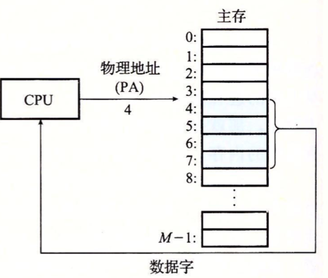

如上图的上下文是一条加载指令，它读取从物理地址4处开始的4字节。当CPU执行这条加载指令时，会生成一个有效物理地址，通过内存总线，把它传递给主存。主存取出物理地址4处开始的4字节，并将它返回给CPU，CPU会将它放在一个寄存器里。

早期的PC使用物理寻址，现代处理器使用的是一种称为**虚拟寻址**的寻址形式。

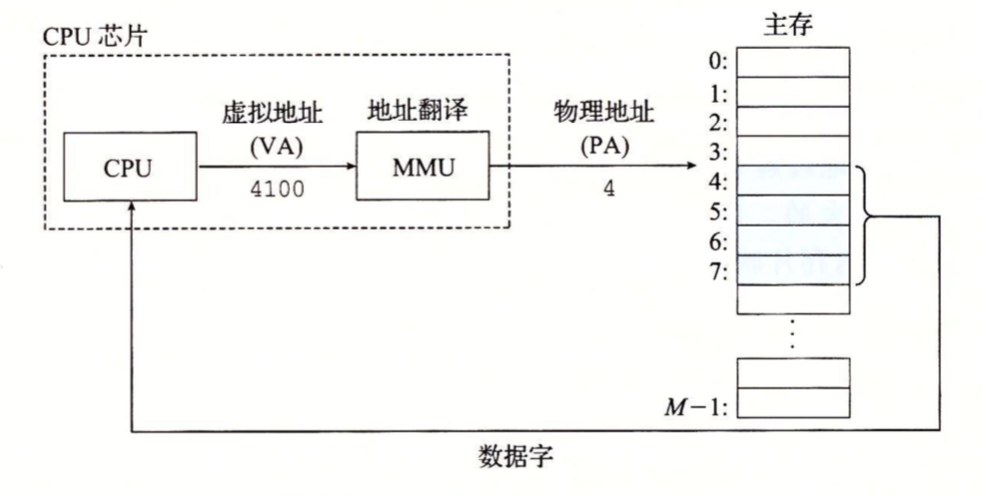

使用虚拟寻址，CPU通过生成一个**虚拟地址**来访问主存，这个虚拟地址在被送到内存之前先转换成适当的物理地址。将一个虚拟地址转换成物理地址的任务叫做**地址翻译**。CPU芯片上叫做**内存管理单元**的专用硬件，利用存放在主存中的**查询表**来动态反映虚拟地址，该表的内容由操作系统管理。

#### 地址空间

地址空间是一个非负整数地址的有序集合：```{0,1,2…}```，如果地址空间中的整数是连续的，那么我们说它是一个**线性地址空间**。在一个带虚拟内存的系统中，CPU从一个有N=2$^n$个地址的地址空间中生成**虚拟地址**，这个地址空间称为**虚拟地址空间**：```{0,1,2,…,N-1}```。

一个地址空间的大小是由表示最大地址所需要的位数来描述的。例如，N=2$^n$个地址的虚拟地址空间就叫做一个n位的地址空间。现代系统通常支持32位或64位虚拟地址空间。

一个系统还有一个物理地址空间，对应系统中物理内存的M个字节：```{0,1,2…,M-1}```。

主存中的每个字节都有一个选自虚拟地址空间的虚拟地址和一个选自物理地址空间的物理地址。

#### 虚拟内存作为缓存的工具

概念上，**虚拟内存**被组织为一个由存放在磁盘上的N个连续的字节大小的单元组成的数组。每个字节都有一个唯一的虚拟地址，作为到数组的索引。磁盘上数组的内容被缓存在主存中，磁盘上的数据被分割成**块**作为磁盘和主存之间的传输单元。VM(虚拟机)通过将虚拟内存分割为称为**虚拟页**(Virtual Page，VP)的大小固定的块来处理这个问题。每个虚拟页的大小为P=2$^p$字节。类似的，物理内存被分割为**物理页**(Physical Page，PP)，大小也为P字节(物理页也被称为**页帧**)。

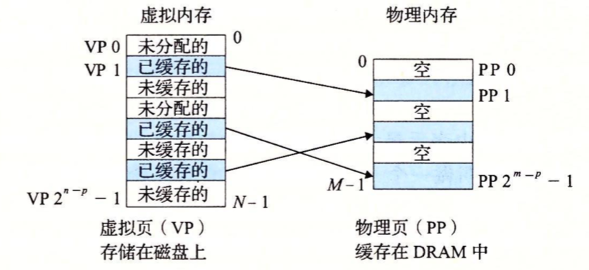

如上图，在任意时刻，虚拟页面的集合都分为三个不相交的子集：

* 未分配的：vm系统还未分配的页。未分配的块没有任何数据和它们相关联，因此也就不占用任何磁盘空间。
* 缓存的：当前已缓存在物理内存中的已分配页。
* 未缓存的：未缓存在物理内存中的已分配页。

**DRAM缓存的组织结构**

在存储层次结构中，DRAM缓存的位置对它的组织结构有很大的影响。因为DRAM缓存不命中，需要由磁盘来服务，而磁盘要比DRAM慢大约100 000倍。而其，从磁盘的一个扇区读取第一个字节的时间开销比起读这个扇区中连续的字节要慢大约100 000倍(随机读和连续读)。

因为DRAM不命中和访问第一个字节的开销，虚拟页往往很大，通常4KB~2MB。DRAM缓存总是使用写回，而不是只写(对磁盘访问时间很长)。

**页表**

虚拟内存系统必须有某种方法来判断一个虚拟页是否缓存在DRAM中的某个地方。如果是，系统还必须确定这个虚拟页放在哪个物理页中。如果不命中，系统必须判断这个虚拟页放在磁盘的哪个位置，然后在物理内存中选择一个牺牲页，将虚拟页从磁盘复制到DRAM中，替换掉这个牺牲页。

**页表**存放在物理内存中，将虚拟页映射到物理页。每次**地址翻译硬件**(存放在内存管理单元(MMU))将一个虚拟地址转换成为物理地址时，都会读取页表。**操作系统**负责维护页表的内容，以及在磁盘和DRAM之间来回传送页。

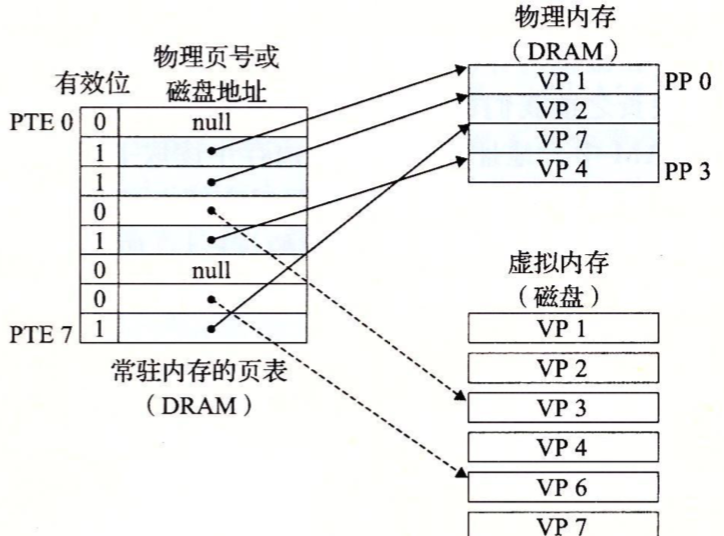

如上图，页表就是一个页表条目(Page Table Entry，PTE)的数组。我们假设每个PTE是由一个**有效位**和一个n位**地址字段**组成的，有效位表明了该虚拟页当前是否被缓存在DRAM中。如果设置了有效位，那么地址字段就表示DRAM中相应的物理页的起始位置。如果没有设置有效位，那么以恶搞空地址表示这个虚拟页还未被分配，否则，这个地址就指向该虚拟页在磁盘上的起始位置。

**页命中**

假如CPU想要读取VP2中的VP2。地址翻译硬件将虚拟地址作为索引来定位PTE2，并从内存中读取它。因为设置了有效位，那么地址翻译硬件就知道VP2已经缓存在内存中了。所以它使用PTE中的物理内存地址构造出这个字的物理地址。

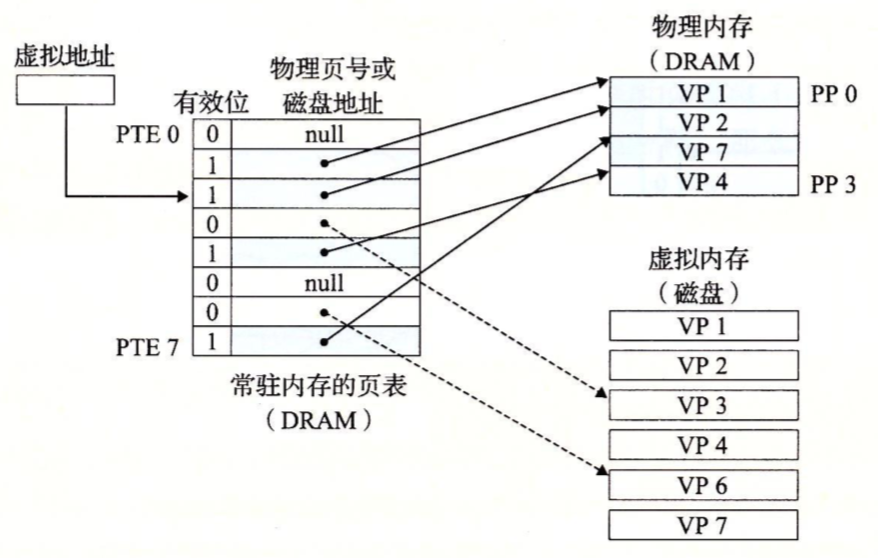

**缺页**

DRAM缓存不命中称为缺页。如下图，CPU引用VP3中的一个字，VP3并未缓存在DRAM中。地址翻译硬件从内存中读取PTE3，从有效位推断出VP3未被缓存，并且触发了一个缺页异常。缺页异常调用内核中的缺页异常处理程序，该程序会选择一个牺牲页，此例中就是存放在PP3中的VP4。如果VP4已经被修改了，那么内核就会将它复制回磁盘。

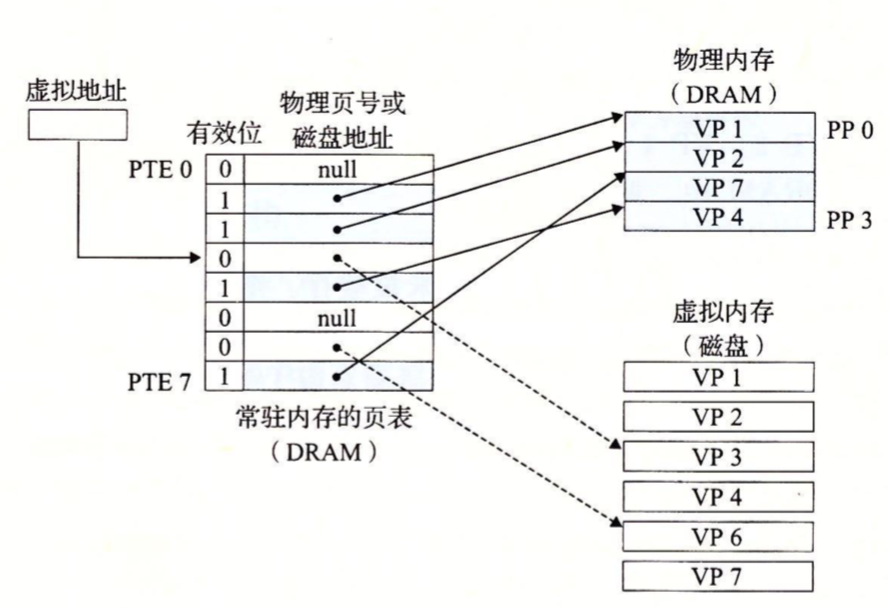

接下来，内核从磁盘复制VP3到内存中的PP3，更新PTE3，然后返回。当异常处理程序返回时，它会重新启动导致缺页的指令，该指令会把导致缺页的地址重发到地址翻译硬件。由于VP3已经缓存在主存中，那么页命中也能由地址翻译硬件正常处理了。


**局部性**

当我们了解虚拟内存的概念后，通常会觉得它的效率应该会非常低。因为不命中会重新从磁盘读取数据，效率会很低。实际上，虚拟内存工作的很好，这主要归功于**局部性**。

在程序运行过程中引用的不同页面总数可能超出物理内存的总大小，但是局部性原则保证了在任意时刻，程序将趋向于在一个较小的活动页面集合上工作，这个集合叫做**工作集**。


#### 虚拟内存作为内存管理的工具

操作系统为每个进程提供了一个独立的页表，因而也是一个独立的虚拟地址空间。注意多个虚拟页面可以映射到同一个共享物理页面上。

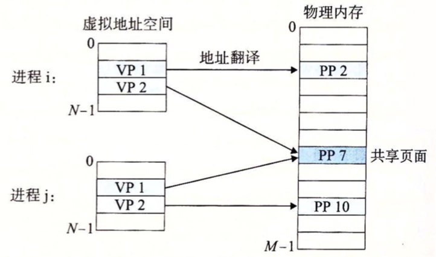

按需页面调度和独立的虚拟地址空间结合，对系统中内存的使用和管理造成了深远的影响。特别的，VM简化了链接和加载、代码和数据共享以及应用程序的内存分配。

* 简化链接。独立的空间允许每个进程的内存映像使用相同的基本格式，而不管代码和数据实际存放在物理内存的何处。
* 简化加载。虚拟内存还使得容易向内存加载可执行文件和共享对象文件。
* 简化共享。独立地址空间为操作系统提供了一个管理用户进程和操作系统自身之间共享的一致机制。
* 简化内存分配。虚拟内存为向用户进程提供一个简单的分配额外内存机制。

#### 虚拟内存作为内存保护的工具

任何现代计算机系统必须为操作系统提供手段来控制对内存系统的访问。不应该一个用户进程修改它的只读代码段。而且也不应该允许它读或者修改任何内核中的代码和数据结构。不应该允许它读或者写其他进程的私有内存，而且不允许它修改任何与其他进程共享的虚拟页面，除非所有的共享者都显式地允许它这么做。

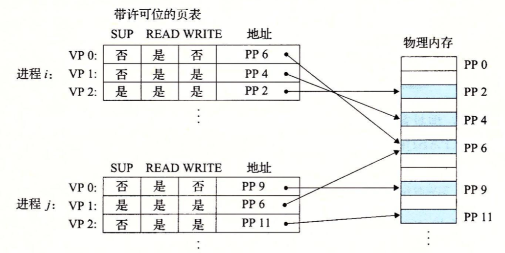

在上面这个例子中，每个PTE中已经添加了三个许可位。SUP位表示进程是否必须运行在内核模式下才能访问该页。运行在内核中的进程可以访问任何页面，但是运行在用户模式下的进程只能访问那些SUP为0的页面。READ位和WRITE位控制对页面的读和写访问。例如，如果进程i运行在用户模式下，那么它有读VP0和读写VP1的权限。然后它不允许访问VP2。

#### 地址翻译

地址翻译符号小结：

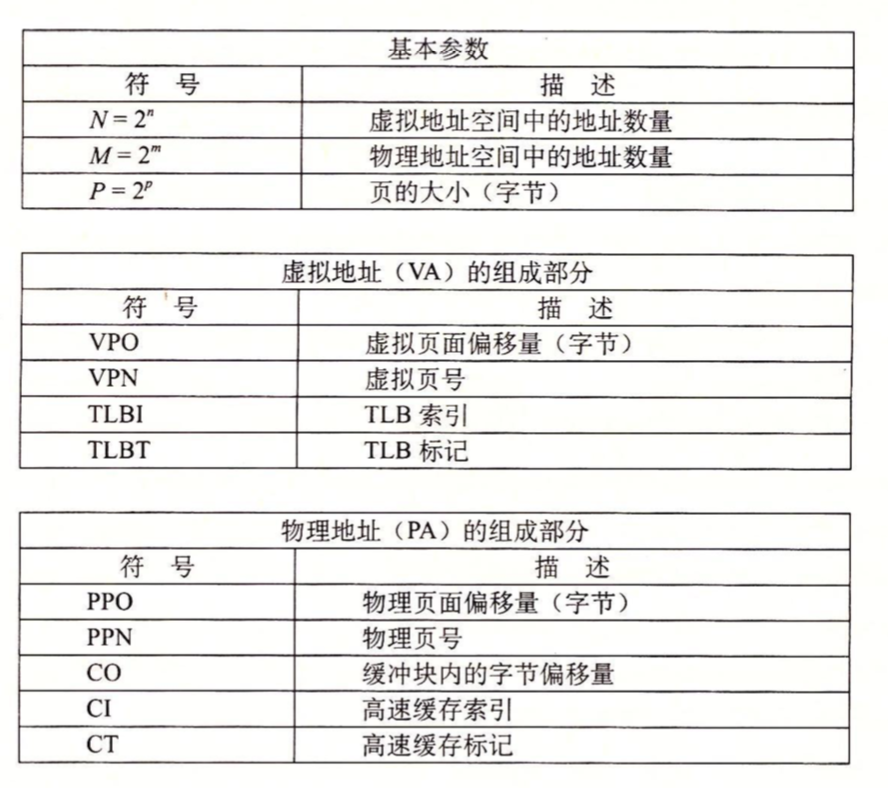

地址翻译是一个N元素的虚拟地址空间(VAS)中的元素和一个M元素的物理地址空间(PAS)中元素之间的映射。

如下图展示了MMU(地址翻译)如何利用页表来实现这种映射。CPU中一个控制寄存器，**页表基址寄存器**(Page Table Register，PTBR)指向当前页表。n位的虚拟地址包括两部分：一个P位的**虚拟页面偏移**(Virtual Page Offset，VPO)和一个(n-p)位的**虚拟页号**(Virtual Page Number，VPN)。

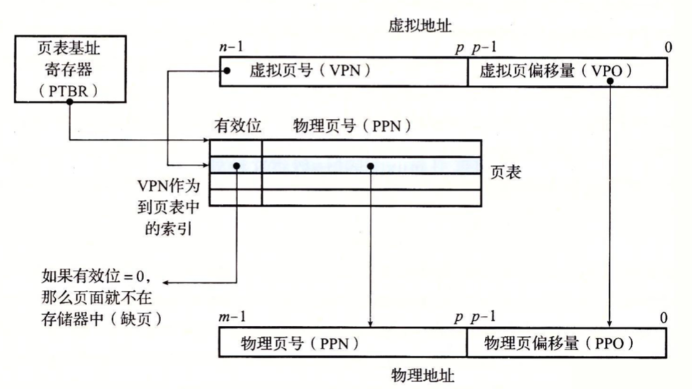

MMU利用VPN来选择适当的PTE。将页表中的物理页号(Physical Page Number，PPN)和虚拟地址中的VPO串联起来，就得到相应的物理地址(物理页面偏移(Physical Page Offset,PPO)和虚拟页偏移量是相同的)。

CPU硬件执行步骤：

* 第一步：处理器生成一个虚拟地址，并把它传送给MMU。
* 第二步：MMU生成PTE地址，并从高速缓存/主存请求得到它。
* 第三步：高速缓存/主存向MMU返回PTE。
* 第四步：MMU构造物理地址，并把它传送给高速缓存/主存。
* 第五步：高速缓存/主存返回所请求的数据给处理器。

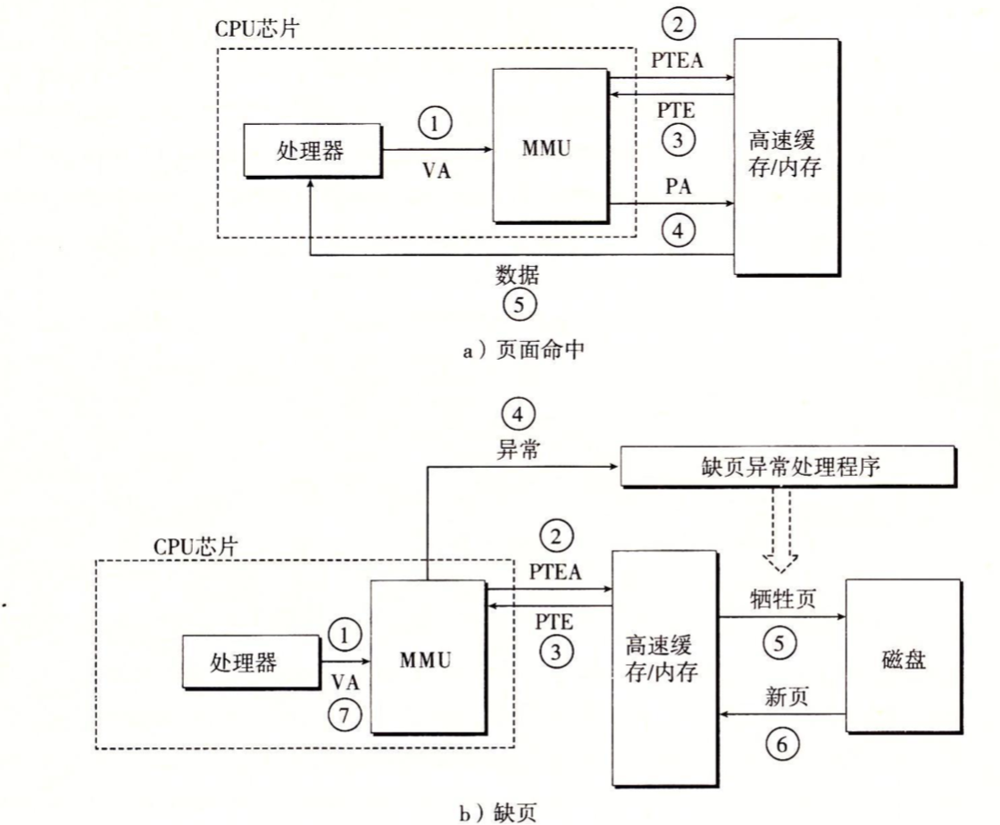


页面命中完全由硬件来处理的，与之不同，处理缺页要求硬件和操作系统内核协作完成。

* 第一步和第三步和命中缓存是一样的。
* 第四步：PTE中的有效位是零，所以MMU触发了一次异常，传递CPU中的控制到操作系统内核中的缺页异常处理程序。
* 第五步：缺页处理程序确定出物理内存中的牺牲页，如果这个页面已经被修改了，则把它换出到磁盘。
* 第六步：缺页处理程序页面调入新的页面，并更新内存中的PTE。
* 第七步：缺页处理程序返回到原来的进程，再次执行导致缺页的指令。CPU将引起缺页的虚拟地址重新发送给MMU。因为虚拟页面现在缓存在物理内存中，所以就会命中，主存就会将所有请求字返回给处理器。

#### 结合高速缓存和虚拟内存

在使用SRAM高速缓存的系统中，大多数系统选择物理寻址来访问SRAM高速缓存，即地址翻译发生在高速缓存查找之前。

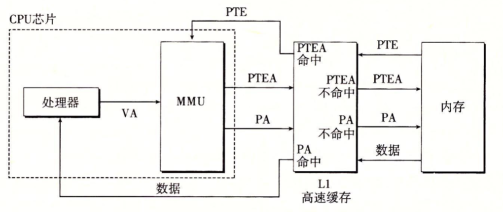

#### 利用TLB加速地址翻译

每次CPU产生一个虚拟地址，MMU就必须查询PTE，以便将虚拟地址翻译成物理地址。为了消除这样的开销，它们在MMU中包括了一个关于PTE的小缓存，称为**翻译后备缓冲器(Translation Lookaside Buffer，TLB)。

TLB是一个小的、**虚拟寻址的缓存**，其中每一行都保存着一个由单个PTE 组成的块。即虚拟地址中的VPN由PTE替换掉。

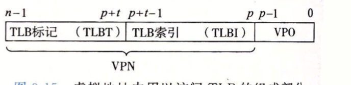

当TLB命中是的步骤，所有地址翻译都是在芯片上的MMU上执行的，所以速度非常快：

* 第一步：CPU产生一个虚拟地址。
* 第二步和第三步：MMU从TLB中取出相应的PTE。
* 第四步：MMU将这个虚拟地址翻译成一个物理地址，并将它发送到高速缓存/主存。
* 第五步：高速缓存/主存将所请求的数据字返回给CPU。

当TLB不命中时，MMU必须从L1缓存中取出相应的PTE，新取出的PTE存放在TLB中，可能会覆盖一个已经存在的条目。

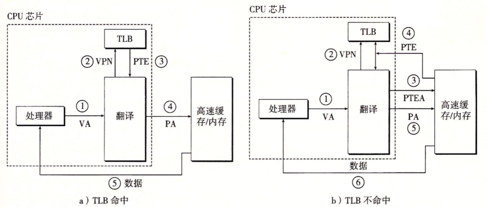

