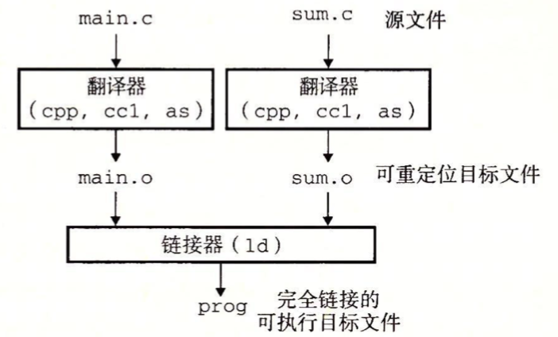
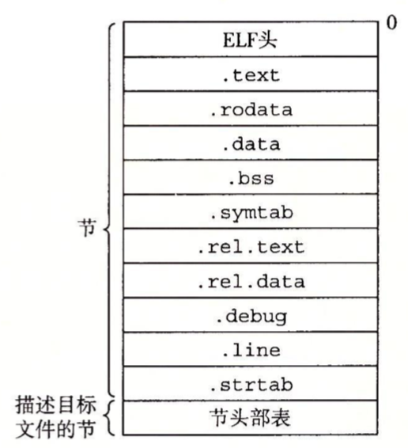

### 编译器驱动程序

示例代码：

```c
//main.c
int sum(int * a,int n);

int array[2] = {1,2};

int main(int argc, const char * argv[]) {
    // insert code here...
    printf("Hello, World!\n");
    int val = sum(array, 2);
    return val;
}
//sum.c
int sum(int *a, int n){
    int i,s = 0;
    
    for(i = 0; i < n; i++){
        s += a[i];
    }
    return s;
}
```

大多数编译系统(GNU编译系统)提供编译器驱动程序（compiler driver），它的作用是提供用户所需要的调用语言预处理器、编译器、汇编器和链接器。如下图概括了驱动程序将示例程序从ASCII码源文件翻译成可执行文件的过程。



1）驱动程序运行C预处理器(cpp)，将源文件main.c翻译成一个ASCII码的中间文件main.i；

2）接下来，驱动程序运行C编译器(ccl)，它将main.i翻译成一个ASCII汇编语言文件main.s；

3）然后驱动程序运行汇编器(as)，main.s翻译成一个可重定位目标文件main.o。

4）最后运行链接器程序ld，将main.o和sum.o以及一些必要的系统文件组合起来，创建一个可执行目标文件prog。

###静态链接

像Linux LD 程序这样的静态链接器，以一组可重定位目标文件和命令行参数作为输入，生成一个完全链接的、可以加载和运行的可执行目标文件作为输出。

为了构造可执行文件，链接器必须完成两个主要任务：

* 符号解析(symbol resolution) 。目标文件定义和符号引用。每个符号对应于一个函数、一个全局变量或一个静态变量。符号解析的目的就是将每个符号引用和一个符号定义关联起来。
* 重定位(relocation)。编译器和汇编器生成从地址0开始的代码和数据节。链接器通过把每个符号定义与一个内存位置关联起来，从而重定位这些节，然后修改所有对这些符号的引用，使得它们执向这个内存位置。

### 目标文件

目标文件有三种形式：

* 可重定位目标文件。包含二进制代码和数据，其形式可以再编译时与 其他可重定位目标文件合起来，创建一个可执行目标文件。
* 可执行目标文件。包含二进制代码和数据，其形式可以被直接复制到内存并执行。
* 可共享目标文件。一种特殊类型的可重定位目标文件，可以在加载或运行时被动态地加载进内存并链接。


### 可重定位目标文件

如下图是一个典型的ELF可重定位目标文件格式。ELF头以一个16字节的序列开始，这个序列描述了生成该文件的字的大小和字节顺序。ELF头剩下的部分包含帮助链接器语法分析和解释目标文件的信息。其中包括ELF头的大小，目标文件的类型(可重定位、可执行或共享的)、机器类型（如 x86-64）、节头部表的文件偏移，以及节头部表条目的大小和数量。

夹在ELF头和节头部表之间的都是节，不同节的位置和大小是由节头部表描述的。一个典型的ELF可重定位目标文件包含下面几个节：

* .text：已编译程序的机器代码。
* .rodata：只读数据，比如printf语句中的格式串和开关语句的跳转表。
* .data：已初始化的全局和静态C变量。局部C变量在运行时保存在栈中，既不出现在data节中，也不出现在bss节中。
* .bss：未初始化的全局和静态C变量，以及所有被初始化为0的全局或静态变量。在目标文件中这个节不占据实际空间，它仅仅是一个占位符。运行时，在内存中分配这些变量，初始值为0。
* .symtab：一个符号表，它存放程序中定义和引用的函数和全局变量的信息。
* .rel.text：一个text节中位置的列表，当链接器把这个目标文件和其他文件组合时，需要修改这些位置。
* .rel.data：被模块引用或定义的所有全局变量的重定位信息。
* .debug：一个调试符号表，其条目是程序中定义的局部变量和类型定义，程序中定义和引用的全局变量，以及原始的C源文件。只有以-g选项调用编译器驱动程序时，才会得到这张表。
* .line：原始C源程序中的行号和.text节中机器指令之间的映射。只有以-g选项调用编译器驱动程序时，才会得到这张表。
* .strtab：一个字符串表，其内容包括.symtab和.debug节中的符号表，以及节头部中的节名字。



### 符号和符号表

每个可重定位目标模块m都有一个符号表，它包含m定义和引用的符号信息。在链接器的上下文中，有三种不同的符号：

* 由模块m定义并能被其他模块引用的全局符号。全局链接器符号对应于非静态的C函数和全局变量。
* 由其他模块定义并被模块m引用的全局符号。这些符号称为外部符号，对应于在其他模块中定义的非静态C函数和全局变量。
* 只被模块m定义和引用的全局符号。它对应于带static属性的C函数和全局变量。这些符号在模块m中任何位置都可见，但是不能被其他模块引用。

.symtab中的符号表不包含对应于本地非静态程序变量的任何符号，这些符号在运行时在栈中被管理，链接器对此类符号不感兴趣。

