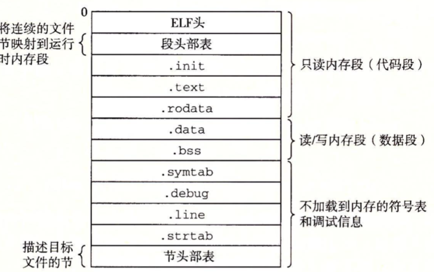

### 编译器驱动程序

示例代码：

```c
//main.c
int sum(int * a,int n);

int array[2] = {1,2};

int main(int argc, const char * argv[]) {
    // insert code here...
    printf("Hello, World!\n");
    int val = sum(array, 2);
    return val;
}
//sum.c
int sum(int *a, int n){
    int i,s = 0;
    
    for(i = 0; i < n; i++){
        s += a[i];
    }
    return s;
}
```

大多数编译系统(GNU编译系统)提供编译器驱动程序（compiler driver），它的作用是提供用户所需要的调用语言预处理器、编译器、汇编器和链接器。如下图概括了驱动程序将示例程序从ASCII码源文件翻译成可执行文件的过程。


1）驱动程序运行C预处理器(cpp)，将源文件main.c翻译成一个ASCII码的中间文件main.i；

2）接下来，驱动程序运行C编译器(ccl)，它将main.i翻译成一个ASCII汇编语言文件main.s；

3）然后驱动程序运行汇编器(as)，main.s翻译成一个可重定位目标文件main.o。

4）最后运行链接器程序ld，将main.o和sum.o以及一些必要的系统文件组合起来，创建一个可执行目标文件prog。

###静态链接

像Linux LD 程序这样的静态链接器，以一组可重定位目标文件和命令行参数作为输入，生成一个完全链接的、可以加载和运行的可执行目标文件作为输出。

为了构造可执行文件，链接器必须完成两个主要任务：

* 符号解析(symbol resolution) 。目标文件定义和符号引用。每个符号对应于一个函数、一个全局变量或一个静态变量。符号解析的目的就是将每个符号引用和一个符号定义关联起来。
* 重定位(relocation)。编译器和汇编器生成从地址0开始的代码和数据节。链接器通过把每个符号定义与一个内存位置关联起来，从而重定位这些节，然后修改所有对这些符号的引用，使得它们执向这个内存位置。

### 目标文件

目标文件有三种形式：

* 可重定位目标文件。包含二进制代码和数据，其形式可以再编译时与 其他可重定位目标文件合起来，创建一个可执行目标文件。
* 可执行目标文件。包含二进制代码和数据，其形式可以被直接复制到内存并执行。
* 可共享目标文件。一种特殊类型的可重定位目标文件，可以在加载或运行时被动态地加载进内存并链接。


### 可重定位目标文件

如下图是一个典型的ELF可重定位目标文件格式。ELF头以一个16字节的序列开始，这个序列描述了生成该文件的字的大小和字节顺序。ELF头剩下的部分包含帮助链接器语法分析和解释目标文件的信息。其中包括ELF头的大小，目标文件的类型(可重定位、可执行或共享的)、机器类型（如 x86-64）、节头部表的文件偏移，以及节头部表条目的大小和数量。

夹在ELF头和节头部表之间的都是节，不同节的位置和大小是由节头部表描述的。一个典型的ELF可重定位目标文件包含下面几个节：

* .text：已编译程序的机器代码。
* .rodata：只读数据，比如printf语句中的格式串和开关语句的跳转表。
* .data：已初始化的全局和静态C变量。局部非静态变量在运行时保存在栈中，既不出现在data节中，也不出现在bss节中；局部静态变量是不在栈中管理的，相反，编译器在.data或.bss中为每个定义分配空间，并在符号表中创建一个由唯一名字的本地链接器符号。
* .bss：未初始化的全局和静态C变量，以及所有被初始化为0的全局或静态变量。在目标文件中这个节不占据实际空间，它仅仅是一个占位符。运行时，在内存中分配这些变量，初始值为0。
* .symtab：一个符号表，它存放程序中定义和引用的函数和全局变量的信息。
* .rel.text：.text节中机器代码的位置列表，当链接器把这个目标文件和其他文件组合时，需要修改这些位置。
* .rel.data：被模块引用或定义的所有全局变量的重定位信息。一般而言，任何一初始化的全局变量，如果它的初始值是一个全局变量地址或者外部外部定义函数的地址，都需要被修改。
* .debug：一个调试符号表，其条目是程序中定义的局部变量和类型定义，程序中定义和引用的全局变量，以及原始的C源文件。只有以-g选项调用编译器驱动程序时，才会得到这张表。
* .line：原始C源程序中的行号和.text节中机器指令之间的映射。只有以-g选项调用编译器驱动程序时，才会得到这张表。
* .strtab：一个字符串表，其内容包括.symtab和.debug节中的符号表，以及节头部中的节名字。


### 符号和符号表

每个可重定位目标模块m都有一个符号表，它包含m定义和引用的符号信息。在链接器的上下文中，有三种不同的符号：

* 由模块m定义并能被其他模块引用的全局符号。全局链接器符号对应于非静态的C函数和全局变量。
* 由其他模块定义并被模块m引用的全局符号。这些符号称为外部符号，对应于在其他模块中定义的非静态C函数和全局变量。
* 只被模块m定义和引用的局部符号。它对应于带static属性的C函数和全局变量(包括static局部变量)。这些符号在模块m中任何位置都可见，但是不能被其他模块引用。

.symtab符号表不包含局部非静态变量的任何符号，这些符号在运行时在栈中被管理。

任何带有static 属性声明的全局变量或者函数都是模块私有的。类似的，任何不带static属性声明的全局变量和函数都是公开的，可以被其他模块访问。

本质上，符号表是一个数组，每个符号表项都是一个```Elf64_Symbol结构体```, 如下：

```c
typedef struct { 
    int   name;      /* String table offset */ 
    char  type:4,    /* Function or data (4 bits) */ 
    binding:4;       /* Local or global (4 bits) */ 
    char  reserved;  /* Unused */  
    short section;   /* Section header index */
    long  value;     /* Section offset or absolute address */ 
    long  size;      /* Object size in bytes */ 
} Elf64_Symbol; 
```

* name：符号名称，是字符串表中的字节偏移，指向符号的以null结尾的字符串名字。
* value：是符号的地址。对于可重定位的模块来说，value是距离定义目标的节的起始位置的偏移。对于可执行目标文件来说，该值是一个绝对运行时地址。
* size：目标的大小。
* type：通常要么时数据，要么是函数。
* binding：表示符号是本地还是全局的。
* section：每个符号都被分配到目标文件的某个节，由section字段表示，该字段也是一个到节头部表的索引。有三个特殊的伪节，它们在节头部表中是没有条目的：ABS代表不该被重定位的符号；UNDEF代表未定义的符号，也就是在本目标模块中引用，但却在其他地方定义的符号；COMMON表示还未被分配位置的未初始化的数据目标。

我们可以通过readelf程序来查看程序的可重定位目标文件main.o的符号表中的符号项：

```
readelf -s main.o
```


我们可以看到main定义的条目，它是一个位于.text节中偏移量为0处的24字节函数。其后跟随着的全局符号array的定义，它是一个位于.data节中偏移量为0处的8字节目标。最后一个条目来自对外部符号sum的引用。readelf用一个整数索引来标识每个节，Ndx=1表示.text，而Ndx=3表示.data节。

### 符号解析

链接器解析符号引用的方法是将每个引用与它输入的可重定位目标文件的符号表中的一个确定的符号定义关联起来。对那些和引用定义在相同模块中的局部符号的引用，符号解析是非常简单的。编译器只允许每个模块中每个局部符号有一个定义。静态局部变量也会有本地链接器符号，编译器还要确保它们拥有唯一的名字。

对全局符号的引用解析就难很多，当编译器遇到一个不是在当前模块中定义的符号时，会假设该符号是在其他某个模块中定义的，生成一个链接器符号表条目，并把它交给链接器处理。如果链接器在它的任何输入模块中都找不到这个被引用符号的定义，就输出一条错误信息并终止。如下，当链接器无法解析对foo的引用时，就会终止。

```c
void foo(void);
int main(){
    foo();
    return 0;
}
```

#### 链接器如何解析多重定义的全局符号

链接器的输入是一组可重定位目标模块。如果多个模块定义同名的全局符号，Linux编译系统采用的方法如下：

在编译时，编译器向汇编器输出每个全局符号，或者是强或者是弱，而汇编器把这个信息隐含地编码在可重定位目标文件的符号表里。函数和已经初始化的全局变量是强符号，未初始化的全局变量是弱符号。

根据强弱符号的定义，Linux链接器使用下面的规则来处理多重定义的符号名：

* 规则1：不允许有多个同名的强符号。
* 规则2：如果有一个强符号和多个弱符号同名，那么选择强符号。
* 规则3：如果有多个弱符号同名，那么从这些弱符号中任意选择一个。


### 重定位

一旦链接器完成了符号解析这一步，就把代码中的每个符号引用和正好一个符号定义关联起来。此时，链接器就知道它的输入目标模块中的代码节和数据节的确切大小。然后就可以开始重定位了，在这个步骤中，将合并输入模块，并为每个符号分配运行时地址。重定位由两步组成：

* 重定位节和符号定义。链接器将所有相同类型的节合并为同一类型的新的聚合节。例如，来自所有输入模块的.data节被全部合并成一个节，这个节成为输出的可执行目标文件的.data节。然后，链接器将运行时内存地址赋给新的聚合节，赋给输入模块定义的每个节，以及赋给输入模块定义哥的每个符号。当这一步完成时，程序中的每条指令和全局变量都有唯一的运行时内存地址了。
* 重定位节中的符号引用。在这一步中，链接器修改代码节和数据节中对每个符号的引用，使得它们指向正确的运行时地址。

#### 重定位条目

当汇编器生成一个目标模块时，它并不知道数据和代码最终将放在内存中的什么位置。它也不知道这个模块引用的任何外部定义的函数或者全局变量的位置。所以无论何时汇编器遇到对最终位置未知的目标引用，它会生成一个重定位条目，告诉链接器在将目标文件合并成可执行文件时如何修改这个引用。代码的重定位条目放在.rel.text中，已初始化数据的重定位条目放在.rel.data中。

如下展示了ELF重定位条目的格式。offset是需要被修改的引用的节偏移。symbol标识被修改引用应该指向的符号。type告知链接器如何修改新的引用。addend是一个有符号常数，一些类型的重定位要使用它对被修改引用的值做偏移调整。


ELF定义了32种不同的重定位类型，我们只关心其中两种最基本的重定位类型：

* R_X86_64_PC32。重定位一个32位PC相对地址的引用。
* R_X86_64_PC64。重定位一个使用32位绝对地址的引用。通过绝对寻址，CPU直接使用在指令中编码的32位值作为有效地址，不需要进一步修改。

#### 重定位符号引用

略。

### 可执行目标文件

我们已经看到链接器如何将多个目标文件合并成一个可执行目标文件，我们的示例C程序，开始时是一组ASCII文本文件，现在已经被转化为一个二进制文件，且这个二进制文件包含加载程序到内存并运行它所需要的所有信息。



可执行目标文件的格式类似于可重定位目标文件的格式。ELF头描述文件的总体格式。它还包括程序的入口点，也就是当程序运行时要执行的第一条指令地地址。.text、.rodata和.data节与可重定位目标文件中的节是相似的，除了这些节已经被重定位到它们最终的运行时内存地址以外，.init节定义了一个小函数，叫做_init，程序的初始化代码会调用它。因为可执行文件是完全链接的，所以它不再需要.rel节。

ELF可执行文件被设计得更容易加载到内存，可执行文件的连续的片被影射到连续的内存段。程序头部表描述了这种影射关系。


* off：目标文件中的偏移
* vddd/pddr：内存地址
* align：对齐要求
* filesz：目标文件中的段大小
* memsz：内存中的段大小
* flags：运行时访问权限

从程序头部表，我们会看到根据可执行目标文件的内容初始化两个内存段。第1行和第2行告诉我们第一段（代码段）有读/执行访问权限，开始于内存地址0x400000处，总共的内存大小是0x69c字节，并且被初始化为可执行目标文件的头0x69c个字节，其中包括ELF头、程序头部表以及.init、.text和.rodata节。

第3行和第4行告诉我们第二个段（数据段）有读/写访问权限，开始于内存地址0x600df8处，总的内存大小为0x230，并用从目标文件中偏移0xdf8处开始的.data节中的0x228个字节初始化。该段中剩下的8个字节对应于运行时将被初始化为0的.bass数据。

对于任何段s，链接器必须选择一个起始地址vaddr，使得

```
vaddr mod align = off mod align
```

这里，offf是目标文件中段的第一个节的偏移量，align是程序头部中指定的对齐(2$^{21}$= 0x200000)。例如：

```
vaddr mod align = 0x600df8 mod 0x200000 = 0xdf8

off mod align = 0xdf8 mod 0x200000 = 0xdf8
```

这个对齐的要求是一种优化，使得当程序执行时，目标文件中的段能够很有效地传送到内存中。

### 加载可执行目标文件

要运行可执行目标文件prog，我们可以在Linux shell的命令行中输入它的名字：

```
linux> ./prog
```

因为prog不是一个内置的shell命令，所以shell会认为prog是一个可执行目标文件，通过调用某个驻留在内存器中称为加载器的操作系统代码来运行它。任何Linux程序都可以通过调用execve函数来调用加载器。加载器将可执行目标文件中的代码和数据从磁盘复制到内存中，然后通过跳转到程序的第一条指令或入口点来运行该程序。这个将程序复制到内存并运行的过程叫做加载。

如下是一个Linux程序运行时内存映象：


如上，Linux x86-64系统中，代码段总是从地址0x400000处开始，后面是数据段。运行时堆在数据段之后，通过调用malloc库往上增长。堆后面的区域是为共享模块保留的。用户栈总是从最大的合法用户地址(2$^{48}$-1)开始，向较小内存地址增长。从地址2$^2{48}$开始，是为内核中的代码和数据保留的，所谓内核就是操作系统驻留在内存的部分。

### 动态链接共享库

略。


