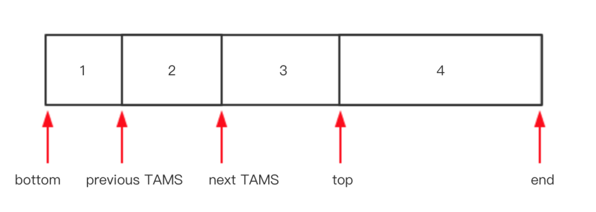
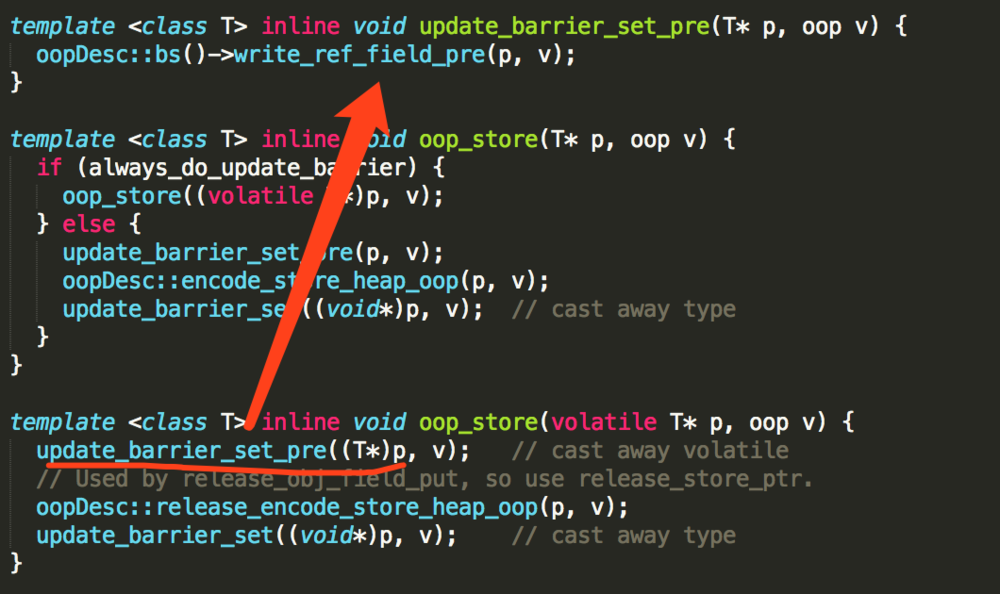
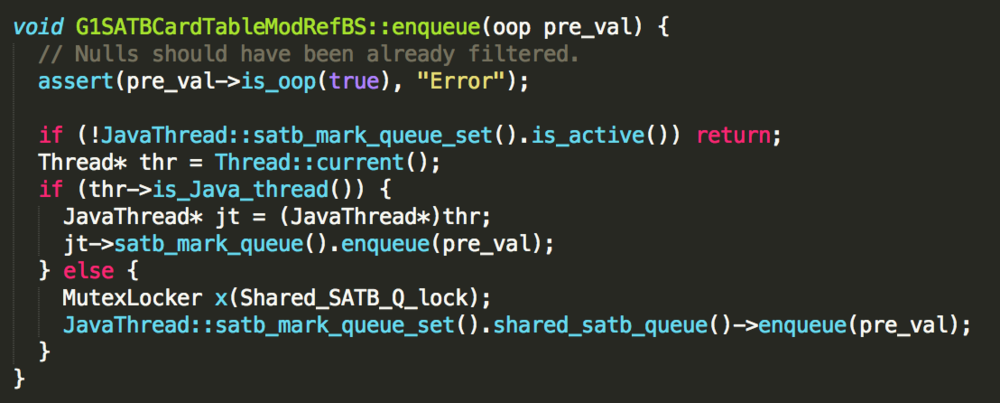
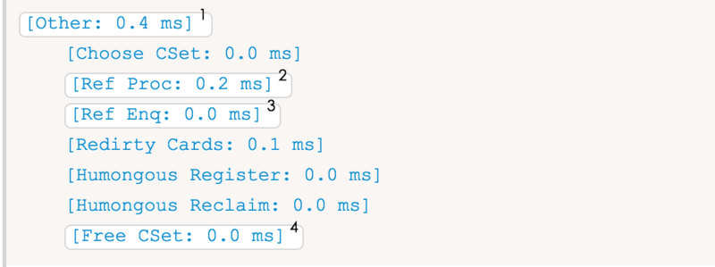

### G1垃圾回收器


G1设计的一个重要目标是设置stop-the-world阶段的持续时长和频率，即你可以给它设置明确的运行目标。你可以要求stop-the-world阶段不超过x milliseconds在给定的y milliseconds时长范围内，比如，在给定的s内不超过5s，G1收集器尽自己最大努力高概率完成目标任务。

#### G1 中几个重要的概念

在G1的实现过程中，引入了一些新的概念，对于实现高吞吐、没有内存碎片、收集时间可控等功能起到了关键作用。

1. Region

传统的GC收集器将连续的内存空间划分为新生代、老年代和永久代(JDK8去除永久代，引入了元空间Metaspace)：


而G1的各代存储地址是不连续的，每一代都使用了n个不连续的大小相同的Region，每个Region占有一块连续的虚拟内存地址。


在上图中，我们注意到还有一些Region标明了H，它代表Humongous，这表示这些Region存储的是巨大对象(humongous object，H-obj)，即大小大于等于region一半的对象。H-obj有如下几个特征：

* H-obj直接分配到old gen，防止反复拷贝移动。
* H-obj在global concurrent marking阶段的clean up 和full GC阶段回收。
* 在分配H-obj之前先检查是否超过initating heap occupancy percent和the marking threshold，如果超过的话，就启动global concurrent marking，提早回收，防止evacuation failures和full GC

为了减少连续H-objs分配对GC的影响，需要把大对象变为普通的对象，建议增大Region size。一个Region的大小可以通过参数-XX:G1HeapRegionSize设定，取值范围从1M到32M，且是2的指数。如果不设定，那么G1会根据Heap大小自动决定

2. SATB

全称Snapshot-At-The-Beginning，由字面理解，是GC开始时活动时活着的对象的一个快照。它是由Taiichi Yuasa为增量式标记清除垃圾收集器开发的一个算法，主要应用于垃圾收集的并发标记阶段，解决了CMS垃圾收集器重新标记阶段长时间STW的潜在风险，即CMS的incremental update设计使得它在remark阶段必须重新扫描所有线程栈和整个young gen 作为root；G1的SATB设计在remark阶段则只需要扫描剩下的satb_mark_queue。

根据三色标记算法，我们知道对象存在三种状态：白：对象没有被标记到，标记阶段结束后，会被当作垃圾回收掉。灰：对象被标记了，但是它的field还没有被标记或者标记完。黑：对象被标记了，并且它的所有field也被标记完了。

由于并发阶段的存在，应用程序和垃圾回收线程同时对对象进行修改，就会出现白对象漏标的情况，这种情况发生的前提是：

- 应用程序赋予一个黑对象对该白对象的引用.
- 应用程序删除了所有从灰对象到该白对象的直接或者间接引用。

对于第一种情况，利用post-write barrier，记录所有新增的引用关系，然后根据这些引用关系为根重新扫描一遍。

对于第二种情况，利用pre-write barrier，将所有即将被删除的引用关系的旧引用记录下来，最后以这些引用为根重新扫描一遍。

Region 包含5个指针，分别是bottom、previousTAMS、nextTAMS、top和end：



其中previousTAMS、nextTAMS是前后两次发生并发标记时的位置，全称top-at-mark-start：

* 假设第n轮并发标记开始，将该Region当前的top指针赋值给nextTAMS，并发标记期间，分配的对象都在[nextTAMS,top]之间，SATB能够确保这部分的对象都会被标记，默认都是存活的。
* 当并发标记结束时，将nextTAMS所在的地址赋值给previousTAMS。

SATB保证了在并发标记阶段新分配的对象不会被漏标。

但如果在TAMS之前有一个白色对象W，被一个灰色对象G引用，在并发阶段切断了对象W和对象G之间的引用关系，对象W就有可能漏标。在G1中，在引用关系被修改之前，插入一层pre-write brarrier



pre-write barrier 最终执行逻辑：



可以看到原引用会保存到satb_mark_queue中，然后下一次的并发标记阶段，会依次处理satb_mark_queue中的对象，确保着部分对象在本轮GC中是存活的。

3. Rset

全称是Remembered Set，是辅助GC过程的一种结构，典型的空间换时间工具，和Card Table 有些类似。还有一种数据结构也是辅助GC的：Collection Set(CSet)，它记录了GC要收集的Region集合，集合里的Region可以是任意年代的。在GC的时候，对于old->young和old->old的跨代对象引用，只要扫描对应的CSet中的RSet即可。

逻辑上每个Region都有一个Rset，Rset记录了其他Region中的对象引用本Region中对象的关系，属于points-into结构(谁引用了我的对象)。而Card Table 则是一种point-out(我引用了谁)的结构，每个Card覆盖一定范围的Heap。

G1的Rset是在Card Table的基础上实现的：每个Region会记录下别的Region有指向自己的指针，并标记这些指针分别在哪些Card范围内，这个Rset其实是一个HashTable，key是别的Region的起始地址，Value是一个集合，里面的元素是Card Table的Index。


上图中有三个Region，每个Region被分成多个Card，在不同Region中Card会相互引用，Region1中的Card中的对象引用了Region2中的Card中的对象，蓝色实线表示的就是points-out的关系，而在Regions2的Rset中，记录了Region1的Card，即红色虚线表示的关系，这就是points-into。而维系RSet中的引用关系靠post-write barrier和Concurrent refinement threads来维护。

post－write barrier 记录了跨Region的引用更新，更新日志缓冲区则记录了那些包含更新引用的Cards。一旦缓冲区满了，Post-write barrier 就停止服务了，会由Concurrent refinement threads处理这些缓冲日志。

在做YGC的时候，只需要选定young generation region的RSet做为根集，这些RSet记录了old->youngde跨代引用，避免了扫描整个old generation。而mixed gc的时候，old generation 中记录 了old -> old 的RSet，young -> old 的引用由扫描全部young generation region 得到，这样也不用扫描全部old generation region。所以RSet的引入大大减少了GC的工作量。

4. Pause Prediction Model 

Pause Prediction Model 即停顿预测模型。G1 GC是一个响应时间优先的GC算法，它与CMS最大的不同是，用户可以设定整个GC过程的期望停顿时间，参数-XX:MaxGCPauseMillis指定一个G1收集过程目标停顿时间，默认值200ms，不过它不是硬性条件，只是期望值。它通过一个预测模型来统计历史数据然后来预测本次垃圾回收需要选择的Region数量，从而尽量满足用户设定的目标停顿时间。

#### 疏散(Evacuation)阶段：Fully Young

在应用程序生命周期的开始阶段，在并发阶段开始之前，G1获取不到任何附加信息，因此它的最初功能是full-young模式。当 Young代塞满了，应用线程暂停，Young区的存活数据被复制到Survivor区域，任何空闲区域因此变成Survivor区。

复制对象过程被加做疏散(Evacuation)，它的工作方式和我们之前看到其他Young收集器几乎一样：

```json
0.134: [GC pause (G1 Evacuation Pause) (young), 0.0144119 secs]1
    [Parallel Time: 13.9 ms, GC Workers: 8]2
    …3
    [Code Root Fixup: 0.0 ms]4
    [Code Root Purge: 0.0 ms]5
    [Clear CT: 0.1 ms]
    [Other: 0.4 ms]6
        …7
    [Eden: 24.0M(24.0M)->0.0B(13.0M) 8
     Survivors: 0.0B->3072.0K 9
     Heap: 24.0M(256.0M)->21.9M(256.0M)]10
     [Times: user=0.04 sys=0.04, real=0.02 secs] 11
```

1. G1阶段清理young区域。 JVM启动之后的134ms阶段开始，检测阶段持续了0.0144s。
2. 表明下列活动被8个并行GC线程实施耗费13.9m。
3. 省略部分，细节在下面的系列片段。
4. 释放数据结构用于管理并行活动。通常应该是接近0。
5. 清除更多数据结构，通常应该非常快。
6. 混杂其他活动，它们的很多是并行的。
7. 细节可以看下面的章节。
8. 阶段前后的Eden区使用大小和容量大小。
9. 阶段前后被用于Survivor区的空间。
10. 阶段前后的heap区总使用大小和容量大小。
11. GC时间期间，不同类别的时长

```
user-回收期间GC线程消耗的总的cpu时间
sys-调用系统或者等待系统事件的消费时长
real-应用程序的停顿的时钟时间。GC期间并发活动时长理论上接近(user time + sys time)
```

大多数重大事件被多个专用GC线程完成。它们的活动如下面片段的描述：

```json
[Parallel Time: 13.9 ms, GC Workers: 8]1
[GC Worker Start (ms)2: Min: 134.0, Avg: 134.1, Max: 134.1, Diff: 0.1]
[Ext Root Scanning (ms)3: Min: 0.1, Avg: 0.2, Max: 0.3, Diff: 0.2, Sum: 1.2]
[Update RS (ms): Min: 0.0, Avg: 0.0, Max: 0.0, Diff: 0.0, Sum: 0.0]
        [Processed Buffers: Min: 0, Avg: 0.0, Max: 0, Diff: 0, Sum: 0]
[Scan RS (ms): Min: 0.0, Avg: 0.0, Max: 0.0, Diff: 0.0, Sum: 0.0]
[Code Root Scanning (ms)4: Min: 0.0, Avg: 0.0, Max: 0.2, Diff: 0.2, Sum: 0.2]
[Object Copy (ms)5: Min: 10.8, Avg: 12.1, Max: 12.6, Diff: 1.9, Sum: 96.5]
[Termination (ms)6: Min: 0.8, Avg: 1.5, Max: 2.8, Diff: 1.9, Sum: 12.2]
[Termination Attempts7: Min: 173, Avg: 293.2, Max: 362, Diff: 189, Sum: 2346]
[GC Worker Other (ms)8: Min: 0.0, Avg: 0.0, Max: 0.0, Diff: 0.0, Sum: 0.1]
GC Worker Total (ms)9: Min: 13.7, Avg: 13.8, Max: 13.8, Diff: 0.1, Sum: 110.2]
[GC Worker End (ms)10: Min: 147.8, Avg: 147.8, Max: 147.8, Diff: 0.0]
```

1. 表明下列活动被8个并行GC线程实施耗费13.9ms(real time)。
2. 线程开始活动的合计时间，在阶段的开始时间匹配时间戳。如果Min和Max差别很大，它也许表明太多线程被使用或者JVM里的GC进程cpu时间被机器上其他进程盗用。
3. 扫描外部(非heap)Root消耗的时间如classloader、jni引用、JVM系统等。展示消耗时间，sum是cpu时间。
4. 扫描来自真实code Root的时长：局部变量等等。
5. 从回收区域复制存活对象花费的时间。
6. GC线程确定它们到底安全点消耗的时间，没有多余工作完成，然后终止。
7. 工作线程尝试终止的次数。实际上线程发现有任务需要完成的时候尝试失败，过早去终止。
8. 其他琐碎的活动不值得在日志里独立片段展示。
9. 任务线程总共花费的时间。
10. 任务线程完成工作的时间戳。

此外，Evacuation阶段期间一些混杂活动被执行，我们讲解一部分，剩余部分后面再讲：




1. 混杂其他的活动，大多数并行执行。
2. 处理非强引用的时间：清除或者确定不需要清理。
3. 顺序处理将剩下的非强引用从引用队列中移除出去。
4. 释放收集集合里面区域花费的时间以便他们适用于下一次分配。

#### G1 GC 模式

G1提供了两种GC模式，young GC 和Mixed GC，两种都是完全Stop The World的。

* Young GC：选定所有年轻代里的Region，通过控制年轻代的region个数，即年轻代内存大小，来控制young GC的时间开销。
* Mixed GC：选定所有年轻代里的Region，外加根据global concurrent marking统计得出收集收益高的若干老年代Region，在用户指定的开销范围之内尽可能选择收益高的老年代Region。

由上面可以知道，Mixed GC不是full GC，它只能回收部分老年代的Region，如果mixed GC实在无法跟上程序分配内存的速度，导致老年代填满无法继续进行Mixed GC，就会使用serial old GC(full GC)来收集整个GC heap。所以我们可以知道G1是不提供full GC的。

global concurrent marking 类似CMS，但是不同的是，在G1 GC中，它主要是为Mixed GC提供标记服务的，并不是GC过程的一个必须环节，它分为四个步骤：

* 初始标记(initial mark,STW)：在这个阶段会经历STW，通常初始标记阶段会跟一次新生代收集一起。初始化做的工作是设置两个TAMS变量(NTAMS和PTAMS)的值，所有在TAMS之上的对象在这个并发期内被识别为隐式存活对象。它标记了从GC Root开始直接可达的对象。
* 根分区扫描(root-region-scan)：这个过程不需要暂停应用，在初始标记或者新生代收集中被拷贝到survivor分区的对象，都需要被看作是根，这个阶段G1开始扫描survivor分区，所有被survivor分区所引用的对象都会被扫描到并被标记。在标记survivor分区时，该阶段不能发生新生代收集，如果扫描根分区时，新生代的空间恰好用尽，新生代垃圾收集必须等待根分区扫描结束才能完成。


* 并发标记(Concurrent Marqsking)：这个阶段从GC Root开始对heap 中的对象标记，标记线程与应用程序线程并行执行，并且收集各个Region的存活信息。并发标记阶段是多线程的，我们可以通过-XX:ConcGCThreads来设置并发线程数，默认情况下，G1垃圾收集器会将这个线程数设置为并行垃圾线程数(-XX:ParallelGCThreads)的四分之一。并发标记会利用trace算法找到所有活着的对象，并记录在一个bitmap中，因为在TAMS之上的对象都是被视为隐式存活，因此只需要遍历那些在TAMS之下的。

  记录在标记的时候发生的引用改变，SATB的思路是在开始的时候设置一个快照，然后假定这个快照不改变，根据这个快照去进行trace，这个时候如果某个对像的引用发生变化，就需要通过pre-write barrier logs将该对象的旧值记录在一个SATB缓冲区中，如果这个缓冲区满了，就把它追加到一个全局的列表中(G1会有并发标记的线程定期去处理这个全局列表)。

* 最终标记(Remark,STW)：标记那些在并发标记阶段发生变化的对象，将被回收。G1垃圾收集器会处理掉剩下的SATB日志缓冲区和所有更新的引用，同时G1垃圾收集器还会找出所有未被标记的存活对象。

* 清除垃圾(Clean up)：清空Region(没有存活对象)，加入到free list。清理阶段真正回收的内存很小，截止到这个阶段G1垃圾收集器主要是标记哪些老年代分区可以回收，将老年代按照它们的存活度从小到大排列。

第一阶段initial mark 是共用了Young GC 的暂停，这是因为它们可以复用root scan操作，所以说global concurrent marking 是伴随Young GC 而发生的。第四阶段Clean up只是回收没有存活对象的Region，所以它并不需要STW。

Mixed GC发生时机以及哪些老年代Region会被选入CSet由一些参数控制着：

* G1HeapWastePercent：在global concurrent marking 结束之后，我们可以知道old gen regions 中有多少空间要被回收，在每次YGC之后和再次发生Mixed GC之前，会检查垃圾占比是否到达此参数，只有到达了，下次才会发生Mixed GC。
* G1MixedGCLiveThresholdPercent：old generation region 中的存活对象的占比，只有在此参数之下，才会被选入CSet。
* G1MixedGCCountTarget：一次global concurrent marking之后，最多执行Mixed GC 的 次数。
* G1OldCSetRegionThresholdPercent：一次Mixed GC 中能被选入CSet的最多old generation region数量。

除了上面的参数，G1 GC的其他主要参数：

| 参数                               | 含义                                                         |
| ---------------------------------- | ------------------------------------------------------------ |
| -XX:G1HeapRegionSize=n             | 设置Region大小，并非最终值                                   |
| -XX:MaxGCPauseMillis               | 设置G1收集过程目标时间，默认值200ms，不是硬性条件            |
| -XX:G1NewSizePercent               | 新生代最小值，默认值5%                                       |
| -XX:G1MaxNewSizePercent            | 新生代最大值，默认值60%                                      |
| -XX:ParallelGCThreads              | STW期间，并行GC线程数                                        |
| -XX:ConcGCThreads=n                | 并发标记阶段，并行执行的线程数                               |
| -XX:InitiatingHeapOccupancyPercent | 设置触发标记周期的 Java 堆占用率阈值。默认值是45%。这里的java堆占比指的是non_young_capacity_bytes，包括old+humongous |

