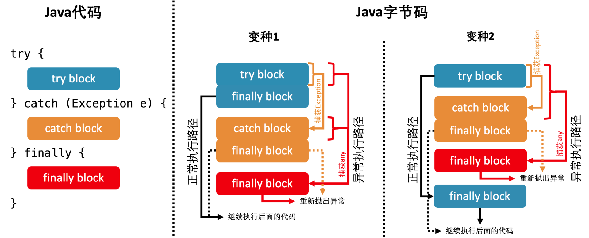

### JVM异常处理

异常处理的两大组成要素是抛出异常和捕捉异常。

抛出异常分为隐式和显式两种：

显式是指在程序中使用"throw"关键字，手动将异常实例抛出；隐式抛异常是指Java虚拟机在执行过程中，碰到无法执行的异常，自动抛出异常。

捕捉异常则涉及如下三种代码块：

1. try代码块：用来标记需要进行异常监控的代码。
2. catch代码块：跟在try代码块之后，用来捕捉在try代码中触发的某种指定类型的异常。除了捕捉声明所捕捉异常的类型之外，catch代码块还定义了针对该异常类型的异常处理器。try代码块后面可以跟着多个catch代码块，来捕捉不同类型的异常。
3. finally代码块：跟在try代码块和catch代码块之后，用来声明一段必定运行的代码块。

在程序正常执行情况下，finally代码块在try代码块之后执行，如果try代码块触发异常，

假如异常没有被捕捉，finally代码块会直接运行，并且在运行之后重新抛出该异常。

假如该异常被catch代码块捕获，finally代码块在catch代码块之后运行。在某些情况下，catch代码块触发异常，那么finally代码块同样会运行，并抛出catch代码块触发的异常。如果在某些极端情况下，finally代码块也触发了异常，那么只好中断当前finally代码块的执行，并往外抛异常。

#### 异常基本概念

在Java语言规范中，所有的异常都是Throwable类或者其子类。Throwable有两大直接子类。第一个是Error，当程序触发Error时，它的执行状态无法恢复，需要终止线程甚至终止虚拟机。第二个子类是Exception，涵盖程序可能需要捕获并且处理的异常。


异常实例构造十分昂贵，由于在构造异常实例时，Java虚拟机需要生成该异常的栈轨迹(stack trace)，该操作会逐渐访问当前线程的Java帧栈，并记录各种调试信息，包括：帧栈所指向方法的名字、方法所在类名、文件名以及在代码中的第几行触发该异常。

#### Java虚拟机捕获异常

在编译生成的字节码时，每个方法都附带一个异常表。异常表中的每一个条目代表一个异常处理器，并且由from指针、to指针、target指针以及所捕获的异常类型所构成。

from指针和to指针标示了该异常处理器所监控的范围，如：try代码块所覆盖的范围。target指针则指向异常处理器的起始位置，如：catch代码块的起始位置。

如下示例代码：

```java
public class ExceptionDemo {

    public static void main(String[] args){
        try {
            test1();
        }catch (Exception e){

        }

    }
    public static void test1(){
        System.out.println("this is a test");
    }
}
```

用javap -v 查看 class字节码：

```java
public static void main(java.lang.String[]);
    descriptor: ([Ljava/lang/String;)V
    flags: ACC_PUBLIC, ACC_STATIC
    Code:
      stack=1, locals=2, args_size=1
         0: invokestatic  #2                  // Method test1:()V
         3: goto          7
         6: astore_1
         7: return
      Exception table:
         from    to  target type
             0     3     6   Class java/lang/Exception

```

如上，编译后main方法有一个异常表，其中from指针和to指针分别是0和3，代表它的监控范围从从索引为0的字节码开始，到索引为3的字节码结束（不包括3）。该条目的target指针是6，代表这个异常处理器从索引为6的字节码码开始。条目的最后一列(type)代表该异常处理器所捕获的异常类型是Exception。

当程序触发异常时，Java虚拟机会从上至下遍历异常表中的所有条目，当触发的异常字节码的索引值在某个异常表条目的监控范围，Java虚拟机会判断所抛出的异常和该条目想要捕获的异常是否匹配，如果匹配，Java虚拟机会控制流转移至该条目target指针指向的字节码。

如果遍历完所有的异常表条目，Java虚拟机仍然没有匹配到异常处理器，那么它会弹出当前方法对应的Java栈帧，并且在它的调用者中重复上述操作。在最坏的情况下，Java虚拟机需要遍历当前线程Java栈上所有的异常表。

finally代码块编译在当前版本的Java编译器的做法是，复制finally代码块的内容，分别放在try-catch代码块所有正常执行以及异常执行路径的出口。



比如变种1：如果try block中的代码执行正常，那么执行流程会直接进入紧随着它的finally block，然后继续执行后面的代码；如果try block中发生异常，那么执行流程会进入catch block中，如果catch block中没有发生异常，同样会进入紧挨着它的finally block执行完fianlly模块里面的代码后，然后继续执行后面的代码；如果在执行catch block时发生异常，则会进入最后一个finall block重新将异常抛出。

如下代码示例：

```java
public class Foo {

    private int tryBlock;

    private int catchBlock;

    private int finallyBlock;

    private int methodExit;

    @Test
    public void test(){

        try {
            tryBlock = 0;
        }catch (Exception e){
            catchBlock = 1;
        }finally {
            finallyBlock = 2;
        }
        methodExit = 3;
    }
    
}
```

使用java -c 命令查看字节码：

```java
public void test();
    Code:
       0: aload_0
       1: iconst_0
       2: putfield      #2                  // Field tryBlock:I
       5: aload_0
       6: iconst_2
       7: putfield      #3                  // Field finallyBlock:I
      10: goto          35
      13: astore_1
      14: aload_0
      15: iconst_1
      16: putfield      #5                  // Field catchBlock:I
      19: aload_0
      20: iconst_2
      21: putfield      #3                  // Field finallyBlock:I
      24: goto          35
      27: astore_2
      28: aload_0
      29: iconst_2
      30: putfield      #3                  // Field finallyBlock:I
      33: aload_2
      34: athrow
      35: aload_0
      36: iconst_3
      37: putfield      #6                  // Field methodExit:I
      40: return
    Exception table:
       from    to  target type
           0     5    13   Class java/lang/Exception
           0     5    27   any
          13    19    27   any

```

针对异常执行的路径，Java编译器会生成一个或者多个异常条目(在javap中以any代替)，来监控try-catch代码块，并且捕获所有种类的异常。这些条目的target指向另一份复制的finally代码块。

如上编译结果中包含三份finally代码块，其中前两块分别位于try代码块和catch代码块的正常执行路径出口，最后一份则作为异常处理器，监控try代码块以及catch代码块，它将捕获try代码块触发的、未被catch代码块捕获的异常，已经catch代码块触发的异常。

如果catch代码块捕获了异常，并且在catch代码块中也触发了另一个异常，那么finally将捕获后面这个异常，原本的异常将被忽略掉。

