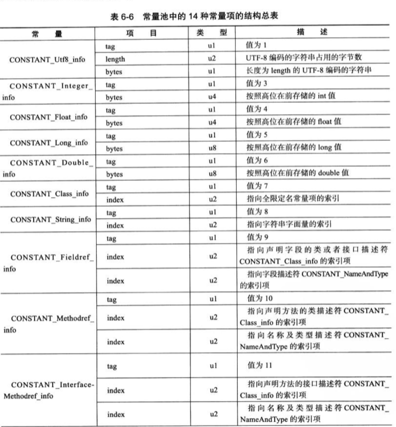
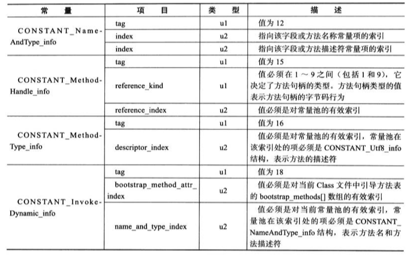

###class类文件结构

class文件是一组以8位字节为基础单位的二进制流，各个数据项目严格按照顺序紧凑地排列在Class文件中，中间没有添加任何分隔符。当需要占用8个字节以上空间的数据项，会分割成若干个8位字节进行存储。

class文件整体的设计类似一张表，表是多个无符号数或以表类型作为数据项组成。

无符号数是基本数据类型，以u1、u2、u4、u8分别代表1个字节、2个字节、4个字节、8个字节。它用来记录数据项在class文件中占用多少个字节。如：magic对应的类型u4，表示在class文件中占用4个字节。

当同一种类型的数据项有多个，它们也以表结构集合在一起，形成一个子表来作为字节码结构的数据项。并且在该数据项前面有一个无符号项来它包含多个数据项。比如，constant_pool就是一个表，它表示的是常量池的集合。constant_pool_count表示常量池中有多少个常量。

如下是class文件的基本结构：

| 类型           | 名称                | 数量                  |
| -------------- | ------------------- | --------------------- |
| u4             | magic               | 1                     |
| u2             | minor_version       | 1                     |
| u2             | major_version       | 1                     |
| u2             | constant_pool_count | 1                     |
| cp_info        | constant_pool       | constant_pool_count-1 |
| u2             | access_flags        | 1                     |
| u2             | this_class          | 1                     |
| u2             | super_class         | 1                     |
| u2             | interfaces_count    | 1                     |
| u2             | interfaces          | interfaces_count      |
| u2             | fields_count        | 1                     |
| field_info     | fields              | field_count           |
| u2             | methods_count       | 1                     |
| method_info    | methods             | methods_count         |
| u2             | attributes_count    | 1                     |
| attribute_info | attributes          | attributes_count      |

下面就一一来解释类文件中的各个数据项。

示例代码，jdk版本：```java version "1.8.0_144"```

```java
package zookeeperdemo;
public class TestClass {
	
	private int m;
	
	public int inc(){
		return m+1;
	}

}
```

编译后的字节码

 ```java
cafe babe 0000 0034 0013 0a00 0400 0f09
0003 0010 0700 1107 0012 0100 016d 0100
0149 0100 063c 696e 6974 3e01 0003 2829
5601 0004 436f 6465 0100 0f4c 696e 654e
756d 6265 7254 6162 6c65 0100 0369 6e63
0100 0328 2949 0100 0a53 6f75 7263 6546
696c 6501 000e 5465 7374 436c 6173 732e
6a61 7661 0c00 0700 080c 0005 0006 0100
177a 6f6f 6b65 6570 6572 6465 6d6f 2f54
6573 7443 6c61 7373 0100 106a 6176 612f
6c61 6e67 2f4f 626a 6563 7400 2100 0300
0400 0000 0100 0200 0500 0600 0000 0200
0100 0700 0800 0100 0900 0000 1d00 0100
0100 0000 052a b700 01b1 0000 0001 000a
0000 0006 0001 0000 0003 0001 000b 000c
0001 0009 0000 001f 0002 0001 0000 0007
2ab4 0002 0460 ac00 0000 0100 0a00 0000
0600 0100 0000 0800 0100 0d00 0000 0200
0e
 ```

#### magic和class文件版本

每个文件的开头4个字节称为魔数，它唯一的作用是确定这个class文件能否被虚拟机接受。很多文件存储标准中也是使用魔数来进行身份验证，如：jpeg或者gif的文件头中也存在魔数。使用魔数而不是通过扩展名来验证文件类型是处于安全考虑，因为文件扩展名是可以更改的。class文件中的魔数是：```0xCAFEBABE```。

紧接着魔数后的第5、6个字节是次版本，第7、8个字节是主版本。JDK可以向下兼容版本，但不能运行超过它超过它版本号的class文件。如：上述的字节码JDK1.8环境下编译的，主版本号是：```0x0034```，转换成10进制后就是52，而JDK1.7可以生成的最高版本号是51,所以如果将该字节码放在1.7的JDK上，虚拟机将拒接执行。

#### 常量池

紧接着主次版本后面就是常量池入口，即常量池的前一项，它是一个u2类型的数据，用来表示常量池中有多少常量。```0x0013```，转十进制19，这代表常量池中有19项常量。常量池的第0位作保留位，常量索引从1开始的。其他容量索引是从0开始。

常量池(静态常量池)主要存放两大类常量：**字面量和符号引用**。字面量比较接近于JAVA中的常量概念，如：字符串、final的常量值。而符号引用包括下面三类常量：

* 类和接口的全限名称(含有包名的类或者接口名称)
* 字段的名称和描述符
* 方法的名称和描述符


Class文件不会生成方法、字段在内存中的地址，无法直接被虚拟机使用，需要在虚拟机运行的时候从常量池中加载、解析、翻译等操作。

常量池中的每一个常量在字节码中的排列方式可以看成一个表。每一张表都有一个特点，表开始的第一位是一个u1类型的标志位(tag)，代表当前这个常量是属于那种常量类型。比如当标记是1时，表示这个常量是字符编码。如下图14种常量类型：

| 类型                             | 标志 | 描述                     |
| -------------------------------- | ---- | ------------------------ |
| CONSTANT_Utf8_info               | 1    | UTF-8编码的字符串        |
| CONSTANT_Integer_info            | 3    | 整形字面量               |
| CONSTANT_Float_info              | 4    | 浮点型字面量             |
| CONSTANT_Long_info               | 5    | 长整形字面量             |
| CONSTANT_Double_info             | 6    | 双精度浮点型字面量       |
| CONSTANT _Class_info             | 7    | 类或接口的符号引用       |
| CONSTANT_String_info             | 8    | 字符串类型字面量         |
| CONSTANT_Fieldref_info           | 9    | 字段的符号引用           |
| CONSTANT_Methodref_info          | 10   | 类中方法的符号引用       |
| CONSTANT_InterfaceMethodref_info | 11   | 接口中方法的符号引用     |
| CONSTANT_NameAndType_info        | 12   | 字段或方法的部分符号引用 |
| CONSTANT_MethodHand_info         | 15   | 表示方法句柄             |
| CONSTANT_MethodType_info         | 16   | 标志方法类型             |
| CONSTANT_InvokeDynamic           | 18   | 表示一个动态方法调用点   |

我们再来看示例代码编译后的字节码，常量池的第一项常量的标识是```0a```，对应的常量类型是```类中方法的符号引用```，CONSTANT_Methodref_info的结构如下：

| 类型 | 名称  | 数量 |
| ---- | ----- | ---- |
| u1   | tag   | 1    |
| u2   | index | 1    |
| u2   | index | 1    |

定义一个方法，包括方法的名称、参数和返回类型以及方法所在类。```方法的符号引用```就是用来指向方法的名称、参数、返回类型等描述符在常量池中的位置。所以CONSTANT_Methodref_info第2行的index指向声明方法的类描述，第3行指向名称类型描述符。

例子中它的值为```0x0004```，指向常量池中的第4项常量。我们可以使用Jdk的bin目录下的一个命令将类文件中的常量池解析出来:```javap -v  class名称 ```。

常量池中的第4项是又指向18项，18项描述的是一段utf-8编码的字符串，这就是方法的类描述。同理可以找出方法的名称类型描述符，```0x000f```指向常量池的15项，15项再指向7、8项，如此就可以查出方法的名称描述是```<init>```，参数、返回类型描述是```()V```。

```java
Constant pool:
   #1 = Methodref          #4.#15         // java/lang/Object."<init>":()V
   #2 = Fieldref           #3.#16         // zookeeperdemo/TestClass.m:I
   #3 = Class              #17            // zookeeperdemo/TestClass
   #4 = Class              #18            // java/lang/Object
   #5 = Utf8               m
   #6 = Utf8               I
   #7 = Utf8               <init>
   #8 = Utf8               ()V
   #9 = Utf8               Code
  #10 = Utf8               LineNumberTable
  #11 = Utf8               inc
  #12 = Utf8               ()I
  #13 = Utf8               SourceFile
  #14 = Utf8               TestClass.java
  #15 = NameAndType        #7:#8          // "<init>":()V
  #16 = NameAndType        #5:#6          // m:I
  #17 = Utf8               zookeeperdemo/TestClass
  #18 = Utf8               java/lang/Object

```

同理下一个常量的标志是```0x09```，字段符号引用，它与方法的符号引用类似，就不多讲了。

我们再来看下一个常量的标识是```0x07 ```，查询类型表是一个类或接口的引用。CONSTANT _Class_info的表结构如下：

| 类型 | 名称       | 数量 |
| ---- | ---------- | ---- |
| u1   | tag        | 1    |
| u2   | name_index | 1    |

tag是标志位，区分常量类型。name_index是一个索引值，它指向常量池中的一个常量，此常量代表这个类(或接口)的全限定名。name_index的类型是u2，即它的值是```0x0011```，转成10进制就是17，指向常量池的第17项常量。常量池中第17项是一个utf-8编码的字符串，它描述的就是类的全限定名称。接下来的常量的标志也是```0x07```，与前一个常量一样。

再接接着是```0x01```，utf-8编码字符串，CONSTANT_Utf8_info的表结构如下：

| 类型 | 名称   | 数量   |
| ---- | ------ | ------ |
| u1   | tag    | 1      |
| u2   | length | 1      |
| u1   | bytes  | length |

length说明这个utf-8编码的字符串长度是多少个字节。它后面紧跟着的就是长度为length字节的连续数据。

length的值为```0001```，说明后面1个字节是这个常量的数据，即```0x6d```，转换成10进制就是106，按照ASCII码表对比，可以发现它是小写字母```m```。（注：因为类名都是英文，可以直接对照ASCII码翻译）。

到这里我们大概能理解常量池中的数据是怎么存放的，首先是一堆类型+索引的常量，用来描述常量池中有哪些类型的常量，并且存储在什么地方，而剩下的就是utf-8的常量，用来存储具体的字符串描述。

class文件中的类、方法和字段名称等都是用CONSTANT_Utf8_info来描述的，CONSTANT_Utf8_info能描述的最大长度是u2的最大值(65535)，如果我们在定义方法名或者成员变量时，如果方法名称长度超过了64kb，将会编译不通过





#### 访问标志

常量池结束后，紧接着两个字节是访问标志，这个标志用于识别一些类或者接口层次的访问信息，包括：这个class是类还是接口；是否定义为public类型，是否定义为abstract;如果是类，是否声明为final等。

| 标志名称       | 标志值 | 含义                                                         |
| -------------- | ------ | ------------------------------------------------------------ |
| ACC_PUBLIC     | 0X0001 | 是否为public类型                                             |
| ACC_FINAL      | 0x0010 | 是否被声明为final,只有类可以声明                             |
| ACC_SUPER      | 0X0020 | 是否允许使用invokespecial字节码的新语义，invokespecial指令在JDK1.0.2发生过改变，为了区别这条指令使用哪种语义，JDK1.0.2之后编译出来的类的这个标志都必须为真 |
| ACC_INTERFACE  | 0x0200 | 标识这是一个接口                                             |
| ACC_ABSTRACT   | 0x0400 | 是否是abstract类型，对于接口和抽象类，此标志值为真，其它值为假 |
| ACC_SYNTHENTIC | 0x1000 | 标识这个类不是由用户代码产生的                               |
| ACC_ANNOTATION | 0x2000 | 标识这是一个注解                                             |
| ACC_ENUM       | 0X4000 | 标识这是一个枚举                                             |

如本文提供的示例代码TestClass,它是一个public类型的类，因此ACC_PUBLIC、ACC_SUPER为真，其它为假，因此它的access_flags的值应该是0x0001|0x0020=0x0021,参照编译后的class 文件：`00 21`，结果也是一致的。

#### 类索引、父类索引与接口索引集合

类索引、父类索引和接口索引集合按照顺序排列在访问标志之后，类索引和父类索引是u2类型的数据，索引值指向类型为CONSTANT _Class_info的常量，再根据CONSTANT _Class_info中的索引找到定义在CONSTANT_Utf8_info类型的常量的全限定名字符串。父类索引用于确定这个类的父类的全限定名称，由于Java不允许类多继承，所以每个类只有一个父类。除Object外，每个类都有父类。

接口索引集合是一组u2型的数据，因为类可以多继承，所以一个类可以有多个接口。接口索引集合的入口第一项(u2型数据)是接口计数器，表示索引表的数量，如果这个类没有实现任何接口则计数器为0。

如示例代码的类索引、父类索引、接口索引集合：```0003 0004 0000```，前两个u2型数据分别指向常量池中的第3个和第4个常量，第三个u2型数据为0x0000表示TestClass没有实现任何接口。

部分常量池内容：

```java
#3 = Class              #17            // zookeeperdemo/TestClass
#4 = Class              #18            // java/lang/Object
```

#### 字段表集合

字段表用来描述接口或者类中声明的变量。字段包括类级别变量以及实例级变量，但是不包括方法内部声明的局部变量。

描述一个字段可以包括的信息有：字段的作用域(public、private、protected修饰符)，是实例变量还是类变量(static修饰符)，可变性(final修饰符)，并发可见性(volatitle修饰符)，是否可被序列化(transient修饰符)，字段数据类型(基本类型、对象、数组)，字段名称等。上述的信息中，修饰符都是boolean型，要么有，要么没有，很适合用标志位来表示，而字段名称、类型无法确定字段名称、类型什么，所以需要通过常量池来保存常量名称、类型。

如下字段表结构：

| 类型           | 名称             | 数量             |
| -------------- | ---------------- | ---------------- |
| u2             | access_flags     | 1                |
| u2             | name_index       | 1                |
| u2             | descriptor_index | 1                |
| u2             | attributes_count | 1                |
| attribute_info | attributes       | attributes_count |

字段修饰符放在access_flags中，它与类中的access_flags非常的类似。字段访问标志含义如下：

| 标志名称      | 标志值 | 含义                     |
| ------------- | ------ | ------------------------ |
| ACC_PUBLIC    | 0X0001 | 字段是否public           |
| ACC_PRIVATE   | 0x0002 | 字段是否private          |
| ACC_PROTECTED | 0X0004 | 字段是否protected        |
| ACC_STATIC    | 0X0008 | 字段是否static           |
| ACC_FINAL     | 0X0010 | 字段是否final            |
| ACC_VOLATILE  | 0X0040 | 字段是否volatile         |
| ACC_TRANSIENT | 0X0080 | 字段是否transient        |
| ACC_SYNTHETIC | 0X1000 | 字段是否有编译器自动生成 |
| ACC_ENUM      | 0X4000 | 字段是否enum             |

在实际情况中，ACC_PUBLIC、ACC_PRIVATE、ACC_PROTECTED只能选一，ACC_FINAL和ACC_VOLATILE不能同时选择。在接口中，字段必须有：ACC_PUBLIC、ACC_STATIC、ACC_FINAL标志。

name_index和descriptor_index是对常量池的引用，分别对应着字段的简单名称和字段描述。字段的简单名称是指没有字段类型(方法的简单名称是指没有返回类型和参数)。如这个类中的字段```m```和方法```int inc()```，它们的简单名称分别是：

```m```和```inc```。

描述符 的作用是用来描述字段的数据类型、方法的参数列表(数量、类型、顺序)、和返回值。根据描述规则，基本数据类型、void都用一个大写字符来描述，而对象类型则用字符L加对象的全限定名来表示。如下是描述符标识字符含义

| 标识字符 | 含义   | 标识字符 | 含义                          |
| -------- | ------ | -------- | ----------------------------- |
| B        | byte   | J        | long                          |
| C        | char   | S        | short                         |
| D        | double | Z        | boolean                       |
| F        | fload  | V        | void                          |
| I        | int    | L        | 对象类型如：Ljava/lang/Object |

对于数组类型，每一个维度将使用一个前置的```[```来描述，如：```java.lang.String[][]```类型的数组，将被记录为：```[[Ljava/lang/String```，```int[]```将被记为```[I```。

用描述符来描述方法时，按照先参数列表后返回值的顺序来描述，参数列表按照参数的顺序放在一组小括号```()```中。如方法void inc()的描述符是()V，方法java.lang.String.toString()的描述符是```()Ljava/lang/String```，方法```int indexOf(char[]source,int sourceOffset,int sourceCount,char[]target,int targetOffsetmint targetCount,int fromIndex)```的描述符是```([CII[CIII])I```。

在给出的示例代码中，第一个u2型数据是容量计数器，它的值是```0X0001```，说明这个类中只有一个字段表数据。接着就是字段访问标志```access_flags```,它的值为```0x0002```，说明这个字段是私有的，接着是字段简单名称```name_index```，它的值是0x0005，从常量表中查询得出，位于第5项是常量```m```，然后是字段描述```descriptor_index```，它的值```0x0006```，查看常量池中第6号位置是```I```，根据这些信息可以推断出源代码定义的字段是：```private int m```。

在字段描述之后，还有一个属性集合，用来存储一些额外的信息，这个后面在讲。

部分常量池内容：

```java
#4 = Class              #18            // java/lang/Object
#5 = Utf8               m
#6 = Utf8               I
```

####  方法表集合

class文件中方法的存储结构和字段一致，表结构也和字段一样，依次包括了：访问标志(access_flags)、名称索引(name_index)、描述符索引(descroptor_index)、属性表集合几项，表结构如下：

| 类型           | 名称             | 数量             |
| -------------- | ---------------- | ---------------- |
| u2             | access_flags     | 1                |
| u2             | name_index       | 1                |
| u2             | descriptor_index | 1                |
| u2             | attributes_count | 1                |
| attribute_info | attributes       | attributes_count |

方法表access_flags与字段表有点区别，volatile关键字和transient关键字不能修饰方法，与之相对应的synchronized、native、strictfp、abstract关键字可以修饰方法、如下标志位表：

| 标志名称         | 标志值 | 含义                             |
| ---------------- | ------ | -------------------------------- |
| ACC_PUBLIC       | 0x0001 | 方法是否为public                 |
| ACC_PRIVATE      | 0x0002 | 方法是否为private                |
| ACC_PROTECTED    | 0x0004 | 方法是否为protected              |
| ACC_STATIC       | 0x0008 | 方法是否为static                 |
| ACC_FINAL        | 0x0010 | 方法是否为final                  |
| ACC_SYNCHRONIZED | 0x0020 | 方法是否为synchronized           |
| ACC_BRIDGE       | 0x0040 | 方法是否是由编译器产生的桥接方法 |
| ACC_VARARGS      | 0x0080 | 方法是否接受不定参数             |
| ACC_NATIVE       | 0x0100 | 方法是否为native                 |
| ACC_ABSTRACT     | 0x0400 | 方法是否为abstract               |
| ACC_STRICTEP     | 0x0800 | 方法是否为strictfp               |
| ACC_SYNTHETIC    | 0x1000 | 方法是否由编译器自动产生         |
|                  |        |                                  |

方法的定义通过访问标志、名称索引、描述符索引表达清楚，方法里面的代码存放在方法属性表集合中一个名为```code```的属性里面。

方法表集合中的入口是一个u2类型数据是```0x0002```，表示集合中有2个方法，一个是编译器添加的实例构造器```<init>```另一个就是源码中的```inc()```。第一个方法的访问标志的值是```0x0001```，代表这个方法是public型，名称索引值为```0x0007```，查看常量池的方法名称是```<init>```，描述符索引是```0x0008```，对应常量是```()V```，属性表计数器attributes_count的值为```0x0001```，表示此方法属性表集合有一项属性，属性表名称索引为```0x0009```，对应常量为```code```，说明此属性是方法的字节码描述。

#### 属性表集合

在Class文件、字段表、方法表都可以携带自己的属性表集合，以用来描述某些专有的信息，下面就方法表中的code属性来详细解释。

java程序方法中的代码经过javac编译器处理后，最终变为字节码指令存储在Code属性内。

code属性表结构

| 类型           | 名称                   | 数量                   |
| -------------- | ---------------------- | ---------------------- |
| u2             | attribute_name_index   | 1                      |
| u4             | attribute_length       | 1                      |
| u2             | max_stack              | 1                      |
| u2             | max_locals             | 1                      |
| u4             | code_length            | 1                      |
| u1             | code                   | code_length            |
| u2             | exception_table_length | 1                      |
| exception_info | exception_table        | exception_table_length |
| u2             | attributes_count       | 1                      |
| attribute_info | attributes             | attributes_count       |

```attribute_name_index```是一项指向```CONSTANT_Utf8_info```型常量的索引，常量值固定为```code```，```attribute_length```是指属性值的长度。由于属性名称索引和属性长度一共为6个字节，所以属性值的长度固定为整个属性表长度减去6个字节。

```max_stack```操作数栈深度的最大值，在方法执行的任意时刻，操作数栈都不会超过这个深度。虚拟机运行的时候会根据这个值来分配栈帧中的操作栈深度。

```max_locals```代表了局部变量所需的存储空间，max_locals的单位是Slot，Slot是虚拟机为局部变量分配内存所需要的最小单位。对于byte、char、float、int、short、int、short、boolean 和returnAddress等长度不超过32的数据类型，每个局部变量占用1个Slot来存放，而double和long这两种64位数据则需要两个Slot来存放。方法参数(包括this)、显示异常处理器的参数（try-catch语句中catch块所定义的异常）、方法体中定义的局部都需要局部变量表来存放。

```code_length```代表字节码长度，它虽然是u4型数据，但是实际上只使用了u2的长度，所以一个方法如果超过65535条字节码，java编译器会拒绝编译。

```code```是用于存储java源程序编译后生成的字节码指令，每个字节是一个u1类型的单字节，当虚拟机读取到code中的一个字节码时，就可以对应查出字节码代表的是什么指令。

前面提到过```<init>```方法的```code```属性，它的操作数栈和本地变量表的容量都为```0x0001```，字节码区域所占的空间长度为```0x0005```，根据字节码指令表翻译出来对应的字节码指令，字节码是```2a b70001b1```，翻译过程如下：

1. 读入2a，查得表0x2a对应的指令是aload_0，这个指令是将第0个 Slot中reference类型的本地变量推送到操作数栈顶。
2. 读入b7，0xb7的指令为invokespecial，这条指令的作用是以栈顶的reference类型的数据所指向的对象作为方法接收者，调用此对象的实例构造器方法，private方法或者它的父类方法。
3. 读入00 01，这个是invokespecial，查询常量池，0x0001对应的常量为实例构造器"<init>"方法的符号引用。
4. 读入b1，查表得0xb1对应的指令为return，含义是返回此方法，并且返回值为void。这条指令执行后，此前方法结束。


下面是通过javap -v指令产生的code代码：

```java
public zookeeperdemo.TestClass();
    descriptor: ()V
    flags: ACC_PUBLIC
    Code:
      stack=1, locals=1, args_size=1
         0: aload_0
         1: invokespecial #1     // Method java/lang/Object."<init>":()V
         4: return
      LineNumberTable:
        line 3: 0

  public int inc();
    descriptor: ()I
    flags: ACC_PUBLIC
    Code:
      stack=2, locals=1, args_size=1
         0: aload_0
         1: getfield      #2                  // Field m:I
         4: iconst_1
         5: iadd
         6: ireturn
      LineNumberTable:
        line 8: 0
```


