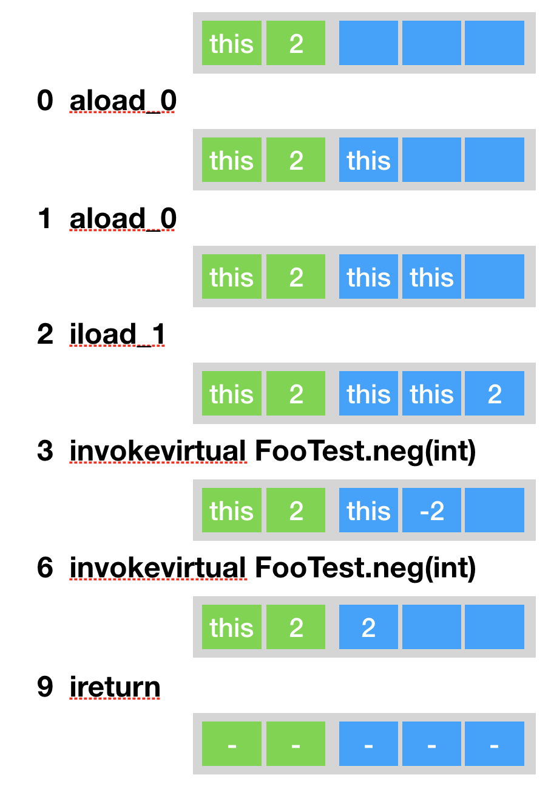

### Java 字节码简介

**Java相关指令**:

* 类相关指令

new（后跟目标类，生成该类的未初始化的对象）,instanceof(后跟目标类，判断栈顶元素是否为目标类/接口的实例，是则压入1，否则压入0)，checkcast（后跟目标类，判断栈顶元素是否为目标类/接口实例，如果不是便抛出异常）,athow(将栈顶异常抛出)，monitorenter(将栈顶对象加锁)和monitorexit（将栈顶对象解锁）。

* 字段访问指令

即包括静态字段访问指令getstatic、putstatic和实例字段访问指令getfield，putfield，这四条指令均附带用以定位目标字段的信息，当消耗的操作数栈元素是不同的。

以putfield为例，如下图，它会将值存储至对象obj的目标字段之中：


* 方法指令

包括invokestatic,invokespecial,invokevirtual,invokeinterface,invokedynamic。除invokedynamic外，其它的方法调用指令所消耗的操作数栈元素是根据调用类型以及目标方法描述符来确定的。在进行方法调用之前，程序需要依次压入调用者(invokestatic不需要)，以及各个参数。

```java
public int neg(int i){
        return -i;
    }
    public int foo(int i){
        return neg(neg(i));
    }
```

```java
public int foo(int);
    descriptor: (I)I
    flags: ACC_PUBLIC
    Code:
      stack=3, locals=2, args_size=2
         0: aload_0//加载局部表里第0个元素到操作数栈顶
         1: aload_0//加载局部表里第0个元素到操作数栈顶
         2: iload_1//将局部变量表第1位置int型数据加载到操作数栈
         3: invokevirtual #2                  // Method neg:(I)I
         6: invokevirtual #2                  // Method neg:(I)I
         9: ireturn

```

以上面这段代码为例，当调用foo(2)时，每条指令执行前后局部变量表以及操作数栈的分别如下：



* 数组相关指令

包括新建基本类型数组的newarray，新建引用型数组de anewarray，生成多维数组的multianewarray，以及求数组长度的arraylength。另外还包括数组的加载指令以及存储指令。


* 控制流指令

包括无条件跳转goto，条件跳转指令，tableswitch和lookupswtich（前者针对密集的cases，后者针对稀疏的cases）,返回指令，其中返回指令的区别分类型：


处返回指令外，其它的控制流指令均附带一个或者多个字节码偏移量，代表需要跳转到的位置。如下abs方法：当栈顶的元素小于0时，跳转到偏移量为6的字节码处。

```
 public int abs(int i){

        if (i > 0){
            return 1;
        }
        return -1;
    }
```

```java
public int abs(int);
    descriptor: (I)I
    flags: ACC_PUBLIC
    Code:
      stack=1, locals=2, args_size=2
         0: iload_1
         1: ifle          6
         4: iconst_1
         5: ireturn
         6: iconst_m1
         7: ireturn
```

