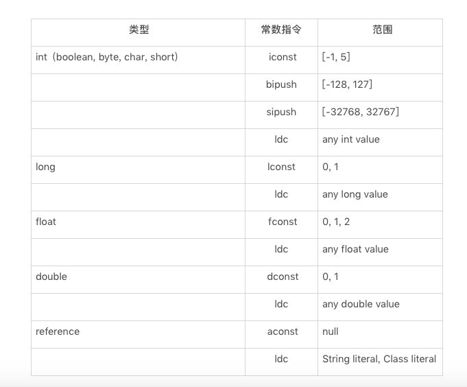

#### Java内存区域

数据存储区域，对于这一块区域的划分，各个虚拟机有各自的划分方式，不过它们都必须遵从JAVA虚拟机的基本规范去实现。


1. 程序计数器

可以看作是当前线程所执行的字节码的指示器，即字节码解释器工作时，通过改变这个指示器的值来选取下一条需要执行的字节码指令。如：循环、跳转、异常处理、线程恢复等。Java虚拟机的多线程运行是通过轮流切换线程并分配处理器执行的时间来实现的，为了保证当线程挂起并唤醒后，可以在它原来正确的位置继续执行，因此它是线程私有的。

如果线程线程执行的是方法，计算器记录的是当正在执行的虚拟机字节码指令的地址，如果执行的是native方法，则这个计数器为空。

**注**：程序计数器是唯一一个不会出现OutOfMemoryError的内存区域，它的生命周期随着线程的创建而创建，随着线程的结束而死亡。

2. Java虚拟机栈

与程序计数器一样，Java虚拟机栈也是线程私有的，并且生命周期与线程相同。虚拟机栈描述的是Java方法执行的内存模型：每个方法执行的同时会创建一个栈帧，用于存放局部变量表，操作数栈，动态链接、方法出口等信息。

* 局部变量表：存放了编译器可知的基本类型数据（boolean、byte、char、int、float、long、double）、对象引用，returnAddress类型（指向了一条字节码指令的地址）。其中64位的double、long占用2个局部变量空间（Slot），其余数据类型占用1个。局部变量的内存空间在编译期就确定了，在运行期不会改变它的大小。

字节码程序可以将计算的结果缓存在局部变量表中。实际上，Java虚拟机将局部变量表当成一个数组，依次存放this指针(仅非静态方法)，所传入的参数，以及字节码中的局部变量。

```java
public void foo(long l,float f){
        {
            int i = 0;
        }
        
        {
            String s = "hello world";
        }
    }
```

上面这段代码为例，由于它是一个实例方法，因此局部变量数组的第0个单元存放者this指针，第一个参数long类型于是数组的1、2两个单元存放着所有传入的long类型参数的值，第二个参数则是float类型，于是数组的第三个单元存放者所传入的float类型参数的值。在方法体中的两个代码块中，我们分别定义了两个局部变量1和s，由于这两个局部变量的生命周期没有重合之处，Java编译器可以将它们编排至同一个单元中，也就是说局部变量数组的第4个单元将为i或者s。


通常存储在局部变量表的值需要加载到操作数栈中方能进行计算，得到结果后再存储到局部变量数组中。这些加载、存储指令是区分类型的，如：int类型的加载指令为iload，存储指令为istore。


加载局部变量数组时，需要指定所加载单元的下标，比如：aload0指加载第0个单元所存储的引用。

在Java字节码中唯一能够直接作用于局部变量表的指令是iinc M N(M 是非负整数，N为整数)。该指令是将局部变量数组中的第M个单元中的int值增加N,常用于for循环中自增量的更新。

```java
public void foo(){
        for (int i = 100; i>= 0;i--){
        }
    }

public void foo();
    descriptor: ()V
    flags: ACC_PUBLIC
    Code:
      stack=1, locals=2, args_size=1
         0: bipush        100//直接操作操作数栈，设置值100
         2: istore_1//将100存放到局部变量数组下标为1的地方
         3: iload_1//再加载局部变量数组下标为1的元素
         4: iflt          13//如果小于，跳到字节码偏移13，即返回结果
         7: iinc          1, -1//否则直接作用于局部变量表，将值减一
        10: goto          3//跳到字节码偏移3
        13: return
```


再来看一个例子

```java
 public static int bar(int i){
        return ((i+1)-2)*3/4;
    }

public static int bar(int);
    descriptor: (I)I
    flags: ACC_PUBLIC, ACC_STATIC
    Code:
      stack=2, locals=1, args_size=1
         0: iload_0//将局部变量表第0个元素加载到操作数栈顶
         1: iconst_1//将1加载到操作数栈顶
         2: iadd//相加
         3: iconst_2//将2加载到操作数栈顶
         4: isub//相减
         5: iconst_3//将3加载到操作数栈顶
         6: imul//相乘
         7: iconst_4//将4加载到操作数栈顶
         8: idiv//相除
         9: ireturn

```

字节码中的stack=2，locals=1代表该方法需要的操作数栈空间为2，局部变量数组空间为1。因为bar方法是一个静态方法，所以局部变量表中的第一个存的不是this指针。如下，以bar(5)为例：


* 操作数栈：它是一个后进先出（LIFO）栈，而它的长度也是在编译时期就写入了class文件当中，是固定的。它的作用就是提供字节码指令操作变量计算的空间

Java字节码是Java虚拟机栈所使用的指令集，在解释执行过程中，每当为Java方法分配栈帧时，Java虚拟机往往需要开辟一块额外的空间作为操作数栈，来存放计算的操作数以及返回结果。具体来说执行每一条指令之前，Java虚拟机要求该指令的操作数已被压入操作数栈中，在执行指令时，Java虚拟机会将该指令所需的操作数弹出，并且将指令的结果重新压入栈中。


以加法指令iadd为例，假设在执行该指令前，栈顶的两个元素分别是int值1和int 值2，那么iadd指令将弹出这两个int，并将求得的和int值3压入栈中。


Java字节码中有好几条指令是直接作用在操作数栈上的，最常见的便是dup：复制栈顶元素，以及pop：舍弃栈顶元素。

dup指令常用于复制new指令生成的未经过初始化的引用。当执行new指令时，Java虚拟机将指向一块已分配的、未初始化的内存的引用压入到操作数栈中。

```java
public void foo(){
	Object o = new Object();
}
public void foo();
    descriptor: ()V
    flags: ACC_PUBLIC
    Code:
      stack=2, locals=2, args_size=1
         0: new           #2              // class java/lang/Object
         3: dup
         4: invokespecial #1              // Method java/lang/Object."<init>":()V
         7: astore_1
         8: return


```

如上：当new指令产生一个还没有进行初始化的引用后，接着调用dup指令复制new指令的结果，然后将这个引用作为调用者去调用其构造方法，也就是上面的invokespecial指令，当调用返回后，操作数栈上仍有原本由new指令生成的引用。

pop指令则常用于舍弃调用指令返回的结果，如下：

```java
 public void foo(){
       bar();
    }

    public static boolean bar(){
        return false;
    }

public void foo();
    descriptor: ()V
    flags: ACC_PUBLIC
    Code:
      stack=1, locals=1, args_size=1
         0: invokestatic  #2                  // Method bar:()Z
         3: pop
         4: return

```

如上我们在foo方法中调用了静态方法bar，但是却不用其返回值，对应invokestatic指令，该指令仍旧会把返回值压入到foo方法的操作数栈中，因此Java虚拟机需要额外的执行pop指令，将返回值舍弃。

在Java字节码中，有一部分指令可以直接将常量加载到操作数栈上，以int型为例，Java虚拟机既可以通过iconst指令加载-1至5之间的int值，也可以通过bipush、sipush加载一个字节、两个字节所能代表的int值。

Java虚拟机还可以通过Idc加载常量池中的常量，如：Idc#18将加载常量池中的第18项。

这些常量包括int型、long型、float型、double型、String型以及Class型的常量，如下：



正常情况下，操作数栈的压入弹出都是一条条指令完成的，唯一的例外情况就是在抛出异常时，Java虚拟机会清除操作数栈上的所有内容，而后将异常实例压入到操作数栈上。

Java虚拟机栈会抛出两种异常：StackOverFlowError和OutOfMemoryError

* 若Java虚拟机栈的内存大小不允许动态扩展，那么当线程请求栈的深度超过当前Java虚拟机栈的最大深度的时候，就会抛出StackOverFlowError。
* 若Java虚拟机栈的内存大小允许动态扩展，且当线程请求栈时内存用完了，无法再动态扩展了，此时抛出OutOfMemoryError异常。

3. 本地方法栈

和虚拟机栈发挥的作用相似，区别是：虚拟机栈为虚拟机执行Java方法服务，而本地方法栈则为虚拟机使用到的Native方法服务。在HotSpot虚拟机中和Java虚拟机栈合二为一。

本地方法被执行时，在本地方法栈也会创建一个栈帧，用来存放本地方法的局部变量表、操作数栈、动态链接、出口信息。

方法执行完毕后相应的栈帧也会出栈并释放内存空间，也会出现 StackOverFlowError 和 OutOfMemoryError 两种异常。

4. 堆

Java虚拟机所管理的内存中最大的一块，Java堆是所有线程共享的一块内存区域，在虚拟机启动时创建。此内存区域的唯一目的就是存放对象实例，几乎所有的对象实例以及数组都在这里分配内存。

Java堆是垃圾收集器管理的主要区域，因此也被称为GC堆。从垃圾回收的角度，由于现在收集器基本都是采用分代垃圾收集算法，所以Java堆还可以细分为：新生代和老年代。再细致一点：Eden空间、From Survivor、To Survivor空间。


在JDK1.8中移除整个永久代，取而代之的是一个叫做元空间（Metaspace)的区域,(永久代使用的是jvm的堆空间，而元空间使用的是物理内存，直接受到本机的物理内存的限制)

参考：<http://www.cnblogs.com/paddix/p/5309550.html>

5. 方法区

方法区与java堆一样，是各个线程共享的内存区域，它用于存储已被虚拟机加载的类信息、常量、静态变量、即时编译器编译后的代码等数据。虽然Java虚拟机规范把方法区描述为堆的一个逻辑部分，但是它却有另外一个别名Non-Heap(非堆)，目的是与Java堆区分开来。

HotSpot虚拟机中方法区也常被称为永久代，本质上两者并不相等。仅仅是因为HotSpot虚拟机设计团队用永久代来实现方法区而已，这样HotSpot虚拟机的垃圾回收器就可以像管理Java堆一样管理这部分内存。但是这样做容易导致内存溢出问题。

相对而言，垃圾收集行为在这个区域是比较少出现的，但并非数据进入方法区后就永久存在了。

6. 运行时常量池

运行时常量池是方法区的一部分。Class文件中除了有类、字段、方法、接口等描述信息外，还有常量池信息（用于存放编译期生成的各种字面量和符合引用）

既然运行时常量池是方法区的一部分，自然受到方法区内存的限制，当常量池无法申请到内存时，会抛出OutOfMemoryError异常。

Jdk1.7之后版本的JVM将运行时常量从方法区移除了，在Java堆中开辟了一块区域来存放运行时常量池。


7. 直接内存

直接内存并不是虚拟机运行时数据的一部分，也不是虚拟机规范中定义的内存区域，但是这部分可以被频繁地使用。可能导致OutOfMemoryError。

JDK1.4中新加入的NIO类引入了一种基于通道与缓存区的i/o方式，它可以直接使用Native函数库直接分配堆外内存，然后通过一个存储在Java堆中的DirectByteBuffer对象作为这块内存的引用进行操作，避免了在Java堆和Native堆之间来回复制数据。

直接内存的分配不会受到Java堆的限制，但是，既然内存就会受到本机总内存大小以及处理器寻址空间的限制。

