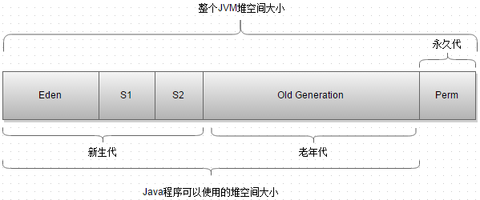

#### Java垃圾回收

当代主流虚拟机(Hotspot VM)的垃圾回收都采用"分代回收"的算法。分代回收是基于对象的生命周期不同，所采取不同的回收方式，提高回收效率。

JDK1.8之前的堆内存示意图：

* 新生代：

大多数对象在新生代中被创建，其中很多对象的生命周期很短。每次新生代的垃圾回收(Minor GC)后，只有少量对象存活。所以在新生代一般采用复制算法，只需要少量的复制成本就可以完成回收。

新生代分为三个区：一个Eden区，两个Survivor区。大部分的对象在Eden区中生成，当Eden区满时，还有存活的对象将被复制到两个Survivor中的一个。当这个Survivor区满时，此区的存活并且还不满足晋升条件的对象将复制到另外一个Survivor区，对象每经历一次MinorGC，年龄加1，达到“晋升年龄阀值”后，对象将被放到“老年代”。“晋升年龄阀值”的大小直接影响对象在新生代中停留的时间，在Serial和ParNewGC两种回收器中，晋升年龄阀值通过参数MaxTenuringThreshold设定，默认值为15。

* 老年代

在新生代中经历N次垃圾回收后仍然存活的对象，就会被放到老年代，该区对象的存活率高。老年代的垃圾回收（Mahor GC）通常使用“标记-清理”或者“标记-整理”算法。整堆包括新生代和老年代的垃圾回收称为full GC(HotSpot VM，除了CMS外，其它能收集老年代的GC都会同时收集整个GC堆，包括新生代)。

* 永久代

主要存放元数据，例如：Class、Method的元信息，与垃圾回收要回收的Java对象关系不大。相对于新生代与老年代来说，该区域的划分对垃圾回收影响比较小。

