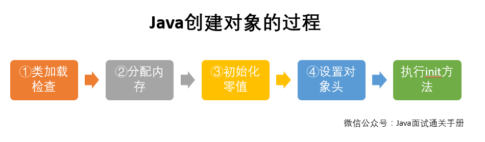

#### Java对象创建

一、对象的创建

1. 虚拟机遇到new指令，首先会去检查这个指令的参数能否在常量池中定位到一个类的符号引用，并且这个引用代表的类是否已经加载，如果没有，就先执行加载过程。
2. 类加载完之后，需要对对象分配内存,对象所需的内存大小在类加载完后可确定。对象内存分配有2种策略：

* 指针碰撞：假设Java堆中内存是完整的，已使用和未使用的内存个在一侧，然后在为新的对象分配内存的时候，根据对象所需要的大小向空闲方向移动指针（对象所需要的内存大小在类加载完之后就可以确定了，根据元数据来计算）。
* 空闲列表：如果Java堆中的内存不是完整的，则虚拟机需要维护一个表来记录哪些内存是可用的，在分配的时候从列表中找出一块足够大的空间给对象，并更新列表。

选择哪种方式由堆是否规整决定，而堆是否规整则由垃圾收集器是否带有压缩整理功能，如：Serial、parNew等带Compact算法的收集器，采用的是指针碰撞而CMS基于Mark-Sweep采用空闲列表。除了如何划分内存外，还需要考虑并发情况，假如在为对象A划分内存时，指针还没来得及更新，然后对象B又用原来的指针分配内存。解决这个问题有2种方案：

* 同步处理
* 为每个线程初始化一块小内存，只有当这块内存用完后，再进行同步分配新的内存。

3. 初始化零值

内存分配完之后，虚拟机需要将分配的内存空间都初始化为零值（不包括对象头），这一步保证了对象的实例字段在Java代码中可以不赋初始值就直接使用，程序能访问这些字段的数据类型所对应的零值。

4. 设置对象头

初始化零值后，虚拟机要对对象进行必要的设置，例如：这个对象是哪个类的实例、如何才能找到类的元数据、对象的哈希值，对象的GC分代年龄等信息。这些信息都存放在对象头中。

5. 执行init方法：在上面工作都完成之后，从虚拟机的视角来看，一个新的对象已经产生，但从Java程序的视角来看，对象创建才刚开始，<init>方法还没有执行，所有的字段还都是零。一般来说，执行new操作之后会接着执行<init>方法，把对象按照程序员的意愿进行初始化，这样一个真正的对象才算完全产生出来。

二对象的内存布局

对象在内存中的布局分为三块：对象头、实例数据、对齐填充。

1、对象头：对象头分为两部分，第一部分存储对象运行时数据，如：哈希码，Gc分带年龄、锁状态标志、线程持有的锁、偏向线程Id、偏向时间戳等。这部分数据的长度在32位和64位操作系统中分别是32位和64位，由于对象在运行期需要存放的数据比较多，它会根据对象的状态来复用自己的存储空间，

#### 对象的内存布局

在hotspot虚拟机中，对象在内存中的布局可以分为3块：对象头、实例数据和对齐填充。

Hotspot虚拟机的对象头包括两部分信息：第一部分用于存储对象自身运行时数据（哈希码、GC分代年龄，锁状态标志等等），另一部分就是类型指针，即对象指向它的类元数据的指针虚拟机通过这个指针来确定对象是哪个类的实例。

实例数据部分是对象真正存储的有效信息，也是程序中所定义的各种类型的字段内容。

对齐填充部分是必然存在的，没什么特殊含义，仅仅起占位置的作用。Hotspot虚拟机的自动内存管理系统要求对象起始地址必须是8字节的整数倍，换句话说就是对象的大小必须是8字节的整数倍，而对象头正好是8字节的倍数，因此，当对象实例数据部分没有对齐时，就需要通过对齐来填充。

#### 对象的访问定位

通过栈中的引用访问堆中的对象有2种方式：句柄和直接指针

1、句柄：如果使用句柄，则需要在堆中维护一个句柄池，栈中的对象指向了句柄池中句柄地址，而句柄包含了实例对象和类型数据的地址信息。

2、直接指针访问

栈中的对象指向堆中的对象，堆中的对象必须考虑如何访问、放置类型数据。

区别：

采用句柄池，栈中存放的是句柄的地址，如果对象被移动了，不需要要改栈中的引用地址，只需要改句柄中的地址，而采用直接指针，省去了一次指针定位的时间开销，如果Java虚拟机频繁去查找对象，可以省去很多查询时间。