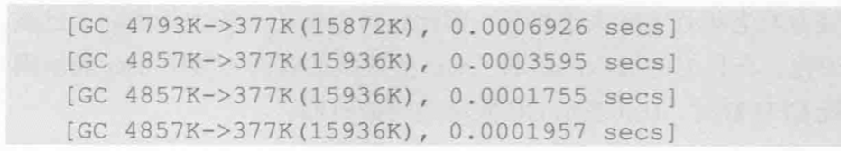

### Java 虚拟机参数

#### 跟踪垃圾回收

1. 打印垃圾回收参数：-XX:+PrintGC



如上日志显示，一共进行了4次GC，每次GC占用一行，在GC前，堆空间使用约4M，GC后，堆空间使用量为377k，当前可用的堆空间和约为16M，最后是本次GC所花费的时间。

同样可以使用-XX:PrintGCDetails参数打印出详细的GC日志：

```java
[GC (System.gc()) [PSYoungGen: 6809K->384K(38400K)] 6809K->392K(125952K), 0.0151906 secs] [Times: user=0.00 sys=0.00, real=0.01 secs] 

[Full GC (System.gc()) [PSYoungGen: 384K->0K(38400K)] [ParOldGen: 8K->284K(87552K)] 392K->284K(125952K), [Metaspace: 2634K->2634K(1056768K)], 0.0101346 secs] [Times: user=0.00 sys=0.00, real=0.01 secs] 
gc
```

[GC 和[Full GC 说明了这次垃圾收集的停顿类型，如果有"Full"，说明这次GC是发生了Stop-The-World的(一般是发生分配担保失败之类的问题，才导致STW)，如果是调用System.gc()方法所触发的收集，那么会显示"[Full GC (System)]"(我们应该禁止使用System.gc()方法，它会触发full GC)。

接下来"[PSYoungGen“表示GC发生的区域，例如使用Serial收集器，新生代名称为“Default New Generation”，所以显示的是"[DefNew"。如果是ParNew收集器，新生代名称就会变为"[ParNew"，意义为"Parallel New Generation"。如果采用Parallel Scavenge收集器，那它配套的新生代名称为"PSYoungGen"，老年代和永久代同理，名称也是由收集器决定的。

方括号内部的6809k->384k(38400k)含义是该内存区域已使用容量->GC后该内存区域已使用容量（该内存区域总容量）。而方括号之外的6809k->392k(125952k)表示GC前堆已使用容量-> GC后Java堆已使用容量(Java堆总容量。

再往后，"0.0025925 secs"表示该内存内存区域GC所占有的时间，单位是秒。有的收集器会给出具体的时间数据，如：[Times: user=0.01 sys=0.00, real=0.01 secs]，这里面的user、sys和real分别代表用户态消耗的CPU时间、内核态消耗的CPU时间和操作从开始到结束所经过的墙钟时间。CPU时间和墙钟时间的区别是：墙钟时间包括各种非运算的等待耗时，例如：等待磁盘I/O、等待线程阻塞，而CPU时间不包括这些耗时。

2. 打印GC发生的时间

如果需要分析GC发生的时间，还可以使用-XX:+PrintGCTimeStamps参数，该参数会在GC时，额外的输出GC发生时间，该时间是虚拟机启动后的时间偏移量。

```
0.142: [GC (Allocation Failure) [PSYoungGen: 7675K->912K(9216K)] 7675K->1432K(19456K), 0.0013736 secs] [Times: user=0.00 sys=0.00, real=0.00 secs] 
Heap
```

如果我们需要关注应用程序的执行时间和停顿时间，使用参数-XX:+PrintGCApplicationConcurrentTime 可以打印应用程序的执行时间，使用参数-XX:+PrintGCApplicationStoppedTime可以打印应用程序由于GC而产生的停顿时间。

```
Application time: 0.0225753 seconds
[GC (Allocation Failure) [PSYoungGen: 7675K->912K(9216K)] 7675K->1432K(19456K), 0.0013057 secs] [Times: user=0.00 sys=0.00, real=0.00 secs] 
Total time for which application threads were stopped: 0.0014421 seconds, Stopping threads took: 0.0000120 seconds
```

3. 保存GC日志

默认情况下，GC日志会在控制台中输出，为此虚拟机允许将GC日志以文件的形式输出，可以使用参数-Xloggc指定：-Xloggc:/Users/user/Documents/gc.log

4. 最大堆和初始堆的设置

-Xms 指定堆初始大小，一般情况下，虚拟机会尽可能维持在初始空间范围内运行。

-Xmx 指定堆最大可使用空间。

```java
public static void heapAlloc(){
    //-Xms5M -Xmx20M  -XX:SurvivorRatio=8 -XX:+PrintGCDetails -XX:+UseSerialGC
		//最大可使用空间(Xmx)
		System.out.print("maxMemory=");
		System.out.println(Runtime.getRuntime().maxMemory());
    	//空闲空间
		System.out.print("free mem=");
		System.out.println(Runtime.getRuntime().freeMemory());
    	//当前堆的空间（Xms）
		System.out.print("total mem=");
		System.out.println(Runtime.getRuntime().totalMemory());
		
		byte[] b = new byte[1024*1024*1];
		System.out.println("分配老1M空间给数组");
		
		System.out.print("maxMemory=");
		System.out.println(Runtime.getRuntime().maxMemory());
		System.out.print("free mem=");
		System.out.println(Runtime.getRuntime().freeMemory());
		System.out.print("total mem=");
		System.out.println(Runtime.getRuntime().totalMemory());
		
		b = new byte[1024*1024*1];
		System.out.println("分配老1M空间给数组");
		
		System.out.print("maxMemory=");
		System.out.println(Runtime.getRuntime().maxMemory());
		System.out.print("free mem=");
		System.out.println(Runtime.getRuntime().freeMemory());
		System.out.print("total mem=");
		System.out.println(Runtime.getRuntime().totalMemory());
		
	}
```

执行结果：

```json
maxMemory=20316160
free mem=5591768
total mem=6094848
分配老1M空间给数组
maxMemory=20316160
free mem=4543176 //创建数组占用了空间
total mem=6094848
[GC (Allocation Failure) [DefNew: 1515K->192K(1856K), 0.0015722 secs] 1515K->1310K(5952K), 0.0016026 secs] [Times: user=0.00 sys=0.00, real=0.00 secs] 
分配老1M空间给数组
maxMemory=20316160
free mem=3670888
total mem=6094848
Heap
 def new generation   total 1856K, used 1282K [0x00000007bec00000, 0x00000007bee00000, 0x00000007bf2a0000)
  eden space 1664K,  65% used [0x00000007bec00000, 0x00000007bed10ae8, 0x00000007beda0000)
  from space 192K, 100% used [0x00000007bedd0000, 0x00000007bee00000, 0x00000007bee00000)
  to   space 192K,   0% used [0x00000007beda0000, 0x00000007beda0000, 0x00000007bedd0000)
 tenured generation   total 4096K, used 1118K [0x00000007bf2a0000, 0x00000007bf6a0000, 0x00000007c0000000)
   the space 4096K,  27% used [0x00000007bf2a0000, 0x00000007bf3b7840, 0x00000007bf3b7a00, 0x00000007bf6a0000)
 Metaspace       used 2644K, capacity 4486K, committed 4864K, reserved 1056768K
  class space    used 286K, capacity 386K, committed 512K, reserved 1048576K
```

5. 新生代配置

参数-Xmn可以设置新生代的大小，设置一个新生代会减少老年代的大小。新生代的大小一般设置为整个堆空间的1/3到1/4。

参数-XX:SurvivorRatio用来设置新生代中eden空间和from/to空间的比例关系，默认是8:1:1。

```java
//-Xms20M -Xmx20M  -Xmn1M -XX:SurvivorRatio=2 -XX:+PrintGCDetails -XX:+UseSerialGC
public static void newSize(){
		byte[] b = null;
		for(int i = 0;i<10;i++){
			b = new byte[1024*1024];
		}
	}
```

执行结果：

```json
Heap
 def new generation   total 768K, used 498K [0x00000007bec00000, 0x00000007bed00000, 0x00000007bed00000)
  eden space 512K,  97% used [0x00000007bec00000, 0x00000007bec7c8d8, 0x00000007bec80000)
  from space 256K,   0% used [0x00000007bec80000, 0x00000007bec80000, 0x00000007becc0000)
  to   space 256K,   0% used [0x00000007becc0000, 0x00000007becc0000, 0x00000007bed00000)
 tenured generation   total 19456K, used 10240K [0x00000007bed00000, 0x00000007c0000000, 0x00000007c0000000)
   the space 19456K,  52% used [0x00000007bed00000, 0x00000007bf7000a0, 0x00000007bf700200, 0x00000007c0000000)
 Metaspace       used 2643K, capacity 4486K, committed 4864K, reserved 1056768K
  class space    used 286K, capacity 386K, committed 512K, reserved 1048576K
```

上面配置-XX:SurvivorRatio=2 -Xmn1M，表示eden与from的比值为2:1，新生代总容量为1M，所以eden区的值为512kb，新生代可用的空间大小为：512kb+256kb = 768kb。

由于eden区无法容纳任何一个程序中分配的1MB数组，因此所有的数组都分配在老年代，老年代最终占用10240kb空间。

````java
//-Xms20M -Xmx20M  -Xmn7M -XX:SurvivorRatio=2 -XX:+PrintGCDetails -XX:+UseSerialGC
````

执行结果：

```json
[GC (Allocation Failure) [DefNew: 2590K->1309K(5376K), 0.0027331 secs] 2590K->1309K(18688K), 0.0028973 secs] [Times: user=0.00 sys=0.00, real=0.00 secs] 
[GC (Allocation Failure) [DefNew: 4452K->1024K(5376K), 0.0012952 secs] 4452K->1307K(18688K), 0.0013167 secs] [Times: user=0.00 sys=0.00, real=0.00 secs] 
[GC (Allocation Failure) [DefNew: 4158K->1024K(5376K), 0.0003002 secs] 4442K->1307K(18688K), 0.0003196 secs] [Times: user=0.00 sys=0.00, real=0.00 secs] 
Heap
 def new generation   total 5376K, used 3209K [0x00000007bec00000, 0x00000007bf300000, 0x00000007bf300000)
  eden space 3584K,  60% used [0x00000007bec00000, 0x00000007bee224c8, 0x00000007bef80000)
  from space 1792K,  57% used [0x00000007bf140000, 0x00000007bf240010, 0x00000007bf300000)
  to   space 1792K,   0% used [0x00000007bef80000, 0x00000007bef80000, 0x00000007bf140000)
 tenured generation   total 13312K, used 283K [0x00000007bf300000, 0x00000007c0000000, 0x00000007c0000000)
   the space 13312K,   2% used [0x00000007bf300000, 0x00000007bf346f28, 0x00000007bf347000, 0x00000007c0000000)
 Metaspace       used 2643K, capacity 4486K, committed 4864K, reserved 1056768K
  class space    used 286K, capacity 386K, committed 512K, reserved 1048576K
```

从上面gc日志可以看到新生代最大可用空间为：3584k+1792k=5376k，它能存放1MB大小的对象，但是无法存放10MB的内存，所以在整个过程中发生了3次GC，但是每次GC过后，只会保留当前引用执行的内存对象，即1024kb大小的对象，它刚好可以被survivo区存储，所以可以发现整个内存分配都在新生代进行，通过GC保证了新生代有足够的空间，而老年代没有为这些数组预留任何空间，只是在GC过程中，部分新生代晋升到老年代。

```java
//-Xms20M -Xmx20M  -Xmn15M -XX:SurvivorRatio=8 -XX:+PrintGCDetails -XX:+UseSerialGC
```

执行结果：

```json
Heap
 def new generation   total 13824K, used 10977K [0x00000007bec00000, 0x00000007bfb00000, 0x00000007bfb00000)
  eden space 12288K,  89% used [0x00000007bec00000, 0x00000007bf6b87a8, 0x00000007bf800000)
  from space 1536K,   0% used [0x00000007bf800000, 0x00000007bf800000, 0x00000007bf980000)
  to   space 1536K,   0% used [0x00000007bf980000, 0x00000007bf980000, 0x00000007bfb00000)
 tenured generation   total 5120K, used 0K [0x00000007bfb00000, 0x00000007c0000000, 0x00000007c0000000)
   the space 5120K,   0% used [0x00000007bfb00000, 0x00000007bfb00000, 0x00000007bfb00200, 0x00000007c0000000)
 Metaspace       used 2643K, capacity 4486K, committed 4864K, reserved 1056768K
  class space    used 286K, capacity 386K, committed 512K, reserved 1048576K
```

这次执行，新生代使用15MB的空间，其中eden区占用了12288K，完全满足10MB数组的分配，因此所有的分配行为都在eden直接进行，没有出发任何GC。

在实际工作中，基本策略是：尽可能的将对象预留在新生代，减少老年代的GC的次数。

```son
  xxxxxxxxxx -XX:NewRatio=2
```

JVM中还可以设置新生代与老年代的比例，如上：新生代与老年代的比例是1:2。

#### 堆溢出处理

在Java程序的运行过程中，如果堆空间不足，有可能抛出内存溢出错误（Out Of Memory)，

```java
Exception in thread "main" java.lang.OutOfMemoryError: Java heap space
```

在发生错误时，需要获取信息以帮助研发人员排查现场问题，Java虚拟机提供了参数-XX:+HeapDumpOnOutOfMemoryError，使用该参数可以在内存溢出时导出整个堆的信息。和它配合使用的还有 -XX:HeapDumpPath=/Users/user/Documents/a.dump，可以指定堆的存放地址：

```java
//-Xms5M -Xmx20M  -Xmn15M -XX:SurvivorRatio=8 -XX:+PrintGCDetails -XX:+UseSerialGC -XX:+HeapDumpOnOutOfMemoryError -XX:HeapDumpPath=/Users/user/Documents/a.dump
public static void testMemory(){
		Vector ver = new Vector<>();
		for(int i =0; i<25; i++){
			ver.add(new byte[1024*1024]);
		}
		
	}
```

#### 直接内存配置

直接内存跳过Java 堆，使Java程序可以直接访问原生堆空间(NIO)，因此从一定程度上加快了内存空间的访问速度。

最大可用直接内存可以使用参数-XX:MaxDirectMemorySize设置，如不设置，默认值为最大堆空间，即-Xmx，当直接内存使用值达到XX:MaxDirectMemorySize时，就会触发垃圾回收，如果垃圾回收不能有效释放足够的空间，直接内存依然会引起OOM。

```java
//访问直接内存
public void directAccess(){
		
		long starttime = System.currentTimeMillis();
		ByteBuffer b = ByteBuffer.allocateDirect(500);
		for(int i = 0;i<100000;i++){
			for(int j = 0; j<99;j++)
				b.putInt(j);
			b.flip();
			for(int j= 0;j<99;j++)
				b.getInt();
			b.clear();
		}
		long endtime = System.currentTimeMillis();
		System.out.println("testDirectWrite"+(endtime - starttime));
		
	}
	
	//访问堆内存
	public void bufferAccess(){
		
		long starttime = System.currentTimeMillis();
		ByteBuffer b = ByteBuffer.allocate(500);
		for(int i = 0;i<100000;i++){
			for(int j = 0; j<99;j++)
				b.putInt(j);
			b.flip();
			for(int j= 0;j<99;j++)
				b.getInt();
			b.clear();
		}
		long endtime = System.currentTimeMillis();
		System.out.println("testBufferWrite"+(endtime - starttime));
		
	}
```

执行结果：

```
testDirectWrite34
testBufferWrite44
```

从执行结果可以看出直接内存的访问比堆内存要快。

虽然在访问上直接内存比较快，但是在内存空间申请时，直接内存反而比堆内存要慢：

```java
public void directAllocate(){
		long starttime = System.currentTimeMillis();
		for(int i =0; i<200000;i++){
			ByteBuffer b = ByteBuffer.allocateDirect(1000);
		}
		long endtime = System.currentTimeMillis();
		System.out.println("directAllocate:"+(endtime-starttime));
	}
	
	public void bufferAllocate(){
		long starttime = System.currentTimeMillis();
		for(int i =0; i<200000;i++){
			ByteBuffer b = ByteBuffer.allocate(1000);
		}
		long endtime = System.currentTimeMillis();
		System.out.println("bufferAllocate:"+(endtime-starttime));
	}
```

执行结果：

```son
bufferAllocate:71
directAllocate:315
```

可以看到在申请内存空间时，堆空间的速度远远高于直接内存，由此可以得出结论：直接内存适合申请次数较少、访问较频繁的场合。如果内存空间本身需要频繁申请，则不适合使用直接内存。

### 内存分配回收策略

#### 对象优先在Eden分配

```java
public class GCDemo {
	
	//-verbose:gc  -Xms20M -Xmx20M -Xmn10M -XX:+PrintGCDetails -XX:SurvivorRatio=8 -XX:+UseSerialGC
	//堆大小固定在20M，新生代大小分配10M，eden和survivor的比例是8:1(默认)  ,JDK1.8
	private static final int _1MB = 1024*1024;
	public static void main(String[] args){
		testAllocation();
	}
	
	public static void testAllocation(){
		
		byte[] allocation1,allocation2,allocation3,allocation4;
		allocation1 = new byte[2*_1MB];
		allocation2 = new byte[2*_1MB];
		allocation3 = new byte[2*_1MB];
		allocation4 = new byte[4*_1MB];	
	}
}
```

执行结果：

```json
[GC (Allocation Failure) [DefNew: 7127K->528K(9216K), 0.0027078 secs] 7127K->6672K(19456K), 0.0027316 secs] [Times: user=0.00 sys=0.00, real=0.00 secs] 
Heap
 def new generation   total 9216K, used 4706K [0x00000000fec00000, 0x00000000ff600000, 0x00000000ff600000)
  eden space 8192K,  51% used [0x00000000fec00000, 0x00000000ff014930, 0x00000000ff400000)
  from space 1024K,  51% used [0x00000000ff500000, 0x00000000ff584250, 0x00000000ff600000)
  to   space 1024K,   0% used [0x00000000ff400000, 0x00000000ff400000, 0x00000000ff500000)
 tenured generation   total 10240K, used 6144K [0x00000000ff600000, 0x0000000100000000, 0x0000000100000000)
   the space 10240K,  60% used [0x00000000ff600000, 0x00000000ffc00030, 0x00000000ffc00200, 0x0000000100000000)
 Metaspace       used 2601K, capacity 4486K, committed 4864K, reserved 1056768K
  class space    used 288K, capacity 386K, committed 512K, reserved 1048576K

```

-Xms20M -Xmx20M -Xmn10M 分别指定JVM启动时分配的内存、JVM运行过程中分配的最大内存、年轻代的大小。XX:SurvivorRatio决定了新生代中Eden区与一个Survivor区的空间比例是8:1。-XX:+UseSerialGC指定使用SerialGC垃圾回收器。

从上面的执行结果可以看出，新生代按照：8:1:1的比例来分配的，即：eden space 8192K 、from space 1024K、to space 1024K，所以新生代可以使用的空间为9216k(Eden+1个Survivor区的总容量)。

按照创建对象的顺序，当执行allocation4 = new byte[4*_1MB];时，新生代已经存放了6M的数据，剩下的空间不够存放allocation4，所以垃圾回收器执行了一次MinorGC，由于allocation1、allocation2、allocation3仍然是存活的状态并且survivor没有足够的容量来存储这些对象，因此它们直接进入老年代，因此老年代大概使用了6M的空间，而新增的allocation4存放在新生代。


#### 大对象直接进入老年代

大对象是指需要大量连续内存空间的Java对象，经常出现大对象容易导致内存还有不少空间就提前触发垃圾收集以收获足够的连续空间来存储它们。

虚拟机提供了一个-XX:PretenureSizeThreshold参数，令大于这个设置值的对象直接在老年代分配，这样做的目的是避免在Eden区及两个Survivor区之间发生大量的内存复制。

```java
public static void testPretenureSizeThreshold() {
	//-verbose:gc  -Xms20M -Xmx20M -Xmn10M -XX:+PrintGCDetails -XX:SurvivorRatio=8 -XX:+UseSerialGC -XX:PretenureSizeThreshold=3145728
		byte[] allocation = new byte[4*_1MB];
}
```

GC日志：

```json
Heap
 def new generation   total 9216K, used 1148K [0x00000000fec00000, 0x00000000ff600000, 0x00000000ff600000)
  eden space 8192K,  14% used [0x00000000fec00000, 0x00000000fed1f048, 0x00000000ff400000)
  from space 1024K,   0% used [0x00000000ff400000, 0x00000000ff400000, 0x00000000ff500000)
  to   space 1024K,   0% used [0x00000000ff500000, 0x00000000ff500000, 0x00000000ff600000)
 tenured generation   total 10240K, used 4096K [0x00000000ff600000, 0x0000000100000000, 0x0000000100000000)
   the space 10240K,  40% used [0x00000000ff600000, 0x00000000ffa00010, 0x00000000ffa00200, 0x0000000100000000)
 Metaspace       used 2601K, capacity 4486K, committed 4864K, reserved 1056768K
  class space    used 288K, capacity 386K, committed 512K, reserved 1048576K
```

如上代码执行后，新生代几乎没有被使用，但是在老年代的10M空间被使用了40%，也就是4MB的allocation对象直接就被分配在老年代中，这是因为PretenureSizeThreshold被设置为3MB,如果大于3MB的 对象将直接被分配在老年代。

PretenureSizeThreshold只对Serial和ParNew两款收集器有效，Parallel Scavenge不需要设置，它会自动判断大对象来选择是否将大对象存储在老年代。

#### 长期存活的对象进入老年代

虚拟机给每个对象定义了一个对象年龄(Age)计数器，如果对象在Eden出生并经过一次MinorGC 后仍然存活，并且能被Survivor 容纳的话，将被移动到Survivor空间中，对象年龄被设置为1，对象在Survivor中每熬过一次MinorGC，年龄就增加1岁，当它的年龄增加到一定的程度（默认为15岁，可以通过 -XX:MaxTenuringThreshold来设置），就会晋升到老年代。

#### 动态对象年龄判定

虚拟机并不是永远地要求对象的年龄必须达到MaxTenuringThreshold才能晋升到老年代，如果在Survivor空间中相同年龄所有对象大小的总和大于Survivor空间的一半，年龄大于或者等于该年龄的对象就直接进入老年代，无需等到MaxTenuringThreshold中要求的年龄。

#### 空间分配担保

在发生MinorGC之前，虚拟机会先检查老年代最大可用的连续空间是否大于新生代所有对象总空间，如果条件成立，那么MinorGC可以确保是安全的。如果不成立，那么会继续检查老年代最大可用的连续空间是否大于历次晋升到老年代对象的平均大小，如果大于，将尝试进行一次Minor GC，尽管这次Minor GC是有风险的；如果小于，那这时要改为进行一次Full GC。

由于新生代采用复杂算法，每次Minor GC后仍然存活的对象将被复制到Survivor区，如果Survivor无法容纳的对象将直接进入老年代，前提是老年代本身还有这些对象的剩余空间，但是具体有多少对象存活下来，其实是无法知道的，只能取之前每一次回收晋升到老年代对象容量的平均值作为经验值，与老年代剩余空间进行比较，决定是否进行Full GC来让老年代腾出更多空间。

```java
//-verbose:gc  -Xms20M -Xmx20M -Xmn10M -xx:+PrintGCDetails -XX:SurvivorRatio=8
public static void testHandlePromotion(){
		
		byte[] allocation1,allocation2,allocation3,allocation4,allocation5,allocation6,allocation7;
		
		allocation1 = new byte[2*_1MB];
		allocation2 = new byte[2*_1MB];
		allocation3 = new byte[2*_1MB];
		allocation1 = null;
    	//gc 释放allocation1对象，allocation4存放到新生代，allocation2、allocation3移动到老年代
		allocation4 = new byte[2*_1MB];
    	//进入新年代
		allocation5 = new byte[2*_1MB];
    	//进入新年代
		allocation6 = new byte[2*_1MB];
		
		allocation4 = null;
		allocation5 = null;
		allocation6 = null;
		//新生代满了，执行gc,新生代所有对象被垃圾回收没有对象进入老年代，allocation7进入新生代
		allocation7 = new byte[2*_1MB];
		
	}
```

执行结果：

```json
[GC (Allocation Failure) [PSYoungGen: 6651K->400K(9216K)] 6651K->4504K(19456K), 0.0035274 secs] [Times: user=0.01 sys=0.00, real=0.01 secs] 
[GC (Allocation Failure) [PSYoungGen: 6705K->368K(9216K)] 10809K->4472K(19456K), 0.0006105 secs] [Times: user=0.00 sys=0.00, real=0.00 secs] 
Heap
 PSYoungGen      total 9216K, used 2744K [0x00000007bf600000, 0x00000007c0000000, 0x00000007c0000000)
  eden space 8192K, 29% used [0x00000007bf600000,0x00000007bf852050,0x00000007bfe00000)
  from space 1024K, 35% used [0x00000007bff00000,0x00000007bff5c010,0x00000007c0000000)
  to   space 1024K, 0% used [0x00000007bfe00000,0x00000007bfe00000,0x00000007bff00000)
 ParOldGen       total 10240K, used 4104K [0x00000007bec00000, 0x00000007bf600000, 0x00000007bf600000)
  object space 10240K, 40% used [0x00000007bec00000,0x00000007bf002020,0x00000007bf600000)
 Metaspace       used 2642K, capacity 4486K, committed 4864K, reserved 1056768K
  class space    used 286K, capacity 386K, committed 512K, reserved 1048576K
```

