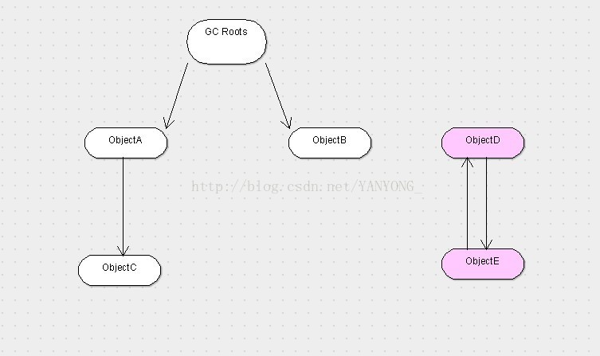

#### Jvm可达性分析

一JVM判断哪些对象需要回收

判断对象是否需要回收，主要依据是该对象是否被其它地方引用。而判断该对象是否被其它地方引用，主要有两种算法来实现。

1、引用计数算法

该算法的实现原理是：给对象一个引用计数器，每当有一个地方引用它时，计数器值就加1，当引用计数器失效时，计数器的值就减1，任何时刻计数器的值为0时，对象就不能再被使用。虽然该算法比较简单，但是Java并没有采用，因为该算法有有一个缺陷：

```java
Demo demo1 = new Demo();
Demo demo2 = new Demo();
demo2.instance = demo1;
demo1.instance = demo2;
```

如果采用引用算法，上面的demo1和demo2分别引用了对方，导致demo2 demo1无法被垃圾回收器回收。而其实一般当线程执行完某个方法后，对象就没有存在的意义了。将被垃圾回收器回收掉。

2、可达性分析算法



该算法的思路是：通过一系列被称为"GC Root"的对象作为起始点，然后从这些节点往下搜索，搜索走过的路径称为引用链，当一个对象没有任何引用连相连时，则证明该对象不可用，如：ObjectD和ObjectE虽然相连，但是没有跟引用链相连，所以这两个对象是不可用的。当然此时的对象并非“非死不可”，要真正宣布一个对象的死亡至少需要经历2次标记。如果对象在进行可达性分析后发现没有与GC Roots相连接的引用链，那它会被第一次标记并且进行一次筛选，筛选的条件是此对象是否有必要执行finalize方法。当对象没有覆盖finalize方法或者finalize方法已经被虚拟机调用过，虚拟机将这两种情况视为“没有必要执行”。

如果这个对象被判定有必要执行finalize方法，那么该对象会被放置在一个队列中（F-Queue）,并由虚拟机新建线程去触发finalize方法，但是线程不会等待方法执行完，因为如果finalize方法执行缓慢或者进入死循环，将导致队列中的其它对象一直处于等待的状态，有可能导致整个垃圾回收系统崩溃。

finalize方法是对象逃脱死亡命运的最后一次机会，在GC对队列进行第二次标记时，只要对象重新与引用链上的任何一个对象建立关联即可，如：this关键字赋值给某个类的变量，那在第二次标记时它将被移出即将回收的集合。

```java


public class DemoProject {
	
	public static DemoProject SAVE_HOOK = null;
	
	public void isAlive(){
		System.out.println("yes i am still alive");
	}

	@Override
	protected void finalize() throws Throwable {
		super.finalize();
		
		System.out.println("finaleze method executed");
		
		DemoProject.SAVE_HOOK = this;
		
	}
	
	public static void main(String[] args) throws Exception {
		
		SAVE_HOOK = new DemoProject();
		
		SAVE_HOOK = null;
		System.gc();//触发垃圾回收
		Thread.sleep(3000);//fianlize方法的优先级很低，暂停等待它
		if(SAVE_HOOK == null){
			System.out.println("i am dead");
		}else{
			SAVE_HOOK.isAlive();
		}
		
		//下面的代码与上面的一样，但是自救失败了，因为任何一个对象的finalize方法只会被系统调用一次
		SAVE_HOOK = null;
		System.gc();//触发垃圾回收
		Thread.sleep(3000);//fianlize方法的优先级很低，暂停等待它
		if(SAVE_HOOK == null){
			System.out.println("i am dead");
		}else{
			SAVE_HOOK.isAlive();
		}
		
		
		
	}


```

执行结果

```
finaleze method executed
yes i am still alive
i am dead
```

在Java中可以作为GC Roots的对象有：

虚拟机栈中引用的对象（本地变量表）

方法区中类静态属性引用的对象

方法区中常量引用的对象

本地方法区中JNI引用的对象。