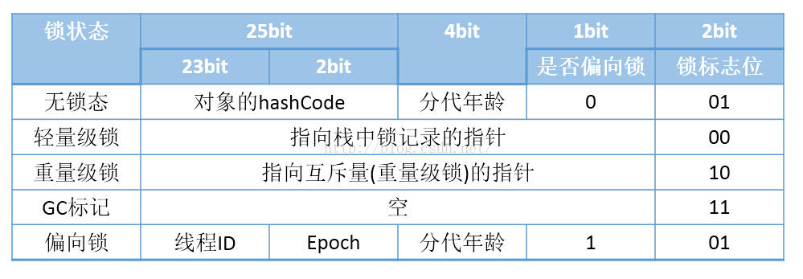

### synchronized关键字

在Java程序中我们可以利用syncronized关键字来对程序进行加锁。它既可以用来声明一个synchronized代码块，也可以直接标记静态或者实例方法。

先看一段synchronized代码块代码：

```java
public class SyncDemo {
    public static void main(String[] args){
       synchronized (Sync.class){
           test1();
       }
    }
    public static void test1(){
        System.out.println("test");
    }
}
```

使用javap -v 查看字节码内容

```java
 public static void main(java.lang.String[]);
    descriptor: ([Ljava/lang/String;)V
    flags: ACC_PUBLIC, ACC_STATIC
    Code:
      stack=2, locals=3, args_size=1
         0: ldc           #2                  // class com/sun/corba/se/impl/orbutil/concurrent/Sync
         2: dup
         3: astore_1
         4: monitorenter
         5: invokestatic  #3                  // Method test1:()V
         8: aload_1
         9: monitorexit
        10: goto          18
        13: astore_2
        14: aload_1
        15: monitorexit
        16: aload_2
        17: athrow
        18: return
      Exception table:
         from    to  target type
             5    10    13   any
            13    16    13   any
```

当声明synchronized代码块时,编译而成的字节码将包含monitorenter和monitorexit指令。这两种指令均会消耗操作数栈上的一个引用类型的元素（也就是synchronized关键字括号里的引用），作为所要加锁、解锁的对象。

关于monitorenter和monitorexit的作用，我们可以抽象的理解为每个锁对象拥有一个锁计数器和一个指向持有该锁的线程的指针。

当执行monitorenter时，如果目标锁对象的计数器为0，那么说明它没有被其它线程所持有，在这种情况下，Java虚拟机会将该锁对象的持有线程设置为当前线程，并且计数器加1。

在目标锁对象的计数器不为0的情况下，如果锁对象的持有的线程是当前线程，那么Java虚拟机可以将其计数器加1，否则需要等待，直至持有线程释放该锁。

当执行monitorexit时，Java虚拟机需要将锁对象的计数器减一，当计数器为0时，那便代表锁已经被释放掉了。

在上面的字节码中包含一个monitorenter指令和多个monitorexit指令，这是因为Java虚拟机需要确保所得的锁在正常执行路径以及异常执行路径上都能被解锁。

当我们使用synchronized标记方法时,示例代码如下：

```java
public class SyncDemo2 {

    public synchronized static void main(String[] args){
        
        System.out.println("test");

    }
}
```

```java
public static synchronized void main(java.lang.String[]);
    descriptor: ([Ljava/lang/String;)V
    flags: ACC_PUBLIC, ACC_STATIC, ACC_SYNCHRONIZED
    Code:
      stack=2, locals=1, args_size=1
         0: getstatic     #2                  // Field java/lang/System.out:Ljava/io/PrintStream;
         3: ldc           #3                  // String test
         5: invokevirtual #4                  // Method java/io/PrintStream.println:(Ljava/lang/String;)V
         8: return

```

当使用synchronized标记方法时，会看到字节码方法中的访问标记包括ACC_SYNCHRONIZED，该标记表示在进入方法时，Java虚拟机需要进行monitorenter操作。而在退出该方法时，不管正常返回还是调用者异常抛异常，Java虚拟机都需要进行monitorexit操作。


#### HotSpot中synchronized具体锁实现

1. 重量级锁

重量级锁是Java虚拟机中最为基础的锁实现，在这种状态下，Java虚拟机会阻塞加锁失败的线程，并在目标锁被释放的时候，唤醒这些线程。

Java线程的阻塞以及唤醒都是依靠操作系统完成的，如Linux系统通过pthread的互斥锁(mutex)来实现的，这些操作将涉及系统调用，需要从系统的用户状态切换到内核态，开销非常大。

为了避免昂贵的线程阻塞、唤醒，Java虚拟机在线程进入阻塞状态之前以及被唤醒后竞争不到锁的情况下进入自旋状态，在处理器上空跑并且轮询是否被释放，如果此时锁被释放，那么当前线程就无需进入阻塞状态，而是直接获取这把锁。

与线程阻塞相比，自旋锁会浪费大量的处理器资源，这是因为当前线程仍处于运行状态，只不过跑的是无用指令。

对于Java虚拟机来说，它并不知道自旋多久(循环次数)才能获取到锁，Java虚拟机给出的方案是自适应自旋，根据以往自旋等待时是否能够获得锁来动态调整自旋的时间，如：假如之前进入阻塞之前获取到了锁，那么这次就自旋此次数多一点，如果之前没有获取到锁，那么这次就自旋次数少一点。

自旋状态还有一个副作用，那就是不公平的锁机制，对于处于阻塞状态的线程，没有办法立即竞争到被释放的锁，然而处于自旋状态的线程，则很可能会优先获得这把锁。

2. 轻量级锁

在Java虚拟机中，针对多个线程在**不同的时间段**请求访问同一把锁，即没有锁竞争，Java虚拟机采用轻量级锁来避免重量级锁的阻塞和唤醒。

在介绍轻量级锁之前，首先要介绍内存布局中对象头的标记字段(mark word)。标记字段的最后两位用来表示对象的锁状态，其中，00代表轻量级锁，01代表无锁(偏向锁)，10代表重量级锁，11则跟垃圾回收算法的标记有关。

下图是32位虚拟机标记字段在不同状态下的结构




当进行加锁操作时，Java虚拟机会判断是否已经是重量级锁，如果不是，它会在当前线程的当前栈帧中划出一块空间，作为该锁的锁记录(lock record)，并且把锁对象的标记字段(mark word)复制到该锁记录中(lock record)。


然后Java虚拟机会尝试用CAS操作替换掉锁对象的标记字段。CAS 是一个原子操作，它会比较目标地址的值是否和期望值相等，如果相等，则替换为一个新的值。比如，假设当前锁对象的标记字段是X ...ZYZ，Java虚拟机会比较该字段是否是X...x01，如果是，则替换为刚才分配的锁记录(Lock record)地址。由于内存对齐的缘故，它的最后两位是00，此时该线程已经成功获得了这边锁，可以继续执行了。

如果对象锁的标记位不是X..X01，那么有两种情况，第一，该线程重复获取同一把锁，此时，Java虚拟机会往栈顶压入一条记录被清零的锁记录，以代表锁被重复获取。(我们可以将一个线程的所有锁记录想象成一个栈结构，每次加锁压入一条锁记录，同理解锁就是弹出一条锁记录，而当前锁记录就是栈顶的记录)

第二，其它线程持有了该锁，此时，Java虚拟机会将这边锁膨胀为重量级锁，并且阻塞当前线程。

当进行解锁操作时，如果当前锁记录为0，则表示重复进入同一把锁，直接将就来弹出栈帧。否则Java虚拟机会尝试用CAS操作，比较所对象中的标记字段的值是否为当前锁记录(Lock Record)的地址，如果是，则将锁对象中的值替换成当前线程锁记录中的值，也就是原来锁对象的标记字段。此时，该线程就已经成功释放这把锁。如果此时地址不相等，意味着这把锁已经被膨胀为重量级锁，此时Java虚拟机会进入重量级锁的释放过程，唤醒因竞争而被阻塞的线程。

3. 偏向锁

如果说轻量级锁针对的情况很乐观，那么接下来的偏向锁针对的情况则更加乐观，从始至终只有一个线程请求某一把锁。

具体来说在线程进行加锁时，如果该锁对象支持偏向锁，那么Java虚拟机会通过CAS操作将当前线程的地址记录在锁对象的标记字段中，并且将标记字段的最后三位设置为101。

然后在接下来的运行过程中，每当有线程请求这把锁，Java虚拟机只需要判断对象标记字段中：最后三位是否为101，是否包含当前线程的地址，以及epoch值是否和锁对象的类的epoch值相同。如果都满足，那么当前线程持有该偏向锁。

**关于epoch值**

先从偏向锁的撤销讲起，当请求加锁的线程和锁对象标记字段保持的线程地址不匹配时(epoch值不相等，如果值相等，那么当前线程可以将该锁重偏向自己)，Java虚拟机需要撤销该偏向锁。这个撤销过程非常麻烦，它要求持有偏向锁的线程到达安全点，再将偏向锁替换成轻量级锁。

如果某一个类对象的总撤销数超过一个阀值(对应Java虚拟机参数-XX:BiasedLockingBulkRebiasThreshold ，默认值为20)，那么Java虚拟机会宣布这个类的偏向锁失效。

具体的做法是在每个类中维护一个epoch值，当设置偏向锁时，Java虚拟机需要将该epoch值复制到锁对象的标记字段中。

在宣布某个类的偏向锁失效时，Java虚拟机实则将该类的epoch值加1，表示之前的偏向锁已经失效，而新设置的偏向锁需要复制新的epoch值。

为了保证当前持有偏向锁并且已加锁的线程不至于因此丢锁，Java虚拟机需要遍历所有线程的Java栈，找出该类已加锁的实例，并且将它们标记字段中的epoch值加1。该操作需要所有的线程处于安全点状态。

如果总撤销数超过另一个阀值(对应 Java 虚拟机参数 -XX:BiasedLockingBulkRevokeThreshold，默认值为40)，那么Java虚拟机会认为这个类已经不再适合偏向锁，此时，Java虚拟机会撤销该类实例的偏向锁，并且在之后的加锁过程中直接为该实例设置轻量级锁。

### 其他资料

#### java线程阻塞的代价

java的线程是映射到操作系统原生线程之上的，如果要阻塞或唤醒一个线程就需要操作系统介入，需要在户态与核心态之间切换，这种切换会消耗大量的系统资源，因为用户态与内核态都有各自专用的内存空间，专用的寄存器等，用户态切换至内核态需要传递给许多变量、参数给内核，内核也需要保护好用户态在切换时的一些寄存器值、变量等，以便内核态调用结束后切换回用户态继续工作。

    如果线程状态切换是一个高频操作时，这将会消耗很多CPU处理时间；
    如果对于那些需要同步的简单的代码块，获取锁挂起操作消耗的时间比用户代码执行的时间还要长，这种同步策略显然非常糟糕的


