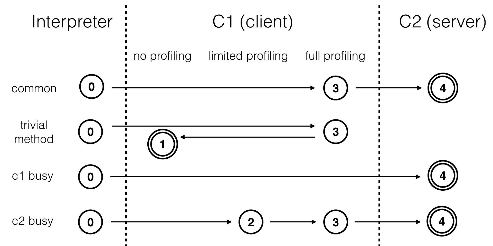

### 即时编译

即时编译即将一个方法中包含的所有的字节码编译成机器码后再执行，另外还有一种方式是解释执行，即逐条将字节码翻译成机器码执行。前者的优势在于实际运行速度快，后者在于无需等待。HotSpot内置了多个即时编译器：C1、C2和Graal。

Graal是Java10正式引入的实验性即时编译器，可以通过参数-XX:+UnlockExperimentalVMOptions -XX:+UseJVMCICompiler启用，并且替换C2。

C1又叫做Client编译器，面向的是对启动性能有要求的客户端GUI程序，采用的优化手段相对简单，因此编译时间较短，对应的参数-client

C2又叫做Server编译器，面向的是对峰值性能有要求的服务器端程序，采用的优化手段相对复杂，因此编译时间较长，但同时生成代码的执行效率较高，对应的参数-server。

#### 分层编译

Java7引入分层编译(对应的参数是-XX:+TieredCompilation)的概念，综合了C1的启动性能优势和C2的峰值性能优势。分层编译将Java虚拟机的执行状态分为5个层次：

0. 解释执行
1. 执行不带profiling的C1代码（C1代码指C1生成的机器码）
2. 执行仅带方法调用次数以及循环回边执行次数profiling的C1代码
3. 执行带所有profiling的C1代码
4. 执行C2代码

profiling是指在程序执行过程中，收集能够反应程序执行状态的数据。这里所收集的数据就是程序的profile。

通常情况下，C2代码的执行效率要比C1代码高出30%以上，对于C1代码的三种状态，按执行效率从高至低则是1层>2层>3层。其中1层的性能比2层的稍微高一些，而2层的性能又比3层高出30%.这是因为profiling越多，其额外的性能开销越大。

在5个层次的执行状态中，1层和4层为终止状态，当一个方法被终止状态编译过后，如果编译后的代码并没有失效，那么虚拟机是不会再次发出该方法的编译请求的。



通常热点方法会被3层的C1编译然后再被4层的C2编译。

如果方法的字节码数码比较少(如：getter/setter)，而且3层的profiling没有可以收集的数据，那么Java虚拟机断定该方法对于C1和C2代码的执行效率相同，在这种情况下Java虚拟机会在3层编译后，直接选择使用1层的C1编译。由于这是一个终止状态，因此Java虚拟机不会继续使用4层的C2编译。

在C1忙碌的情况下，Java虚拟机在解释执行过程中对程序进行profiling，而后直接使用4层的C2编译。在c2忙碌的情况下，方法会被2层的C1编译，然后再被3层的C1编译，以减少方法在3层的执行时间。

Java8默认是开启了分层编译的，不管开启还是关闭分层编译，原本用来选择即时编译器的参数-clinet和-server都是无效的。当关闭分层编译的情况下，Java虚拟机将直接采用C2。

如果希望只使用C1，那么可以打开分层编译的情况下，使用参数-XX:TiredStopAtLevel=1。在这种情况下，Java虚拟机会在解释执行之后直接由1层的C1进行编译。

#### 即时编译的触发

Java虚拟机是根据方法的调用次数和循环回边的执行次数来触发即时编译。Java虚拟机在0层、2层和3层执行状态时进行profiling，其中包括方法的调用和循环回边的执行次数。循环回边可以简单的理解为往回跳的指令。

```java
public static void foo(Object o){
        int sum = 0;
        for(int i = 0;i<200; i++){
            sum += i;
        }
}


```

```java
 public static void foo(java.lang.Object);
    descriptor: (Ljava/lang/Object;)V
    flags: ACC_PUBLIC, ACC_STATIC
    Code:
      stack=2, locals=3, args_size=1
         0: iconst_0//将0加载到操作数栈顶(sum)
         1: istore_1//将0保存到局部变量表下标为1的地方
         2: iconst_0//(i)
         3: istore_2
         4: iload_2//加载下标2处的数据(i)
         5: sipush        200//将200加载到操作数栈顶
         8: if_icmpge     21//比较，200是否大于i，是则继续往后走，否则跳到21
        11: iload_1//将sum加载到操作数栈顶
        12: iload_2//将i加载到操作数栈顶
        13: iadd//相加
        14: istore_1//存放到相加后的值
        15: iinc          2, 1//i自增
        18: goto          4//跳到4，继续循环
        21: return//返回结果

```

如上：偏移量为18的字节码往回跳至偏移量为7的字节码中，每当运行一次，Java虚拟机便会将该方法的循环回边计数器加1。在即时编译过程中，我们会识别循环的头部和尾部，在上面的这段字节码中，循环的头部是偏移量为4的字节码，尾部是偏移量为15的字节码。

在不启用分层编译的情况下，当方法的调用次数和循环回边的次数的和超过由参数-XX:CompileThreshold指定的阀值时(使用C1该值为1500，使用C2该值为10000),便会触发即时编译。

当启用分层编译时，Java虚拟机将不采用由参数-XX:CompileThreshold指定的阀值，而是阀值会动态调整。即在比较阀值时，Java虚拟机会将阀值与某个系数s相乘。该系数与当前待编译的方法数目成正比，与编译线程的数据成反比。

```
系数的计算方法为：
s=queue_size_X/(TierXLoadFeedback*compiler_count_X)+1
其中X是执行层次，可以取3或者4；
queue_size_X是执行层次为X的待编译方法的数目
TierXLoadFeedback是预设好的参数，其中Tier3LoadFeedback为5，Tier4LoadFeedback为3
compiler_count_X是层次X的编译线程数目
```

在64位Java虚拟机中，默认编译线程的总数目是根据处理器数量来调整的(对应参数 -XX:+CICompilerCountPerCPU，默认是true；当通过参数-XX:+CICompilerCount=N强制设定总编译数目时，CICompilerCountPerCPU将被设置为false)。

Java虚拟机将这些编译线程按照1:2的比例分配给C1和C2(至少各为1)，比如：对于一个四核机器来说，总的编译线程是3，其中包含一个C1编译线程和两个C2编译线程。

```
对于四核及以上的机器，总的编译线程数目为：
n = log2(N)*log2(log2(N))*3/2
其中N为cpu核心数目
```

当启用分层编译时，即时编译具体的触发条件如下：

```
当方法的调用次数大于由参数-XX:TierXInvocationThreshold指定的阀值乘以系数，或者当方法调用次数大于由参数-XX:XMINInvocationThreshold指定的阀值乘以系数，并且方法调用次数和循环回边次数之和大于由参数-XX:TierXCompileThreshold指定的阀值乘以系数时，便会触发X层即时编译。
i>TierXInvocationThreshold*s||(i>XMINInvocationThreshold*s&&i+b>TierXCompileThreshold*s)//i为调用次数，b为循环回边次数
```

#### OSR编译

决定一个方法是否是热点代码的因素有两个：方法的调用次数、循环回边的执行次数，即时编译便是根据这两个计数器的和来触发的。

在JVM中除了以方法为单位的即时编译之外，还存在着以循环为单位的即时编译，叫做On-Stack-Replacement(OSR)编译。循环回边计数器便是用来触发这种类型的编译的。

OSR实际上是一种技术，它指的是在程序执行过程中，动态的替换掉Java方法栈帧，从而使得程序能够在非方法入口进行解释执行和编译后的代码之间进行切换。

在不启用分层编译的情况下，触发OSR编译的阀值由参数-XX:CompileThreshold指定的阀值的倍数：

```
(OnStackRelacePercentage-InterpreterfilePercentage)/100
其中-XX:InterpreterfilePercentage的默认值是33，当使用C1时，-XX:OnStackRelacePercentage为933，当使用C2时为140
```

也就是说，默认情况下，C1的OSR编译的阀值是12500，而C2的为10700。

在启用分层编译的情况下，触发OSR编译的阀值是由-XX:TierXBackEdgeThreshold指定的阀值乘以系数。

#### Profiling

分层编译中的0层、2层和3层都会进行profiling，收集能够反应程序执行状态的数据，如：方法的调用次数和循环回边的执行次数。它们都是用于触发即时编译。

此外0层和3层还会收集用于4层c2编译的数据，比如：分支profile(branch profile)，包括跳转次数和不跳转次数，以及非私有实例方法调用指令、强制类型转换checkcast指令、类型测试instanceof指令和引用类型的数组存储aastore指令的类型profile(receiver type profile)。

通常情况下，我们不会在解释执行过程中收集分支profile和类型profile，只有当方法触发C1编译后，Java虚拟机认为该方法可能被C2编译，方才在该方法的C1代码中收集这些profile，但是如果有太多的方法数目等待C1编译，那么Java虚拟机才会开始在解释执行过程中收集这些profile。然后C2可以根据这些数据进行猜测，假设接下来的执行同样会按照所收集的profile进行，从而作出比较激进的优化。

#### 基于分支profile的优化

```java
public static int foo(boolean f,int in){

        int v;
        if (f){
            v = in;
        }else {
            v = (int)Math.sin(in);
        }

        if (v == in){
            return 0;
        }else {
            return (int) Math.cos(v);
        }

    }
```

```java
public static int foo(boolean, int);
    descriptor: (ZI)I
    flags: ACC_PUBLIC, ACC_STATIC
    Code:
      stack=2, locals=3, args_size=2
         0: iload_0//加载局部变量表下标为0的元素到栈顶(f)
         1: ifeq          9//如果为false跳到第9行
         4: iload_1//true，加载局部变量表下标为1的元素(in)到栈顶
         5: istore_2//存储栈顶元素到局部变量表下标为2的地方
         6: goto          16//跳转到偏移量为16的字节码处
         9: iload_1//加载in
        10: i2d//将int型数据强制转换成double型数值并将结果压入栈顶
        11: invokestatic  #2                  // Method java/lang/Math.sin:(D)D
        14: d2i//将double型数据转成int型压入栈顶
        15: istore_2//将栈顶元素存放到局部变量表下标为2的地方
        16: iload_2//加载局部变量表中下标为2的元素到栈顶(v)
        17: iload_1//加载in
        18: if_icmpne     23//比较两个int值的大小，如果不相等，跳到23
        21: iconst_0//相等，将0压入到栈顶
        22: ireturn//返回0
        23: iload_2//将v压入栈顶
        24: i2d//将int转成double
        25: invokestatic  #3                  // Method java/lang/Math.cos:(D)D
        28: d2i
        29: ireturn//返回栈顶元素

```

代码完整执行流程如下：


假设应用程序调用该方法时，所传入的boolean值皆为true，那么偏移量为1以及偏移量为18的条件跳转指令所对应的分支profile中，跳转的次数都为0。


C2可以根据这两个分支profile作出假设，在接下来的执行过程中，这两个分支跳转指令仍然不会发生跳转。基于这个假设，C2便不会再编译这两个条件跳转语句所对应的false分支。并且在第二个分支处，v的值只有可能等于输入的int值，因此经过裁剪、优化后如下：


因此即时编译器可以根据跳转指令的分支profile将从未执行过的分支剪掉，以避免编译这些很可能不会用到的代码，从而节省编译时间以及部署所要消耗的内存空间。当然即时编译器对分支profile的利用不仅仅是限于“剪枝”，它还会根据分支profile，计算每一条程序执行路径的概率，以便某些编译器优化优先于处理概率较高的路径。

#### 基于类型profile的优化

下面是关于instanceof以及方法调用的类型profile

```java
public static int hash(Object in){
        if (in instanceof Exception){
            return System.identityHashCode(in);
        }else {
            return in.hashCode();
        }
    }
```

```java
public static int hash(java.lang.Object);
    descriptor: (Ljava/lang/Object;)I
    flags: ACC_PUBLIC, ACC_STATIC
    Code:
      stack=1, locals=1, args_size=1
         0: aload_0//加载in
         1: instanceof    #4                  // class java/lang/Exception
         4: ifeq          12//false跳转到12
         7: aload_0
         8: invokestatic  #5                  // Method java/lang/System.identityHashCode:(Ljava/lang/Object;)I
        11: ireturn
        12: aload_0//加载in
        13: invokevirtual #6                  // Method java/lang/Object.hashCode:()I
        16: ireturn

```

假设应用程序调用该方法传入的Object都是Integer实例，那么偏移量为1的instanceof指令的类型profile仅为Integer，偏移量为4的分支跳转语句的分支profile中不跳转的次数为0，偏移量为13的方法调用指令的类型profile仅包含Integer。


在java虚拟机中，如果instanceof测试的目标类型是final类型，那么Java虚拟机仅需要比较测试对象的动态类型是否为该final类型。对象头存有该对象的动态类型，因此，获取对象的动态类型仅为单一的内存读取指令。

如果目标类型不是final类型，比如：Exception，那么Java虚拟机需要从测试对象的动态类型开始，依次测试该类、该类的父类、祖先类，该类所直接实现或者间接实现的接口是否与目标类型一致。

在我们的例子中，instanceof指令的类型profile仅包含Integer，根据这个信息，即时编译器可以假设，在接下来的执行过程中，所输入的Object对象仍为Integer实例。因此生成的代码将测试所输入的对象的动态类型是否是Integer，如果是则继续执行接下来的代码。然后即时编译器会采用和第一个例子中一致的分支profile的优化，以及对方法调用的条件去虚化内联。


和第一个例子一样，根据数据流分析，上述代码可以最终优化为极其简单的形式：


