#### 垃圾回收器


1. Serial收集器

Serial（串行）收集器是一个单线程收集器。单线程意味着它只会使用一条垃圾收集线程去完成垃圾收集工作，更重要的是它在进行垃圾收集工作时，必须暂停其它所有的工作线程（Stop The World），直到它收集结束。该垃圾回收器针对新生代采用复制算法。

使用-XX:+UseSerialGC参数可以指定使用新生代串行收集器和老年代串行收集器。当虚拟机在client模式下运行时，它是默认的垃圾回收器。


2. Serial Old收集器

Serial收集器的老年代版本，它同样是一个单线程收集器。它主要有两大用途：一种用途是在JDK1.5以及以前的版本中与Parallel Scavenge收集器搭配使用，另一个用途作为CMS收集器的后备方案。由于老年代垃圾回收通常会使用比新生代回收更长的时间，因此，在堆空间较大的应用中，一旦老年代串行收集器启动，应用程序很可能会因此停顿较长的时间。它采用的是标记-整理算法。

* -XX:+UseSerialGC:新生代、老年代都使用串行回收器
* -XX:+UseSerialGC:新生代使用ParNew回收器，老年代使用串行回收器
* -XX:+UseParallelGC:新生代使用ParallelGC回收器，老年代使用串行收集器。


3. ParNew新生代收集器

ParNew收集器其实就是Serial收集器的多线程版本，除了使用多线程进行垃圾收集外，其余行为（控制参数、收集算法、回收算法策略）和Serial收集器一样。ParNew回收器也是

独占式的回收器，在收集过程中，应用程序会全部暂停。

* -XX:+UseParNewGC:新生代使用ParNew回收器，老年代使用串行回收器。
* XX:+UseConcMarkSweepGC：新生代使用ParNew回收器，老年代使用CMS。

ParNew回收器工作时的线程数量可以使用-XX:ParallelGCThreads参数指定，一般，最好与cpu数量相当，避免过多的线程数，影响垃圾回收性能。


4. Parallel Scavenge收集器

```
-XX:+UseParallelGC 
    使用Parallel收集器+ 老年代串行

-XX:+UseParallelOldGC
    使用Parallel收集器+ 老年代并行
    
```

Parallel Scavenge收集器是一个新生代收集器。它使用复制算法的收集器，也是并行的多线程收集器。

Parallel Scavenge收集器追求高吞吐量（高效率的利用CPU）。所谓吞吐量就是CPU中用于运行用户代码的时间与cpu总消耗时间的比值，即吞吐量＝运行用户代码时间/(运行用户代码时间＋垃圾收集时间)，虚拟机总共运行100分钟，其中垃圾收集花掉1分钟，那吞吐量就是99%%。

高吞吐量可以高效率的利用CPU时间，尽快完成程序的运算任务，主要适合在后台运算而不需要太多交互的任务。

Parallel Scavenge提供了两个参数用于精确控制吞吐量。

* -XX:MaxGCPauseMillis：控制最大垃圾收集停顿时间。它的值是一个大于0的整数。ParallelGC在工作时，会调整Java堆大小或者其他一些参数，尽可能地把停顿时间控制在MaxGCPauseMillis以内。如果希望减少停顿时间，而把这个值设得很小，为了达到预期的停顿时间，虚拟机可能会使用一个较小的堆，而这将导致垃圾回收变得很频繁，从而增加了垃圾回收的总时间，降低了吞吐量。
* -XX:GCTimeRatio：设置吞吐量的大小。它的值是一个0到100之间的整数。假设GCTimeRatio 的值为n，那么系统将花费不超过1/(1+n)的时间用于垃圾回收。比如GCTimeRatio等于19，则系统用于垃圾收集的时间不超过1/(1+19)=5%。默认情况下，它的取值是99，即不超过1/(1+99)=1%的时间用于垃圾收集。

ParallelGC回收器与ParNew回收器另一个不同的在于它支持一种自适应的GC调节策略。使用-XX:+UseAdaptiveSizePolicy可以打开自适应GC策略。在这种模式下，新生代的大小、eden 和survivior的比例、晋升老年代的对象年龄等参数会自动调整，以达到在堆大小、吞吐量和停顿时间之间的平衡。

5. Parallel Old收集器

Parallel Scavenge收集器的老年代版本，使用多线程和"标记-整理"算法，它在JDK1.6中才可以使用。

使用-XX:+UseParallelOldGC可以在新生代使用ParallelGC回收器，老年代使用ParallelOldGC回收器。在注重吞吐量以及cpu资源的场合，都可以优先考虑Parallel Scavenge收集器和Parallel Old收集器。参数-XX:ParallelGCThreads也可以用于设置垃圾回收的线程数量。

6. CMS(Concurrent Mark Sweep)收集器

CMS是一种以获取最短回收停顿时间为目标的收集器。它非常符合在注重用户体验的应用上使用。它是HotSpot虚拟机第一款真正意义上的并发收集器，它第一次实现了让垃圾收集线程与用户线程同时工作。

CMS收集器使用"标记-清理"算法实现的，该算法会导致收集结束时会有大量空间碎片产生同时它无法处理浮动垃圾。	

**垃圾回收过程**:

* 初始标记，它需要Stop The World，主要分为两步：

  1）标记GC Root 直接关联的可达的老年代对象，

  2）遍历新生代对象，标记可达的老年代对象。


* 并发标记：同时开启GC线程和用户线程，然后遍历初始标记阶段标记出来的存活对象，然后继续递归这些对象可达的对象，所有可达的对象都在本阶段中标记。
* 预清理：清理前准备以及控制停顿时间(可以关闭-XX:-CMSPrecleaningEnabled，不进行预清理)。由于重新标记是独占cpu的，如果新生代gc发生后，立即触发一次重新标记，那么一次停顿时间可能很长。为了避免这种情况，预处理时，会刻意等待一次新生代GC的发生，然后根据历史性能数据预测下一次新生代GC可能发生的时间，然后在当前时间和预测时间的中间时刻，进行重新标记，尽可能减少一次停顿时间。


* 重新标记：重新标记是为了修正并发标记期间因为用户程序继续运行而导致标记产生变动的那一部分对象的标记记录，如在运行期间可能发生新生代对象像晋升到老年代、或者直接在老年代分配对象、或者更新老年代对象的引用关系等。对于这些对象都是需要重新标记的，否则有些对象就会被遗漏，发生漏标的情况。这个阶段的停顿时间一般比初始标记标记阶段的时间稍长，远远比并发标记阶段时间短。（Stop The World）
* 并发清除：开启用户线程，同时GC线程开始对标记的区域做清除。


**CMS主要参数**

启动CMS回收器的参数是-XX:+UseConcMarkSweepGC。CMS是多线程回收器，合理的工作线程数量对系统性能有重要的影响。

CMS默认启动线程的并发线程数是(ParallelGCThreads+3)/4)。ParallelGCThreads表示GC并行时使用的线程数量，如果新生代使用ParNew，那么ParallelGCThreads也就是新生代GC的线程数量。这意味着有4个ParallelGCThreads时，只有一个并发线程，而两个并发线程时，有5~8个ParallelGCThreads线程数。

并发线程数可以使用-XX:ConcGCThreads或者-XX:ParallelGCThreads参数手工设定。当cpu资源比较紧张时，受到CMS回收线程的影响应用系统的性能在垃圾回收阶段可能会非常糟糕。

由于CMS回收器不是独占式的的回收器，在CMS回收过程中，应用程序仍然在不停的工作。这些新生成的垃圾在CMS回收过程中是无法清除的。同时，因为应用程序没有中断，所以在CMS过程中，还应该确保应用程序有足够的内存可以用。因此，CMS垃圾回收器不会等待堆内存饱和时，才进行垃圾回收。

这个回收阀值可以使用-XX:CMSInitiatingOccupanyFraction来指定，默认是68。即当老年代的空间使用率到达68%时，会执行一次CMS回收。如果应用程序内存增长缓慢，则可以设置一个稍大的值，大的阀值可以有效降低CMS的触发频率，减少老年代回收的次数；反之，如果内存增长率很快，则应该降低这个阀值，避免在CMS 的执行过程中，出现内存不足，CMS回收失败，虚拟机将启动老年代串行收集器进行垃圾回收。

CMS使用标记－清除算法，这意味着收集结束会有大量空间碎片产生。空间碎片过多时，将会给大对象分配带来大麻烦，可能会出现老年代还有大量空间剩余，但无法找到足够大的连续空间来分配当前对象，不得不提前触发一次full GC。

-XX:+UseCMSCompactAtFullCollection开关可以使CMS 在垃圾收集完成之后，进行一次内存碎片整理，内存碎片的整理不是并发的。-XX:CMSFullGCsBeforeCompaction参数可以指定多少次CMS回收后，进行一次内存压缩。

由于G1的出现，CMS在Java9中已被废弃。

7. G1收集器

G1(Gabage-First)是一款面向服务器的垃圾收集器，主要针对配备多颗处理器以及大容量内存的机器。它被视为JDK1.7中HotSpot虚拟机的一个重要进化特征。G1依然属于分代垃圾回收器，它会区分年轻代和老年代，依然有eden区和survivor区，但是从堆的结构上看，它并不要求整个eden区、年轻代或者老年代都连续。它使用了分区算法。

* 并行与并发：G1能充分利用CPU、多核环境下的硬件优势，使用多个CPU来缩短Stop-The-World停顿时间。部分其它收集器原本需要停顿Java用户线程来执行GC操作，G1收集器仍然可以通过并发的方式让Java程序继续执行。
* 分代收集：G1可以不需要其它的收集器配合就可以独立管理整个GC堆，但是还是保留了分代的概念。
* 空间整合：与CMS的标记-清理算法不同，G1从整体来看是基于标记整理算法实现的收集器，从局部上来看是基于复制算法实现的。
* 可预测的停顿：G1相对于CMS的另一个优势，降低停顿时间是G1和CMS共同特点，但是G1除了追求低停顿外还能建立可预测的停顿时间模型，能让使用者明确指定在一个长度为M毫秒的时间片段内。

**G1的内存划分和主要收集过程**

G1收集器将堆进行分区，划分一个个的区域，每次收集的时候，只收集其中的几个区域，以此来控制垃圾回收的产生的停顿时间。

G1的收集过程分为4个阶段：

* 新生代
* 并发标记周期
* 混合收集
* 如果需要，可能会进行Full GC

1）新生代GC

类比其它的垃圾回收器，G1对新生代的垃圾回收没有太大的变化。新生代的GC工作主要是对eden和survivor区，一旦eden区被沾满，新生代就GC就会启动。

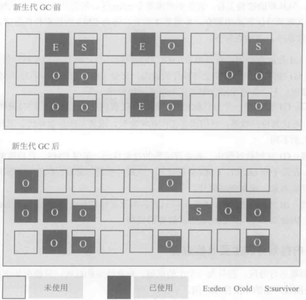

如上：所有的eden区都应该被清空，而survivor区会被收集一部分数据。

2）G1的并发标记周期

* 初始标记：标记从根节点直接可达的对象，这个阶段会伴随一次新生代的GC，它是会产生全局停顿的，应用程序线程在这个阶段必须停止执行。
* 根区域扫描：初始标记必然会伴随一次新生代GC，所以在初始化标记后，eden被清空，并且存活对象被移入survivor区。在这个阶段，将扫描由survivor区直接可达老年代的对象，并且标记这些直接可达的对象。这个过程是可以和应用程序并发执行的。但是根区域扫描不能和新生代GC同时执行（因为根区域扫描依赖survivor区的对象，而新生代GC会修改这个区域），因此新生代GC需要等待根区域扫描完成后才能执行。
* 并发标记：和CMS类似，并发标记将会扫描并查找整个堆的存活对象，这个过程可以被一次新生代GC打断。

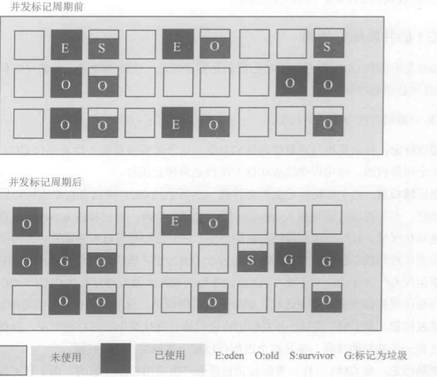

如上并发标记期间包含一次新生代GC，故新生代会被整理，但是由于并发标记期间，应用程序依然在运行，因此并发标记结束后，又会有新的eden空间被使用。并发标记前后最大的不同是在该阶段后，系统增加了一些标记G的区域。这些区域被标记，是因为它们内部的垃圾比例比较高，因此希望在后面的混合GC中进行收集。这些将要被回收的区域被G1记录在一个称为Collection Sets（回收集）的集合中。

* 重新标记：由于在并发标记过程中，应用程序依然在运行，因此标记结果需要进行修正。在G1中这个过程使用SATB算法完成。即G1会在标记之初为存活对象创建一个快照，这个快照有助于加速重新标记的速度。
* 独占清理：这个阶段会引起停顿。它将计算各个区域的存活对象和GC回收比例并进行排序，识别可供混合回收的区域。在这个阶段还会更新记忆集(Remebered Set)。该阶段给出了需要被混合回收的区域并进行了标记。
* 并发清理阶段：这里会识别并清理完全空闲的区域。
* 混合回收：并发清理阶段虽然有对象被回收，但是总体来说，回收比例是相当低的，但是在并发清理阶段后，G1已经明确知道哪些区域含有比较多的垃圾，在混合回收阶段，就可以专门针对这些区域进行回收。G1全称Garbage First Garbage Collector即垃圾优先的垃圾回收器，这里的垃圾优先是指回收时优先选取垃圾比例最高的区域。这个阶段会同时清理新生代和老年代，如下图：

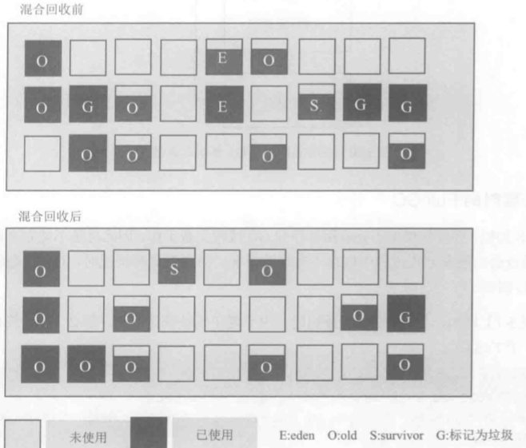

如上：新生代GC，eden区会被清空，此外，有两块被标记为G(垃圾比例高的区)的区域被清理，被清理区域的存活的对象会被移动到其它区域，这样可以减少空间碎片。

和CMS类似，并发收集由于让应用程序和GC线程交替工作，因此不能完全避免在特别繁忙的场合出现在回收过程中内存不足的情况，当遇到这种情况，G1会转入一个Full GC进行回收。


**G1日志**

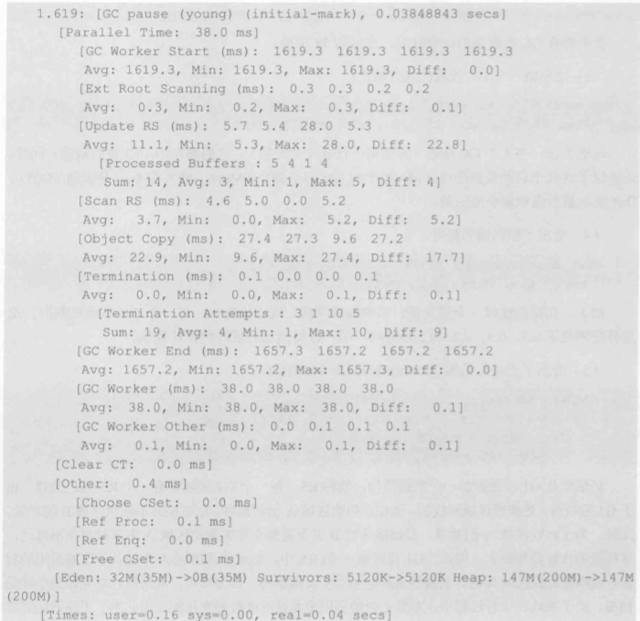

1. 日志第一行


表示在应用程序开启1.619秒时发生了一次新生代的GC，这是在初始标记时发生的，耗时0.038秒，意味着应用程序至少暂停了0.038秒。

2. 后续并行时间


​	表示所有GC线程总的花费时间，这里为38毫秒。

3. 给出每一个GC线程的执行情况

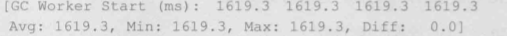

这里一共4个GC线程，它们都是在1619.3秒启动，同时 还给出了这几个启动数据的统计值，如平均(Avg)、最小(Min)、最大(Max)和差值(Diff)，Diff表示最大值和最小值的差。

4. 根扫描的耗时

   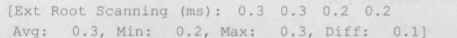         

如上根扫描时(全局变量、系统数据字典、线程栈等)每一个GC线程的耗时，这里分配消耗了0.3、0.3、0.2、0.2秒时间，最后一行给出这些耗时的统计数据。

5. 更新记忆集(Remembered Sets)的耗时

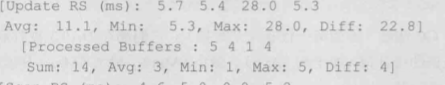

每一个G1区域都有一个RS与之关联，G1在回收垃圾时是按照区域回收的，比如：在回收区域A时，很可能不回收区域B的对象，此时，为了回收区域A的对象，要扫描区域B甚至整个堆来判断区域A中哪些对象不可达，这样做的代价显然很大。因此G1在区域A的RS中，记录了在区域A中被其它区域引用的对象，这样在回收区域A时，只要将RS视为区域A根集的一部分即可，从而避免做整个堆的扫描。由于系统在运行过程中，对象之间的引用关系是可能时刻变化的，因此为了更高效的跟踪这些关系，会将变化记录在Update Buffers中。

上面的Processed Buffers指的是处理这个Update Buffers数据。这里给出的4个时间也是4个GC线程的耗时以及它们的统计数据。

6. 扫描RS时间

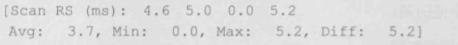

7. 在正式回收前，G1会对被回收区域的对象进行疏散，即将存活对象放置在其它区域中，因此需要进行对象的复制。

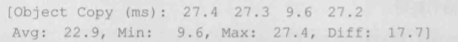

8. GC工作线程的终止信息

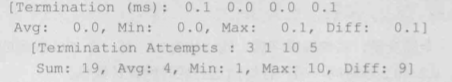

这里的终止时间是线程花在终止阶段的耗时。在GC线程终止阶段前，它们会检查其它GC线程的工作队列，查看是否仍然还有对象引用没有处理完，如果其它线程仍然有没有处理完的数据，请求终止的GC线程就会帮助它尽快完成，随后再尝试终止。其中Termination Attempts 展示了每一个工作线程尝试终止的次数。

9. GC工作线程的完成时间


上面显示在系统运行1657毫秒附近，这几个线程都终止了。

10. GC工作线程的存活时间，单位是毫秒

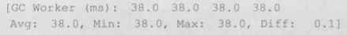

11. GC花费在其它任务中的耗时，单位是毫秒

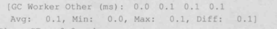

12. 清空CardTable的时间，RS就是依靠CardTablle来记录哪些是存活对象

```[Clear CT : 0.0 ms]```

13. 其它几个任务的耗时

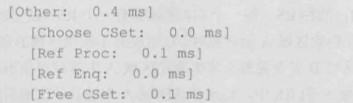

CSet：Collection Sets 的时间  ，RefProc : 处理弱引用、软引用的时间，RefEnq：弱引用、软引用入队时间，Free CSet：释放被回收的CSet中区域的时间，包括它们的RS。

14. 最后，就是比较熟悉的GC回收的整体清空

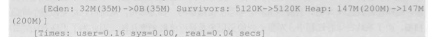

这里显示eden区一共32M被清空，survivor区没有释放对象，整个堆空间没有释放空间。用户CPU耗时0.16秒，实际耗时0.04秒。