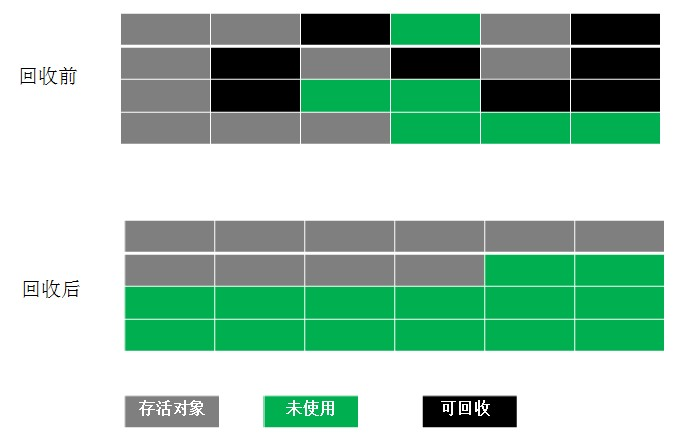

#### 垃圾回收算方法

1、标记－清除算法

算法分为两个阶段：首先标记出所有需要回收的对象，在标记完成后，统一回收所有被标记的对象。标记－清除算法有两个缺点：一是效率问题，标记和清除的效率都不高，另一个是空间问题，标记清除之后会产生大量的不连续的内存碎片。空间碎片过多会导致程序运行过程中，如果有大对象产生，将无法找到足够大的连续内存而提前触发一次垃圾回收


2、复制算法

将内存按容量划分为大小相等的两块，每次只用其中一块，当这一块的内存用完了，就将还存活的对象复制到另外一块上，然后再把已经使用过的内存空间一次清理掉。这样使得每次都对半区进行内存回收，内存分配不用考虑内存碎片的问题。但是这种算法将内存的大小缩小了一半，代价太高。

HotSpot的新生代采用的就是复制算法，因为新生代对象存活率不高，不用进行太多的复制。它将内存分为一块较大的Eden空间和两块较小的Survivor(from 、to大小相同)空间，大小比例是8:1，每次使用Eden和其中一块Survivor，也就是每次新生代可用内存为整个新生代容量大小的90%,只有10%会被浪费，JVM 每次触发垃圾回收，都会将存活的对象复制到另一块Survivor内存空间中(大对象，或者老年对象会直接进入老年代，如果Survivor内存空间已经满了也会进入老年代)。


3、标记－整理(压缩)算法

复制算法在对象存活率较高时就要进行较多的复制操作，效率会变低。并且如果不想浪费50%的空间，就需要额外的空间进行担保，以应对被使用的内存中所有的对象都100%的存活的极端情况。如：老年代为新生代担保。

标记－整理是一种老年代回收算法。它在标记-清除算法的基础上做了一些优化。和标记清除算法一样，标记压缩算法也首先从根节点开始，对所有可达对象做一次标记，但后续步骤不是直接对可回收的对象进行清除，而是让所有存活的对象都向一端移动，然后直接清理掉端边界以外的内存。




4.  分代收集算法

前面介绍的复制、标记清除算法、标记压缩等垃圾算法它们都具有自己独特的优势和特点，因此根据垃圾回收对象的特点，使用合适的算法回收，才是明智的选择。

分代收集算法是目前大部分JVM的垃圾收集器采用的算法。它的核心思想是根据对象存活的生命周期将内存划分为若干个不同的区域。一般情况下将堆划分为老年代和新生代，在堆之外还有一个永久代。老年代的特点是每次垃圾收集时只有少量对象需要被回收，而新生代的特点是每次垃圾回收时都有大量的对象需要被回收，那么就可以根据不同代的特点采取最适合的收集算法。


5. 分区算法

分代算法将按照对象的生命周期长短分成两部分，分区算法将整个堆空间划分成连续的不同小区间，每一个区间都独立使用，独立回收。这种算法的好处是可以控制一次回收多少个小区间。

一般来说，相同的条件下，堆空间越大，一次GC时所需要的时间就越长，从而产生的停顿也越长，为了更好地控制GC产生的停顿时间，将一块大的内存区域分隔成多个小块，根据目标的停顿时间，每次合理地回收若干个小区间，而不是整个堆空间，从而减少一次GC所产生的停顿。


#### 新生代垃圾回收

大多数对象在新生代中被创建，其中很多对象的生命周期很短。每次新生代的垃圾回收(Minor GC)后，只有少量对象存活。所以在新生代一般采用复制算法，只需要少量的复制成本就可以完成回收。

新生代分为三个区：一个Eden区，两个Survivor区。大部分的对象在Eden区中生成，当Eden区满时，还有存活的对象将被复制到两个Survivor中的一个。当这个Survivor区满时，此区的存活并且还不满足晋升条件的对象将复制到另外一个Survivor区，对象每经历一次MinorGC，年龄加1，达到“晋升年龄阀值”后，对象将被放到“老年代”。“晋升年龄阀值”的大小直接影响对象在新生代中停留的时间，在Serial和ParNewGC两种回收器中，晋升年龄阀值通过参数MaxTenuringThreshold设定，默认值为15。另外，如果单个survivor区已经被占用了50%(-XX:TargetSurvivorRatio)，那么较高复制次数的对象也会被晋升到老年代(大对象也会直接存储到老年区)。

新生代回收的频率很高，但是每次回收的耗时很短，而老年代回收的频率比较低，但是耗时更多的时间。为了支持高频率的新生代回收，虚拟机可能使用一种叫做卡表的数据结构。

卡表是一个比特位集合，每一个比特位可以用来表示老年代的某一个区域中的所有对象是否持有新生代对象的引用。这样在新生代GC时，可以不用花大量时间扫描所有的老年代对象，来确定每一个对象的引用关系，而可以先扫描卡表，只有当卡表的标记为1时，才需要扫描给定区域的老年对象，而卡表位置为0的所在区域的老年对象，一定不包含新生代对象的引用，如下图：


卡表的每一位表示老年代4kb的空间，卡表记录为0的老年代区域没有任何对象指向新生代，只有卡表为1的区域才有对象包含新生代引用，因此在新生代gc时，只需要扫描卡位为1所在的老年代空间。

#### 老年代垃圾回收

在新生代中经历N次垃圾回收后仍然存活的对象，就会被放到老年代，该区对象的存活率高。老年代的垃圾回收（Mahor GC）通常使用“标记-清理”或者“标记-整理”算法。整堆包括新生代和老年代的垃圾回收称为full GC(HotSpot VM，除了CMS外，其它能收集老年代的GC都会同时收集整个GC堆，包括新生代)。

#### 永久代垃圾回收

主要存放元数据，例如：Class、Method的元信息，与垃圾回收要回收的Java对象关系不大。相对于新生代与老年代来说，该区域的划分对垃圾回收影响比较小。

#### Stop-The-World

为了让垃圾回收器可以正常且高效地执行，大部分情况下，会要求系统进入一个停顿的状态。停顿的目的是终止所有应用线程的执行，只有这样，系统才不会有新的垃圾出现。同时停顿保证了系统状态在某一个瞬间的一致性，也有益于垃圾回收器更好的标记垃圾对象。

在多线程环境中，如果垃圾回收器回收正在被引用的对象内存，然后其它线程从原引用去访问已经被回收的对象，则很可能会导致Java虚拟机崩溃。

在Java虚拟机中，传统的垃圾回收法采用一种简单粗暴的方式，那便是Stop-the-world，停止其它非垃圾回收线程的工作，直到完成垃圾回收。这也就造成了垃圾回收所谓的暂停时间(GC pause)。

Java 虚拟机中的Stop-the-world是通过安全点(safepoint)的机制来实现，当Java虚拟机收到Stop-the-world请求，它便会等待所有的线程都到达安全点，才允许请求Stop-the-world的线程进行独占的工作。

```java
//-Xms1g -Xmx1g  -Xmn512k -XX:+PrintGCDetails -XX:+UseSerialGC -Xloggc:/Users/user/Documents/gc.log
public class StopWorldTest {
	
	public static class MyThread extends Thread{
		
		HashMap map = new HashMap<>();
		@Override
		public void run() {
			
			try{
				
				while(true){
					
					if(map.size()*1024/1024/1024 >= 900){
						map.clear();
						System.out.println("clean map");
					}
					
					byte[] b1;
					for(int i = 0;i<100;i++){
						b1 = new byte[1024];
						map.put(System.nanoTime(), b1);
					}
					Thread.sleep(1);
				}
				
			}catch(Exception e){
				
			}
			
		}
		
	}
	

	public static class PrintThread extends Thread{
		
		public static final long starttime = System.currentTimeMillis();
		@Override
		public void run() {
			while(true){
				try{
					long t = System.currentTimeMillis() - starttime;
					System.out.println(t/1000+"."+t%1000);
					Thread.sleep(100);
				}catch(Exception e){
					
				}
			}
		}	
	}
	
	
	public static void main(String[] args){
		
		MyThread t = new MyThread();
		PrintThread p = new PrintThread();
		t.start();
		p.start();
		
	}
}
```

执行结果：

```
0.0
0.104
0.207
0.310
0.415
0.520
0.626
0.727
0.832
0.935
1.43
1.146
1.250
1.360
1.467
1.569
1.678
1.783
1.886
1.992
2.95
2.196
2.301
2.409
2.514
2.617
2.724
2.827
2.929
3.32
3.138
3.247
```

gc日志：

```
0.169: GC (Allocation Failure) 0.169: [DefNew: 384K->64K(448K), 0.0011494 secs] 384K->254K(1048512K), 0.0012322 secs 

0.196: GC (Allocation Failure) 0.196: [DefNew: 448K->64K(448K), 0.0006233 secs] 638K->523K(1048512K), 0.0006843 secs 

0.202: GC (Allocation Failure) 0.202: [DefNew: 447K->63K(448K), 0.0005399 secs] 906K->892K(1048512K), 0.0005963 secs 

0.209: GC (Allocation Failure) 0.209: [DefNew: 447K->63K(448K), 0.0022813 secs] 1276K->1265K(1048512K), 0.0025894 secs 

0.216: GC (Allocation Failure) 0.216: [DefNew: 447K->64K(448K), 0.0009155 secs] 1649K->1643K(1048512K), 0.0010189 secs 

```

从执行结果可以看出0.00.1040.2070.3100.4150.5200.6260.7270.8320.9351.431.1461.2501.3601.4671.5691.6781.7831.8861.9922.952.1962.3012.4092.5142.6172.7242.8272.9293.323.1383.247

gc日志：

```
0.169: GC (Allocation Failure) 0.169: [DefNew: 384K->64K(448K), 0.0011494 secs] 384K->254K(1048512K), 0.0012322 secs 

0.196: GC (Allocation Failure) 0.196: [DefNew: 448K->64K(448K), 0.0006233 secs] 638K->523K(1048512K), 0.0006843 secs 

0.202: GC (Allocation Failure) 0.202: [DefNew: 447K->63K(448K), 0.0005399 secs] 906K->892K(1048512K), 0.0005963 secs 

0.209: GC (Allocation Failure) 0.209: [DefNew: 447K->63K(448K), 0.0022813 secs] 1276K->1265K(1048512K), 0.0025894 secs 

0.216: GC (Allocation Failure) 0.216: [DefNew: 447K->64K(448K), 0.0009155 secs] 1649K->1643K(1048512K), 0.0010189 secs 

```

从执行结果可以看出0.00.1040.2070.3100.4150.5200.6260.7270.8320.9351.431.1461.2501.3601.4671.5691.6781.7831.8861.9922.952.1962.3012.4092.5142.6172.7242.8272.9293.323.1383.247

gc日志：

```
0.169: GC (Allocation Failure) 0.169: [DefNew: 384K->64K(448K), 0.0011494 secs] 384K->254K(1048512K), 0.0012322 secs 

0.196: GC (Allocation Failure) 0.196: [DefNew: 448K->64K(448K), 0.0006233 secs] 638K->523K(1048512K), 0.0006843 secs 

0.202: GC (Allocation Failure) 0.202: [DefNew: 447K->63K(448K), 0.0005399 secs] 906K->892K(1048512K), 0.0005963 secs 

0.209: GC (Allocation Failure) 0.209: [DefNew: 447K->63K(448K), 0.0022813 secs] 1276K->1265K(1048512K), 0.0025894 secs 

0.216: GC (Allocation Failure) 0.216: [DefNew: 447K->64K(448K), 0.0009155 secs] 1649K->1643K(1048512K), 0.0010189 secs 

```

从执行结果可以看出0.935到1.43之间隔了0.5秒，显然这期间发生了垃圾回收，然后对着gc日志可以看出的确如分析一致。