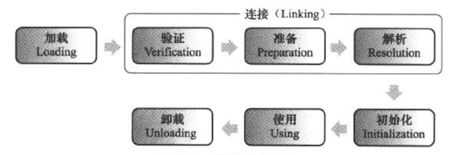

### 类加载时机

类被加载到虚拟机内存开始，到卸载出内存为止，它的整个生命周期包括：加载、验证、准备、解析和初始化、使用和卸载7个阶段。其中验证、准备、解析3个部分称为连接。



加载、验证、准备、初始化和卸载这5个阶段的顺序是确定的，类加载过程必须按照这种顺序按部就班地开始，而解析阶段就不一定，它在某些情况下可以在初始化阶段之后开始，比如动态绑定。

Java虚拟机规范中并没有强制约束虚拟机什么时候开始加载字节码，但是对于初始化阶段，虚拟机则严格规定了5种情况下必须立即对类进行初始化。

1）遇到new(创建一个对象)、getstatic(获取静态字段值)、putstatic(设置静态字段值)或invokestatic(调用静态方法)这4条字节码指令时，如果类没有进行初始化，则需要先触发其初始化。如果静态字段被fianl修饰，已经在编译期把结果放入常量池的静态字段除外。

2）使用java.lang.reflect包的方法对类进行反射调用的时候，如果类没有进行初始化，则需要先触发其初始化。

3）当初始化一个类的时候，如果发现其父类还没有进行初始化，则需要先触发其父类的初始化。

4）当虚拟机启动时，用户需要指定一个要执行的主类(包含main()方法的那个类)，虚拟机会先初始化这个主类。

5）当使用JDK1.7的动态语言支持时，如果动态方法调用所对应的类没有进行初始化，则需要先触发其初始化。

例子1：

```java
public class SuperClass {
	static{
		System.out.println("SuperClass init");
	}
	public static int value = 123;
}


public class SubClass extends SuperClass {
	
	static {
		System.out.println("Subclass init");
	}
}

public class NotInitialization {
	public static void main(String[] args) {
		System.out.println(SubClass.value);
	}
}
```

执行上述代码后，只会打印出父类中的```SuperClass init```，说明只对父类进行了初始化。在HotSpot虚拟机中，对于静态字段，只会初始化字段所在的类。

 例子2：

```java
public class ConstClass {
	
	static{
		System.out.println("ConstClass init");
	}
	public static final String HELLOWORLD = "hello world";

}

public class NotInitialization {
	public static void main(String[] args) {
		//System.out.println(SubClass.value);
		System.out.println(ConstClass.HELLOWORLD);
	}
}
```

代码执行之后并没有输出```ConsClass init```，这是因为```hello world ```在编译阶段已经存储到了```NotInitialization```类的常量池中，以后```NotInitialization```对常量```ConstClass.HELLOWORLD```的引用实际转化为```NotInitialization```类对自身常量池的引用了。也就是```NotInitialization```的class文件中并没有```ConstClass```类的符号引用入口，这两个类没有任何关系。

### 类加载过程

#### 加载

在加载阶段，虚拟机需要完成以下3件事：

1）通过一个类的全限定名来获取定义此类的二进制字节流。二进制字节流的来源可以是ZIP包中读取(war包)；从网络中获取(Applet)；运行时计算生成(动态代理)等。

2）将这个字节流所代表的静态存储结构转化为方法区的运行时数据结构。

3）在内存中生成一个代表这个类的java.lang.Class对象，作为方法区这个类的各种数据的访问入口。

对于一个非数组类的加载阶段，获取它的二进制字节流是开发人员可控的，因为加载阶段可以使用系统提供的引导类加载器来完成，也可以由用户自定义的类加载器区完成。

对于数组类而言，情况就有所不同，数组类本身不通过类加载器创建，它是由Java虚拟机直接创建的。 但数组类与类加载器仍然有很密切的关系，因为数组的元素类型还是要靠类加载器去创建。创建的规则如下：

1）如果数组的类型是引用型，那就以递归的形式区加载这个类型。

2）如果数组的类型不是引用类型(如int[]数组)，Java虚拟机将会把数组C标记为与引导类加载器关联。

3）数组类的可见性(public 、private)与它的类型的可见性一致，如果不是引用类型，那数组类的可见性将默认为public。

加载阶段与连接阶段的部分内容是交叉进行的，加载阶段尚未完成，连接阶段可能已经开始了。

#### 验证

字节码不一定要求用Java源码编译而来，可以使用任何途径产生，甚至包括用十六进制编辑器直接编写来产生Class文件。为了虚拟机减少因载入有害的字节流而导致系统崩溃，需要对字节码进行验证。

1. 文件格式验证

主要验证字节流是否符号Class文件格式的规范，并且是否能被当前的虚拟机处理。检查的项可能包括下面几点：

* 是否以魔数0xCAFEBABE开头。
* 主、次版本号是否在当前虚拟机处理范围之内。
* 常量池的常量中是否有不被支持的常量类型(检查常量flag标志)。
* 指向常量的索引中是否有指向不存在的常量。

等等。。

2. 元数据验证

主要是对字节码描述的信息进行语义分析，保证其描述符号Java语言规范。

* 这个类是否有父类（除了Object外，所有的类应当有父类）。
* 这个类的父类是否继承了不允许被继承的类。
* 如果这个类不是抽象类，是否实现了其父类或接口之中要求实现的所有方法。

等等。

3. 字节码验证

主要是通过数据流和控制流分析，确定程序的语义是合法的、符合逻辑的。

* 保证操作数栈的数据与指令代码能配合工作，不会出现在操作数栈放置了一个int类型数据，却使用long类型来加载入本地变量表中。
* 保证跳转指令不会跳转到方法体以外的字节码指令上。
* 保证方法体中类型转换是有效的。例如可以把一个子类对象赋值到父类数据类型，但是把父类对象赋值给子类数据类型是危险、不合法的。

4. 符合引用验证

符合引用验证可以看作是对类自身以外的信息进行匹配性校验。

* 符合引用中通过字符串描述的全限定名是否能找到对应的类。
* 在指定类中是否存在符合方法的字段描述符以及简单名称描述的方法和字段。
* 符合引用中的类、字段、方法的访问性(private、protected、public、default)是否可以被当前类访问。

#### 准备

准备阶段将被static修饰的变量进行初始化，即将变量的值设置为数据类型的零值。比如：

```java
public static int value = 123;
```

变量value在准备阶段过后的初始值为0而不是123。实例变量将会在对象实例化时随着对象一起分配在Java堆中。

还有一种情况，

```java
public static final int value = 123;
```

如果静态属性被final修饰，那么在准备阶段就会被赋值123。

#### 解析

解析阶段是虚拟机将常量池内的符号引用替换为直接引用的过程。主要是针对常量池中的接口、字段、方法等解析。直接引用和符号引用的关系是：

* 符号引用以一组符号来描述所引用的目标，符号可以是任何形式的字面量，只要使用时能无歧义地定义到目标即可。比如CONSTANT_Methodref_info，用来描述常量池中的方法引用。
* 直接引用：直接引用可以是直接指向目标的指针、相对偏移量或是一个能间接定位到目标的句柄。如果有了直接引用，那引用的目标必定已经存在内存中。

虚拟机解析发生的具体时间只要求了在执行```anewarray、checkcast、getfield、getstatic、instanceof、invokedynamic、invokeinterface、invokespecial、invokestatic、invokevirtual、ldc、ldc_w、new、putfield、putstatic、multianewarray```这16个用于操作符号引用的字节码指令之前，先对它们使用的符号引用进行解析。其他情况下，虚拟机可以在类被加载时就对常量池中的符号进行解析或者在符号引用被使用时才进行解析。

虚拟机可以对符号引用进行多次解析，并把第一次解析的结果进行缓存(在运行时常量池中记录直接引用，并把常量标记为已解析状态)，invokedynamic指令除外，从而避免解析动作重复进行。

invokedynamic指令上面规则则不成立，当由invokedynamic指令触发的解析动作，某个符号引用已经被解析过了，但是这个解析结果并不对其他invokedynamic指令也同样生效。

1. 类或接口的解析

假设当前类所处的类为D，如果要把一个从未解析过的符号引用N，并把它解析为类或者接口C的直接引用，那虚拟机完成这个解析过程需要3个步骤：

1）如果C不是一个数组类型，那么虚拟机会把符号引用指向的全限定名传给类D的类加载器，然后由这个加载器区加载这个类C。

2）如果C是一个数组，并且数组的元素类型为对象，那么会按照第1点去加载数组元素类型。如何元素类型是基本元素，那么需要加载的类型就是它们的包装类型。接着由虚拟机生成一个代表此数组维度和元素的数组对象。

3）如果上面的步骤没有问题，最后就需要检查类或接口的访问权限。

2. 字段解析

解析一个从未被解析过的字符号引用，首先将会对字段表内class_index项中索引指向的类或者接口符号索引解析出来，如果解析成功，那将这个字段所属的类或者接口用C表示，接下来的步骤主要是对C进行搜索：

1）如果这个C本身包含的简单名称和字段描述符与目标字段匹配，则返回这个字段的直接引用，查找结束。

2）否则，如果C实现了其他接口，那么按照继承关系从下往上递归搜索各个接口和它的父接口，如果匹配，则返回这个字段的直接引用，查找结束。

3）否则，如果C不是java.lang.Object的话，将会按照继承关系从下往上递归搜索其父类，如果在父类中有匹配，则返回这个字段的直接引用，解释查找。

4）否则，查找失败，抛出 java.lang.NoSuchFieldError异常。

如果查找过程成功返回了引用，将会对这个字段进行权限验证，如果发现不具备对字段的访问权限，将抛出java.lang.IllegalAccessError异常。

3. 类方法解析

类方法解析的第一个步骤与字段解析一样，需要先将所属类解析出来。我们用C来表示解析出来的类。

1）类方法和接口方法符号引用的常量类型定义是分开的，如果在类方法表中发现class_index的索引是一个接口，则抛出一个异常。

2）如果通过了第1步，在类C中查找是否有简单名称和描述符与目标相匹配，如果有则返回这个方法的直接引用，查找结束。

3）否则，在类C的父类中递归查找。

4）否则，在类C实现的接口列表及它们的父接口之中递归查找，如果匹配，说明类C是一个抽象类，这时查找结束，抛出java.lang.AbstractMethodError异常。

5）否则，宣告方法查找失败，抛出java.lang.NoSuchMethodError。

最后，如果查找过程成功，则返回直接引用，并对这个方法进行权限验证，如果发现没有权限，则抛出java.lang.IllegalAccessError异常。

4. 接口方法解析

接口方法解析也需要先解析出接口方法表的class_index项中索引的方法所属的类或接口的符号引用，如果解析成功，则依然用C来表示这个接口。

1）与类方法不同，如果在接口方法表中发现class_index中的索引指向的是一个类，那么久直接抛出异常。

2）在接口C中查找。

3）在接口C的父接口中递归查找，直到java.lang.Object类。

4）否则，宣告方法查找失败，抛出java.lang.NoSuchMethodError异常。

接口中的所有方法默认都是public，所以步存在访问权限的问题。

#### 初始化

初始化阶段可以看作是执行类构造器```<clinit>()```方法的过程。

```<clint>()```方法是由编译器自动收集类中的所有类变量的赋值动作和静态语句块(static{})中的语句合并而成的。编译器收集的顺序是由语句在源文件中出现的顺序决定的，静态语句块中只能访问定义在静态语句之前的变量，定义在它之后的变量，在前面的静态语句块可以赋值，但是不能访问。

```java
public class Test {
	static{
		i = 0;
		System.out.println(i);//编译会报错
	}
	static int i = 1;
}
```

```<clinit>()```方法与实例构造函数(```<init>()```方法)不同，不需要显式的调用父类构造器，虚拟机会保证在子类的类构造函数执行之前，父类的```<init>()```方法已经执行完毕。

由于父类的```<clinit>()```方法先执行，也就意味着父类中定义的静态语句要先优先于子类的变量赋值操作。如下代码，它的执行结果是2而不是1。

```java
public class Parent {
	public static int A = 1;
	static{
		A = 2;
	}
}

public class Sub extends Parent{
	public static int B = A;
	public static void main(String[] args) {
		System.out.println(Sub.B);	
	}
}
```

```<clinit>()```方法对于类或接口来说并不是必需的，如果一个类中没有静态语句块，也没有对变量的赋值操作，那么编译器可以不为这个类生成```<clinit>()```方法。

接口中不能使用静态代码块，但是可以使用静态变量，因此也要生成```<clinit>()```方法。但是接口与类不同的是，执行接口的```<init>()```方法不需要先执行父接口的```<clinit>()```方法。只有当父接口中定义的变量使用时，父接口才会初始化。接口的实现类在初始化时也一样不会执行接口的```<clinit>()```方法。

虚拟机会保证一个类的```<clinit>()```方法在多线程环境中被正确的加锁、同步，如果多线程同时去初始化一个类，那么只会有一个现场去执行这个类的```<clinit>()```方法，其他线程都需要等待，直到活动线程执行```<clinit>()```方法完毕。


