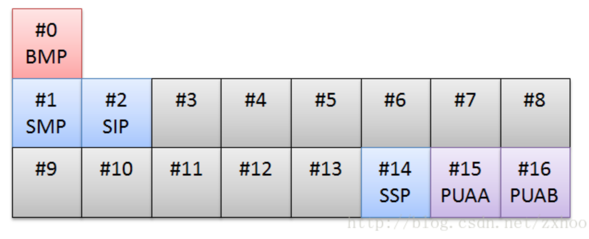

#### ASCII码

在计算机中，1个字节对应8位二进制数，而每位二进制数有0、1两种状态，因此1个字节可以组合256种状态。如果把这256种状态每一个都对应一个符号，就能通过一个字节的数据表示256个字符。美国人于是就制定了一套编码，ASCII码。ASCII码描述了英文字母、特殊符号与8位二进制的对应关系，它一共定义了128个字符(取值范围：0x00-0x7f)，每个字符只使用了8位中的后7位，最前面一位统一规定为0。

#### ANSI

美国国家标准协会，也就是说，每个国家自己制定自己的文字的编码规则，并得到ANSI认可，符合ANSI的的标准，全世界在表示对应国家文字的时候都通用这种编码就叫做ANSI编码。比如中国的ANSI对应就是GB2312标准，日本就是JIT。

好了，ANSI的标准是什么呢？首先是ASCII的代码你不能用，也就是说ASCII码中在任何ANSI中应该都是相同的，其它的自己进行扩展。比如，中国把ASCII码变成8位，Ox7f之前我不动你的，我从0xa0开始编，0xa0到0xff才95个码位，对于中国文字那简直是杯水车薪，因此，就用两个字节吧，此编码范围从 0xA1A1-0XFEFE，这个范围可以表示23901个汉字，基本够用了。GB2312才7000多个。GBK更广，编码范围从0x8140-0xFEFE，可以表示3万多个汉字。

ANSI编码有一个致命的缺陷，就是每个标准是各自为阵的，不能兼容，完全可能会出现一个编码两个字符集都有对应，不知道显示哪一个的问题。

#### Unicode

**基本概念**

1. 代码点：Unicode标准的本意很简单：给世界上每一种文字系统中的每一个字符都分配一个唯一的整数，这个整数叫做代码点。
2. 代码空间：所有代码点构成一个代码空间，根据Unicode定义，总共有1 114 112个代码点，编号从0x0-0x10ffff。换句话说，如果每个代码点都能代表一个有效的字符的话，那么Unicode标准最多能够编码1 114 112个字符。最新的Unicode标准(7.0)已经超过11万个字符分配了代码点。
3. 代码平面：Unicode标准把代码点分成了17个代码平面，编号为#0-#16。每个代码平面包含65536(2^16)个代码点，其中#0叫做基本多语言平面，其余平面叫做补充平面。Unicode7.0只使用了17个平面中的6个，并且给这6个平面起了名字：

* BMP：大部分常用的字符都坐落在这个平面内，比如ASCII字符、汉字等。前128个字符为ASCII字符，前256个字符为ISO-8859-1字符，0x4E00~0X9FFF定义了两万多个汉字，其中前20902个汉字是按照《康熙字典》里笔画顺序排列的。

* SMP：这个平面定义了一些古老的汉字，不常用。
* SIP：这个平面主要是一些BMP中没有包含的汉字。
* SSP：这个平面定义了一些非图型字符。

**Unicode编码方案**

Unicode没有规定字符对应的二进制码如何存储，以汉字“汉”为例，它的Unicode码点是0x6c49，对应的二进制数是110110001001001，二进制数有15位，这也说明它至少需要2个字节来表示。可以相像，在Unicode字典中越往后的字符可能就需要3个字节或者4个字节，甚至更多字节来表示。

这就导致了一些问题，计算机怎么知道你这个2个字节表示一个字符而不是分别表示两个字符呢。这里我们可能会想到，那就取个最大的，假如Unicode中最大的字符用4个字节就表示了，那么我们就将所有的字符都用4个字节来表示，不够的就往前面补0。这样确实可以解决编码问题，但是却造成了空间的极大浪费，如果是一个英文文档，那么文件大小就大出了3倍，这显然是无法接受的。

**UTF-8**

UTF-8是目前互联网上使用最广泛的一种Unicode编码方式，它的最大特点就是可变长。它可以使用1-4个字节表示一个字符，根据字符的不同变换长度。编码规则如下：

1. 对于单字节的字符，第一位设为0，后面的7位对应这个字符的Unicode码点，因此，对于英文中的0-127号字符，与ASCII码完全相同。这意味着ASCII码那个年代的文档用UTF-8编码打开完全没有问题。
2. 对于需要使用N个字节来表示的字符(N > 1)，第一个字符的前N位设为1，第N+1位设为0，剩下的N-1个字节的前两位都设为10，剩下的二进制位都用这个字符的Unicode码点来填充。

码点范围与UTF-8二进制对照表：

| Unicode十六进制码点范围 | UTF-8二进制                         |
| ----------------------- | ----------------------------------- |
| 0000 0000 - 0000 007F   | 0xxxxxxx                            |
| 0000 0080 - 0000 07FF   | 110xxxxx 10xxxxxx                   |
| 0000 0800 - 0000 FFFF   | 1110xxxx 10xxxxxx 10xxxxxx          |
| 0001 0000 - 0010 FFFF   | 11110xxx 10xxxxxx 10xxxxxx 10xxxxxx |

下面以汉字“汉”位例，汉的Unicode码点是0x6c49(110 1100 0100 1001)，通过上面的对照表可以发现，0x0000 6c4位于第三行范围，那么得出其格式为1110xxxx 10xxxxxx 10xxxxxx。接着从“汉”的二进制数最后一位开始，从后向前依次填充对应格式中的x，多出的x用0补上，这样就得到了“汉”的UTF-8编码为11100110  10110001  10001001 ,转换成十六进制就是0Xe6 0xb7 0x89。

解码的过程也十分简单：如果一个字节的第一位是0，则说明这个字节对应一个字符；如果一个字节的第一位是1，那么连续有多少个1，就表示该字符占用多少个字节。