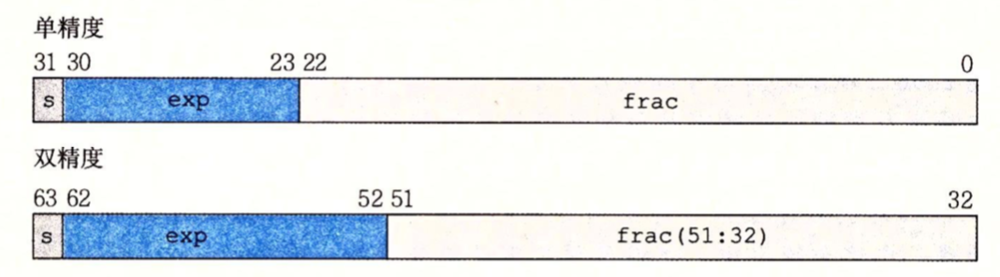
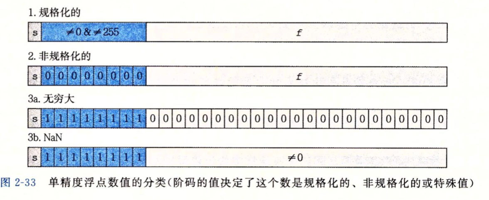

#### 十进制与二进制

> 说明：用小下标表示进制，无下标默认为十进制。例如十进制1表示为1，二进制1表示为 $1_2$。

我们先来看一下二进制与十进制之间的转换：

$101.11_2$=1$\times$$2^2$+0$\times$$2^1$+1$\times$$2^0$+1$\times$$2^{-1}$+1$\times$$2^{-2}$=4+1+1/2+1/4 = 5.75

反过来：

5.75 = 5+3/4=4+1+1/2+1/4 = 101.11$_2$

**十进制小数点向左移动1位相当于该数除以10，向右移动1位相当于该数乘以10；同理二进制小数点向左移动1位相当于将该数除以2，向右移动1位相当于将该数乘以2**。

例如：11$_2$/2=1.1$_2$，1.1$_2$$\times$2=11$_2$。

#### 科学计数法

通常采用科学计数法来表示一个极大或者极小的数。采用科学计数法主要利于节省存储空间并且可以较为直观的确认它的大小。

例如：

0.00000000000000000000000167262158 = 1.67262158$\times$10$^{-24}$

1898130000000000000000000000 = 1.89813$\times$10$^{27}$

等号右边就是科学计数法的表达格式，即：a$\times$10$^n$

#### 二进制科学计数法

其实二进制科学计数法跟十进制类似，如下例子：

5.75 = 101.11$_2$  = 1.0111 $\times$2$^2$

0.1875 = 3/16=1/16+1/8=2$^{-4}$+2$^{-3}$=0.0011$_2$ = 1.1$_2$$\times$2$^{-3}$

因此二进制的科学计数法是：y = a$\times$2$^x$，其中$x$为阶码，2为阶码的底，y、a都用二进制数表示，a表示y的全部有效数字，$x$指明小数点的位置。

#### IEEE浮点数

我们都知道用普通的补码不能很有效的表示非常大的数字，例如5$\times$2$^{100}$，它是用101后面跟随100个零的位模式来表示，如果在计算机中采用这种方式来存储大数字，将会非常耗费空间。因此对于一个很大的数，我们通常使用类似科学计数法的形式来表示，也就是**IEEE标准**。

IEEE754浮点标准规定了四种表示浮点数值的方式

* 单精度(32位)
* 双精度(64位)
* 延伸单精度(43比特以上，很少使用)
* 延伸双精度(79比特以上，通常以80位实现)

IEEE754标准规定一个**实数**可以用V = (-1)$^s$$\times$M$\times$2$^E$的形式来表示：

* 符号(sign) ：s决定一个实数是负数(s=1)还是正数(s=0)。
* 阶码(指数)：指明小数点的位置，同时E的作用是对浮点数加权。
* 尾数：M是一个二进制小数(小数点后面的数值)，它代表了浮点数的精度，使用**原码**表示。

IEEE标准将浮点数的位划分为三部分，并分别对这些值进行编码，以单精度为例：

* 第一部分：符号位，占一个字节，直接将s填入，即0为正数，1为负数。
* 第二部分：阶码，实数中的阶码(指数)E加上一个偏移值。偏移值为2$^{n-1}$-1，其中n为存储指数的比特位长度。
* 第三部分：尾数，存储“有效数字”的小数部分。使用原码表示。

#### 示例

我们以32位单精度浮点数为例子：

* 最高的1位是符号位。
* 接下来是8位阶码， 偏移量为2$^{8-1}$-1=128-1=127。
* 最后23位是尾数。

**正数实例**

1）将十进制数转换为浮点数

78 = 01001110$_2$=1.001110$_2$$\times$2$^6$

分析：

> 78是正整数，所以符号位是0。
>
> 指数为6，因此浮点数中的阶码为6+127=133=10000101$_2$
>
> 由于尾数只存储有效数字的小数部分，所以尾数是001110。最高位1规定不显示存储，以隐含方式存在，计数或恢复数值时再把这个1补上。
>
> 最终得到的32位浮点数为：
>
> 0-10000101-00111000000000000000000

2）将浮点数恢复为十进制数

0-10000101-00111000000000000000000

分析：

> 符号为0，说明是正数。
>
> 阶码为10000101=133，因此实际指数值为133-127=6。
>
> 尾数=小数部分00111000000000000000000+隐含值1=1.00111000000000000000000。
>
> 因此，该浮点数所表示的实际值为1.00111$_2$$\times$2$^6$=01001110=78

**负数实例**

将十进制数转换成浮点数：

-16 = 10010000$_2$ = -1.0$\times$2$^4$

分析：

> 符号位是1
>
> 阶码是4+127=131=10000011$_2$
>
> 尾数是0
>
> 因此-16的单精度浮点数表示为：1-10000011-00000000000000000000000

**浮点数表示步骤**

1. 将十进制数值转换成二进制数值
2. 将二进制数值转换成科学计数法。其中二进制采用原码表示。
3. 确定符号位，如果是正数，符号位为0，如果是负数，符号位为1。
4. 计算阶码，将科学计数法的指数值加上偏移值(单精度为127)，再转换成8位二进制。
5. 计算尾数，忽略有效数字的整数部分1(小数点左边的1)，将有效数字的小数部分作为尾数，如果尾数不足23位(单精度)则右边用0填充至23位。

**指数为什么要加上偏移值**

上面可以看到，指数存储的时候需要加上偏移值，但是恢复的时候还得再减回来。它之所以要加上偏移值，是因为科学计数法的指数可为正，可为负。因此，一个数转为浮点数之后，符号位、阶码这两部分都是带符号的。如果我们要比较两个浮点数的大小，那么除了要判断数值本身的符号位，还要判断比较阶码的符号位，最后才是非符号部分的比较。显然，这会复杂化比较逻辑。

在使用了偏移值之后，无论指数部分是正是负，都可以转换成非负数。将真值映射到正数域的数值称为移码。使用移码来比较两个真值的大小比较简单，只要高位对齐后逐位比较即可，不用考虑符号位的问题。

**为什么偏移值为2$^{n-1}$-1而不是2$^{n-1}$**

8位二进制有符号数的取值范围是[-128,127]，也是32位浮点数指数可能表示的最大取值范围。要使指数变成非负数，则[-128,127]至少需要加上128，得到阶码[0,255]。但是IEEE754规定阶码0和255为特殊值，那么阶码实际能表示的范围是[1,254]。所以如果偏移值仍为128，那么指数范围将变成[-127,126]。

为了让浮点数能够表示更大的取值，将指数范围加上1得到范围[-126,127]，对应偏移值减去1得到127。但是能表示的区间似乎并没有发生变化。

无论如何，阶码的规定如下：

* 阶码的范围是：1到2$^2$-2，对于单精度浮点是[1,254]。
* 偏移值是：2$^{n-1}$-1，对于单精度浮点数是：127.
* 单精度的实际指数范围是[-126,127]。

**为什么隐含最高位1**

由于使用科学计数法表示二进制值时，最高位为固定数值1。因此，通过省略最高位1，浮点数的尾数可以增加1位来更精确的表示数值(23位尾数能表示24位二进制数)。

#### 浮点数表现形式

前面对于浮点数的介绍，其实指的是浮点数的**规格化**表现形式。规格化形式是浮点数最主要的表现形式，日常使用的绝大部分数值都可以用它来表示。

根据浮点数第二部分的值(阶码值)，可以分成三种不同的情况(最后一种情况有两个变种)：

**情况1：规格化的值**

这是最普遍的情况。当阶码的位模式不全为0(数值0)，也不全为1(单精度数值为 255，双精度值为2047)，都属于这种情况。上面已经介绍过了，就不再叙述。

**情况2：非规格化的值**

当阶码域全为0时，所表示的数就是非规格形式。一般是某个数字相当接近零时，才需要使用非规格化形式来表示。

IEEE 754标准规定：非规格化形式的浮点数的指数偏移值比规格化形式的浮点数的指数偏移值小1，也就是偏移值为2$^{n-1}$-2。对于单精度浮点数，偏移值为126，因此，实际值为固定数值-126(阶码0减去偏移值126)。

非规格化数有两个用途，首先，它们提供了一种表示数值0的方法，因为使用规格化数，我们必须总是使M>=1，因此我们就不能表示0。实际上，+0.0的浮点表示的位模式位全0：符号位是0，阶码字段全为0(表明是一个非规格化值)，小数域也全为0。当符号为是1，而其它域全为零时，我们得到值-0.0。根据IEEE的浮点格式，值+0.0和-0.0在某些方面被认为是不同的。、

非规格化数的另外一个作用是表示那些非常接近于0.0的数。它们提供了一种属性，称为逐渐溢出，其中，可能的数值分布均匀的接近于0.0。

**情况3：特殊值**

最后一类数值是当阶码全为1的时候出现。当小数域全为0时，得到的值表示无穷，并且当s=0时是正无穷，或者当s=1时是负无穷。

当我们把两个非常大的数相乘，或者除以零时，无穷能够表示溢出的结果。当小数域为非零时，结果值被称为"NaN"，即不是一个数的缩写(Not a Number)。

