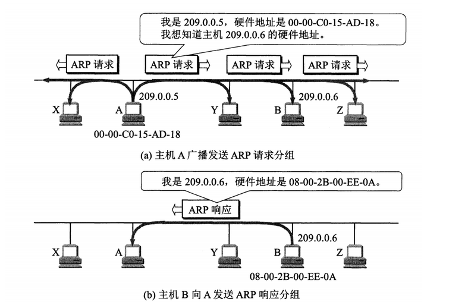

### ARP协议

ARP是用来解决同一个局域网上主机或者路由器的IP地址和硬件地址(MAC地址)的映射问题。

在实际应用中，当我们知道了一个机器的ＩＰ地址，然后去访问它时，首先会判断要去的这个地址(或者网卡)和我是否是一个网段，只有是同一个网段的，它才会发送ARP请求，获取MAC地址（只要是在网络上跑的包，都是完整的，可以有下层没有上层，绝对不可能有上层没下层）。因为在实际网络的链路上传送数据帧时，最终还是必须使用该网络的硬件地址

每个主机都有一个ARP高速缓存，里面有本局域网上的各主机和路由器的ＩＰ地址和ＭＡＣ地址的映射表．当主机Ａ要向本局域网的某个主机Ｂ发送ＩＰ数据报时，就先在其ＡＲＰ高速缓存中查看有无主机Ｂ的ＩＰ地址．如果有，就在ＡＲＰ高速缓存中查出其对应的硬件地址，再把这个硬件地址写入到ＭＡＣ帧，然后通过局域网把该ＭＡＣ帧发往此硬件地址．

如果主机Ａ在ARP缓存中没有IP映射，则主机A的ARP进程在本局域网上广播发送一个ARP请求分组，在本局域网上的所有主机上运行的ARP进程都收到了此ARP请求分组，主机Ｂ收到该请求后会发送ARP响应分组给主机Ａ告诉其ＭＡＣ地址，随后主机Ａ收到主机Ｂ的ＡＲＰ响应分组后，就在其ＡＲＰ高速缓存中写入主机Ｂ的ＩＰ地址到硬件地址映射．

