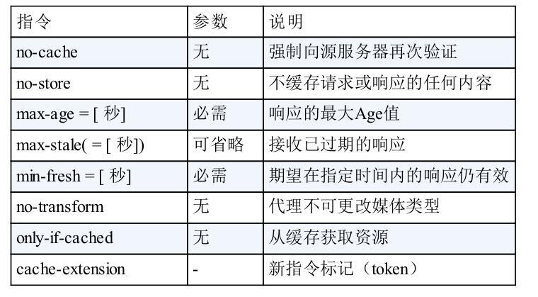
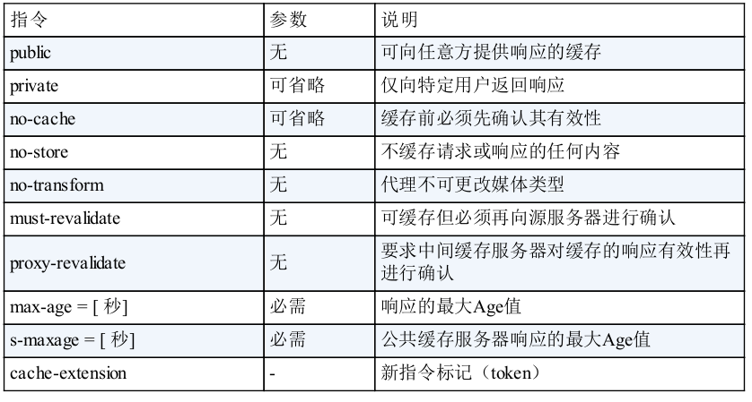

#### HTTP协议

#### 1. HTTP 请求的准备

当我们在浏览器中输入一个URL时，浏览器会将这个域名发送给DNS服务器，然后DNS服务器将它解析成IP地址。然后由于HTTP是基于TCP协议的，所以首先要先建立TCP连接，进行三次握手，并且目前使用的HTTP协议大部分都是1.1，在1.1的协议里面，默认开启Keep-Alive的，这样建立的TCP连接就可以在多次的请求中复用。

#### 2. HTTP 请求的构建

请求格式如下：


HTTP的报文大概分为三大部分。第一部分是请求行，第二部分是请求的首部，第三部分才是请求的正文实体。

#### 第一部分请求行

在请求行中，URL就是请求地址如：```http://www.baidu.com```，版本是HTTP 1.1。

对于方法，我们常用的有如： GET，就是去服务器获取资源；POST，主动告诉服务器一些信息，例如我们在网站注册用户时，主动添加个人信息；PUT：就是向指定资源位置上传最新内容，它与POST基本相同，但是在实际应用中，PUT往往用来修改一个资源。还有DELETE，用来删除资源。

#### 第二部分：首部字段

请求行下面就是首部字段，首部是key value，通过冒号分割。

通用首部字段

1. Cache-Control：能够控制缓存行为，指令的参数是可选的，多个指令之间通过","分隔

* 缓存请求指令



* 缓存响应指令



 public指令：Cache-Control:public 

当指定使用public指令时，则明确表明其他用户也可以利用缓存。

public指令：Cache-Control:private

当指定private指令后，响应只以特定的用户作为对象。即缓存服务器会对特定用户提供资源缓存的服务，对于其他用户发送过来的请求，代理服务器则不会返回缓存。

no-cache指令：Cache-Control:no-cache

> 从字面意思上很容易把no-cache误解为不缓存，事实上no-cache代表不缓存过期的资源，缓存会向资源服务器进行有效期确认后处理资源。no-store才是真正的不进行缓存。

使用no-cache指令的目的是为了防止从缓存中返回过期的资源。客户端发送的请求中如果包含no-cache指令，则表示客户端将不会接收缓存过的响应。于是，“中间”的缓存服务器必须把客户端请求转发给资源服务器。

如果服务器返回的响应中包含no-cache指令，那么缓存服务器不能对资源进行缓存。源服务器以后将不再对缓存服务器请求中提出的资源有效性进行确认，且禁止其对响应资源进行缓存操作。

由服务器返回的响应中，若报文首部字段Cache-Control中对no-cache字段指定具体参数值，那么客户端在接收到这个被指定的首部字段后，就不能使用缓存。```Cache-Control:no-cache=Location```。

no-store指令： Cache-Control:no-store

当使用no-store指令时，暗示请求或者响应中包含机密信息，因此，该指令规定禁止缓存。

max-age指令：Cache-Control:max-age=604800(单位：秒)

当客户端发送的请求中包含max-age指令时，如果判断缓存资源的缓存时间数值比指定时间的数值更小，那么客户端就接收缓存的资源。另外，当指定max-age值为0，那么缓存服务器通常需要将请求转发给资源服务器。

当服务器返回的响应中包含max-age指令时，缓存服务器将不再对资源的有效性做确认，而max-age数值代表资源保存为缓存的最长时间。

HTTP/1.1版本的缓存服务器遇到同时存在Expires首部字段的情况时，会优先处理max-age指令，而HTTP/1.0情况相反。

min-fresh指令：Cache-Control:min-fresh=60

min-fresh指令要求缓存服务器返回至少还未过指定时间的缓存资源。比如，当指定min-fresh为60秒后，过了60秒的资源都无法作为响应返回了。

max-stale指令：Cache-Control:max-stale=3600

使用max-stale可指示缓存资源，即使过期也照常接收。如果指令未指定参数，那么无论经过多久，客户端都会接收响应；如果指令中指定了具体数值，那么即使过期，只要仍处于max-stale指定的时间内，仍旧会被客户端接收。

only-if-cached指令：Cache-Control:only-if-cached

使用only-if-cached指令表示不进行网络请求，完全只使用缓存，若缓存不命中，则返回状态码504。

must-revalidate指令：Cache-Control:must-revalidate

使用must-revalidate指令，代理会向资源服务器验证即将返回的缓存目前是否仍然有效。

若代理无法连通资源服务器再次获取有效资源的话，缓存必须给客户端一条504。另外使用must-revalidate指令会忽略请求的max-stale指令。

2. Connection

Connect首部字段具备如下两个作用：

* 控制不再转发给代理的首部字段
* 管理持久连接

> Connection:不再转发的字段名称

在客户端发送请求和服务端返回响应内，使用Connection首部字段，可控制不再转发给代理的首部字段。

> Connection:close

HTTP/1.1版本的默认连接都是持久连接。为此，客户端会在持久连接上连续发送请求。当服务器端想明确断开连接时，则指定Connection首部字段的值为close 。

HTTP/1.1之前的版本默认是非持久连接。为此，如果想在旧版本的HTTP协议上维持持续连接，则需要指定Connection首部字段的值为Keep-Alive。


请求首部字段：

1. Accept：告诉WEB服务器，用户代理能够处理的媒体类型，以及媒体类型的相对优先级。```*/*```表示任何类型 (text/html)。
2. Accept-Charset：告诉服务器用户代理支持的字符集，以及字符集的相对优先级，可用q值来表示相对优先级，q的范围是0~1，默认q=1.0 比如：gb2312,utf-8;q=0.7,*;q=0.7。

3. Accept-Encoding：告诉服务器用户代理支持的内容编码，通常指定压缩方法(gzip, deflate)。

4. Accept-Language：用来告诉服务器用户代理能够处理的自然语言集,比如：zh-CN,zh;q=0.8,zh-TW;q=0.7,zh-HK;q=0.5,en-US;q=0.3,en;q=0.2。

5. Authorization：用来告诉服务器，用户代理的认证信息。
6. Host：请求的web服务器域名地址。当请求被发送到服务器时，请求中的主机名会用IP地址直接替换解决。但如果相同的IP地址下部署运行着多个域名，那么服务器就无法理解究竟哪个域名对应的请求。因此就需要使用首部字段Host来明确指出请求的主机名称。
7. If-Match：形如if-xxx这种样式的请求首部字段，都可称为条件请求。服务器接收到附带条件的请求后，只有判断指定条件为真，才会执行请求。首部字段If-Match它会高速服务器匹配资源所用的实体标记(ETag)值。这时的服务器无法使用弱ETag值。服务器会对比If-Match字段值和资源的ETag值，仅当两者一致时，才会执行请求。还可以使用星号(*)指定If-Match值，服务器将会忽略Etag的值，只要资源存在就处理请求。
8. If-Modified-Since：如果在If-Modified-Since字段指定的日期时间之后，资源发生了更新，服务器会接受请求。如果请求的资源没有更新，则返回状态码304Not Modified的响应。获取资源的更新日期时间可以通过Last-Modified来确定。
9. If-None-Match：它的段值与ETag值不一致时，可以处理该请求。与If-Match首部字段的作用相反。
10. If-Range：浏览器告诉WEB服务器，如果我请求的对象没有发生改变，就把我缺少的部分给我，如果对象改变了，就把整个对象给我。浏览器通过发生请求对象的ETag或者自己所知道的最后修改时间给WEB服务器，让其判断对象是否改变了。
11. If-Unmodified-Since：与首部字段If-Modified-Since的作用相反。
12. Max-Forwards：通过TRACE方法或OPTIONS方法，发送包含首部字段Max-Forwards的请求时，该字段以十进制整形的形式指定可经过的服务器最大数目。服务器在往下一个服务器转发之前，Max-Forwards的值减一后重新赋值。当服务器接收到Max-Forwards值为0的请求时，则不再进行转发，而是直接返回。


#### 3. HTTP请求的发送

HTTP协议是基于TCP协议的，所以它使用面向连接的方式发送请求，通过stream二进制流的方式传给对方。当然到了TCP层，它会把二进制流变成一个报文段发送给服务器。

在发送每个报文段的时候，都需要对方有一个回应ACK来保证报文段可靠的到达了对方。如果没有回应，那么TCP这一层会重新传输，直到可以到达。同一个包有可能被传了好多次，但是HTPP这一层不需要知道这一点，因为是TCP这一层需要关注的。

TCP层发送每一个报文的时候，都需要加上自己的地址（即源地址）和它想要去的地方（目标地址），将这两个信息放到IP头里面，交给IP层进行传输。

IP层需要查看目标地址和自己是否在同一个局域网。如果是，就发送ARP协议来请求这个目标地址对应的MAC地址，然后将源MAC和目标MAC放入MAC 头，发送出去即可；如果不在同一个局域网，就需要发送到网关，还要发送ARP协议来获取网关的MAC地址，然后将源MAC和网关MAC放入MAC头，发送出去。

网关收到包发现MAC符合，取出目标IP地址，根据路由协议找到下一跳的路由器，获取下一跳路由器的MAC地址，将包发给下一个路由器。

这样路由器一跳一跳终于到达局域网，这个时候，最后一跳的路由器能够发现，目标地址就在自己的某一个出口的局域网上。于是，这个局域网上发ARP，获取这个目标地址的MAC地址，将包发出去。

目标的机器发现MAC地址符合，就将包收起来；发现IP地址符合，根据IP头中协议项，知道自己上一层是TCP协议，于是解析TCP的头，里面有序列号，需要看一看这个序列包是不是我要的，如果是就放入缓存中然后返回一个ACK，如果不是就丢弃。

TCP头里面还有端口号，HTTP的服务器正在监听这个端口号。于是，目标机器自然知道是HTTP服务器这个进程想要这个包，于是将包发给HTTP服务器。HTTP服务器的进程看到，原来这个请求是要访问一个网页，于是就把这个网页发给客户端。

#### 4. HTTP返回的构建

HTTP的返回报文也有一定格式的，如下基于HTTP1.1的：


响应首部字段：

1. ETag：首部字段ETag能告诉客户端实体标识。它是一种可将资源以字符串形式做唯一标识的方式。服务器会为每份资源分配对应的ETag。当资源更新时，ETag值也需要更新。

Etag中有强ETag值和弱Tag值之分：

强ETag：不论实体发生多么细微的变化都会改变它的值。

弱ETag：只用于提示资源是否相同。只有资源发生根本改变，产生差异时才会改变Etag值。

1. Accept-Range用来告知客户端，服务端是否能处理范围请求，以指定获取服务端某个部分的资源。可以指定的字段值有两种，可处理范围请求时指定其为bytes，反之则指定其为none。
2. age：告知客户端，源服务器在多久前创建了响应。字段值的单位为秒。若创建该响应的服务器是缓存服务器，Age值是指缓存后的响应再次发起认证到认证完成的时间值。
3. Location：可以将响应接收方引导至某个与请求URI位置不同的资源。基本上该字段会配合3xx：Redirection的响应，提供重定向URI。
4. Retry-After：告知客户端应该在多久之后再次发送请求。
5. Server：首部字段Server告知客户端当前服务器上安装的HTTP服务器应用程序的信息。
6. Vary：首部字段Vary可对缓存进行控制。从代理服务器接收到源服务器返回包含Vary指定项的响应之后，并进行缓存，然后接收到客户端请求，仅对包含有相同Vary指定首部字段的请求返回缓存。如果Vary指定的首部字段不相同，必须从源服务器重新获取资源。

实体首部字段：

1. Allow：用于通知客户端能够支持Request-URI指定资源的所有HTTP方法。当服务器接收到不支持的HTTP方法时，会以状态码405Not Allowed作为响应返回。与此同时，还会把所有能支持的HTTP方法写入首部字段Allow后返回。
2. Content-Encoding：告诉客户端服务器对实体的主体部分选用的内容编码方式。内容编码是指在不丢失实体信息的前提下所进行的压缩(gzip)。
3. Content-Language：告诉客户端，实体主体使用的自然语言。
4. Content-Length：实体主体部分的大小(单位是字节)。对实体主体进行内容编码时，不能使用Content-Length首部字段。
5. Content-Location：给出与报文主体部分相对应的URI。
6. Content-Range：针对范围请求，返回响应时使用首部字段Content-Range，能告知客户端返回符合范围的哪个部分。字段值以字节为单位，表示当前发送部分以及整个实体大小。
7. Content-Type：说明了实体主体内对象的媒体类型。和首部字段Accept一样。
8. Expires：首部字段Expires会将资源失效日期告知客户端。缓存服务器在接到含有首部字段Expires的响应后，会以缓存来应答请求，在Expires字段值指定的时间之前，响应的副本会一直被保存。当超过指定的时间后，缓存服务器在请求发送过来时，会转向源服务器请求资源。
9. Last-Modified：首部字段Last-Modified指明资源最终修改时间。

#### 5. HTTP 2.0

HTTP1.1在应用层以纯文本的形式进行通信。每次通信都要带完整的HTTP的头，而且不考虑pipeline模式的话，每次的过程总是像上面描述的那样一去一回。这样在实时性、并发性上都存在问题。

为了解决这些问题，HTTP2.0会对HTTP的头进行一定的压缩，将原来每次携带的大量key value在两端建立一个索引表，对相同的头只发索引表中的索引。


