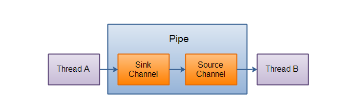

#### Java NIO Pipe

Java NIO管道是两个线程之间的单向数据连接。Pipe有一个source通道个一个sink通道。数据会被写到sink通道，从source通道读取。



**创建管道**

```
 Pipe pipe = Pipe.open();
```

**向管道写数据**

```java
 Pipe pipe = Pipe.open();
       //要向管道写数据，首先要访问sink通道
       Pipe.SinkChannel sinkChannel = pipe.sink();
       
       String data = "new String";
       
       ByteBuffer byteBuffer = ByteBuffer.allocate(48);
       
       byteBuffer.clear();
       
       byteBuffer.put(data.getBytes());
       
       byteBuffer.flip();
       
       while (byteBuffer.hasRemaining()){
           //写入数据
           sinkChannel.write(byteBuffer);
           
       }
```

**从管道中读取数据**

首先要先访问source通道

```
Pipe.SourceChannel channel = pipe.source();
```

调用source的read()方法来读取数据，read()方法会返回读取了多少字节进缓冲区。

```
ByteBuffer byteBuffer = ByteBuffer.allocate(48);

 int byteRead = channel.read(byteBuffer);
```

