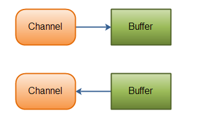
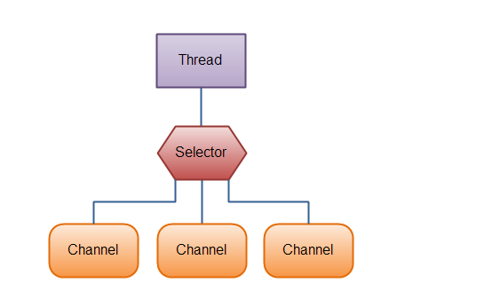

### Java NIO

传统IO，一个用户发起IO操作后，必须等待IO操作完成，然后用户进程才能运行。Java NIO当用户发起一个IO操作以后便可以返回去做其它的事情，但是用户进程需要时不时的询问IO操作是否就绪，这就需要用户进程不断的去询问，从而引入不必要的CPU资源浪费。

要了解NIO，我们需要知道NIO中的一个关键组件Channel(通道)，Channel有点类似于流，一个Channel可以和文件或者Socket对应。

下面是Java NIO中一些主要的Channel的实现：

* FileChannel
* DatagramChannel
* SocketChannel
* ServerSocketChannel

FileChannel是文件IO，DatagramChannel是UDP网络IO，SocketChannel是TCP网络IO。

和Channel一起使用的另外一个重要组件是Buffer，它类似于一个内存区域或者byte数组，数据需要包装成Buffer的形式才能和Channel交互（写入或者读取）。



以下是Java NIO里关键的Buffer实现

* ByteBuffer
* CharBuffer
* DoubleBuffer
* FloatBuffer
* IntBuffer
* LongBuffer
* ShotBuffer

另外一个与Channel密切相关的是Selector(选择器)。在Channel的众多实现中，有一个SelectableChannel实现，任何一个SelectableChannel都可以将自己注册到一个Selector中。这样，这个Channel就能被Selector所管理。而一个Selector可以管理多个SelectableChannel。当SelectableChannel的数据准备好时，Select就会被接到通知，得到那些已经准备好的数据。SocketChannel就是SelectableChannel的一种。



实例：

```java
public class ChannelDemo {
    public static void main(String[] args)throws Exception{
        RandomAccessFile accessFile = new RandomAccessFile("/home/yanyong/worksapce/nio-data","rw");
		//开启一个channel
        FileChannel fileChannel = accessFile.getChannel();
		//申请一个buffer
        ByteBuffer byteBuffer = ByteBuffer.allocate(48);
		//将channel中的数据写入到Buffer中
        int byteRead = fileChannel.read(byteBuffer);
		//当buffer中被写入了数据
        while (byteRead != -1){
            System.out.println("Read："+byteRead);
			//切换模式，从写模式切换到读模式
            byteBuffer.flip();
			//hasRemaining()：是否还剩下内容没有读
            while (byteBuffer.hasRemaining()){
				//打印buffer中的数据
                System.out.println((char)byteBuffer.get());
            }
			//清空缓存
            byteBuffer.clear();
            byteRead = fileChannel.read(byteBuffer);
        }
        accessFile.close();
    }
}
```


#### 1. Channel

JavaNIO的通道类似流，但又有些不同。它既可以从通道中读取数据，又可以将数据写到通道，但流的读写通常是单向的；通道可以异步地读写；通道中的数据总是要先读到一个buffer中，或者总是要从一个buffer中写入。

#### 2. Buffer的基本用法

为了了解Buffer的工作原理，需要熟悉它的三个属性：

- capacity 

作为一个内存快，Buffer有一个固定的大小值，也叫做capacity。入股Buffer满了，需要将其清空才能继续往里面写数据。

- position

当向buffer写入数据时，position表示写入数据的标志位，随着数据的写入position会向前移动到下一个可插入数据的Buffer单元。它的最大值为capacity-1

- limit

在写的模式下，limit等于capacity，表示最多可以往buffer中写入多少数据。

当切换Buffer到读模式时，limit表示最多能读到多少数据，即切换模式时，limit的值会设置成position的值。


2.1. 申请一个缓存空间

```java
ByteBuffer byteBuffer = ByteBuffer.allocate(48);

public static ByteBuffer allocate(int capacity) {
        if (capacity < 0)
            throw new IllegalArgumentException();
    	//创建一个堆缓存,第一个参数是capacity,第二个参数是limit
        return new HeapByteBuffer(capacity, capacity);
 }

HeapByteBuffer(int cap, int lim) {            // package-private
	super(-1, 0, lim, cap, new byte[cap], 0);//创建一个byte[]数组，调用父类的构造方法       
}

  
```

2.2. 向Buffer中写数据

写数据到buffer有两种方式

* 从channel写到buffer

```
 int byteRead = fileChannel.read(byteBuffer);
```

* 通过put方法写入到Buffer。put方法有很多版本，允许你以不同的方式把数据写入到Buffer中。具体查看源码。

```java
buf.put(127);
//源码
public ByteBuffer put(byte x) {

        hb[ix(nextPutIndex())] = x;//检查数组是否越界，如果不越界在返回position++
        return this;
}
final int nextPutIndex() {                          // package-private
        if (position >= limit)
            throw new BufferOverflowException();
        return position++;
}
```

2.3. flip()方法

将Buffer从写模式切换到读模式，调用flip()方法会将position设置为0，并将limit设置成之前的position。

```java
public final Buffer flip() {
        limit = position;
        position = 0;
        mark = -1;
        return this;
 }
```

2.4. 从Buffer中读取数据

从buffer中读取数据有两种方式：

* 从Buffer读取数据到CHannel

```
int bytesWritten = inChannel.write(buf);
```

* 使用get()方法从Buffer中读取数据

```java
byte aByte = buf.get();

//源码
public byte get() {
        return hb[ix(nextGetIndex())];
}

final int nextGetIndex() {                          // package-private
        if (position >= limit)
            throw new BufferUnderflowException();
        return position++;
}
```

2.5. rewind()方法

rewind()方法将position设置回0，即可以重新读取Buffer中的所有数据。limit保持不变。

```java
public final Buffer rewind() {
        position = 0;//将position设置为0
        mark = -1;
        return this;
 }
```

2.6. clear()和compact()方法

一旦读完Buffer中的数据，需要让Buffer准备好再次被写入，可以通过clear()或者compact方法来完成。

如果调用clear()方法，position将被设置回0，limit被设置成capacity。即Buffer被清空了，但是Buffer中的数据并未清除，只是这些标志告诉我们可以从哪里开始往Buffer写数据。

```java
public final Buffer clear() {
        position = 0;//position设置为0
        limit = capacity;//limit设置成capacity
        mark = -1;
        return this;
 }
```

compact()方法将所有未读的数据拷贝到Buffer起始处，然后将position设置到最后一个未读元素后面，limit设置成capacity，然后向Buffer中写入数据就不会覆盖掉那些未读的数据。

```java
 public ByteBuffer compact() {
     	//拷贝数据
		//hb：数据来源；ix(position())：拷贝的起始位置；hb：目标源；remaining()：拷贝长度
        System.arraycopy(hb, ix(position()), hb, ix(0), remaining());
     	//将position设置成最后一个未读数据后一位
        position(remaining());
     	//设置limit
        limit(capacity());
        discardMark();
        return this;
    }
```

2.7. mark()与reset方法

通过mark()方法，可以标志Buffer中的一个特定位置，之后可以通过reset()方法恢复到position。

```java
public final Buffer mark() {
        mark = position;//将position赋值给mark
        return this;
}

public final Buffer reset() {
        int m = mark;
        if (m < 0)
            throw new InvalidMarkException();
        position = m;//将mark重新赋值给position
        return this;
}
```

### 3. 通道之间的通信

在Java NIO中，如果两个通道中有一个是FileChannel，那你可以直接将数据从一个channel传输到另外一个channel。

```java
RandomAccessFile fromFile = new RandomAccessFile("/home/yanyong/worksapce/from","rw");

FileChannel fromChannel = fromFile.getChannel();
RandomAccessFile toFile = new RandomAccessFile("/home/yanyong/worksapce/to","rw");
FileChannel toChannel = toFile.getChannel();

long position = 0;
long count = fromChannel.size();
toChannel.transferFrom(fromChannel,position,count);
```

#### 4. Selector

Selector(选择器)是Java NIO中能够检测到一到多个NIO通道，并能够知晓通道是否为诸如读、写事件做好准备的组件。它可以一个单独线程可以管理多个channel，因此对于操作系统来说，线程之间上下文切换开销很大，每个线程都要占用系统的一些资源（如内存），使用的线程越少越好。当然现在一个cpu都有多个内核，不使用多任务可能在浪费cpu能力。

* Selecor的创建

```java
 Selector selector = Selector.open();
```

* 向Selector注册通道，注册成功后，会返回SelectionKey对象

```java
channel.configureBlocking(false);
SelectionKey key = channel.register(selector,Selectionkey.OP_READ);
```

与Selector一起使用，Channel必须处于非阻塞模式下，这意味着不能将FileChannel与Selector一起使用，因为FileChannel不能切换到非阻塞模式(没有configureBlocking方法)。

register()方法的第二个参数表示Selector监听器对什么事件感兴趣(interestOps)，可以监听四种不同类型的事件：

1. OP_CONNECT：某个channel成功连接到另一个服务器称为“连接就绪”

```java
public static final int OP_CONNECT = 1 << 3;
```

2. OP_ACCEPT:一个server socket channel准备接收新进入的连接称为"接收就绪"

```java
public static final int OP_ACCEPT = 1 << 4;
```

3. OP_READ：一个 有数据可读的通道可以说是“读就绪

```java
public static final int OP_READ = 1 << 0;
```

4. OP_WRITE：等待写数据的通道可以说是“写就绪”

```java
public static final int OP_WRITE = 1 << 2;
```

如果Selector对多个事件感兴趣，可以用“或”操作符将常量连接起来，如下：

```java
int interestSet = SelectionKey.OP_READ | SelectionKey.OP_WRITE;
```

* interestOps集合

interestOps集合就是你所选的感兴趣的事件集合，如下：

```java
//public abstract int interestOps();
int interestSet = selectionKey.interestOps();
//通过&操作可以确定某个事件是否在interestOps集合中
boolean isInterestedInAccept  = (interestSet & SelectionKey.OP_ACCEPT) == SelectionKey.OP_ACCEPT；
```

* ready集合

ready集合是通道已经准备就绪的操作集合，在一次选择（Selection）之后，你会首先访问这个ready set。

```java
//public abstract int readyOps();
public final boolean isReadable() {
        return (readyOps() & OP_READ) != 0;
}
```

* 通过SelectionKey访问Channel和Selector

```java
 public abstract SelectableChannel channel();
 public abstract Selector selector();
```

* 附加对象

可以将一个对象或者更多的信息附着到SelectionKey上，这样就方便识别某个给定的通道。

```java
selectionKey.attach(theObject);
Object attachedObj = selectionKey.attachment();
```

* 通过Selector选择通道

一旦向Selector注册了一个或者多个通道，就可以调用select方法获取感兴趣且事件(连接、接受、读、写)准备好的通道。

select()方法：阻塞到至少有一个通道在你注册的事件上就绪了。

select(long timeout)：和select()一样，除了最长会阻塞timeout毫秒。

selectNow()：不会阻塞，不管通道是否就绪，立即返回。

select()方法返回int值，表示有多少通道已经就绪。即自从上次调用select()方法后，有多少通道变成就绪状态。如：如果调用select()方法，有一个通道变成就绪，返回1，若再次调用select()方法，如果另一个通道就绪了，它会再次返回1。

* selectedKeys()

如果调用select()方法有值返回，说明有一个或者多个通道就绪了，然后可以通过调用selector的selectedKeys()方法，访问“已选择键集”中的就绪通道：

```
Set selectedKeys = selector.selectedKeys();
```

遍历已选择的键集合来访问已经就绪的通道，检测各个键对应的通道的就绪事件：

```java
Set selectedKeys = selector.selectedKeys();
Iterator keyIterator = selectedKeys.iterator();
while(keyIterator.hasNext()) {
    SelectionKey key = keyIterator.next();
    if(key.isAcceptable()) {
        // a connection was accepted by a ServerSocketChannel.
    } else if (key.isConnectable()) {
        // a connection was established with a remote server.
    } else if (key.isReadable()) {
        // a channel is ready for reading
    } else if (key.isWritable()) {
        // a channel is ready for writing
    }
    //每次迭代末尾调用remove()方法，移除已经处理完的通道，下次该通道变成就绪时，Selector会将其再次添加到集合中
    keyIterator.remove();
}
```

* wakeUp()

某个线程调用select()放到后阻塞了，即使没有通道已经就绪，也有办法让其从select()方法返回，只要让其它线程在第一个线程调用select()方法的那个对象上调用Selector.wakeup()方法即可。阻塞在select()方法上的线程会立即返回。

如果有其它线程调用了wakeup()方法，但当前没有线程阻塞在select()方法上，下个调用select()方法的线程会立即醒过来。

* close()

用完Selector后调用close()方法会调用其close()方法关闭Selector，且使注册到该Selector上所有的SelectionKey实例无效。通道本身不会关闭.

完整示例：

```java
Selector selector = Selector.open();
channel.configureBlocking(false);
SelectionKey key = channel.register(selector, SelectionKey.OP_READ);
while(true) {
  int readyChannels = selector.select();
  if(readyChannels == 0) continue;
  Set selectedKeys = selector.selectedKeys();
  Iterator keyIterator = selectedKeys.iterator();
  while(keyIterator.hasNext()) {
    SelectionKey key = keyIterator.next();
    if(key.isAcceptable()) {
        // a connection was accepted by a ServerSocketChannel.
    } else if (key.isConnectable()) {
        // a connection was established with a remote server.
    } else if (key.isReadable()) {
        // a channel is ready for reading
    } else if (key.isWritable()) {
        // a channel is ready for writing
    }
    keyIterator.remove();
  }
}

```

