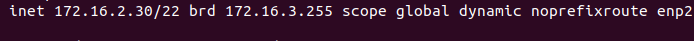
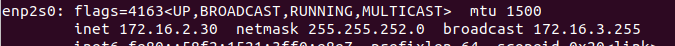
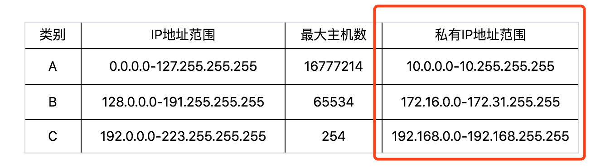
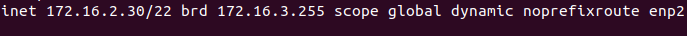

### ip相关知识

查看ip地址在Windows上使用ipconfig，在linux上是ifconfig(ip addr)。**ip地址是网卡在网络世界的通讯地址，相当于我们现实世界的门牌号**。IPV4被点分割为四个部分，每个部分8位，所以Ip地址总共有32位。它分为5类：


A、B、C类主要分为两部分，前面一部分是网络号，后面一部分是主机号。很好理解，大家都是六单元1001号，我是小区A的六单元1001号，而你是小区B的六单元1001号。

A、B、C三类地址所能包含的主机数量如下：


从上面的表格中可以看出，C类地址能包含的最大主机数量太少了，只有254个，而B类地址能包含的最大主机数量又太多了，6万多台机器放在一个网络下面，一般企业达不到这种规模，浪费地址。

#### 无类型域间选路

无类型域间选路(CIDR)打破了原来设计的几类地址的做饭，将32位的ip地址一分为二，前面是网络号，后面是主机号。如：10.100.122.2/24，这个ip地址中有一个斜杠，斜杠后面有个数字24，它表示前面24位是网络号，后面8位是主机号。

**广播地址**：广播地址是在ip地址的基础上将主机号的二进制全部填上1，再将得到的二进制全部转化成十进制就可以得到广播地址，如前面提到的ip地址10.100.122.2/24的广播地址是:10.100.122.255。如果往这个地址发送数据，所有10.100.122网段的机器都可以收到。

**子网掩码：**子网掩码只有一个作用，就是将某个ip地址划分成网络地址和主机地址两部分。即ip地址的网络部分都是“1”,主机部分全是“0”，如ip地址10.100.122.2/24的掩码是：255.255.255.0。

**网络号**：先将ip地址转换成二进制，然后与二进制的子网掩码进行按位and，得到的就是网络号。

如下例子：

通过```ip addr ```查看本地IP地址如下：



它的ip地址、子网掩码、广播地址如下：



#### 公有ip和私有ip

在日常工作中，几乎不用划分A类、B类和C类，但是有一点需要注意，就是有公有ip地址和私有ip地址。



表格最右列是私有ip地址段，平常我们看到的数据中心，办公室、家里或者学校的ip地址一般都是私有ip地址。因为这些地址允许组织内部的it人员自己管理、自己分配而且可以重复。

在ip地址后面有一个scope，对于eth0这张网卡来说，是global，说明这张网卡可以对外开放，可以接收来自各个地方的包。



对于lo来讲，是host，说明这张网卡仅仅可以供本机相互通信。lo全称**loopback**，又称**环回接口**，往往会被分配到127.0.0.1这个地址。这个地址用于本机通信，经过内核处理后直接返回，不会在任何网络中出现。


#### MAC地址

Mac地址像身份证一样，是一个唯一的标识。它的唯一性设计是为了组网的时候，不同的网卡放在一个网络里面的时候，可以不用担心冲突。从硬件的角度，保证不同的网卡有不同的标识。

#### 网关

