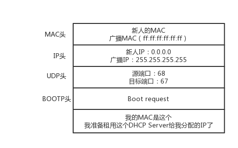

### 动态主机配置协议(DHCP)

动态主机配置协议，它可以为客户机自动分配IP地址、子网掩码以及缺省网关等TCP/IP参数。简单来说就是DHCP服务器上有一个数据库，存放着IP地址、网关、DNS等参数。当客户端请求使用时，服务器则负责将相应的参数分配给客户端。避免客户端手动指定IP地址。特别是在大规模的网络中，客户端数目多，使用DHCP可以方便对这些机器进行管理。

#### DHCP工作方式

* DHCP Discover

当一台机器加入一个新网络的时候，只知道自己的MAC地址，它会使用IP地址0.0.0.0发送一个广播包，目的IP地址为255.255.255.255。广播包封装了UDP，UDP封装了BOOTP。格式如下：

* DHCP Offer

如果网络管理员在网络里面配置了DHCP Server ，它就相当于IP管理员。当一台机器带着自己的MAC地址加入一个网络时，DHCP SERVER会为这台新的机器分配一个ip地址，并且将它缓存在DHCP SERVER中，从而不会为其它DHCP客户分配此IP地址。MAC地址是机器的唯一的身份，如果MAC地址重复了，就没办法配置了。

如果有多个DHCP Server ，则新来的机器会收到多个IP地址，它一般会选择最先到的那个，并且会向网络发送一个DHCP Request广播数据包，包中包含客户端的MAC地址、接受的租约中的IP地址、提供此租约的DHCP服务器地址等，并告诉其它DHCP Server它将接受哪一台服务器提供的IP地址，并请求撤销它们提供的IP地址，以便提供给下一个IP租用请求者。

由于还没有得到DHCP Server的最后确认，客户端任然使用0.0.0.0为源IP地址，255.255.255.255为目标地址进行广播。在BOOTP里面，接受某个DHCP Server的分配的IP。

当DHCP Server接收到客户机的DHCP request之后，会广播返回给客户机一个DHCP ACK消息包，表明已经接受客户机的选择，并将这一IP地址的合法租用信息和其它的配置信息都放入该广播包，发给客户机。

#### IP地址的收回和续租

客户机会在租期过去50%的时候，直接向为其提供IP地址的DHCP Server发送DHCP request消息包，客户机接受到该服务器回应的DHCP ACK消息包，会根据包中所提供的新的租期以及其它已经更新的TCP/IP参数，更新自己的配置。这样，IP租期更新就完成了。