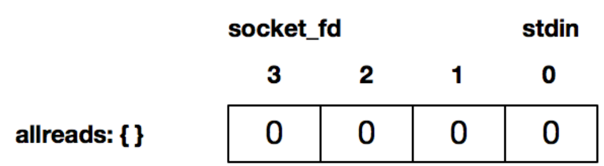
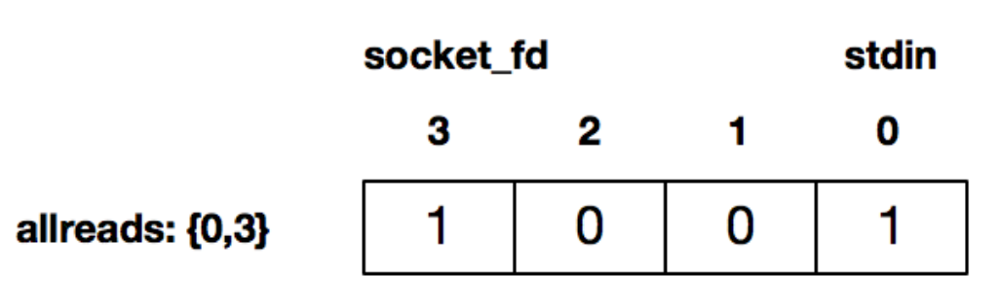
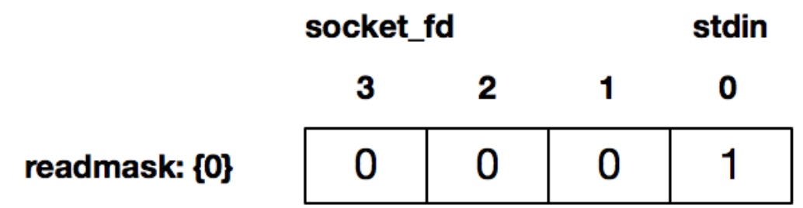

I/O多路复用的设计初衷是解决这样的场景：我们把标准输入、套接字等都看做I/O的一路，多路复用的意思，就是在任何一路I/O有事件发生的情况下，通知应用程序区处理相应的I/O事件。

使用select函数，通知内核挂起进程，当一个或多个I/O事件发生后，控制权返还给应用程序，由应用程序进行I/O事件的处理。

I/O事件的类型非常多，比如：

* 标准输入文件描述符准备好可以读。
* 监听套接字准备好，新的连接已经建立成功。
* 已连接套接字准备好可以读。
* 如果一个I/O事件等待超过了10秒，发生了超时事件。

#### select函数的使用方法

```c

int select(int maxfd, fd_set *readset, fd_set *writeset, fd_set *exceptset, const struct timeval *timeout);

//返回：若有就绪描述符则为其数目，若超时则为0，若出错则为-1
```

maxfd表示待测试的描述符基数，它的值是待测试的最大描述符加1。比如现在select待测试的描述符集合是{0,1,4}，那么maxfd就是5。因为很多系统用一个整形数组来表示一个描述字集合，如下这个向量数组，可以看出maxfd是5。

```
a[4],a[3],a[2],a[1],a[0]
```

紧接着的是三个描述符集合，分别是读描述符集合readset、写描述符集合writeset和异常描述符集合exceptset，这三个分别通知内核，在哪些描述符上检测数据可以读，可以写和有异常发生。

C提供一些宏来对描述符数组进行操作：

```c
void FD_ZERO(fd_set *fdset);　　　　　　
void FD_SET(int fd, fd_set *fdset);　　
void FD_CLR(int fd, fd_set *fdset);　　　
int  FD_ISSET(int fd, fd_set *fdset);
```

* FD_ZERO用来将这个向量的所有元素都设置成0。
* FD_SET用来把对应套接字fd的元素，a[fd]设置成1。
* FD_CLR用来把对应套接字fd的元素，a[fd]设置成0。
* FD_ISSET对这个向量进行检测，判断出对应套接字的元素a[fd]是0还是1。

其中0代表不需要处理，1代表需要处理。

三个描述符集合的每一个都可以设置为空，这样就表示不需要内核进行相关的检测。

最后一个参数是timeval 结构体时间：

```c
struct timeval {
  long   tv_sec; /* seconds */
  long   tv_usec; /* microseconds */
};
```

当设置为空(NULL)，表示如果没有I/O事件发生，则select一直等待下去。

当设置一个非零的值，表示等待固定的一段时间后从select阻塞调用中返回。

当将tv_sec和tv_usec都设置成0，表示根本不等待，检测完毕立即返回。这种情绪使用的比较少。

例子：

```c
int main(int argc, char **argv) {
    if (argc != 2) {
        error(1, 0, "usage: select01 <IPaddress>");
    }
    
    int socket_fd = tcp_client(argv[1], SERV_PORT);
    
    char recv_line[MAXLINE], send_line[MAXLINE];
    int n;
    
    fd_set readmask;
    fd_set allreads;
    //初始化描述符集合
    FD_ZERO(&allreads);
    //使用FD_SET将0(标准输入)，连接套接字描述符3设置为待检测
    FD_SET(0, &allreads);
    FD_SET(socket_fd, &allreads);
    
    for (;;) {
        //重新设置待测试的描述符集合，因为select返回会修改readmask描述符集合
        readmask = allreads;
        //使用select来检测套接字描述符是否有数据可读
        int rc = select(socket_fd + 1, &readmask, NULL, NULL, NULL);
        
        if (rc <= 0) {
            error(1, errno, "select failed");
        }
        //如果为真，说明连接描述符准备好可读了
        if (FD_ISSET(socket_fd, &readmask)) {
            n = read(socket_fd, recv_line, MAXLINE);
            if (n < 0) {
                error(1, errno, "read error");
            } else if (n == 0) {
                error(1, 0, "server terminated \n");
            }
            recv_line[n] = 0;
            fputs(recv_line, stdout);
            fputs("\n", stdout);
        }
        
        //如果为真，标准输入可读了
        if (FD_ISSET(STDIN_FILENO, &readmask)) {
            if (fgets(send_line, MAXLINE, stdin) != NULL) {
                int i = strlen(send_line);
                if (send_line[i - 1] == '\n') {
                    send_line[i - 1] = 0;
                }
                
                printf("now sending %s\n", send_line);
                ssize_t rt = write(socket_fd, send_line, strlen(send_line));
                if (rt < 0) {
                    error(1, errno, "write failed ");
                }
                printf("send bytes: %zu \n", rt);
            }
        }
    }
    
}
```

通过FD_ZERO初始化一个描述符集合，这个描述符集合是空的：

```c
FD_ZERO(&allreads);
```



分别使用 FD_SET 将描述符 0，即标准输入，以及连接套接字描述符 3 设置为待检测：

```c
FD_SET(0, &allreads);
FD_SET(socket_fd, &allreads);
```



通过 select 来检测套接字描述字有数据可读，或者标准输入有数据可读。比如，当用户通过标准输入使得标准输入描述符可读时，返回的 readmask 的值为：

```
int rc = select(socket_fd + 1, &readmask, NULL, NULL, NULL);
```



select调用返回后，可以使用FD_ISSET来判断哪个描述符准备好可读了。